# 如何用 Python 识别日本烛台图案

> 原文：<https://towardsdatascience.com/how-to-identify-japanese-candlesticks-patterns-in-python-b835d1cc72f7?source=collection_archive---------6----------------------->


克里斯·利维拉尼在 [Unsplash](https://unsplash.com?utm_source=medium&utm_medium=referral) 上的照片

日本烛台是最重要的工具之一，用于自由交易或量化交易。它们是被称为价格行动的特殊交易风格的第一个例子。

让我们看看它们是什么，以及如何在 Python 中使用它们。

***来自《走向数据科学》编辑的提示:*** *虽然我们允许独立作者根据我们的* [*规则和指导方针*](/questions-96667b06af5) *发表文章，但我们并不认可每个作者的贡献。你不应该在没有寻求专业建议的情况下依赖一个作者的作品。详见我们的* [*读者术语*](/readers-terms-b5d780a700a4) *。*

# 日本的烛台有哪些？

日本烛台是一种特殊的图表类型。对于每个时间段，它们显示最高价、最低价、开盘价和收盘价。

让我们看一个示例图表:

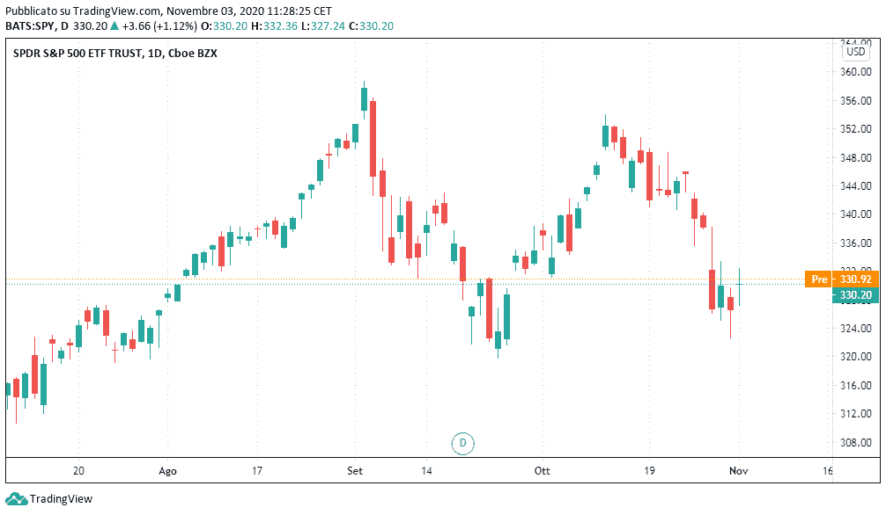

日本烛台图表示例。图片作者。

每一天都用一个叫做*蜡烛的符号来代表。*每根蜡烛由一个*实体、*一个*上影*和一个*下影*制成。

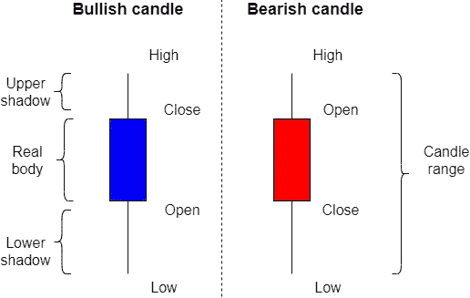

作者图片

蜡烛有一种颜色。如果收盘价高于开盘价，它们通常是白色、绿色或蓝色的(看涨蜡烛线)。如果收盘价低于开盘价，它们就是黑色或红色的(看跌蜡烛线)。

# 它们是如何使用的？

这种图表非常有用，因为它在一个简单的符号中给了我们很多信息，但最重要的用途与模式有关。模式是蜡烛线的组合，显示一个特殊的图形形状，它们对发现价格反转很有用。让我们看看其中的一些。

# 在 Python 中识别模式

下面是最常见模式的列表，Python 代码可以让我们识别它们。

你可以在我的 GitHub 储存库中找到完整的代码:[https://GitHub . com/gianlucamalato/machine learning/blob/master/candlesticks . ipynb](https://github.com/gianlucamalato/machinelearning/blob/master/Candlesticks.ipynb)

首先要安装 *yfinance* 库，下载市场数据。

```
!pip install yfinance
```

然后我们可以导入*熊猫*和*金融*。

```
import pandas as pd
import yfinance
```

对于这个例子，我们将使用过去 5 个月的标准普尔 500 每日数据。

```
ticker = yfinance.Ticker("SPY")
df = ticker.history(period = '5mo')
```

现在，我们将创建与模式一样多的列，每一列都有一个布尔值，如果模式出现则为真，否则为假。

所以，我们必须在历史数据中扫描。我们将使用 for 循环。我们计算真实的身体宽度和烛光范围。

```
for i in range(2,df.shape[0]):
  current = df.iloc[i,:]
  prev = df.iloc[i-1,:]
  prev_2 = df.iloc[i-2,:] realbody = abs(current['Open'] - current['Close'])
  candle_range = current['High'] - current['Low'] idx = df.index[i]
```

现在让我们看看一些模式及其代码，它们必须包含在循环的*中。*

# 看涨摇摆

看涨摆动是一个简单的 3 蜡烛线模式。第二根蜡烛线在三根蜡烛线中最低。蜡烛的颜色无关紧要。这是一个信号，表明价格可能上涨。

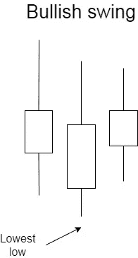

作者图片

所以，代码很简单:

```
df.loc[idx,'Bullish swing'] = current['Low'] > prev['Low'] and prev['Low'] < prev_2['Low']
```

# 看跌摇摆

看跌的波动与看涨的波动相反。它由三根蜡烛组成，第二根蜡烛最高。蜡烛的颜色无关紧要。

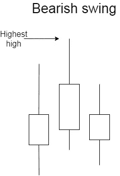

作者图片

这是代码:

```
df.loc[idx,'Bearish swing'] = current['High'] < prev['High'] and prev['High'] > prev_2['High']
```

# 多头针棒

针条是非常频繁和强大的模式。众所周知，针棒有很长的影子和很小的实体。非常重要的一点是，针棒不仅仅是蜡烛，它还必须从周围的价格活动中突出出来。所以，相对于前一根蜡烛线，一根看涨的针棒线必须有一个更低的低点。

我们可以定义一个“小”的真实物体为宽度小于烛光范围除以 3 的真实物体。一根看涨的针棒将会把真实的主体放在蜡烛的上半部分。蜡烛的颜色无关紧要。

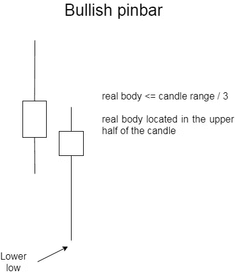

作者图片

下面是多头针棒的代码:

```
df.loc[idx,'Bullish pinbar'] = realbody <= candle_range/3 and  min(current['Open'], current['Close']) > (current['High'] + current['Low'])/2 and current['Low'] < prev['Low']
```

# 轴承销杆

看跌的针柱就像看涨的针柱一样，但是真正的主体现在位于蜡烛线的下半部分，并且比之前的蜡烛线高。

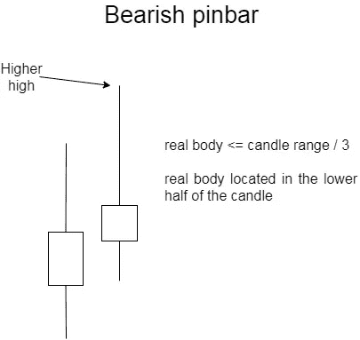

作者图片

代码如下:

```
df.loc[idx,'Bearish pinbar'] = realbody <= candle_range/3 and max(current['Open'] , current['Close']) < (current['High'] + current['Low'])/2 and current['High'] > prev['High']
```

# 内部酒吧

酒吧内部是由两根蜡烛组成的图案。第二根蜡烛完全包含在第一根蜡烛的范围内。颜色无关紧要。

这种模式显示了波动性的收缩，这可能是一个强大的方向性爆炸的前奏。

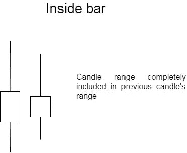

作者图片

代码如下:

```
df.loc[idx,'Inside bar'] = current['High'] < prev['High'] and current['Low'] > prev['Low']
```

# 外部酒吧

外侧杠与内侧杠相反。蜡烛系列完全包括之前的蜡烛。

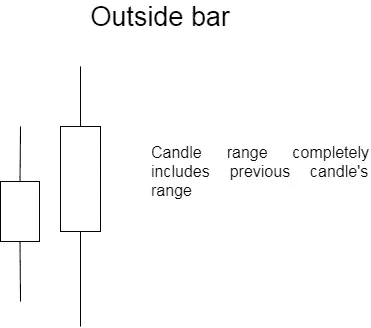

作者图片

代码如下:

```
df.loc[idx,'Outside bar'] = current['High'] > prev['High'] and current['Low'] < prev['Low']
```

# 看涨吞没

多头吞没是一种强势的多头形态。这是一个外面的酒吧，有一个巨大的、乐观的真实身体。我们可以把“巨大”定义为一个真实的物体，它的宽度占蜡烛线的 80%以上。

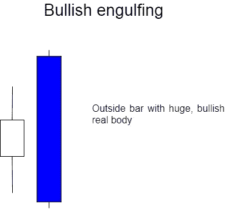

作者图片

代码如下:

```
df.loc[idx,'Bullish engulfing'] = current['High'] > prev['High'] and current['Low'] < prev['Low'] and realbody >= 0.8 * candle_range and current['Close'] > current['Open']
```

# 熊市吞没

看跌吞没是看涨吞没的反义词。一根巨大的熊蜡烛完全吞没了前一根蜡烛。

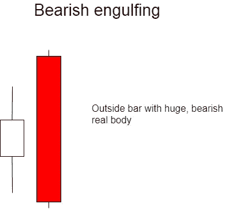

作者图片

代码如下:

```
df.loc[idx,'Bearish engulfing'] = current['High'] > prev['High'] and current['Low'] < prev['Low'] and realbody >= 0.8 * candle_range and current['Close'] < current['Open']
```

# 完整的代码

下面是完整的代码。请记住，我们必须用错误来填补空白。

```
for i in range(2,df.shape[0]):
  current = df.iloc[i,:]
  prev = df.iloc[i-1,:]
  prev_2 = df.iloc[i-2,:]realbody = abs(current['Open'] - current['Close'])
  candle_range = current['High'] - current['Low']idx = df.index[i]

  # Bullish swing
  df.loc[idx,'Bullish swing'] = current['Low'] > prev['Low'] and prev['Low'] < prev_2['Low']# Bearish swing
  df.loc[idx,'Bearish swing'] = current['High'] < prev['High'] and prev['High'] > prev_2['High']# Bullish pinbar
  df.loc[idx,'Bullish pinbar'] = realbody <= candle_range/3 and  min(current['Open'], current['Close']) > (current['High'] + current['Low'])/2 and current['Low'] < prev['Low']# Bearish pinbar
  df.loc[idx,'Bearish pinbar'] = realbody <= candle_range/3 and max(current['Open'] , current['Close']) < (current['High'] + current['Low'])/2 and current['High'] > prev['High']

  # Inside bar
  df.loc[idx,'Inside bar'] = current['High'] < prev['High'] and current['Low'] > prev['Low']

  # Outside bar
  df.loc[idx,'Outside bar'] = current['High'] > prev['High'] and current['Low'] < prev['Low']

  # Bullish engulfing
  df.loc[idx,'Bullish engulfing'] = current['High'] > prev['High'] and current['Low'] < prev['Low'] and realbody >= 0.8 * candle_range and current['Close'] > current['Open']# Bearish engulfing
  df.loc[idx,'Bearish engulfing'] = current['High'] > prev['High'] and current['Low'] < prev['Low'] and realbody >= 0.8 * candle_range and current['Close'] < current['Open']df.fillna(False, inplace=True)
```

我们的数据框最终将是这样的:

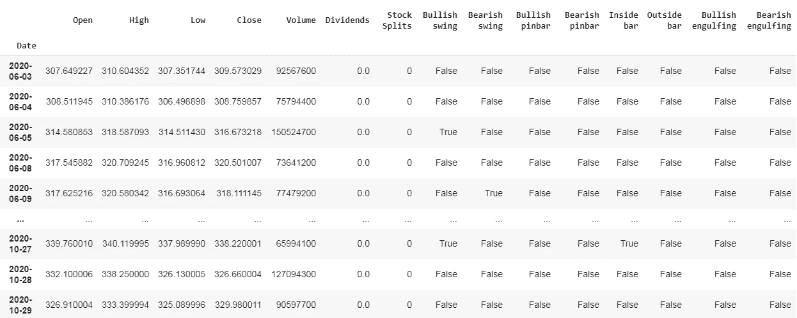

根据列的值过滤行将使我们回测任何使用这种模式的交易策略。

# 结论

日本烛台模式对于发现趋势反转非常有用。本文中没有描述许多不同的模式，但是在这里您可以找到最重要的模式。这种模式的 Python 实现对任何想开始算法交易冒险的人都非常有用。