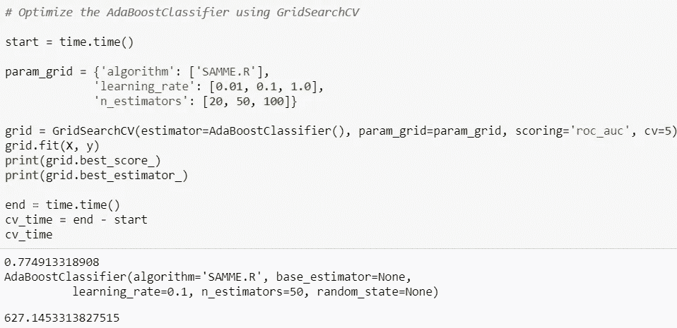

# 如何在人群中识别潜在客户？

> 原文：<https://towardsdatascience.com/how-to-identify-potential-customers-among-the-crowd-abd95b8d0f79?source=collection_archive---------40----------------------->

## 数据科学

## 邮购销售公司的真实数据科学任务

# 介绍

在这个项目中，德国的一家[邮购](https://en.wikipedia.org/wiki/Mail_order)销售公司对确定普通人群的细分市场感兴趣，并以此作为其营销增长的目标。**人口统计信息**(由 Arvato Finacial Solutions 通过 [Udacity](https://classroom.udacity.com/nanodegrees/nd025/dashboard/overview) )已提供给**普通大众**以及邮购公司的**老客户**以建立公司客户群模型。目标数据集包含邮寄营销活动目标的人口统计信息。

**目标是确定哪些人最有可能响应营销活动，成为邮购公司的客户**。


# 数据描述

的。由于与 Arvato 签订了保密协议，因此没有提供该项目的 csv 文件。以下是所使用的文件:

1.  **uda city _ AZDIAS _ 052018 . CSV**:德国一般人口的人口统计数据；891 211 人(行)x 366 个特征(列)
2.  **uda city _ CUSTOMERS _ 052018 . CSV**:邮购公司客户的人口统计数据；191 652 人(行)x 369 个特征(列)。
3.  **uda city _ MAILOUT _ 052018 _ train . CSV**:作为营销活动目标的个人的人口统计数据；42 982 人(行)x 367 人(列)。
4.  **uda city _ MAILOUT _ 052018 _ test . CSV**:作为营销活动目标的个人的人口统计数据；42 833 人(行)x 366 人(列)。
5.  **DIAS Attributes—Values 2017 . xlsx**:文件中按字母顺序描述的列的详细信息。要了解更多功能，请点击[此处](https://github.com/harshdarji23/Arvato-Identifying-the-potential-customers/tree/master/Data)。

# 数据预处理

1.  **记忆力减退。CSV(**uda city _ AZDIAS _ 052018)**保存普通人群人口统计数据的文件大小为 2.5 GB，因此我编写了一个简单的函数来更改数据类型(int64 到 int16)，并减少了 78%的内存使用。要了解更多关于功能和内存缩减的信息，请点击[此处](https://www.kaggle.com/gemartin/load-data-reduce-memory-usage)。**
2.  **数据理解**:所有的数据文件都有相同的特征，所以我决定用**uda city _ AZDIAS _ 052018 . CSV**文件去理解人口统计数据。我使用了**DIAS Attributes—Values 2017 . xlsx**文件来理解每个值对列的意义。请参见下图中的示例:


这里，属性 **AGER_TYP** 描述了最佳 AGER 类型。如果您看到上面的值列，它的值为 **-1，0，**，这意味着含义未知，无法进行分类。进一步检查发现有意义的属性**‘未知’/‘无分类’**为缺失值。所以，我决定用 **nan 来填充这样的值。**当然，有许多属性的值是未知的。欲知详细分析，请点击[此处](https://github.com/harshdarji23/Arvato-Identifying-the-potential-customers/tree/master/Jupyter%20Notebook)。

**3。处理缺失值**:有 **366 个特性**，所以我决定在理解数据(来自第 2 部分)之后首先检查列，因此，我计算了每列中缺失值的百分比，并决定阈值为 30%，也就是说，如果列包含的缺失值超过 **70%** ，我将简单地删除这些列。


通过进一步检查，我发现以 **D19** 开头的属性被删除了。D19 当我们在**DIAS Attributes-Values 2017 . xlsx**文件中查找时，显示它包含交易数据(例如，基于产品组指南的交易活动)

我做的下一件事是按行查找缺失值，我决定删除包含超过 15 个缺失值的行。我在这里使用 Q3–1.5 iqr 来决定阈值 15。


为简单起见，其余的缺失值用平均值估算。

4.**特征工程**:有很多分类变量，所以如果它们少于 **10 级**，我就用它们创建**虚拟**变量。既然所有的特征都是数字，我们可以应用任何机器学习算法。但在此之前，我应用了 **StandardScaler()** 对所有列进行了变换。

# 客户细分

这里，主要目标是使用无监督学习方法来分析现有客户和一般人群的属性，以创建客户细分。该分析描述了普通人群中更有可能成为邮购公司主要客户群的部分，以及普通人群中不太可能成为主要客户群的部分。

因此，我使用了 **PCA** 技术来捕捉数据中的最大**方差**并降低数据的维度。我决定了一个阈值 **50%** 。


366 个特征中的 36 个能够捕捉 50%的变化。遵循主成分分析维度 0:


解读第一个 PCA 组件(10 大特性):

1.  **plz 8 _ BAUMAX**:plz 8(pos)内最常见的建筑类型——主要是> 10 户家庭住宅
2.  **plz 8 _ ant G4**:plz 8(pos)高份额> 10 户住宅数量
3.  **plz 8 _ ant G3**:plz 8(pos)中 6-10 户住宅的数量-高份额
4.  **plz 8 _ ant G1**:plz 8(负)低份额 1-2 户住宅数量
5.  **MOBI_REGIO** :移动模式(负)——高机动性

所以这个群体是**高流动性，大家庭区域，拥挤区域，低收入**。

接下来，我使用经过主成分分析的数据来应用 k-means 聚类，并确定客户细分群体。我用肘法来决定集群的数量，我决定用 **10。**


我对邮购公司客户的人口统计数据做了同样的转换**uda city _ CUSTOMERS _ 052018 . CSV .**


在这里，我们可以看到属于**集群 1 和集群 8** 的人是响应邮购公司的营销活动并成为客户的人。所以，营销团队应该关注这样的群体。好消息是德国有很多人(1 和 8 的蓝条)属于这些群体。

# 营销预测-监督学习模型

这里，我们将使用包含作为营销活动目标的个人的人口统计数据的数据集。训练数据集具有客户的响应，我们将使用 ML 模型来学习参数并预测测试数据中客户的响应。

1.  **uda city _ MAILOUT _ 052018 _ train . CSV**:作为营销活动目标的个人的人口统计数据；42 982 人(行)x 367 人(列)。
2.  **uda city _ MAILOUT _ 052018 _ test . CSV**:作为营销活动目标的个人的人口统计数据；42 833 人(行)x 366 人(列)。

## 数据准备

我已经使用了相同的清理功能，它是我在分段报告中使用的。我用平均值填充了数字列中缺少的值，并为分类列创建了虚拟变量。我还执行了一个 scaler 转换，因为我想检查不同 ML 算法的性能。但是，数据集中的类是一个**不平衡**，训练数据中 **98%** 的响应是负的， **2%** 是正的，所以用召回(识别潜在客户)作为衡量标准是不正确的。因此，我使用 **ROC AUC** 作为评估性能的指标。我还从客户数据集中添加了额外的功能。

```
test['CUSTOMER_GROUP'] = test['CUSTOMER_GROUP'].apply(lambda x:1 if x=='SINGLE_BUYER' else 0)
test['PRODUCT_GROUP1'] = test['PRODUCT_GROUP'].apply(lambda x:1 if 'FOOD' in x else 0)
test['PRODUCT_GROUP2'] = test['PRODUCT_GROUP'].apply(lambda x:1 if 'COSMETIC' in x else 0)
```

表现最好的模型是:


我尝试优化两个模型的超参数，Adaboostclasifer 排在最前面。以下是我使用的参数:



## 预测竞赛

我向 Kaggle 上举办的比赛提交了我对测试数据的预测，我得到了 **0.79459，**的分数，仅比排行榜第一名落后 0.016。

## 特征重要性

**D19_SOZIALES** :这是与数据字典中没有给出的交易相关的特征，是潜在客户响应营销活动的最重要特征。


## 结论

我们使用德国的人口统计数据和营销活动的历史客户数据来确定最佳目标人口统计群体，从而减少营销支出。我们成功地应用主成分分析和 K-均值聚类来识别客户群。我们使用带有超参数调整的 Adaboost 分类器来预测和分类客户是否会对营销活动做出反应。详细分析可以在 [**这里找到**](https://github.com/harshdarji23/Arvato-Identifying-the-potential-customers) **。**