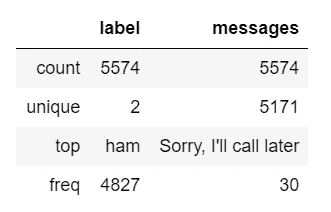
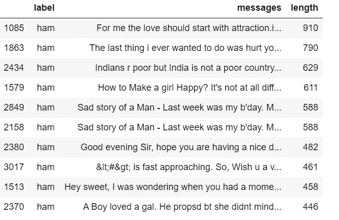
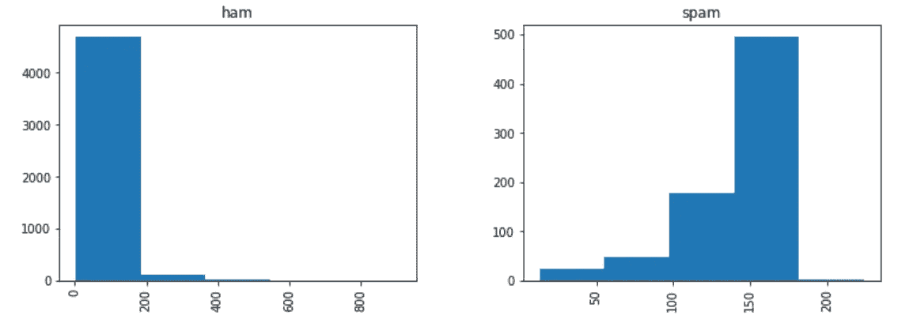
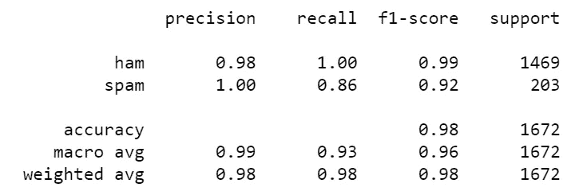
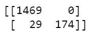

# 如何使用自然语言处理(NLP)识别垃圾邮件？

> 原文：<https://towardsdatascience.com/how-to-identify-spam-using-natural-language-processing-nlp-af91f4170113?source=collection_archive---------17----------------------->

## 使用 Python 自然语言处理的垃圾邮件检测

人类掌握了数百万个单词，但从计算上来说:我们如何使用编程技术操纵大量文本？

计算机可以理解普通语言并与人类对话的想法一直是科幻小说的主题。然而，二十世纪上半叶又有一篇经典论文设想由[](https://en.wikipedia.org/wiki/Computing_Machinery_and_Intelligence)**艾伦·图灵(1950)作为计算智能的标志。**

**本文将关注计算机系统如何使用自然语言处理(NLP)来分析和解释文本。为此，你应该安装自然语言工具包，你可以从[http://nltk.org](http://www.nltk.org/)开始安装。在引用的网站上可以找到说明以及需要安装的相关包的细节，包括 Python 本身，它也是免费的。**

## **什么是自然语言处理(NLP)？**

**自然语言处理(NLP)是[人工智能(AI)](https://medium.com/@patriziacastagnod/artificial-intelligence-ai-d741e3549fe) 的一个子集，它基本上负责机器或机器人对人类语言的理解。**

**NLP 中的一个重要子主题是***【NLU】***自然语言理解，原因是它用于理解人类语言的结构和意义，然后在计算机科学的帮助下将这些语言知识转化为基于规则的机器学习算法，这些算法可以解决特定的问题并执行所需的任务。**

# **PYTHON 语言处理**

**这篇文章的目的是告诉你如何检测垃圾短信。**

**为此，我们使用来自 [**UCI 数据集**](https://archive.ics.uci.edu/ml/datasets/SMS+Spam+Collection) 的数据集，这是一个公共数据集，包含为手机垃圾邮件研究而收集的带 SMS 标签的消息。它有一个由 5.574 条英文短信组成的集合，根据合法(ham)或垃圾邮件进行标记。**

**因此，我们将训练一个模型来学习自动区分火腿/垃圾邮件。然后我们将使用“测试数据”来测试模型。最后，为了评估我们的模型是否有效，我们将计算准确率、分类报告和混淆矩阵。**

# **探索性数据分析**

**要开始，我们应该首先导入所有的库，然后加载数据并重命名 names 列:**

```
# Import libraryimport pandas as pd
import numpy as np
import string
import seaborn as sns
import matplotlib.pyplot as plt
from nltk.corpus import stopwords
from sklearn.feature_extraction.text import CountVectorizer
from sklearn.feature_extraction.text import TfidfTransformer
from sklearn.model_selection import train_test_split
from sklearn.svm import SVC
from collections import Counter
from sklearn.metrics import classification_report,confusion_matrix
from sklearn.model_selection import GridSearchCV
%matplotlib inline# Load data
data = pd.read_excel('data.xlsx')# Rename names columns 
data.columns = ['label', 'messages']
```

**让我们看看我们的数据描述:**

```
data.describe()
```

****

**数据描述(图片由作者提供)**

**请注意，我们的数据包含 5574 条短信的集合，而且我们只有 2 个标签:火腿和垃圾邮件。现在，我们创建一个名为“length”的列，以了解文本消息有多长，然后根据标签绘制它:**

```
data["length"] = data["messages"].apply(len)
data.sort_values(by='length', ascending=False).head(10)
```

****

```
data.hist(column = 'length', by ='label',figsize=(12,4), bins = 5)
```

****

**长度和标签之间的直方图(图片由作者提供)**

**请注意，通过直方图，我们已经能够发现垃圾邮件往往有更多的字符。**

**最有可能的是，您遇到的大多数数据都是数值型或分类型的，但是当它是字符串类型(文本格式)时会发生什么呢？**

**您可能已经注意到，我们的数据是 string 类型的。因此，我们应该将它转换成一个数字向量，以便能够执行分类任务。为此，我们使用 [**单词袋**](https://en.wikipedia.org/wiki/Bag-of-words_model#:~:text=The%20bag%2Dof%2Dwords%20model,word%20order%20but%20keeping%20multiplicity.) ，其中文本中的每个唯一单词将由一个数字表示。但是在做这个转换之前，我们要去掉所有的标点符号，然后常见的词像:['我'，'我'，'我自己'，'我们'，'我们的'，'我们的'，'我们自己'，'你'，'是'…]。这个过程叫做**标记化**。在这个过程之后，我们将字符串序列转换成数字序列。**

1.  ****去掉所有标点:**假设我们有下面这句话:
    *** * * * * * * * * *大家好！！！很高兴遇见你**************

**而且我们要去掉**！！！**和**。****

**首先，我们加载导入字符串库，并执行以下操作:**

```
message = "Hi everyone!!! it is a pleasure to meet you."message_not_punc = []for punctuation in message:
    if punctuation not in string.punctuation:
           message_not_punc.append(punctuation)# Join the characters again to form the string.
message_not_punc = ''.join(message_not_punc)
print(message_not_punc)**>>> Hi everyone it is a pleasure to meet you**
```

**2.**删除常用词:****

**为此，我们使用 nltk 库，即 nltk.corpus 中的**导入停用词****

**重要的是要知道**停用词**支持 23 种语言(这个数字必须是最新的)。在这种情况下，我们使用英语:**

```
from nltk.corpus import stopwords# Remove any stopwords for remove_punc, but first we should to transform this into the list.message_clean = list(message_not_punc.split(" "))# Remove any stopwordsi = 0
while i <= len(message_clean):
 for mess in message_clean:
     if mess.lower() in stopwords.words(‘english’):
                  message_clean.remove(mess)

 i =i +1

print(message_clean)**>>> ['Hi', 'everyone', 'pleasure', 'meet']**
```

**因此，通过步骤 1 和 2，我们可以创建以下函数:**

```
def transform_message(message):
    message_not_punc = [] # Message without punctuation
    i = 0
    for punctuation in message:
        if punctuation not in string.punctuation:
            message_not_punc.append(punctuation)
    # Join words again to form the string.
    message_not_punc = ''.join(message_not_punc) 

    # Remove any stopwords for message_not_punc, but first we should     
    # to transform this into the list.
    message_clean = list(message_not_punc.split(" "))
    while i <= len(message_clean):
        for mess in message_clean:
            if mess.lower()  in stopwords.words('english'):
                message_clean.remove(mess)
        i =i +1
    return  message_clean
```

**现在，我们可以通过以下方式将上述函数应用于我们的数据分析:**

```
data['messages'].head(5).apply(transform_message)>>>
0    [Go, jurong, point, crazy, Available, bugis, n...
1                       [Ok, lar, Joking, wif, u, oni]
2    [Free, entry, 2, wkly, comp, win, FA, Cup, fin...
3        [U, dun, say, early, hor, U, c, already, say]
4    [Nah, dont, think, goes, usf, lives, around, t...
Name: messages, dtype: object
```

# **…向量化…**

**请注意，我们将消息作为令牌列表。因此，下一步是将这些消息转换成一个向量。**

**为此，我们从 Scikit Learn 中使用 [**计数矢量器**](https://scikit-learn.org/stable/modules/generated/sklearn.feature_extraction.text.CountVectorizer.html) 。CountVectorizer 将文档集合转换为令牌计数数组。如果你想看 Python 中 countvectorizer 的例子，我们邀请你阅读下面这篇文章:[***Python 中的 count vector izer***](https://www.educative.io/edpresso/countvectorizer-in-python)**

**首先，我们从 sklearn learn 导入计数矢量器:**

```
from sklearn.feature_extraction.text import CountVectorizer
```

**CountVectorizer 有很多参数，但是我们只使用“ **analyzer** ”，这是我们自己之前定义的函数:**

```
vectorization = CountVectorizer(analyzer = transform_message )X = vectorization.fit(data['messages'])
```

**现在，我们应该将消息的整个数据帧转换成向量表示。为此，我们使用**变换**函数:**

```
X_transform = X.transform([data['messages']])print(X_transform)
>>> :	:
  (0, 11383)	9
  (0, 11384)	20
  (0, 11385)	14
  (0, 11386)	2
  (0, 11387)	4
  (0, 11391)	11
  (0, 11393)	5
  (0, 11396)	1
  (0, 11397)	1
  (0, 11398)	18
  (0, 11399)	18
  (0, 11405)	2
  (0, 11408)	1
  (0, 11410)	1
  (0, 11411)	8
  (0, 11412)	7
  (0, 11413)	1
  (0, 11414)	1
  (0, 11415)	27
  (0, 11417)	3
  (0, 11418)	104
  (0, 11420)	9
  (0, 11422)	1
  (0, 11423)	7
  (0, 11424)	1 
```

# **TF-IDF**

**在对我们的数据应用“计数矢量器”之后，我们使用 TF-IDF。你肯定想知道 TD-FT 是什么？我们为什么要使用它？让我给你解释一下:**

**[**TF-IDF**](https://en.wikipedia.org/wiki/Tf%E2%80%93idf) 是 ***的缩写逆文档频率*** 是一个数值度量，表示一个词与集合中的一个文档的相关程度。**

**TF-IDF 的值与单词在文档中出现的次数成比例地增加，并且被该单词在文档集合中的频率抵消，这允许处理一些单词通常比其他单词更常见的事实。**

# ****如何计算 TF-IDF？****

****TF-IDF** 由两项组成:第一项是**项频率(TF)** ，第二项是**逆文档频率(IDF)****

****词频(TF):** 衡量一个词在文档中出现的频率，即一个词在文档中出现的次数除以该文档中的总字数:**

****TF(t) =(术语 t 在文档中出现的次数)/(文档中的总术语数)****

****逆文档频率(IDF):** 衡量一个术语的重要性，计算方法是语料库中文档数量的对数除以特定术语出现的文档数量。**

****IDF(t) = log_e(文档总数/包含术语 t 的文档数)****

**更多信息请参考[****TF-IDF 是什么意思？”*T34***](http://www.tfidf.com/#:~:text=TF(t)%20%3D%20(Number,terms%20are%20considered%20equally%20important.&text=IDF(t)%20%3D%20log_e(,with%20term%20t%20in%20it).)**

***继续我们的代码，我们从 sk learn . feature _ extraction . text 导入 TfidfVectorizer，然后:***

```
*tfidf_transformer = TfidfTransformer().fit(X_transform)*
```

***要一次将整个词袋语料库转换为 TF-IDF 语料库:***

```
*X_tfidf = tfidf_transformer.transform(X_transform)
print(X_tfidf.shape)>>> (5572, 11425)*
```

# ***分类模型***

***将特征表示为向量，我们最终可以训练我们的垃圾邮件/垃圾邮件分类器。你可以使用任何分类算法。这里我们用[***支持向量分类(SVC)***](https://scikit-learn.org/stable/modules/generated/sklearn.svm.LinearSVC.html) 算法。***

***首先，我们将数据分为训练数据和测试数据。我们采用 80 % (0.80)的训练数据和 30% (0.30)的测试数据，并使用 SVC 拟合模型:***

```
*X_train, X_test, y_train, y_test = train_test_split(X_tfidf, data['messages'], test_size=0.30, random_state = 50)    
clf = SVC(kernel='linear').fit(X_train, y_train)*
```

# ***试验模型***

***为了测试模型，我们使用之前计算的 X_test:***

```
*predictions = clf.predict(X_test)
print('predicted', predictions)>>> predicted ['spam' 'ham' 'ham' ... 'ham' 'ham' 'spam']*
```

# ***我们的模型可靠吗？***

***出现的问题是:我们的模型在整个数据集上可靠吗？***

***为此，我们可以使用 SciKit Learn 的内置分类报告，它返回 **P** [**recision，Recall**](https://en.wikipedia.org/wiki/Precision_and_recall) ，[**F1-Score**](https://en.wikipedia.org/wiki/F-score)**以及[**混淆矩阵**](https://en.wikipedia.org/wiki/Confusion_matrix) **x*******

```
***from sklearn.metrics import classification_report
print (classification_report(y_test, predictions))***
```

**********

*****分类报告(图片由作者提供)*****

```
***from sklearn.metrics import confusion_matrix
print(confusion_matrix(y_test,predictions))***
```

**********

*****困惑矩阵(图片由作者提供)*****

*****准确性是了解模型是否有效的好方法，但这不足以说明我们的模型是好的，为此我们使用了分类报告和混淆矩阵。你可以看到获得的结果相当好。*****

*****我们完了！！！希望这些信息对您有用。如果您对完整代码感兴趣，可以从下面的链接中获得: [**如何使用 NLP**](https://github.com/patrycas/How-to-identify-Spam-using-Natural-Language-Processing-NLP-) 识别垃圾邮件*****