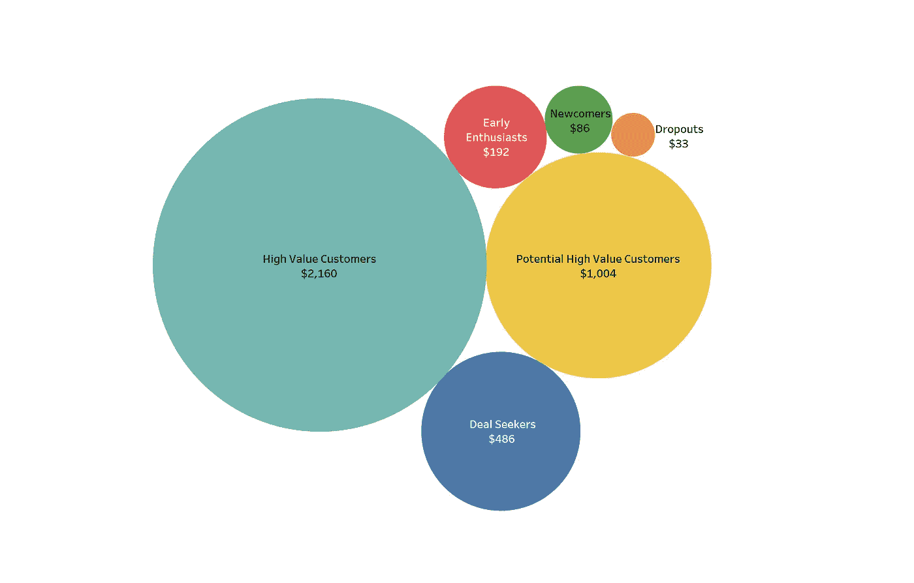
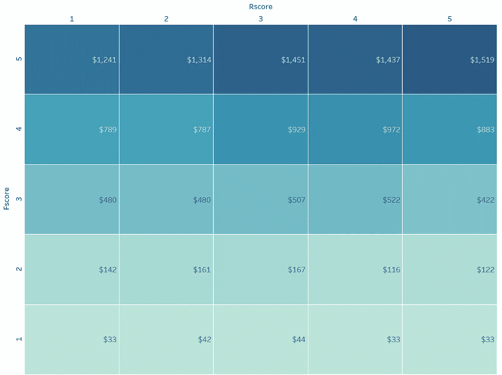
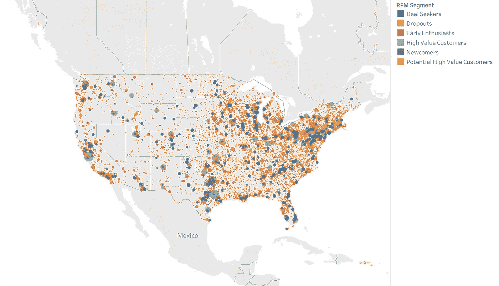
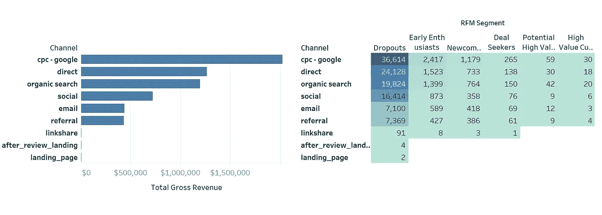
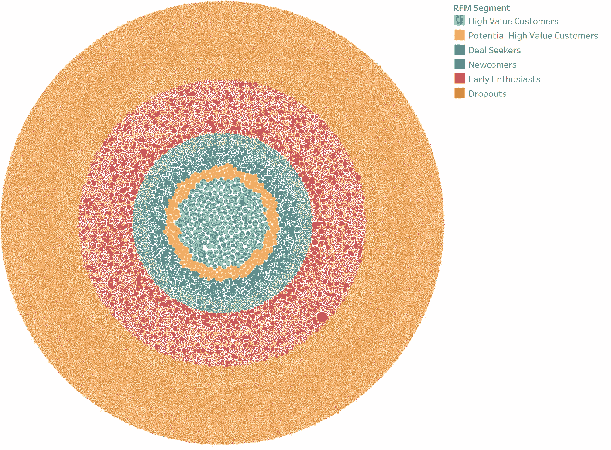

# 如何使用基于 RFM 的细分来识别最佳客户

> 原文：<https://towardsdatascience.com/how-to-identify-the-best-customers-using-rfm-based-segmentation-a0a16c34a859?source=collection_archive---------19----------------------->

## 最好的客户并不总是我们所说的高价值客户

基于 RFM 分析的客户细分(气泡大小代表每个细分市场的平均总收入)

在新冠肺炎·疫情，我手头有了一些空闲时间，于是我决定做无偿咨询工作。我在帮助一些电子商务公司分析他们的客户数据。我在工作中遇到的一个常见主题是，这些公司更感兴趣的是获得他们最好的客户名单，这样他们就可以开展一些营销活动来增加收入。我的建议一直是，每个客户群都有一些有价值的见解可以提供，并且*最佳客户*取决于当前的公司目标/目的。换句话说，最佳客户并不总是我们所说的高价值客户。在这篇文章中，我将强调 RFM 细分可以提供的各种见解。

# 使用 RFM 分析的分割

基于 RFM 的分析——代表新近性、频率和货币——可能是细分客户的最简单方法之一，因为公司通常随时可以获得客户购买信息。

这里有一个样本客户购买历史数据，这是 RFM 分析需要的。这样，每位顾客的 RFM 属性都得到了 1-5 分(或 1-4 分或 1-3 分，取决于你对购买行为的观察程度)，1 分最低，5 分最高。

用于 RFM 分析的客户购买历史数据示例

例如，最近一次购买的客户在最近性上的得分为 5，而一段时间没有购买的客户的得分为 1。

这里需要注意的重要一点是，评分标准因业务而异，通过了解客户购买周期，我们可以得出评分标准。对于这个样本数据，我使用了以下基于 2 个月购买期的最近得分。一旦你对所有三个属性进行评分，我们就可以创建 RFM 评分(这三个评分的总和)和 RFM 类别(当 R=4，F=3，M=4，RFM 类别= 434)。你可能已经看到过 RFM 分数被用来细分客户的例子。这种方法有一些严重的缺陷，最好使用 RFM 类别。

使用 5 分制可以导致多达 125 个 RFM 类别。下一步是将这些 RFM 类别分成不同的部分。虽然标准的 RFM 分析没有考虑其他数据点，如客户关系的时间长度，但这是整体查看购买数据并为 RFM 类别分配细分的时候了。例如，与业务有长期关系、最近购买但金额较低的客户可能比与我们有类似近期、金额但频率较低且关系较短的客户更频繁地使用促销优惠。一个可以被划分为*交易寻求者*，另一个可以被划分为*新人*。

RFM 细分后的客户数据

在上面的例子中，我确定了 6 个具有独特购买行为的细分市场。

> 辍学者:换句话说，他们是流失的顾客。他们通过最初的促销优惠成为我们的客户，要么没有回来，要么进行了 1-2 次后续购买。
> 
> 早期爱好者:这些顾客和公司在一起的时间比中途退出的顾客相对要长，他们经常购物，花很多钱。然而，他们一路上都迷路了。如果目标是重新激活流失的客户，这些客户将是最佳客户。
> 
> 新人:顾名思义，这个细分市场由相对较新且活跃的客户组成。针对这一细分市场的任何营销努力都可能是向他们推广忠诚度计划或提供尝试其他产品的促销活动。
> 
> 交易寻求者:这些客户与公司的关系相对较长，目前很活跃。他们对频繁购买感兴趣，但通常会留意促销优惠。如果开展促销活动，这些人将是最佳客户。
> 
> 潜在高价值客户:与交易寻求者相比，这些客户相对较新，但对价格不太敏感，或者对促销优惠不太感兴趣。在更短的时间内，他们频繁购买，花了公司很多钱。将他们推向高价值客户，并让他们加入忠诚度计划。
> 
> 高价值客户:这些是最忠诚的客户。他们购买频繁，货币价值高。他们可能是品牌传播者，应该专注于服务好他们。他们可能是获得任何新产品发布反馈的最佳客户，或者是早期采用者或推广者。

# 从可视化中获得洞察力

一旦使用 RFM 分析确定了客户群，将这些客户群可视化总是一个好主意，这不仅是为了进行健全性检查，也是为了获得可操作的见解。我用 Tableau 来显示片段。

R&F 得分的每用户平均收入(ARPU)矩阵

新近和频率得分矩阵图通常是一个很好的健全性检查。随着 R 分数和 F 分数的增加，货币价值增加。考虑到企业最近可能获得了新客户，较高的 R 分数不一定会带来较高的货币价值。

每个客户群总收入的树形图

树形图显示了每个客户群对总收入的贡献，以及给定客户群中的每个客户对总收入的贡献。在某种程度上，这有助于预测在有多少客户和其他细分市场有多活跃的情况下，收入会有多稳定。

当客户有地理信息时，将它们标在地图上会给出一些独特的见解。我见过的一个有趣的案例是一家有一些零售业务的电子商务公司。绘制客户地理数据有助于解释该公司零售店所在地理区域的在线购物者集群。有趣的是，这些在线客户群是有机获得的。因此，您可以评估扩大零售业务的策略，这可能会促进电子商务业务的发展。

按细分市场划分的客户地理分布(气泡大小代表客户的总销售额)

总收入和客户数量方面的渠道绩效

还有就是渠道表现。客户细分有助于更好地了解渠道绩效。通过查看每个细分市场的客户终身价值(LTV ),以及每个细分市场的哪一部分属于某个渠道，以及与该渠道相关的获取成本，我们可以比没有细分市场时更准确地评估渠道绩效。

# 最后

通常，初创公司更倾向于增长，而不是保留。即使资源有限，创业公司最好将有限的资源投入到了解现有客户上，这样他们就可以制定有效的保留策略，从而帮助他们获得新客户。毕竟，留住现有客户可能比获得一个新客户要便宜得多。口碑仍然是一个主要的客户获取渠道，你希望你的客户成为你产品的传播者。

客户细分的牛眼图

重申对*最佳客户*的追求，高价值客户就是最佳客户似乎是显而易见的。当手头有一个目标时——比方说开展一场营销活动来增加收入——我们应该更深入地挖掘，找出谁是该特定目标的最佳客户，或者哪个客户群处于靶心。