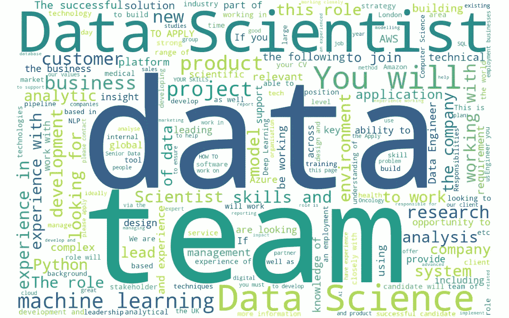
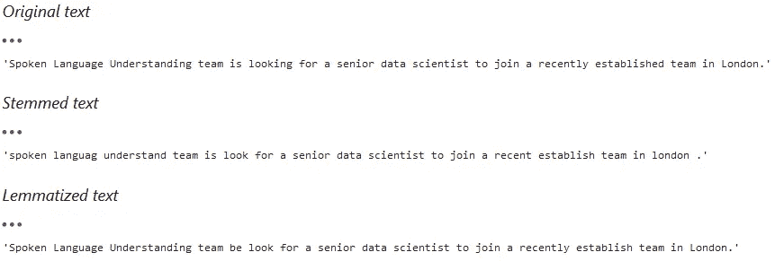
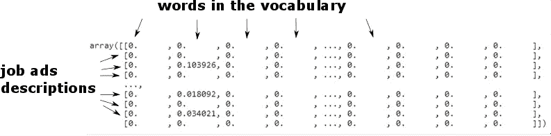
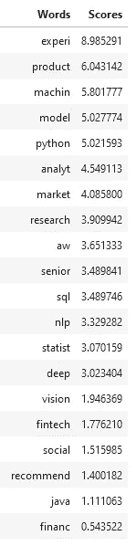
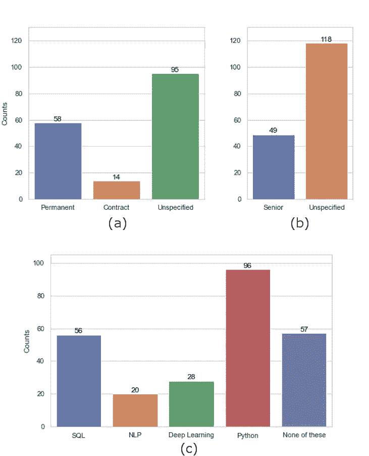
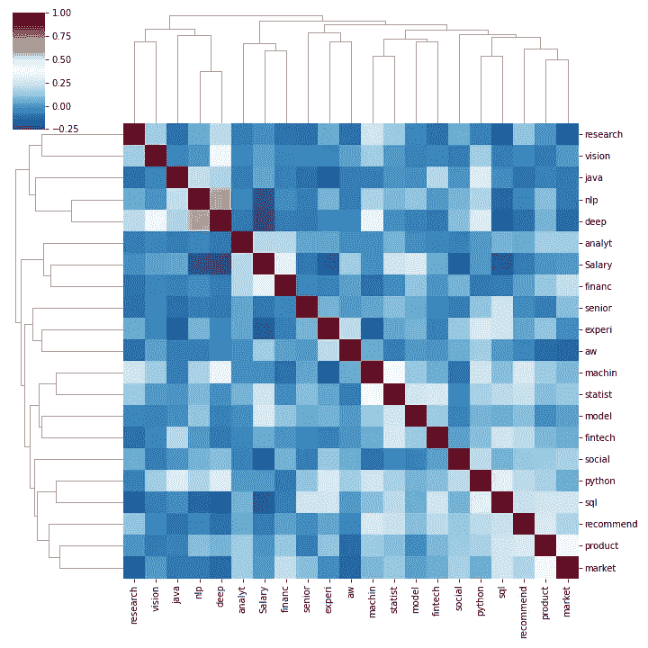

# 如何识别数据科学就业市场上最需要的数据科学技能

> 原文：<https://towardsdatascience.com/how-to-identify-the-most-requested-skills-on-the-data-science-job-market-with-data-science-726845ca9638?source=collection_archive---------29----------------------->

## 使用抓取和自然语言处理从招聘广告中提取信息

做一个好看的字云不是必备技能，但应该是。

几天前，我的 LinkedIn 网络中的一名技术招聘人员发布了一个请求，要求为未来的数据科学家推荐学习资源。她希望确保候选人获得适合当今市场的技能。在她收到的回复中，许多是轶事(“我做了这个……我学到了那个”)，暗示了一套常见的在线学习平台，而其他人则包含通用的建议，如“练习编码面试”或“试试 Kaggle 竞赛”。

我想:**这个没用。我如何能同时做所有这些事情？现在有没有更好的方法来收集就业市场上最需要的技能的有用信息？**作为一名数据科学新人，我感觉自己在追逐市场，根据我在招聘广告上最常看到的(或我认为我看到的)内容，或根据我在面试中被问到的问题，挑选新项目或学习材料。

我决定向前迈出一步，自己找出答案:在这个项目中，我从一个流行的求职网站上收集了一些职位描述，以找出其中反复出现的关键词，哪些与可获得的技能相对应，以及它们如何(以及是否)与广告上的工资相关联。

# 项目结构

该项目分为三个主要部分:

*   数据采集:识别信息来源，抓取相关招聘广告网页，保存内容；
*   数据操作:职位描述中包含的文本通过词干清理，并矢量化；
*   数据分析和结论:与关键技能相对应的最频繁出现的词被识别，并且与广告工资的相关性被调查。

你可以在这里找到[项目的代码。](https://github.com/RaffaToSpace/Job_ads_scraping_nlp)

## 数据采集

这个过程的第一步是确定信息的来源，选择合适的工具并获取信息。作为一个来源，我选择了 reed.co.uk 的 T4，因为它容易导航，细节丰富，并且在我的地区很受欢迎。

使用[美汤](https://www.crummy.com/software/BeautifulSoup/bs4/doc/)，我做了一个简单的脚本，当我在伦敦和 20 英里范围内搜索【数据科学家】职位时，抓取了一定页数结果的招聘广告。该脚本保存搜索结果，然后访问每个招聘广告对应的页面，并以 JSON 格式存储职位描述、工资、合同类型和位置信息。每个职务都由一个参考号标识，如果某些职务在搜索中出现多次(例如，如果被提升)，它们将只保存一次。

## 数据操作

文本操作和分析的工具并不缺乏，因为 NLP 是目前机器学习最流行的应用之一(查看[这里](/natural-language-processing-nlp-top-10-applications-to-know-b2c80bd428cb)和[这里](https://www.topbots.com/top-ai-ml-research-trends-2020/)关于这个主题的一些有趣的见解)。我个人的学习建议是看一下 [fastAI 在线资料](https://www.fast.ai/2019/07/08/fastai-nlp/)，涵盖了 fastAI 库等等。

招聘广告描述包含不同词形变化(主要是复数和-ing 后缀)、标点符号和停用词。它们都可以被清理掉，只留下那些可能传达有用信息的文字。作为第一步，我使用了 [nltk 包](https://www.nltk.org/)对文本执行*词干提取*，删除了单词的变形和大写字母。

原文与其词干版本和词条版本的比较。词汇匹配需要知道每个单词的位置才能正常工作，因此例如单词“口语”和“理解”以大写字母开始，并被视为名词，而不被转换为“口语”和“理解”。

词干提取的另一种方法是*词汇匹配*，它根据意思而不是拼写来减少单词。我决定使用词干，因为我的目的是分离文本中的单词，而不是研究文本的含义。

第二步是使用 scikit learn 中的 [TF-IDF 矢量器函数对我的文本进行矢量化，该函数返回一个包含所分析文本中所有单词的词汇表，以及一个针对每个工作广告描述的矢量，该矢量包含每个词干单词的术语频率乘以逆文档频率(因此 TF-IDF)的值，该值突出显示有意义的单词，有利于高度重复出现的单词，如“The”、“a”、“is”等。](https://scikit-learn.org/stable/modules/generated/sklearn.feature_extraction.text.TfidfVectorizer.html)

图中的矩阵包含被分析文本语料库的 TF-IDF 值。每行对应一个工作描述文本，每列对应语料库词汇表中的一个单词。

简单来说，TF-IDF 值矩阵的每一行对应于我们目标的一个观察(一个工作广告描述)，每一列对应于一个给定变量(我们词汇表中的一个词)的值，它的值对应于变量的值。

这对于描述职位描述非常有用，我们可以用它来找到最常用的词，看看它们是否与其他因素相关，比如工资。

## 最常见的关键技能

整个职位描述语料库中最常见的单词可以通过对矩阵的列求和来识别，得到每个单词的累积值。我对结果进行了过滤，去掉了一些无处不在的词，比如“数据”和“工作”。在分析的时候，我可以观察到，大致按顺序并按亲和力分组:

求职广告中的词干及其相对重要性分数。

*   **历练**，而**学长**(比**学弟**多得多)；
*   **产品**，**市场**；
*   **建模**，**统计**；
*   **Python** ，**SQL；**
*   **NLP** ，**机**，**学**，**深**，**学**；
*   **AWS**；
*   **研究**，**洞察**，**分析。**

令我惊讶的是，计算机视觉、金融科技和社交媒体在某种程度上并不常见。从技术角度来看，NLP 和 SQL 以及对 AWS 的熟悉是值得学习的技能。

如果你是大三或者初入市场(像我一样)，那么你大概不会喜欢看到“经验”排在首位，但它与[市场趋势](https://www.datacareer.co.uk/blog/uk-data-science-analytics-job-market-in-2019/)是一致的。

从绝对意义上来说，我们可以看看某些关键词在招聘广告中出现的频率，并使用获得的数字作为我们决策过程的衡量标准。

在 167 份分析的招聘广告中，就业类型的分布(a)，职位描述中“高级”一词的出现(b)，以及一些关键技能的出现(c)。

作为一个例子，我统计了合同和固定工作的出现,“高级”一词的出现，以及工作描述中一些关键技能的出现。请注意，如何从简单的词汇分析中，收集关于特定技能重要性的有价值的信息是可能的。

## 与工资的相关性

我的计划是定义一个数据获取方案，从数百个招聘广告中收集信息，并探索建立回归模型来估计工资的可能性。我正在测试这个想法的可行性，方法是评估所报告的工资信息的质量，并查看任何关键词的出现是否与工资相关。

工作广告页面包含了在一个明确定义的领域中的建议工资范围的信息，这是很容易阅读的。然而，薪水数字经常被替换为“有竞争力的薪水”，“薪水面议”，或类似的表达。在兴趣的情况下，69%的值不幸丢失。另一个复杂因素是，全职工作的工资是按年报告的，而承包商工作的工资是按日报告的，税收制度的差异使得比较变得棘手。

我们可以通过创建一个表来检查薪水是否与任何关键字相关，该表包含每个工作的薪水数字和对应于关键技能的 TF-IDF 矩阵的子集，并使用 Pandas *corr()* 方法来获得相应的相关矩阵。

相关聚类热图([参见 seaborn 的指南，了解如何用相关关键词制作一个](https://seaborn.pydata.org/generated/seaborn.clustermap.html))的“薪水”。

在聚类相关矩阵中，相关的数量彼此相邻，因此很容易发现。在这种情况下，任何两个变量之间的最小相关分数都高于-0.25，这意味着没有显著的负相关。关于正相关，我们感兴趣的是白色到红色的方块。树状图显示了变量是如何逐步聚类的。

最明显的相关性是在 *Python* 和 *SQL* 之间，它们可能经常在详细描述其需求的工作描述中出现，以及*深度(学习)*与 *NLP* 和*视觉*之间的相关性，这是 NLP 和计算机视觉神经网络的两个最流行的应用。其他可见的关联是在*机械(电子学习)*和*统计学家(ics)* 之间，以及*产品*和*市场*之间。

*工资*呢？它与 *financ(e)* 的相关性很弱，这可能说明了薪酬最高的部门，但这不是足够的证据。

**注意:**聚类图也非常有用，可以直观地感受到所选关键词在职位描述语料库中的分布情况，如何基于这些关键词进行聚类，以及职位描述之间如何进行聚类。例如，你可以看到关键词 *experience* 和 *python* 几乎均匀地分布在整个语料库中，而其他关键词，如 *NLP* 和 *vision* ，则更加集中([详见我的地图](https://github.com/RaffaToSpace/Job_ads_scraping_nlp/blob/master/data/cluster_heatmap.png))。

# 结论

在这篇文章中，我展示了我的智能求职方法，使用基本的网络搜集和 NLP 技术来收集对就业市场的见解。根据结果:

*   我会考虑投资时间来提高我的 NLP 和 SQL 技能。
*   我会特别注意用现实生活中的项目来丰富我的投资组合，从而增强我在该领域的经验。
*   我还会致力于我的分析和研究技能，创造我自己的问题来解决，并从中产生有价值的见解。

## 进一步的工作

这在很大程度上是一个开放式项目，因为所获得的信息取决于当时的情况，并将随着时间的推移而变化，并且可以在许多不同的层面上进行分析。例如，有趣的是:

*   根据内容对招聘广告进行聚类，以找到关键词和数量或工作特征之间的进一步联系。
*   开发一个工作工资回归预测器，收集大量的工资值观察值，并正确比较不同类型合同的薪酬。

希望我在这里描述的工作能对别人有用。如果你想谈论它，请随时联系。

# 关于我

我是一名数据科学家，目前正在寻找新的机会。在过去的几年里，我一直致力于空间应用的量子技术。

GitHub:[https://github.com/RaffaToSpace](https://github.com/RaffaToSpace)

领英:[https://www.linkedin.com/in/raffaele-nolli-581a4351/](https://www.linkedin.com/in/raffaele-nolli-581a4351/)