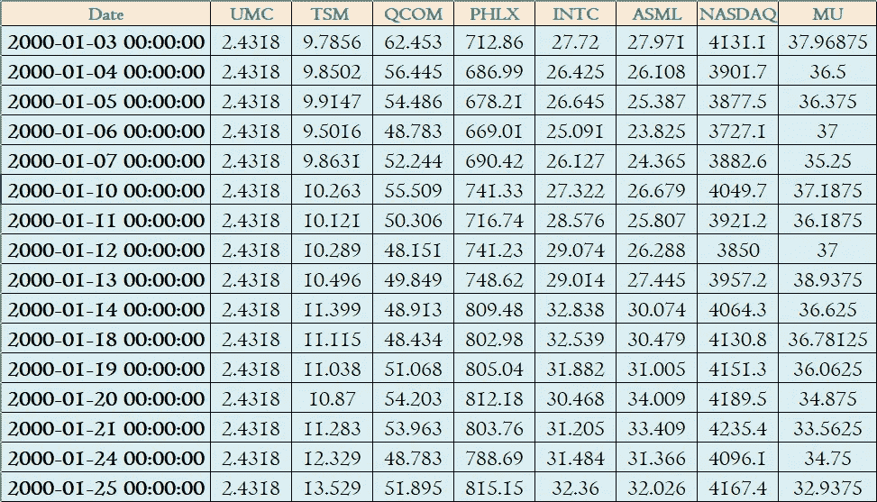

# 机器学习监督算法如何识别正确的自变量？

> 原文：<https://towardsdatascience.com/how-to-identify-the-right-independent-variables-for-machine-learning-supervised-algorithms-439986562d32?source=collection_archive---------3----------------------->


在计算机科学领域有一个非常著名的缩写词 *GIGO* ，这是我在学生时代学过的。 *GIGO* 代表垃圾进出。本质上，这意味着如果我们向计算机程序和算法提供不适当的垃圾数据，那么它将导致垃圾和不正确的结果。

机器学习算法和我们人类是一样的。广义的机器学习算法有两个阶段——学习和预测。
学习环境和参数应与未来要做预测的条件相似。在无偏数据样本上训练的算法和输入变量值的排列真实地反映了全部人口数据集，能够很好地进行准确的预测。

监督机器学习算法成功的基石之一是为学习阶段选择正确的独立变量集。在本文中，我将讨论一种结构化的方法来选择正确的独立变量来输入算法。我们不希望过多输入冗余数据点，即高度相关(**多重共线性**)数据，并在不提高预测准确性的情况下使模型复杂化。事实上，有时过多的数据会降低预测的准确性。另一方面，我们需要确保模型不会过于简单，并反映真实的复杂性。

***目标***

我们想建立一个模型来预测 ASML 公司的股票价格。我们已经下载了过去 20 年来 ASML 的一些客户、竞争对手和指数点的股价数据。我们不确定在构建 ASML 股票预测模型时应该包括这些数据点中的哪一个。

***样本数据文件***

我写了一个小函数，我可以从不同的程序调用它来下载过去 20 年的股票价格。

```
"""Filename - GetStockData.py is a function to download the stock from 1st Jan 2000 until current date"""import datetime as dt
import pandas as pd
import pandas_datareader.data as web
import numpy as npdef stockdata(ticker): start= dt.datetime(2000,1,1)    ## Start Date Range
    end=dt.datetime.now()    ## Curret date as end date Range
    Stock=web.DataReader(ticker, "yahoo", start, end)

    name=str(ticker) + ".xlsx"
    Stock.to_excel(name)
    return ()
```

从另一个带有股票代码的程序调用函数 stockdata()来下载数据。

```
""" Filename - stockdownload.py"""
import GetStockData
ticker= ["MU", "ASML","TSM","QCOM", "UMC", "^SOX", "INTC","**^**IXIC"]
for i in ticker:
    GetStockData.stockdata(i)
```

请注意，GetStockData python 文件和 stockdownload.py 文件放在同一个文件目录中，以便成功导入文件。

***第一步-*** 第一步是想到所有可能影响因变量的变量。到了这一步，我会建议不要约束自己的思维，大脑转储所有的变量。

***第二步-*** 下一步是收集/下载预期自变量数据点进行分析。

我已经将下载的数据格式化并整理成一个 excel 文件“StockData.xlsx”



过去 20 年的股票价格数据—从 2000 年 1 月到 2020 年 8 月

***步骤 3-*** 我们将导入包 pandas、matplotlib、seaborn 和 statsmodels 包，我们将使用这些包进行分析。

```
import pandas as  pd
import matplotlib.pyplot as plt
import seaborn as sns
from statsmodels.stats.outliers_influence import variance_inflation_factor
```

***步骤 4-*** 将完整的数据样本数据 excel 文件读入名为“数据”的 PandasDataframe 中。此外，我们将用日期列替换索引

```
data=pd.read_excel("StockData.xlsx")
data.set_index("Date", inplace= True)
```

我不会关注初步的数据质量检查，如空白值、异常值等。和各自的修正方法，并假设不存在与差异相关的数据序列。

***第 5 步-*** 开始理解自变量之间关系的最好地方之一就是变量之间的相关性。在以下代码中，使用绘制了关联的热图。熊猫的 corr 方法。

```
sns.heatmap(data.corr(), annot=True, cmap="YlGnBu")
plt.show() 
```

如下所示，相关性热图为我们提供了变量之间关系的可视化描述。现在，我们不想要一组与因变量有或多或少相似关系的自变量。例如，TSM 和纳斯达克指数与 ASML 的相关系数分别为 0.99 和 0.97。包括 TSM 和 NASDAQ 可能不会提高预测的准确性，因为它们与因变量 ASML 股票价格有类似的关系。


***第 6 步-*** 在我们开始舍弃多余的自变量之前，让我们检查一下自变量中的**方差膨胀因子** ( **VIF** )。VIF 在普通最小二乘回归分析中量化了多重共线性的严重程度。它提供了一个指标来衡量估计回归系数的方差(估计值的标准差的平方)因共线性而增加的程度。我鼓励你们大家阅读维基百科上关于[方差膨胀因子](https://en.wikipedia.org/wiki/Variance_inflation_factor)的页面，以便更好地理解它。

在下面的代码中，我们计算每个独立变量的 VIF 并打印出来。我们将创建一个没有 ASML 历史股票价格的新数据框架，因为我们的目标是确定潜在自变量中的 VIF。

```
X=data.drop(["ASML"], axis=1)
vif = pd.DataFrame()
vif["features"] = X.columns
vif["vif_Factor"] = [variance_inflation_factor(X.values, i) for i in range(X.shape[1])]
print(vif)
```


一般来说，我们的目标应该是自变量的 VIF 小于 10。我们已经从之前的热图中看到，TSM 和 NASDAQ 与 ASML 有相似的相关系数，同样也反映了高 VIF 指标。

基于我们对热图和 VIF 结果的理解，让我们放弃纳斯达克(最高的 VIF)作为我们模型自变量的潜在候选，重新评估 VIF。

```
X=data.drop(["ASML","NASDAQ"], axis=1)
vif = pd.DataFrame()
vif["features"] = X.columns
vif["vif_Factor"] = [variance_inflation_factor(X.values, i) for i in range(X.shape[1])]
print(vif)
```


我们可以看到，除去纳斯达克，VIF 的其他几个潜在的独立公司也减少了。

选择独立变量的正确组合需要一点经验，还要用不同的排列进行试错 VIF 检验。TSMC 是世界领先的半导体代工厂，作为 ASML 的客户，对 ASML 的业务有很大的影响。考虑到这一点，我将放弃“INTC”和“PHLX ”,并重新评估剩余变量的 VIF。


正如我们可以看到的，经过两次迭代后，所有剩余变量的 VIF 都小于 10。我们删除了具有多重共线性的变量，并确定了与预测 ASML 股票价格相关的独立变量列表。

我希望，在为你的机器学习模型选择正确的自变量集合时，你会发现本程序中解释的方法是有帮助的。

如果你喜欢这篇文章，那么你可能也会喜欢[机器学习和供应链管理:动手系列](https://medium.com/@kaushikthoughts/machine-learning-and-supply-chain-management-hands-on-series-2-d723125f749e)

*免责声明——本文仅为教育目的而写。不要根据本文中确定的独立变量进行任何实际的股票买卖或任何金融交易。*