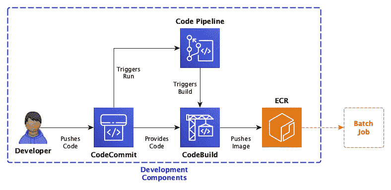
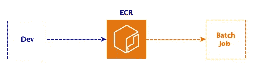
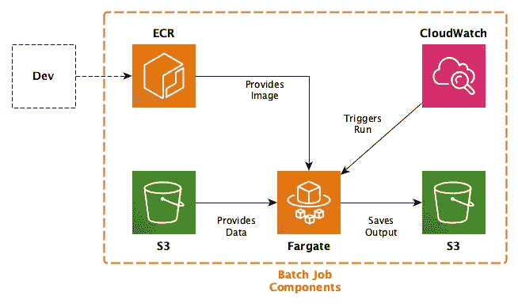

# 如何在 AWS 上实现无服务器批处理作业架构

> 原文：<https://towardsdatascience.com/how-to-implement-a-serverless-batch-job-architecture-on-aws-b3358cd33428?source=collection_archive---------24----------------------->

## 概念性的想法和使它们工作的代码

这篇博文是关于 AWS 上无服务器批处理作业的特定类型架构的三篇技术深度文章之一。该架构背后的基本前提是，我们希望使用 AWS 的托管服务来运行批处理作业。如果您想了解更多关于该架构的信息，请点击[此处](https://blog.codecentric.de/en/2020/06/cost-effective-batch-jobs-on-aws-serverless-infrastructure/)了解更多详情。该架构的整体情况如下:

整体架构(作者图解)。

简而言之，该架构由一个用于开发的组件块和另一个用于执行批处理作业的组件块组成。在这篇博文中，我们只关注这个架构的**托管服务**。还有一个[公共代码库](https://github.com/timo-boehm/serverless_batch_aws)，允许你基于 Cloudformation 脚本复制完整的服务及其所有部分。

云提供商用两个核心承诺宣传托管服务。首先，云提供商管理维护和其他底层职责。因此，客户可以专注于功能和架构。第二，托管服务往往更便宜，因为您只需为您使用的服务付费，而无需大量的前期投资。

托管服务支持**无服务器**设计。换句话说，体系结构可以让您摆脱与服务器堆栈相关的许多顾虑。这种抽象级别加速了开发，并引入了与服务架构相关的不可能的灵活性级别。

让我们从云形成脚本的初级入门开始。如果你已经有了云形成或者类似概念的经验，你可以略读或者跳过下面三段。

**CloudFormation** 是针对*基础设施的 AWS 服务，代码为*。也就是说，您定义一个目标基础设施，将其推送给 AWS，AWS 为您提供它。您将资源组织在所谓的堆栈中，使其易于调整、监控或删除。

您可以在 JSON 或 YAML 文件中编写 CloudFormation 脚本。这里和代码库中的所有例子都是 YAML 文件，但是您也可以在 JSON 中做同样的事情。

还有一组专门针对 CloudFormation 的命令可供您使用。在接下来的例子中，我使用了其中的四个:

1.  **！Ref** 是内部参考；也就是说，CloudFormation 从同一个堆栈插入一个值。
2.  **！Sub** 用于将变量替换成字符串。
3.  **！GetAtt** 类似于“！Ref”但是指向资源的特定属性，而不是一般的引用。
4.  **！ImportValue** 用于从当前堆栈外部导入值。在本例中，网络和策略规范来自其他配置文件。

# 大局

该架构的指导原则是开发和生产工作流的分离。也就是说，这里涉及到两个角色:**开发者**负责实现业务逻辑，**云工程师**保证稳定运营。

**开发工作流程**由三个功能组成——一个*代码库*，它是开发者之间协作的主要工具。一个*构建环境*克隆存储库，并将代码转换成容器。最后，每当代码库发生变化时，编排工具就会触发新的构建，并将结果推送到映像注册中心。只要开发人员确保主分支反映了他们工作的当前状态，容器就会自动更新。

**批处理工作流程**包含两个功能。首先，计算资源需要加载容器并运行它。第二，触发器需要在要求的时间间隔内开始计算。

这两个工作流之间唯一的重叠是图像注册。这种最小重叠的减少确保了开发和生产之间的分离。

# 实施细节

我将实现细节分成三个小节，它们反映了上面描述的大背景。对于每个托管服务，我解释了它们在架构中的角色以及它们最相关的参数。我还提供了 CloudFormation 片段，以便您可以将我的解释与实际代码联系起来。

> **注意:**这些说明仅涵盖托管服务。但是不包括网络和访问管理。如果你想了解更多的细节，请看[网络](/network-configurations-for-fargate-tasks-6333314c4001)和 [IAM 角色和政策](/how-to-configure-iam-roles-for-fargate-tasks-on-aws-76ad54f11314)上的两篇相关文章。

## 开发组件中的托管服务

开发工作流程(作者插图)。

开发工作流程的第一个组成部分是一个**代码提交**库。唯一特殊的配置是*代码*部分。这个部分允许你在 S3 上以 ZIP 文件的形式提供一个初始代码库。我在示例中使用它来使整个工作流直接启动，但是它是可选的。但是，如果您为代码指定了一个不可用或不可访问的位置，则堆栈创建会失败。下面是相关的 CloudFormation 脚本:

第二，有一个 **CodeBuild** 项目。它将一个*源*转换成一个图像，并将结果推送到一个容器注册表中。在这种情况下，源代码是上面定义的 CodeCommit 存储库。该项目使用存储库的 HTTP URL 来克隆它。注意，构建的规范来自一个 *buildspec.yml* 文件，它是克隆代码的一部分。

一旦 CodeBuild 克隆了存储库，构建的映像就会在您需要指定的*环境*中发生。要使它按预期工作，您必须了解几个参数:

*   **类型**描述了总体环境，例如，您是否需要 GPU。通常， *LINUX_CONTAINER* 完成这项工作。
*   **计算类型**指定用于构建的虚拟硬件。在撰写本文时，对于 *LINUX_CONTAINER* ，有四个不同的选项可供选择。最小的选项包括 3 GB 内存和两个 vCPUs。
*   特定基础图像的选择取决于你的构建需要什么。查看文档中的运行时列表，看看哪个选项能满足您的需要，并做出相应的选择。例如，寻找正确的 Python 版本。
*   特权模式使项目能够构建 Docker 容器。由于本例使用了 Docker 图像，因此参数为 *true* 。
*   您还可以为构建指定额外的**环境变量**。在这个例子中，我们传递了帐户 ID、容器注册名和一个图像标签。你需要什么变量取决于 *buildspec.yml* 和 Dockerfile。

将该列表与 Cloudformation 脚本进行比较，了解更多详细信息:

最后，还有一个**代码管道**用于编排。它由两个阶段组成，包括一个*名称*和一个*动作列表*。不同类型的操作需要不同的配置参数集，所以我在这里主要关注其中的一些。

主分支中的每个变化都会触发**源**阶段。这个阶段充当流水线的初始化阶段。主要参数是存储库的*名称*、您想要监控变更的*分支*，以及一个指示管道是否应该拉取变更的标志。如果您将此设置为 *true* ，每当库被更新时，新的运行将自动开始。

如果采购成功，则**构建**阶段开始。所有管道需要的是对上述 CodeBuild 项目的有效引用。

下面是 CloudFormation 脚本中涵盖管道的部分:

对于 CodePipeline 来说，还有比我列出的更多的可用操作。例如，您可以用 GitHub 或 Bitbucket 上的库替换源库，用 webhook 替换对变更的提取。请将此设置视为您实验的起点。

## 连接环节

连接容器注册表(由作者图解)。

使用**弹性容器注册表(ECR)** 很容易。您需要做的就是定义一个存储库的名称:

如您所见，选择注册表作为链接是分离开发和执行的一种强有力的方式。只要开发工作流将图像推送到图像存储库，它就不会中断批处理作业工作流。

## 批处理作业组件中的托管服务

批处理作业架构(作者举例说明)。

批处理作业的计算核心是 **Fargate 任务**。但是我们首先需要一个托管的地方来运行它们，即 AWS **弹性容器服务(ECS)** 上的集群。幸运的是，我们需要实现的只是它的*集群名*:

然而，在任务定义中涉及到更多的配置。有两组值需要设置:通用参数和容器定义。让我们从常规设置开始:

*   **CPU** 和**内存**是任务的硬件需求。AWS 只允许这两个参数的某种组合，因此请查看文档以避免出现错误消息。请注意，您指定了 CPU 单元的数量，因此 256 是 0.25 个 vCPU，1024 是一个 vCPU，依此类推。
*   Fargate 任务的正确**网络模式**是 *awsvpc* 。如果您尝试使用另一个选项，您的容器将无法连接到外部。
*   为了确保任务使用无服务器基础设施，您需要将**所需的兼容性**设置为 *Fargate* 。

这些参数定义了图像运行的框架。接下来让我们看看确切的容器定义:

*   **映像**是容器注册表中容器映像的地址。不幸的是，AWS 没有提供一种干净的方法来提取它，所以您必须自己构建字符串。
*   我不能夸大**日志配置**的重要性。如果做错了，调试应用程序几乎是不可能的。相比之下，如果将**日志驱动**设置为 *awslogs* ，则可以访问 CloudWatch 中的所有日志记录信息。

现在任务已经就绪，我们需要添加一种方法来定期触发它。这个功能由一个 **CloudWatch 规则**接管。 *ScheduleExpression* 定义触发器触发的频率。*状态*参数指定一旦 CloudFormation 部署它，触发器是否激活。配置中更重要的部分是触发器的*目标*，所以我想为您提供更多的细节:

*   **Arn** 参数指向我们上面指定的虚拟 ECS 集群。其余设置参考 ECS 细节。
*   **发射类型**有两种选择: *EC2* 和 *Fargate* 。因为我们设计的一切都是无服务器的，所以我们需要选择后者。
*   从安全角度来看，关键的是**网络配置**，这是我们在 AWS VPC 中指定的。为了确保无法访问互联网，我们禁用了*公共 IP* 并分配了*子网*和*安全组*。
*   **任务定义 Arn** 指的是我们上面指定的实际任务。

以下是 CloudFormation 中的完整规范:

为了完整起见，下面是我如何在 CloudFormation 脚本中指定两个 S3 桶。请注意，可以定义生命周期策略或其他更细微的配置:

我希望这篇文章能帮助你更好地理解每个托管服务对无服务器工作流的贡献。同样，如果你想了解更多关于架构的知识，请参考[概念帖子](https://blog.codecentric.de/en/2020/06/cost-effective-batch-jobs-on-aws-serverless-infrastructure/)。如果你打算重建它，看看[公共代码库](https://github.com/timo-boehm/serverless_batch_aws)。

请在评论中告诉我你的想法和经历。我也很乐意在 [Twitter](https://twitter.com/timo_data) 和 [LinkedIn](https://www.linkedin.com/in/timo-boehm-datascience/) 上连接。感谢您的阅读！