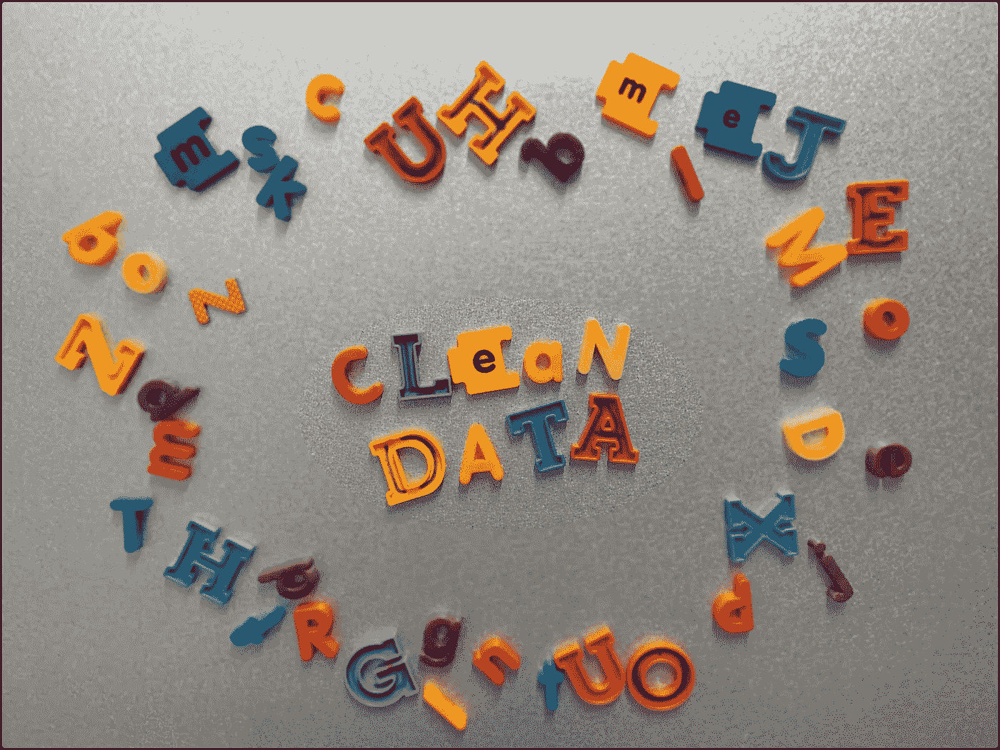
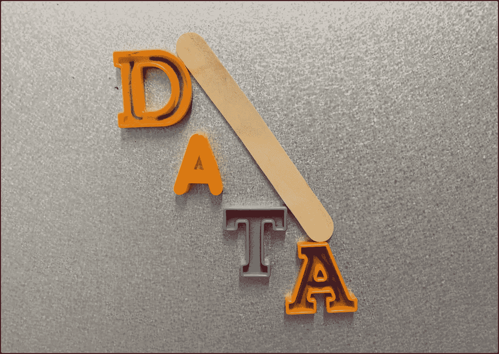

# 如何实施成功的数据清理流程

> 原文：<https://towardsdatascience.com/how-to-implement-a-successful-data-cleaning-process-701e565e6575?source=collection_archive---------29----------------------->

[拉杆脚轮](https://medium.com/u/4d32c78bd7f8?source=post_page-----701e565e6575--------------------------------)

## 因为你不能测量脏数据

## 干净的数据是发现和洞察的基础。如果数据是脏的，你的团队为分析、培养和可视化数据付出的极大努力完全是浪费时间。当然，脏数据并不新鲜。早在计算机普及之前，它就一直困扰着人们的决策。现在计算机技术在日常生活中无处不在，这个问题变得更加复杂。

公司需要确定的第一件事是，他们的内部是否有脏数据。幸运的是，这很容易做到。答案是肯定的。每个人都有脏数据，这意味着你也有脏数据。现在我们已经越过了这个障碍，我们必须提出的下两个问题更难回答，“哪些数据是脏的？”以及“我们如何清理我们的数据？”

这些年来，我看到许多公司和团队竭尽全力清理他们的数据。它们涉及大型专门团队、主要项目时间表以及数月或数年的努力。他们都以差不多相同的方式结束，失败。至少项目结束时公司数据被清理的最初任务是失败的。

事实是，项目的形式往往会改变。它从一个有开始和结束的线性项目，然后是一个干净数据的预期交付，演变成一个无限持续的循环过程。然而，用于分析和洞察的干净数据的最终目标得以实现。

## ***失败的例子……***

在我解释一个成功的数据清理循环过程所涉及的步骤之前，让我们花点时间来探究像上面给出的例子这样庞大的数据清理项目总是失败的原因。清理数据的线性项目方法有一个固有的假设，会导致我们重复失败。它假设您正在清理的数据在本质上是静态的。新数据将进入您的系统，但新数据将正确输入，不包含错误或不干净。但是，如果脏数据以某种方式再次被引入源系统，那么您已经实施的流程将考虑所有可能形式的脏数据问题，这些问题可能会在将来出现。

这不是源系统工作方式的真实写照。例如，假设我们有人力资源部门使用的软件。它允许人力资源人员输入员工姓名，并通过所有入职要求跟踪他们的进度，从最初的聘用日期到员工接受其职位的全面培训。

该软件由第三方软件开发团队编写(或至少是定制的),贵公司曾使用该团队根据其特定的入职流程定制该软件。正如我们所期望的，该软件将所有数据保存到 SQL 事务数据库中。数据库中的一个字段存储了每个员工在整个入职流程中每次评估的分数。当然，如果某项评估尚未完成，则不会记录分数。您对数据的初步检查显示，未完成的评估在分数字段中包含一个空字符串，而已完成的评估在该字段中包含一个实际分数值。

您的团队实现了清理转换，以确保这些空字符串值在您的分析数据表中变为空值，以便您可以在计算过程中轻松找到并忽略它们。问题解决了！或者你是这么认为的…

数据清理工作完成几个月后，一名人力资源员工发现了人力资源软件本身的问题，他们向软件开发团队提出了这个问题。第三方团队选择通过改变其软件的行为来解决问题，不再使用空字符串值来表示不完整的评估分数，但他们现在使用零作为不完整的占位符。起初，这似乎解决了人力资源的问题，但很快分析师的报告开始反映出入职团队的平均得分极低。

当您的团队最终被要求进行调查时，您意识到问题来自所使用的平均方法。由于空字符串最初是不完整的指示符，并且您将它们转换为空值，所以分数的平均值可以通过简单的 average 函数来完成，因为它忽略了空值。它不会忽略零。因此，平均值现在包含了未完成评估的零分。

回到制图板！

## ***一个循环的清洗过程将起作用***

虽然上面的例子很简单，但现实生活中的问题要复杂得多，它清楚地展示了线性数据清理方法固有的问题。

相反，我们不断改变和增加影响整个业务数据的流程，因此，我们不断改变我们的环境，为有问题的数据带来新的机会。更糟糕的是，我们不仅改变了流程、系统、来源、领域和与数据收集相关的许多其他元素，我们还在以越来越快的速度添加新数据。

当您已经创建了一种清理数据的方法并实现了它时，这些因素中的许多或全部都已经改变了——改变了许多次。

线性数据清理路径注定要失败，应该放弃。相反，让我们从每个人最终都会采用的循环过程的系统化版本开始。与其在线性版本上浪费时间、精力和资源，然后采用无组织的循环数据清理方法，并像其他人一样让您的团队感到失败，您可以从一开始就正确地构建循环流程，每个人都会成功，知道他们为什么成功，同时带着成功的感觉做他们的工作。听起来不是更好吗？

[拉杆脚轮](https://medium.com/u/4d32c78bd7f8?source=post_page-----701e565e6575--------------------------------)

## ***把你的清洁过程想象成急诊分诊***

数据清理的循环过程相当简单。它由 5 个类似于医院急诊室的阶段组成。虽然各医院在急诊室程序的具体实施上有所不同，但基本步骤是相同的。第一阶段是分流。在这一阶段，医疗专业人员对患者进行评估，根据患者的严重程度为其分配优先级，并将他们分配到适当的小组进行治疗。第二阶段是治疗阶段。它包括对病人进行实际治疗，以及在病人出院前和出院后安排任何必要的随访。

使用这些 ER 和 triage 过程作为指南，让我们考虑一下周期性数据清理是什么样子的。

## **分析——一名患者走进急诊室**

人们出现在急诊室不仅仅是为了闲逛或者喝杯咖啡。他们在那里是有原因的。即使他们疾病的原因还没有被诊断出来，这次访问的背景也是明白无误的。数据清理也是如此。

更传统的线性数据清理方法的困难之一是情况的抽象性。让我们思考一下这个问题。如果我们正在查看数据库中的数据，但实际上并没有试图为公司分析任何东西(即月度销售趋势或损耗)脏数据可能很明显，也可能不明显。但是，一旦我们开始计算收入、利润、客户流失率，以及我们的企业要求了解的其他典型项目，脏数据就会出现。脱离上下文的数据很容易伪装成干净的数据。因此，在线性方法中，我们经常会遗漏许多实际包含脏数据的数据字段。在线性清理项目结束时，当分析师第一次发现利润一栏中的数字完全不合理时，就需要重新检查得到的“干净”数据。

使用数据清理的循环过程，我们从分析开始。继续前进，让分析师们在数据中放松。告诉他们向数据工程师提出要求，施展他们的分析魔法，当数据看起来不正确时，不要羞于提出问题。这是我们的清理过程迫切需要的帮助和上下文，以便正确和全面地清理我们当前拥有的数据。

每当分析师发现与数据有关的东西时，这就成为将病人送到急诊室的理由。是胃痛或者气短或者高烧把数据带给你清洗。当然，一旦分析师将“数据”患者发送到您的急诊室，您的数据分诊人员必须准备好执行。

## 评估——伸出舌头，说“啊”

当有人走进急诊室时，医疗小组做的第一件事就是评估病人。他们测量他们的体温、血压、逐项列出病人正在服用的药物清单、获得症状描述等等。开始评估“数据”患者时也是如此。

[拉杆脚轮](https://medium.com/u/4d32c78bd7f8?source=post_page-----701e565e6575--------------------------------)

当然，在医疗情况下，大部分信息都是与已知的正常范围进行比较的。护士和医生知道你的体温或血压是否高于可接受的范围。那些法线已经建立了。但是在有数据的情况下，可能需要先建立正常值，然后才能验证患者的健康状况。

您的“数据”分类小组将评估分析师(转诊医生)发给他们的患者。在我们循环流程的这一阶段，您的团队将与分析师以及可能的其他业务团队成员一起工作，以验证数据确实是脏的。您还需要使用这些数据评估业务案例及其对公司或公司下属部门的影响。

在这一阶段，我们要问的第一个问题是“这些数据看起来应该是什么样的:相加或平均还是作为一个维度或其他什么？”如果没有对数据应该是什么的正确理解，我们很有可能做出不清理数据的更改。我们可能只是将数据转换成另一种形式的脏数据。

接下来，您需要理解数据的影响和重要性。首席执行官或首席财务官是否使用这些数据来制定市场决策、产品决策、向公众报告公司进展？客户服务部是否使用这些数据来改善您客户的体验？营销部门会利用这些数据来规划他们的下一个广告策略吗？是否存储了这些数据，并在今年晚些时候用于董事会的趋势分析？有无限的可能性，但数据的影响和重要性将帮助您正确地优先考虑这个病人。

## **分配优先级——即使紧急情况也有严重程度**

甚至急诊室的病人也有不同程度的紧急情况。一名患者可能感到恶心，另一名患者感到极度的胸部和手臂疼痛。还有一个可能失去知觉或遭受烧伤。虽然他们都需要医疗护理，但目前只有这么多的医疗专业人员来帮助他们，最糟糕的情况将值得优先考虑。当然，许多因素被用来确定某人疾病的严重程度和相应的优先级。“数据”患者也是如此。

一旦您在上下文中理解了数据应该是什么以及它的重要性和影响，您将需要为它分配一个优先级。所有团队的资源都是有限的，您的数据清理团队也不例外。这暴露了线性清洁方法的另一个问题。当您线性清理数据时，每一个识别出的脏数据出现往往会获得同等的优先级，因为它成为一个大型项目的一部分，该项目将在项目结束时考虑数据清理。当今世界，大多数团队的资源都非常有限。同等优先地处理所有问题会大大延迟团队发布最重要和最有影响力的结果。

[拉杆脚轮](https://medium.com/u/4d32c78bd7f8?source=post_page-----701e565e6575--------------------------------)

您的数据团队需要建立自己的优先级规则。也许任何特别来自客户要求或故障单的东西都会跳到列表的最前面。或者，最高管理层的请求可能会获得最高优先级。每一种公司文化都有其自身的动力，你的团队应该与公司领导一起工作，以确定对请求进行优先排序的最佳行动方案。但是，一旦定义了该标准，您的团队应该使用在评估中收集的上下文、影响和重要性，以及确定优先级的标准，并相应地分配每个请求。

## **确定清理数据的适当流程和团队**

医院经常每班雇用一名急诊室医生。这位医生将在她值班期间，为每一位病人看病，并解决进入急诊室的每一种情况。然而，如果一个特殊的急诊室病人需要一个专家，值班医生将努力稳定病人的病情，然后将他分配到一个部门。那个特定部门的随叫随到的医生将接手这个特殊的病例。如果一个特定的病人需要多个专家，那么可以分配多个部门来协助整个治疗计划。

在清理数据时，指派一名通才甚至可能是多名专家的做法是一样的。你必须总结出最好的团队来获得最好的结果。为了做到这一点，您的数据专家团队，也许是多面手，需要更多地了解有问题的脏数据。

首先确定数据的来源，以及数据在最终保存到数据库供分析师使用之前所经历的任何转换。同样，您的团队可能需要获得数据工程师、数据辩论者、数据库管理员或更多业务团队成员的协助，以正确评估患者。如果您确定与源数据相关的应用程序没有正确地将数据保存到数据库中，您甚至可以寻求软件开发人员的帮助。不要害怕与他人合作，寻求帮助。

通过概述数据和任何 ETL 的源系统，您可以更加容易和快速地从正确的团队获得必要的资源。如果是会计数据，您可能需要与这些服务器的数据团队合作。或者，如果是地球科学数据，您需要接触一些地球科学家，以了解他们与数据工程师一起帮助设计的 ETL 过程。你明白了。

执行这些前期工作，将您的“数据”患者置于尽可能好的护理中，并确保最快的“恢复”或清洁时间。

## **确定清理数据的必要步骤**

有了合适的团队，病人的治疗现在可以开始了。集合起来的团队将需要决定如何最好地清理数据，以便在分析师使用的数据库中使用和存储。当然，这可能是一个快速的过程，也可能需要一段时间，这取决于现有 ETL 的复杂性或所涉及的源系统的肮脏本质。

[拉杆脚轮](https://medium.com/u/4d32c78bd7f8?source=post_page-----701e565e6575--------------------------------)

一旦必要的步骤被识别、测试并达成一致，它们就需要被记录，当然，还要被实现。最好是使用一个开发、测试、生产环境架构，并首先将变更实现到开发中。然后提升到测试环境，只有当所有内容都被验证为正确时，才把最终解决方案提升到生产环境。但是这些环境和部署步骤因公司而异，您需要遵循您的组织概述的流程。

## **自动执行您刚刚实施的清洁步骤**

在医院里，一旦病人接受了治疗并被认为可以出院，他们仍然可能有后续的预约或需要执行的任务，如服药。对于数据清理，可能还需要多个后续任务，但是始终需要的一个后续任务涉及自动化。

不管你公司的变化过程是什么，你必须做的一件事是通过自动化使变化持久。自动化有多种形式。您可能需要改变现有的 ETL 过程，或者引入一个自动化的过程来清理 ETL 后的数据。自动化可以通过为你和你的公司工作的任何语言或系统来实现:SQL、Python、C#、SAS 等等。使用微软产品的公司常用的自动化系统是 SQL Server Integration Services(或 SSIS)。这些任务的计划执行可以像 cron 或 Microsoft 任务管理器或 SQL 代理一样简单。不一定需要精密。但是需要自动化。

如果您允许清理过程仍然是手动的，您将很快让您的团队被重复的手动工作淹没，并且承担新的数据清理工作的希望将被放弃。

我已经在其他地方说过了，但是让你的团队变得无用的最快方法是用重复的手工工作来压倒他们。所有探索、清理和初始数据争论工作都是手动的。但是一旦过程被清晰地定义，如果你的团队希望继续影响你公司的洞察力和决策，它必须是自动化的。

## **重复**

现在，您已经完成了清洁流程的所有步骤，包括分析、识别、评估、优先排序、团队分配、建立清洁流程和自动化清洁流程，现在是时候重复该流程了。分析师将确认您团队的工作结果并心存感激，但他们也会向您发送新的“数据”患者，并为这些生病并需要您治疗的新患者重新开始这一过程。

## **最后一次提醒，正式建立您的周期性数据清理流程……**

在医院急诊室救人的医生和护士并不只是即兴发挥。他们已经训练多年了。他们几乎可以在睡梦中完成工作，因为这已经通过数小时的正式训练而在他们心中根深蒂固。他们不仅在医疗程序和知识方面接受了严格的培训，急诊室中用于对患者进行分类、收治患者、确定患者优先顺序的政策和程序，以及治疗患者的所有方式都经过了彻底的研究和正式化，以便为任何来到他们门前的患者提供最佳的生存机会。

医务人员和医院管理人员知道，一个强大的、正式的计划会减少出错的机会，从而带来更大的成功。形式化计划的好处同样适用于数据清理。

正如本文开头所概述的，大型的基于线性的数据清理项目最终通常会以相同的循环过程告终。线性过程让他们失望了，因为工作还必须完成，团队在每个问题出现时就着手解决。但是很多时候，在一次失败的线性尝试之后，到达这个相同的过程，会使该过程处于一种非正式的状态。这实际上只是以一种特别的方式进行的。

避免这个陷阱！

没有形式化，过程结果将在成功和失败之间起伏不定。每个新发现的脏数据问题的成功清理将永远是待价而沽的。你的团队会工作不稳定，他们对工作的动力时好时坏。即使随着时间的推移，随着团队的形成，你的临时方法开始发挥作用，但每当团队成员离开或新成员加入时，它就会被颠覆。原因是…没有计划可循。

有时候，当你的团队对自己的工作感觉良好时，他们会表现出色。但是其他时候，重复的工作和对最初数据清理项目失败的回忆会促使他们质疑自己的工作和工作的性质。

“为什么我们不能创建一个流程来解决所有这些问题，而不是每天面对一场火灾？”

“为什么管理层不关心我们已经超负荷工作了？他们只是不断给我们发送更多的请求。”

“我们什么时候才能赶上？”

如果您愿意花时间并努力将清理数据的循环过程正式化，您的团队将有一个路线图可以遵循，并且您组织中的其他部门将有一个指南来正确地与您的团队进行交互。在许多方面，这只是一个视角，但是过程的形式化消除了模糊性，并使正在完成的工作有了目的。形式化是确保您的团队在数据清理方面取得一致成功的必要步骤。

***杆蓖麻*** *帮助企业获得分析权！他与国际组织和小型企业合作，开始或改进他们在数据分析、数据科学、技术战略和技术领导力方面的工作。除了咨询，Rod 还喜欢公开演讲、教学和写作。你可以在*[*rodcastor.com*](https://rodcastor.com/)*和*[*applied ai . us*](https://appliedai.us/)*了解更多关于罗德和他的作品。*