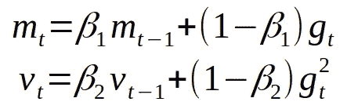
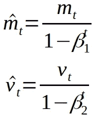
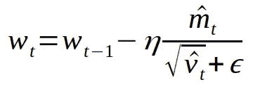
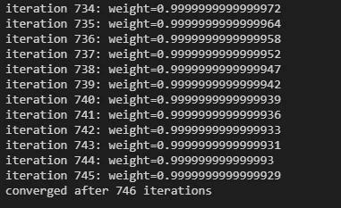

# 如何从头开始实现 Adam 优化器

> 原文：<https://towardsdatascience.com/how-to-implement-an-adam-optimizer-from-scratch-76e7b217f1cc?source=collection_archive---------5----------------------->

没你想的那么难！

TL；博士如果你想跳过教程。这里是我创作的[笔记本](https://github.com/enochkan/building-from-scratch/blob/main/adam-optimizer-from-scratch.ipynb)。

Adam 是一种基于自适应矩估计优化随机目标函数的算法。Adam 的更新规则是 momentum 和 RMSProp 优化器的组合。

规则很简单。从头开始编写 Adam 代码，无需借助任何外部 ML 库，如 PyTorch、Keras、Chainer 或 Tensorflow。只允许我们使用的库是`numpy`和`math`。

(っ^‿^)っ(っ^‿^)っ(っ^‿^)っ(っ^‿^)っ(っ^‿^)っ(っ^‿^)っ

# 第一步:理解亚当是如何工作的

学习亚当作品最简单的方法就是看吴恩达的 [**视频**](https://www.youtube.com/watch?v=JXQT_vxqwIs) 。或者，你可以阅读亚当的 [**原论文**](https://arxiv.org/abs/1412.6980) 来更好地理解背后的动机和直觉。

亚当依赖的两个值是 *β* ₁和 *β* ₂. *β* ₁是一阶矩估计的速率的指数衰减，其文献值为 0.9。β是二阶矩估计的指数衰减率，文献值为 0.999。这两个文献值适用于大多数数据集。

使用参数β1 和β2 计算移动平均值

在给定的迭代 *t* 上，我们可以根据参数 *β* ₁、 *β* ₂和梯度 *gt 计算移动平均。*由于 SGD 和 RMSProp 等大多数依赖于移动平均值的算法都存在偏差，因此我们需要额外的步骤来纠正偏差。这被称为偏差校正步骤:

移动平均线的偏差修正

最后，我们可以根据计算出的移动平均值，以步长 *η* 更新参数(权重和偏差):

# 步骤 2:用 Python 实现 Adam

总结一下，我们需要定义几个变量:一阶指数衰减 *β* ₁，二阶指数衰减 *β* ₂，步长 *η* 和一个小值 *ε* 防止零除。此外，我们将`m_dw`、`v_dw`、`m_db`和`v_db`定义为权重和偏差`dw`和`db`的梯度的前一时间步的均值和无中心方差。

回想一下，Adam 依赖于两个重要的矩:均值的一阶矩估计和方差的二阶矩估计。使用这些矩估计，我们可以在给定适当步长的情况下更新权重和偏差。

# 步骤 3:测试实现

为了测试我们的实现，我们首先需要定义一个损失函数及其各自的梯度函数。梯度函数可以通过简单地对损失函数求导来获得。例如:

注意，我们还定义了一个额外的函数来检查收敛性，这是基于当达到收敛时权重不会改变的事实。最后，我们可以使用构建的 Adam 优化器迭代更新权重和偏差，并查看它们是否收敛:

查看结果，在 750 次迭代下达到收敛。大获成功！

请随意查看我的其他故事和 github 项目。祝你今天开心！玩的开心！

由[乌列尔 SC](https://unsplash.com/@urielsc26?utm_source=medium&utm_medium=referral) 在 [Unsplash](https://unsplash.com?utm_source=medium&utm_medium=referral) 上拍摄的照片