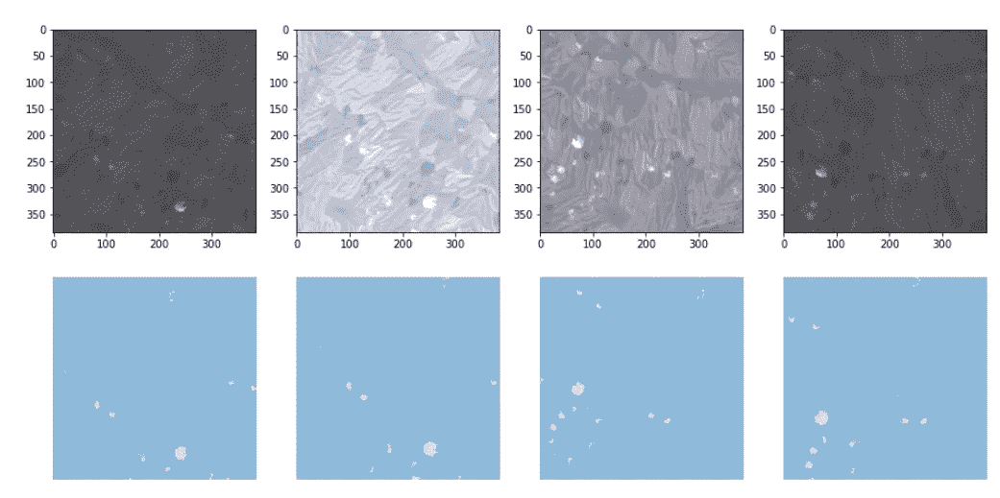
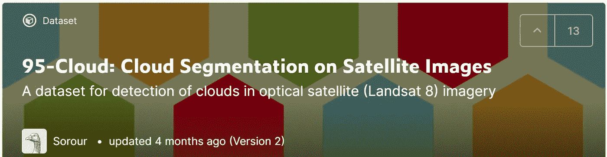
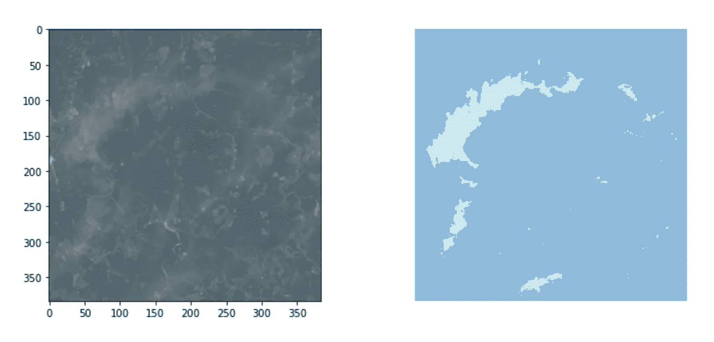
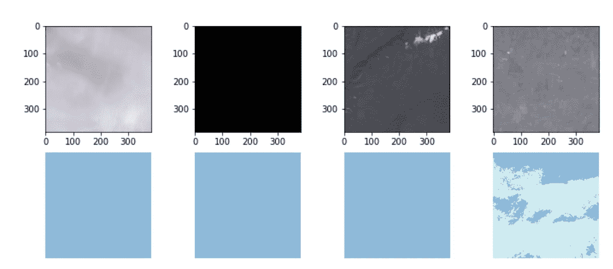
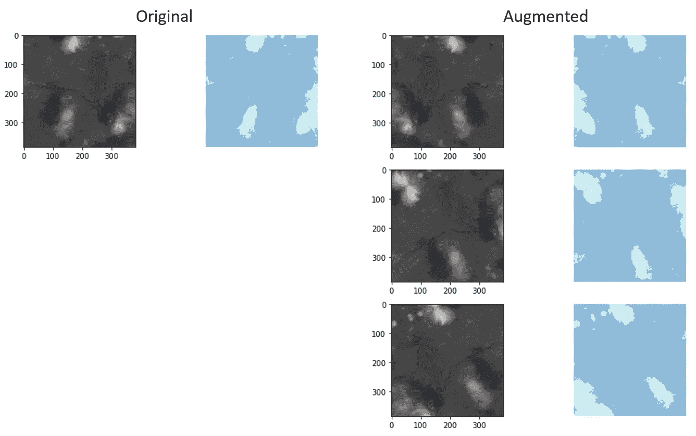
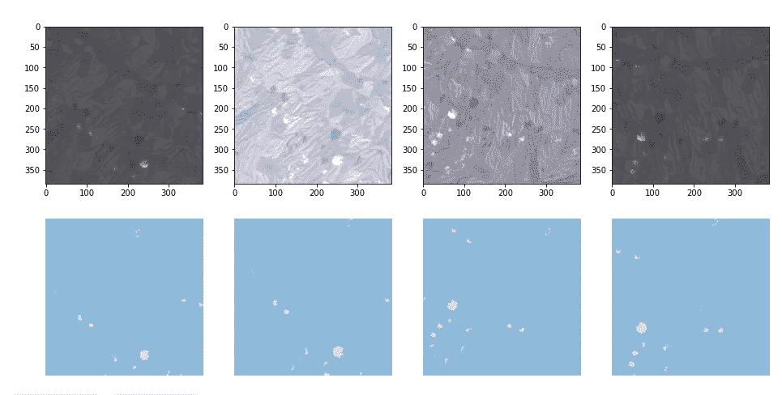

# 如何使用 Fastai-v2 和 Albumentations 实现多光谱卫星图像分割的增强

> 原文：<https://towardsdatascience.com/how-to-implement-augmentations-for-multispectral-satellite-images-segmentation-using-fastai-v2-and-ea3965736d1?source=collection_archive---------23----------------------->

## 通过多光谱图像增强和 Fastai v2 提高深度学习算法的性能



图 1:应用于 Landsat 8 补丁及其相应的云掩膜的增强。图片作者。

## 更新

关于课程**科学家 Python 入门** ( [可在 YouTube](https://youtu.be/oQaoj6LE5E4) ) 和其他类似文章的信息，请访问我的网站[cordmaur.carrd.co](http://cordmaur.carrd.co/)。

# 介绍

我们知道图像增强是计算机视觉任务的一个关键因素。它有助于算法避免过度拟合，也限制了对庞大训练数据集的需求[1]。大多数深度学习框架都有一个实现增强“开箱即用”的视觉模块，如 Keras、PyTorch 和 Fastai 库的情况。当我们需要向模型提供与 3 通道标准(RGB)不匹配的图像时，问题就出现了。这是大多数遥感应用的情况(例如图 1)和许多其他区域。

为了克服这一限制，我将展示如何使用白蛋白库[2]实现多光谱增强，并将其插入 Fastai v2 数据块以供进一步培训。关于如何为卫星图像创建数据块的原则可以在我之前的故事[“如何使用 Fastai-v2 为多光谱卫星图像分割创建数据块”](/how-to-create-a-datablock-for-multispectral-satellite-image-segmentation-with-the-fastai-v2-bc5e82f4eb5)中找到。

## 1-数据集

我们将使用的数据是 Kaggle 提供的公共数据集，名为[*“95 云:卫星图像上的云分割”*](https://www.kaggle.com/sorour/95cloud-cloud-segmentation-on-satellite-images) *，*，包含从 57 个 Landsat 8 场景中提取的训练补丁。事实上，这个数据集是以前的 Kaggle 数据集的扩展，该数据集用于训练一个非常简单的 Fastai v1 模型([此处为](https://medium.com/analytics-vidhya/a-simple-cloud-detection-walk-through-using-convolutional-neural-network-cnn-and-u-net-and-bc745dda4b04))。这些贴片的尺寸为 384x384，包含 4 个波段——红、绿、蓝和近红外。此外，还有一个标记云的地面真相补丁。由于我们的目标只是展示如何实现增强，没有进一步考虑准确性，我们将只使用最新版本。



图 2— Kaggle 数据集。图片来自 ka ggle([https://www . ka ggle . com/sorour/95 cloud-cloud-segmentation-on-satellite-images](https://www.kaggle.com/sorour/95cloud-cloud-segmentation-on-satellite-images))

为了方便起见，这里显示的所有代码都可以在 Kaggle 笔记本中使用([这里是](https://www.kaggle.com/cordmaur/remotesensing-fastai2-multiband-augmentations))，所以我们将从安装必要的依赖项开始:

```
# update torch and torch vision
!pip install -q torch==1.6.0+cu101 torchvision==0.7.0+cu101 -f [https://download.pytorch.org/whl/torch_stable.html](https://download.pytorch.org/whl/torch_stable.html)# install kornia, we will give it a try to accelarate our preprocessing
!pip install -q --upgrade kornia
!pip install -q allennlp==1.1.0.rc4# and install fastai2
!pip install -q --upgrade fastai
```

## 2-打开图像

除了视觉库不支持多通道图像的问题，该数据集将每个波段保存在单独的文件夹中。因此，为了打开一个图像，我们首先需要纠正每个波段的路径，然后将它们整理成一个单一的 4 通道图像。不像我们在之前的[故事](/how-to-create-a-datablock-for-multispectral-satellite-image-segmentation-with-the-fastai-v2-bc5e82f4eb5)中那样子类化 TensorImage 类，我将尝试使事情变得更简单，并将图像作为张量打开。这种方法的缺点是我们不能像`DataLoader.showbatch()`一样使用 Fastai 的内部可视化功能，因为它不知道如何显示 4 个波段。

第一步是创建三个基本函数:

1.  打开一个 TIF 文件，并将其作为 PyTorch 张量返回；
2.  给定一个文件名(假设是红色波段)，返回其他三个波段(绿色、蓝色和 Nir)的名称；
3.  一次打开 4 个波段，将它们整理成一个图像。为此，我们将使用第一维(或轴)连接图像

一旦我们的函数被定义，我们将通过传递一个项目到管道来测试它们。管道是应用于一个项目的一系列功能，以我们想要的方式转换它。

为了加载项目，我们将考虑我们的基础图像在红色文件夹中，然后我们将自动获取其他波段。因此，我们的管道将由两个功能组成:1- `get_filenames` 和 2- `open_ms_tif`。我们的最终图像将有形状`(4, 384, 384)`。用 matplotlib 显示它会在维度上做最后的排列，把通道放在最后一个轴上成为`(384, 384, 4)`，并且用`[…, :3]`切掉 Nir 波段。

考虑到我们的最终目标是分割图像中的云，我们必须将相同的增强应用于地面真相。因此，将进行类似的程序来打开面罩。

```
torch.Size([4, 384, 384]) torch.Size([384, 384])
```



图 3:显示补丁和相应云遮罩的代码输出。图片作者。

如我们所见，我们的管道运行良好。我使用 TensorMask 的`.show()` 方法和 context `ctx`参数，只是为了说明在 Fastai 中可以将输出强制到任何上下文。另一个有趣的命令是 partial，它返回对预先填充了一组给定参数的函数的引用。

## 3-创建数据集和数据加载器

在进行扩充之前，我们将首先创建一个数据集和一个数据加载器，只是为了检查是否一切都按预期工作。注意，我们不需要在数据块中指定 get_items 函数，因为我们的源已经是一个条目列表。我们还将定义一个函数`show_img()`来显示多通道张量。

```
torch.Size([4, 4, 384, 384]) torch.Size([4, 384, 384])
```



图 4:显示一个批处理样本的代码输出。(上)RGB 图像|(下)云遮罩。图片作者。

## 4-扩充

为了扩充，我们将使用白蛋白库。有一个巨大的可能的增强列表，分为不同的类，如像素级和空间级变换。对于本教程，我们将保持简单，只使用基本的移动，翻转，缩放，旋转，亮度和对比度。完整的列表可以通过他们的在线文档获得([此处](https://albumentations.ai/docs/getting_started/transforms_and_targets/))。

白蛋白库的一个重要方面是它支持分割和对象检测的增强。这意味着它可以将应用于图像的相应增强应用于其目标(遮罩或边界框)。这是至关重要的一点，因为我们需要保持我们的云遮罩与增强图像相匹配。

Fastai 将对一个元组(X，Y)应用增强，其中 X 是图像，Y 是遮罩。为了让它在框架内工作，有必要子类化 ItemTransform 类并创建`encodes()`方法。为了使它通用，我们的子类将在实例创建时接收期望的转换，如下所示:



图 5:代码输出显示:(左)原始项目(图像和遮罩)|(右)图像和遮罩的增强版本。图片作者。

注意，在这个类中定义了一个`split_idx=0`。这就是告诉 Fastai 只增加训练数据集，而不是验证数据集。现在我们已经建立了我们的转换类，让我们在数据块中使用它。我们将重新创建数据块，现在将`item_tfms`参数设置为`aug`。然后，我们将要求数据加载器多次创建一个项目，以查看它是如何进行的。



图 6:代码输出演示了在通过数据加载器时应用于同一个补丁的增强。图片作者。

## 结论

正如我们在这个故事中看到的，实现多光谱卫星图像的数据增强只是找到正确工具的问题。在这方面，白蛋白是一个很好的伴侣，因为它可以处理许多渠道，并增加目标。

如前所述，包含所有代码的笔记本可以在 Kaggle ( [此处](https://www.kaggle.com/cordmaur/remotesensing-fastai2-multiband-augmentations))找到。在那里，还可能找到有和没有增强的学习准确度的比较。

希望你喜欢。

## 参考

[1] Shorten，c .，Khoshgoftaar，T.M .，2019 年。面向深度学习的图像数据增强综述。j 大数据 6、60。https://doi.org/10.1186/s40537-019-0197-0[。](https://doi.org/10.1186/s40537-019-0197-0)

[2] Buslaev，a .，Iglovikov，V.I .，Khvedchenya，e .，Parinov，a .，Druzhinin，m .，Kalinin，A.A .，2020。快速灵活的图像增强。信息 11125。【https://doi.org/10.3390/info11020125 