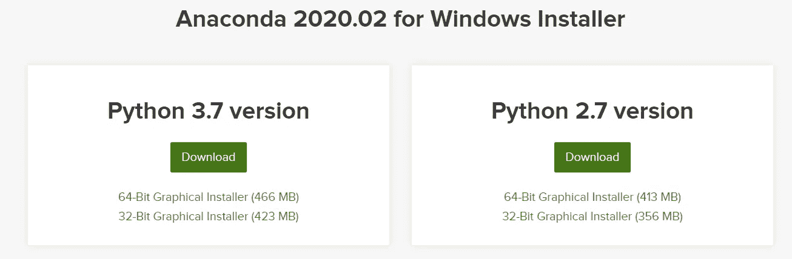

# 如何使用 PyCaret 在 Power BI 中实现集群

> 原文：<https://towardsdatascience.com/how-to-implement-clustering-in-power-bi-using-pycaret-4b5e34b1405b?source=collection_archive---------10----------------------->


Power BI 中的集群仪表板

在我们的[上一篇文章](/build-your-first-anomaly-detector-in-power-bi-using-pycaret-2b41b363244e)中，我们展示了如何通过将异常检测器与 PyCaret 集成，在 Power BI 中构建异常检测器，从而允许分析师和数据科学家在他们的报告和仪表板中添加一层机器学习，而无需任何额外的许可成本。

在这篇文章中，我们将看到如何使用 PyCaret 在 Power BI 中实现聚类分析。如果你以前没有听说过 PyCaret，请阅读这个[公告](/announcing-pycaret-an-open-source-low-code-machine-learning-library-in-python-4a1f1aad8d46)以了解更多信息。

# 本教程的学习目标

*   什么是集群？聚类的类型。
*   在 Power BI 中训练和实现无监督聚类模型。
*   在仪表板中分析结果和可视化信息。
*   如何在电力 BI 生产中部署集群模式？

# 开始之前

如果您以前使用过 Python，很可能您的计算机上已经安装了 Anaconda 发行版。如果没有，[点击这里](https://www.anaconda.com/distribution/)下载 Python 3.7 或更高版本的 Anaconda 发行版。



[https://www.anaconda.com/products/individual](https://www.anaconda.com/products/individual)

# 设置环境

在我们开始在 Power BI 中使用 PyCaret 的机器学习功能之前，我们必须创建一个虚拟环境并安装 pycaret。这是一个三步走的过程:

[✅](https://fsymbols.com/signs/tick/) **步骤 1——创建一个 anaconda 环境**

从开始菜单打开 **Anaconda 提示符**并执行以下代码:

```
conda create --name **myenv** python=3.7
```

[✅](https://fsymbols.com/signs/tick/) **第二步—安装 PyCaret**

在 Anaconda 提示符下执行以下代码:

```
pip install pycaret
```

安装可能需要 15-20 分钟。如果您在安装时遇到问题，请查看我们的 [GitHub](https://www.github.com/pycaret/pycaret) 页面，了解已知问题和解决方案。

[✅](https://fsymbols.com/signs/tick/)t22】第三步——在 Power BI 中设置 Python 目录

创建的虚拟环境必须与 Power BI 链接。这可以使用 Power BI Desktop 中的全局设置来完成(文件→选项→全局→ Python 脚本)。默认情况下，Anaconda 环境安装在以下位置:

C:\Users\ ***用户名***\ AppData \ Local \ Continuum \ anaconda 3 \ envs \ myenv


文件→选项→全局→ Python 脚本

# 什么是集群？

聚类是一种将具有相似特征的数据点分组的技术。这些分组对于探索数据、识别模式和分析数据子集非常有用。将数据组织成簇有助于识别数据中的底层结构，并在许多行业中找到应用。集群的一些常见业务用例有:

以营销为目的的✔客户细分。

促销和折扣的✔顾客购买行为分析。

✔在诸如新冠肺炎的流行病爆发中识别地理群集。

# 聚类的类型

考虑到集群任务的主观性，有各种算法适合不同类型的问题。每种算法都有自己的规则和计算聚类背后的数学原理。

本教程是关于使用名为 PyCaret 的 Python 库在 Power BI 中实现聚类分析的。对这些算法背后的具体算法细节和数学的讨论超出了本教程的范围。


Ghosal A .、Nandy A .、Das A.K .、Goswami S .、Panday M. (2020)对不同聚类技术及其应用的简短回顾。

在本教程中，我们将使用 K-Means 算法，这是最简单和最流行的无监督机器学习算法之一。如果你想了解更多的 K-Means，你可以阅读[这篇论文](https://stanford.edu/~cpiech/cs221/handouts/kmeans.html)。

# 设置业务环境

在本教程中，我们将使用来自世界卫生组织全球卫生支出数据库的当前卫生支出数据集。该数据集包含 2000 年至 2017 年 200 多个国家的卫生支出占国民生产总值的百分比。

我们的目标是通过使用 K-Means 聚类算法在这些数据中找到模式和组。

[源数据](https://data.worldbank.org/indicator/SH.XPD.CHEX.GD.ZS)


样本数据点

# 👉我们开始吧

现在，您已经设置了 Anaconda 环境，安装了 PyCaret，了解了集群分析的基础知识，并且有了本教程的业务上下文，让我们开始吧。

# 1.检索数据

第一步是将数据集导入 Power BI Desktop。您可以使用 web 连接器加载数据。(Power BI 桌面→获取数据→来自 Web)。


Power BI 桌面→获取数据→其他→ Web

链接到 csv 文件:
[https://github . com/py caret/power bi-clustering/blob/master/clustering . CSV](https://github.com/pycaret/powerbi-clustering/blob/master/clustering.csv)

# 2.模特培训

为了在 Power BI 中训练聚类模型，我们必须在 Power Query Editor 中执行 Python 脚本(Power Query Editor→Transform→Run Python script)。将以下代码作为 Python 脚本运行:

```
from **pycaret.clustering** import *
dataset = **get_clusters**(dataset, num_clusters=5, ignore_features=['Country'])
```


超级查询编辑器(转换→运行 python 脚本)

我们使用 **ignore_features** 参数忽略了数据集中的“ *Country* 列。可能有许多原因导致您不想使用某些列来训练机器学习算法。

PyCaret 允许您隐藏而不是删除数据集中不需要的列，因为您可能需要这些列用于以后的分析。例如，在这种情况下，我们不想使用“国家”来训练算法，因此我们在 **ignore_features 下传递它。**

PyCaret 中有超过 8 种现成可用的聚类算法。


默认情况下，PyCaret 训练一个具有 4 个聚类的 K 均值聚类模型。默认值可以很容易地更改:

*   要更改模型类型，使用 **get_clusters()** 中的 ***模型*** 参数。
*   要更改簇号，使用 ***num_clusters*** 参数。

参见具有 6 个集群的 **K 模式集群**的示例代码。

```
from **pycaret.clustering** import *
dataset = **get_clusters**(dataset, model='kmodes', num_clusters=6, ignore_features=['Country'])
```

**输出:**


聚类结果(执行 Python 代码后)


最终输出(点击表格后)

包含分类标签的新列被附加到原始数据集。然后，所有年份列都被*取消透视*以规范化数据，这样它就可以用于 Power BI 中的可视化。

下面是 Power BI 的最终输出。


Power BI Desktop 中的结果(应用查询后)

# 3.仪表盘

一旦您在 Power BI 中有了集群标签，以下是一个如何在 dashboard 中可视化集群标签以获得洞察力的示例:


仪表板的摘要页面


仪表板的详细信息页面

你可以从我们的 [GitHub](https://github.com/pycaret/powerbi-clustering) 下载 PBIX 文件和数据集。

# 👉在生产中实施集群

上面展示的是在 Power BI 中实现集群的一种简单方法。但是，需要注意的是，每当 Power BI 数据集被刷新时，上面显示的方法都会训练聚类模型。这可能是一个问题，原因有二:

*   当使用新数据重新训练模型时，分类标签可能会改变(例如，在重新训练时，先前被标记为分类 1 的一些数据点可能被标记为分类 2)
*   你不想每天花几个小时的时间重新训练模型。

在 Power BI 中实现集群的一种更有效的方法是使用预先训练的模型来生成集群标签，而不是每次都重新训练模型。

# 事前培训模型

你可以使用任何集成开发环境(IDE)或笔记本来训练机器学习模型。在此示例中，我们使用 Visual Studio 代码来训练一个聚类分析模型。


Visual Studio 代码中的模型定型

然后将训练好的模型保存为 pickle 文件，并导入到 Power Query 中以生成分类标签。


群集管道保存为 pickle 文件

如果您想了解更多关于使用 PyCaret 在 Jupyter 笔记本中实现聚类分析的信息，请观看这个 2 分钟的视频教程:

[https://www.youtube.com/watch?v=2oxLDir7foQ](https://www.youtube.com/watch?v=2oxLDir7foQ)

# 使用预先训练的模型

以 Python 脚本的形式执行以下代码，从预训练的模型中生成标签。

```
from **pycaret.clustering** import *
dataset = **predict_model**('c:/.../clustering_deployment_20052020, data = dataset)
```

它的输出将和我们上面看到的一样。不同之处在于，当您使用预训练模型时，标签是使用同一模型在新数据集上生成的，而不是重新训练模型。

# 让它在 Power BI 服务上发挥作用

一旦你上传了。pbix 文件到 Power BI 服务，还需要几个步骤来实现机器学习管道到数据管道的无缝集成。其中包括:

*   **为数据集**启用计划刷新—要使用 Python 脚本为包含您的数据集的工作簿启用计划刷新，请参见[配置计划刷新](https://docs.microsoft.com/en-us/power-bi/connect-data/refresh-scheduled-refresh)，其中还包括关于**个人网关**的信息。
*   **安装个人网关** —你需要一个**个人网关**安装在文件所在的机器上，并且安装了 PythonPower BI 服务必须能够访问 Python 环境。您可以获得关于如何[安装和配置个人网关](https://docs.microsoft.com/en-us/power-bi/connect-data/service-gateway-personal-mode)的更多信息。

如果您有兴趣了解更多关于聚类分析的知识，请查看我们的笔记本教程[。](https://www.pycaret.org/clu101)

# PyCaret 1.0.1 来了！

我们收到了来自社区的大力支持和反馈。我们正在积极改进 PyCaret，并准备我们的下一个版本。 **PyCaret 1.0.1 会更大更好**。如果您想分享您的反馈并帮助我们进一步改进，您可以[在网站上填写此表格](https://www.pycaret.org/feedback)或者在我们的 [GitHub](https://www.github.com/pycaret/) 或 [LinkedIn](https://www.linkedin.com/company/pycaret/) 页面上发表评论。

关注我们的 [LinkedIn](https://www.linkedin.com/company/pycaret/) 并订阅我们的 [Youtube](https://www.youtube.com/channel/UCxA1YTYJ9BEeo50lxyI_B3g) 频道，了解更多关于 PyCaret 的信息。

# 重要链接

[用户指南/文档](https://www.pycaret.org/guide)
[GitHub 资源库](https://www.github.com/pycaret/pycaret) [安装 PyCaret](https://www.pycaret.org/install)
[笔记本教程](https://www.pycaret.org/tutorial)
[贡献于 PyCaret](https://www.pycaret.org/contribute)

# 想了解某个特定模块？

从第一个版本 1.0.0 开始，PyCaret 有以下模块可供使用。点击下面的链接，查看 Python 中的文档和工作示例。

[分类](https://www.pycaret.org/classification)
[回归](https://www.pycaret.org/regression) [聚类](https://www.pycaret.org/clustering)
[异常检测](https://www.pycaret.org/anomaly-detection) [自然语言处理](https://www.pycaret.org/nlp)
[关联规则挖掘](https://www.pycaret.org/association-rules)

# 另请参见:

笔记本中的 PyCaret 入门教程:

[聚类](https://www.pycaret.org/clu101)
[异常检测](https://www.pycaret.org/anom101)
[自然语言处理](https://www.pycaret.org/nlp101)
[关联规则挖掘](https://www.pycaret.org/arul101)
[回归](https://www.pycaret.org/reg101)
[分类](https://www.pycaret.org/clf101)

# 你愿意投稿吗？

PyCaret 是一个开源项目。欢迎每个人都来投稿。如果您愿意投稿，请随意处理[个未决问题](https://github.com/pycaret/pycaret/issues)。dev-1.0.1 分支上的单元测试接受拉请求。

如果你喜欢 PyCaret，请给我们 GitHub 回购的⭐️。

中:【https://medium.com/@moez_62905/】T4

领英:[https://www.linkedin.com/in/profile-moez/](https://www.linkedin.com/in/profile-moez/)

推特:[https://twitter.com/moezpycaretorg1](https://twitter.com/moezpycaretorg1)