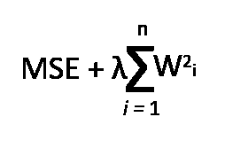

# 如何在 TensorFlow(Keras)中实现自定义正则化

> 原文：<https://towardsdatascience.com/how-to-implement-custom-regularization-in-tensorflow-keras-4e77be082918?source=collection_archive---------31----------------------->

## 技术的

## 了解如何使用 TensorFlow 和 Keras 相对轻松地实现自定义神经网络正则化技术。


萨法尔·萨法罗夫在 [Unsplash](https://unsplash.com/s/photos/code?utm_source=unsplash&utm_medium=referral&utm_content=creditCopyText) 上拍摄的照片

# 介绍

本文介绍了神经网络中的正则化主题。它包括机器学习工程师和数据科学家如何实施定制正则化技术的细节。

**正则化技术通过限制网络中权重值的范围来降低神经网络过拟合的可能性。**

下面的文章介绍了传统的正则化技术以及它们是如何在 TensorFlow(Keras)中实现的。下面的参考文章是针对那些喜欢神经网络内正则化主题的深入概述的读者。

[](/regularization-techniques-and-their-implementation-in-tensorflow-keras-c06e7551e709) [## TensorFlow(Keras)中的技术及其实现

### 理解用于减轻深度神经网络中过拟合问题的传统技术。

towardsdatascience.com](/regularization-techniques-and-their-implementation-in-tensorflow-keras-c06e7551e709) 

# 实现自定义正则项

在我们继续之前，值得注意的是，在大多数情况下，您不需要实现您的自定义正则化技术。

*tensor flow、Keras 和 PyTorch 等流行的机器学习库内部实现了标准的正则化技术。*

我将要实现的正则化技术是 L2 正则化技术。

**L2 正则化惩罚权重值。对于较小的权重值和相对较大的权重值，L2 正则化将这些值转换为接近 0 但不完全 0 的数字。**

L2 惩罚权重的平方和，因此我们将在 python 函数中实现这个逻辑。



L2 正则化

```
def custom_l2_regularizer(weights):
    return tf.reduce_sum(0.02 * tf.square(weights))
```

上面的代码是我们自定义的 L2 正则化技术。

使用 TensorFlow 的数学运算，我们可以计算传入函数的权重的平方和。

*   [tf.reduce_sum](https://www.tensorflow.org/api_docs/python/tf/math/reduce_sum) :数学运算，其结果是传递给函数的值的总和。
*   [tf.square](https://www.tensorflow.org/api_docs/python/tf/math/square) :对其参数中的值进行平方的数学运算

这就是全部了。

为了利用我们的自定义正则项，我们将其传递到神经网络层，如下所示:

```
keras.layers.Dense(200, activation='relu', kernel_regularizer=custom_l2_regularizer),
```

Keas 神经网络层可以在其'*kernel _ regulator*'参数内接受自定义函数。

# 把所有的放在一起

为了了解所实现的自定义正则化技术的效果，我们将构建一个简单的神经网络，并执行图像分类这一简单任务。

这一节将包括执行一些常见神经网络实现任务的代码片段，并且 GitHub repo 链接也是可用的[这里](https://github.com/RichmondAlake/tensorflow_2_tutorials/blob/master/14_custom_regularizer.ipynb)包括本文中的所有代码。

为了实现我们的神经网络和加载数据集，我们将利用以下工具和库:Keras、TensorFlow 和 NumPy。

```
import tensorflow as tf
from tensorflow import keras
import numpy as np
```

将数据集加载并划分到测试、验证和培训中。

还需要将数据集中图像的像素强度从 0–255 到 0–1 的值范围进行归一化。

数组' *class_names* '被初始化以保存数据集中图像所表示的服装的商品标签。

```
(train_images, train_labels),(test_images, test_labels) = keras.datasets.fashion_mnist.load_data()train_images = train_images / 255.0
test_images = test_images / 255.0validation_images = train_images[:5000]
validation_labels = train_labels[:5000]class_names = ["T-shirt/top", "Trouser", "Pullover", "Dress", "Coat", "Sandal", "Shirt", "Sneaker", "Bag", "Ankle boot"]
```

这里，我们按照前面的解释定义了自定义正则项。

```
def custom_l2_regularizer(weights):
    return tf.reduce_sum(0.02 * tf.square(weights))
```

下一步是实现我们的神经网络及其层。这里为每一层分配适当的参数，包括我们的自定义正则化。

```
model = keras.models.Sequential([
    keras.layers.Flatten(input_shape=[28,28]),
    keras.layers.Dense(200, activation='relu', kernel_regularizer=custom_l2_regularizer),
    keras.layers.Dense(100, activation='relu', kernel_regularizer=custom_l2_regularizer),
    keras.layers.Dense(50, activation='relu', kernel_regularizer=custom_l2_regularizer),
    keras.layers.Dense(10, activation='softmax')
])
```

为了确保我们的神经网络正确训练，我们利用随机梯度下降优化算法，并设置一些任意的超参数，如时期和学习率。

```
sgd = keras.optimizers.SGD(lr=0.01)
model.compile(loss="sparse_categorical_crossentropy", optimizer=sgd, metrics=["accuracy"])
model.fit(train_images, train_labels, epochs=60, validation_data=(validation_images, validation_labels))
```

在训练之后，在测试数据集上对训练的模型进行评估。评估数据必须包含模型在训练期间没有遇到的数据。

```
model.evaluate(test_images, test_labels)
```

为了验证我们的模型的准确性，我们可以获取测试图像的子集，并运行推理来验证它们的结果。

```
practical_test_images =  test_images[:10]
predictions = model.predict_classes(practical_test_images)
print(predictions)
print(np.array(class_names)[predictions])
```

使用 Keras 实现神经网络的定制组件(如正则化器)非常容易；您甚至可以更进一步，探索如何使用 Keras 实现定制指标、激活函数、损失函数以及更多功能。


[Alex](https://unsplash.com/@alx_andru?utm_source=unsplash&utm_medium=referral&utm_content=creditCopyText) 在 [Unsplash](https://unsplash.com/s/photos/end?utm_source=unsplash&utm_medium=referral&utm_content=creditCopyText) 上拍照

# 我希望这篇文章对你有用。

要联系我或找到更多类似本文的内容，请执行以下操作:

1.  订阅我的 [**YouTube 频道**](https://www.youtube.com/channel/UCNNYpuGCrihz_YsEpZjo8TA) 即将发布的视频内容 [**这里**](https://www.youtube.com/channel/UCNNYpuGCrihz_YsEpZjo8TA)
2.  跟我上 [**中**](https://medium.com/@richmond.alake)
3.  通过 [**LinkedIn**](https://www.linkedin.com/in/richmondalake/) 联系我