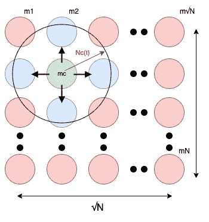

# 如何实现 Kohonen 的自组织地图

> 原文：<https://towardsdatascience.com/how-to-implement-kohonens-self-organizing-maps-989c4da05f19?source=collection_archive---------14----------------------->

## 安|索姆| **SOFM |** MATLAB

## 用 MATLAB 玩和学 SOMs


巴黎艾菲尔铁塔——照片由[丹尼斯·内沃扎伊](https://unsplash.com/@dnevozhai?utm_source=unsplash&utm_medium=referral&utm_content=creditCopyText)在 [Unsplash](https://unsplash.com/?utm_source=unsplash&utm_medium=referral&utm_content=creditCopyText) 上拍摄

> 人工神经网络(ANN)的灵感来自大脑早期的感觉处理模型。可以通过在计算机中模拟模型神经元网络来创建人工神经网络。通过应用模拟真实神经元过程的算法，我们可以让网络“学习”解决许多类型的问题。—安德斯·克拉夫([自然生物技术](https://www.nature.com/articles/nbt1386))

在后现代生活中，我们在每一项活动中都参与了大量惊人的人工神经网络应用，但我们对它们的能力和复杂性一无所知。人工神经网络已被用于解决从语音识别到蛋白质二级结构预测、癌症分类和基因预测等难题。由于对这些高级性能的认识在不久的将来将是必要的，我们应该对这些有更好的了解，并且我们可以从简单的水平开始我们理解 ann 的旅程。

作为一种基本类型的人工神经网络，让我们考虑一种**自组织映射(SOM)** 或**自组织特征映射(SOFM)** ，使用*无监督学习*对其进行训练，以产生训练样本输入空间的低维离散化表示，称为映射。

> 自组织地图？
> 
> 它将高维数据之间的非线性统计*关系*转化为它们在低维显示器上的图像点的简单几何关系，通常是规则的二维节点网格。因为 SOM 由此压缩信息，同时在显示器上保留主要数据元素的最重要的拓扑和/或度量关系— [Teuvo Kohonen](https://www.springer.com/gp/book/9783540679219)

# 🔎为什么是 SOM？

基本上，SOMs 被表征为高维输入数据流形到常规低维数组元素的非线性、有序、平滑映射。在训练 SOM 的神经元之后，我们得到高维输入数据的低维表示，而不会扰乱数据分布的形状和每个输入数据元素之间的关系。自组织映射不同于其他人工神经网络，因为与误差校正学习(梯度下降反向传播等)相比，自组织映射应用无监督学习，并且自组织映射使用邻域函数来保持输入空间的拓扑属性。由于它的简单性，我们可以很容易地解释和演示它的功能。详细的解释请参考 Teuvo Kohonen 的自组织地图。

# 💡SOM 是如何工作的？


SOM 学习数据表示——在第 1、10、50 和 100 时段，输入用蓝点表示，模型的神经元值用红点表示(图片由作者提供)

上图给出了学习过程的简单说明，我们可以很容易地从这种表示中理解 SOMs 的特性。最初，输入数据(*蓝点*)在 2D 空间占据特殊分布，未学习的神经元(权值)(*红点*)随机分布在一个小区域内，神经元经过输入的修改和学习后，在学习过程中逐步得到输入数据分布的形状。此外，每个神经元代表一个小的输入数据空间集群。因此，在这个演示中，我们能够用 100 个神经元表示 1000 个数据点，保留输入数据的拓扑结构。这意味着我们已经在高维数据和低维表示(map)之间建立了联系。对于进一步的计算和预测，我们可以利用这几个神经元值来表示巨大的输入数据空间，这使得处理速度更快。

# 📄学习算法

作为 SOM 的基本模型，我们将从'**N '-维**输入数据空间映射到一个**二维神经元阵列(' N '个神经元)**。该 SOM 可以使用以下过程来实现:

## 🛠设置:

*   **"P"** 输入矢量数量可用。(i= 1，2，…，P)
*   **第 I 个**输入向量有 **n 个**元素: **Xᵢ = (xᵢ1，xᵢ2，…，xᵢn)**
*   **“N”**神经元数量(节点或权重)可用。(i= 1，2，…，N)
*   **第 I 个**神经元向量有 **n 个**元素: **mᵢ = (mᵢ1，mᵢ2，…，mᵢN)**
*   这些神经元向量排列成 2D 矩阵来表示。
*   假设所有向量元素都是实数。


SOM 基本模型的建立—输入向量和神经元矩阵(图片由作者提供)

## 🔖活动动态:

对于给定的输入 **Xᵢ** ，找到离给定输入最近(最小欧氏距离)的神经元，并用 **c** 表示该神经元。


## ✏️学习动力公司:

对于给定的输入 **Xᵢ** ，在找到 **mc** 神经元后，**仅**更新 **mc** 的**邻域**神经元集合:


对于 **t = 0，1，2，… T** 。(t 是模型将被更新的迭代次数，并且 **mᵢ (0)** 可以是初始的任意向量)。函数 **hci(t)** 是所谓的**邻域函数**，在格点(矩阵元素)上定义的平滑核。

由于我们**只有**需要更新 **mc** 神经元周围的邻近神经元，首先我们需要找到神经元 **mc** 周围矩阵点的**邻域集合。下面给出了一个简单的拓扑邻域查找方法，更高级的平滑邻域查找方法可以在文献中找到。**



在 **Nc(t)** 内寻找数组点的邻域集——绿色神经元是 **mc** 神经元，蓝色神经元是神经元的邻域集，只会更新(图片由作者提供)

标记为 **Nc(t)** 的圆内的所有神经元，我们认为它们是‘MC’神经元的**邻域集合。神经元的**邻域集合**半径 **Nc(t)** 通常在迭代(t)中单调递减。我们通常从 **Nc(0) = √N/2** 开始，我们需要在每次迭代中减小半径。**

在找到需要更新的邻域神经元集后，我们可以使用下面的 **hci(t)** 函数，更新 **mc** 周围的神经元。


在这个方程中， **|| rc — ri||** 定义了神经元的 2D 矩阵位置之间的距离( **√N x √N** 矩阵)。 **α(t)** 的值被识别为学习率因子(0 < α(t) < 1)。 **α(t)** 和 **σ(t)** 都是时变的单调递减函数，如下:


对每个输入数据向量( **P** 个输入数据向量)进行学习。然后在相同的输入数据向量上重复进行相同的过程 **T** 次迭代。经过 **T** 次迭代后，你将得到一个完全学习过的神经元矩阵，它映射了我们的输入数据值。

# 📦MATLAB 实现

使用上述算法，Teuvo Kohonen 的《自组织地图》一书中提到的几个有趣的例子已经使用 MATLAB 实现，您可以将其复制到您的本地计算机，如下所示:

```
git clone [https://github.com/KosalaHerath/kohonen-som.git](https://github.com/KosalaHerath/kohonen-som.git)
```

让我们将存储库的 home 定义为 *< REPO_HOME >* 。然后，转到以下位置，您可以找到三个 MATLAB 实现示例，并且可以在您的计算机上使用任何 MATLAB 版本运行它们:

```
<REPO_HOME>/source/kohonen_examples
```

否则，您只需单击以下链接并转到实施库:

[](https://github.com/KosalaHerath/kohonen-som.git) [## 科萨拉赫拉特/科霍宁-索姆

### 此时您不能执行该操作。您已使用另一个标签页或窗口登录。您已在另一个选项卡中注销，或者…

github.com](https://github.com/KosalaHerath/kohonen-som.git) 

这些例子从均匀随机分布的二维( **n=2** )输入数据向量开始。共有 **1000 个**输入数据值( **P=1000** )。此外，我们将神经元的数量定义为 **N = 10 x 10 = 100** ，迭代次数定义为 **T = 300** 。您可以更改这些参数，并使用上面的实现来处理模型。

## 📍示例 1:平方输入分布

这个例子的输入数据值是在 2 维空间上随机分布的正方形。


方形输入分布的 SOM 学习数据表示-输入以蓝点表示，模型的神经元值以红点表示，时间为 1、50、250 和 300(图片由作者提供)

## 📍示例 2:三角形输入分布

该示例的输入数据值是在二维空间上随机分布的三角形。


三角形输入分布的 SOM 学习数据表示——在第 1、50、250 和 300 时段，输入用蓝点表示，模型的神经元值用红点表示(图片由作者提供)

## 📍示例 3:具有 1D 神经元阵列的三角形输入分布

这个例子的输入数据值是在 2 维空间上的正方形形状的随机分布，并且特别地，我们考虑 1D 神经元阵列而不是 2D 矩阵。因此，由神经元阵列所作的线将试图覆盖如下的所有输入数据分布。


1D 神经元阵列的 SOM 学习数据表示——在第 1、50、250 和 300 时段，输入用蓝点表示，模型的神经元值用红点表示(图片由作者提供)

因此，现在您可以通过不同的输入和修改来学习和使用这些实现，并且您尝试的越多，您会理解得越好。请在此 处提出任何**修改**来改进 [**的这些实现。**](https://github.com/KosalaHerath/kohonen-som/issues)

干杯！🍺

# 🗞参考

[1] Krogh，A. (2008 年)。什么是人工神经网络？*自然生物技术*，26(2)，第 195–197 页。

[](https://www.nature.com/articles/nbt1386) [## 什么是人工神经网络？

### 人工神经网络已被应用于从语音识别到蛋白质预测等问题

www.nature.com](https://www.nature.com/articles/nbt1386) 

[2] Teuvo Kohonen (2001 年)。*自组织地图*。纽约斯普林格。

[](https://www.springer.com/gp/book/9783540679219) [## 自组织地图| Teuvo Kohonen | Springer

### 自从这本书的第二版在 1997 年初出版以来，在……

www.springer.com](https://www.springer.com/gp/book/9783540679219)