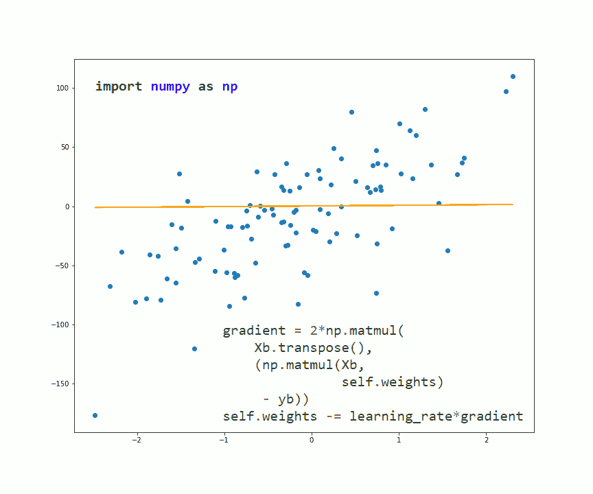
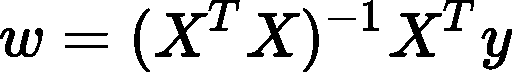
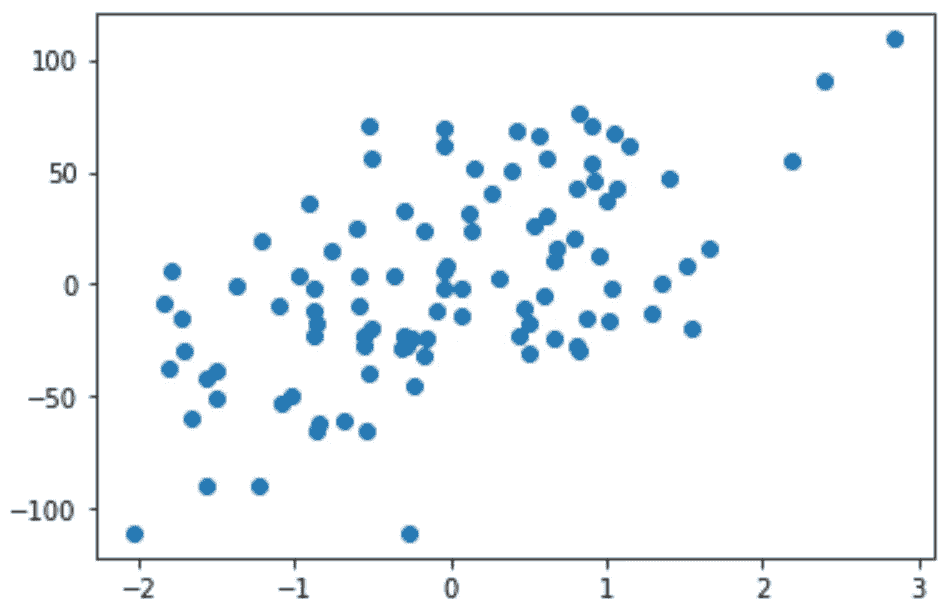
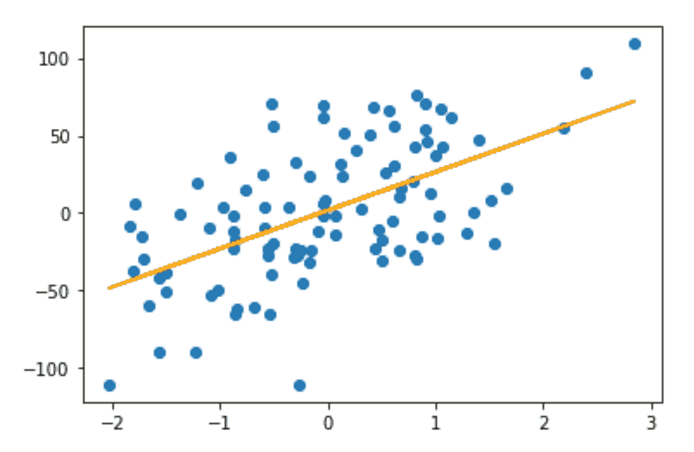
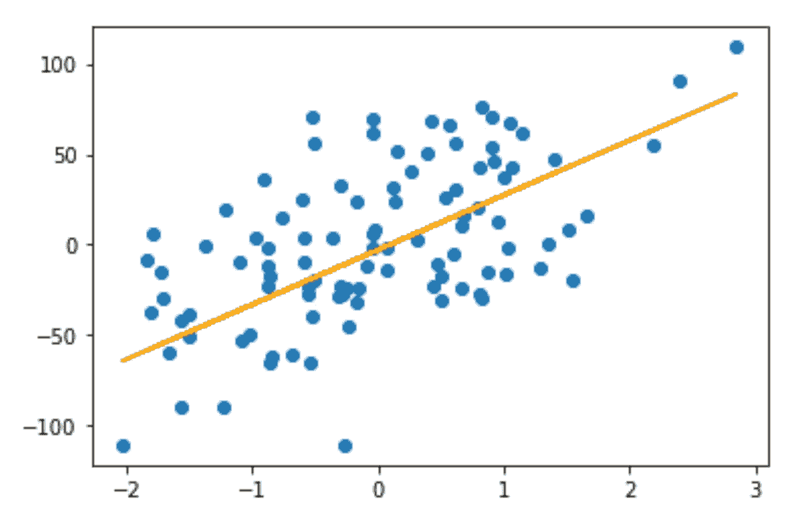

# 如何用 NumPy 实现线性回归

> 原文：<https://towardsdatascience.com/how-to-implement-linear-regression-with-numpy-172790d2f1bc?source=collection_archive---------29----------------------->

## 更好地理解线性回归并提高您的数字技能



作者图片

我们先简单回忆一下什么是线性回归:

> L *线性回归是根据一些其他已知变量以线性方式估计未知变量。视觉上，我们通过我们的数据点拟合一条线(或更高维的超平面)。*

如果你对这个概念不太适应，或者想更好地理解它背后的数学原理，你可以阅读我以前写的关于线性回归的文章:

[](/understanding-linear-regression-eaaaed2d983e) [## 了解线性回归

### 线性回归背后的数学详细解释

towardsdatascience.com](/understanding-linear-regression-eaaaed2d983e) 

现在，让我们把重点放在实现上。

首先，很明显，我们需要导入一些库。我们导入`numpy`，因为它是我们用于实现的主要内容，`matplotlib`用于可视化我们的结果，以及来自`sklearn`的`make_regression`函数，我们将使用它来生成一个回归数据集作为示例。

```
**import** **numpy** **as** **np****import** **matplotlib.pyplot** **as** **plt****from** **sklearn.datasets** **import** make_regression
```

然后我们将使用以下方法创建一个`LinearRegression`类:

*   `.fit()` —该方法将实际学习我们的线性回归模型；在这里，我们将找到最佳权重
*   `.predict()` —这个将用于预测；它将返回我们的线性模型的输出
*   `.rmse()` —用给定的数据计算我们的模型的均方根误差；这个指标有点像“从我们的模型估计值到真实 y 值的平均距离”

我们在`.fit()`中做的第一件事是将一个额外的 1 列连接到我们的输入矩阵 x。这是为了简化我们的数学，并将偏差视为一个始终为 1 的额外变量的权重。

`.fit()`方法将能够通过使用封闭公式或随机梯度下降来学习参数。为了选择使用哪一个，我们将有一个名为`method`的参数，它需要一个字符串“solve”或“sgd”。

当`method`设置为“求解”时，我们将通过以下公式获得模型的权重:



这要求矩阵 X 具有满列秩；因此，我们将检查这一点，否则我们会显示一条错误消息。

我们的第一部分`.fit()`方法是:

注意`method`之后的其他参数是可选的，仅在我们使用 SGD 的情况下使用。

该方法的第二部分处理`method = ‘sgd’`的情况，它不要求 X 具有完整的列秩。

我们的最小二乘线性回归的 SGD 算法概述如下:


我们将通过将 weights 类属性初始化为一个 numpy 向量来开始此算法，该向量的值取自均值为 0、标准差为 1/(列数)的正态分布。我们将标准偏差除以列数，以确保在算法的初始阶段不会得到太大的输出值。这是为了帮助我们更快地收敛。

在每次迭代的开始，我们随机地打乱我们的数据行。然后，对于每一批，我们计算梯度并将其从当前权重向量中减去(乘以学习率),以获得新的权重。

下面是我们`.fit()`方法的后半部分:

我们从这个方法返回`self`，以便能够像这样连接构造函数和`.fit()`的调用:`lr = LinearRegression().fit(X, y, ‘solve’)`。

`.predict()`方法相当直接。我们首先检查之前是否调用了`.fit()`，然后将一列 1 连接到 X，并验证 X 的形状允许与权重向量相乘。如果一切正常，我们只需返回 X 和权重向量相乘的结果作为预测。

在`.rmse()`中，我们首先使用`.predict()`获得模型的输出，然后如果预测期间没有错误，我们计算并返回均方根误差，该误差可以被认为是“从我们的模型估计值到真实 y 值的平均距离”。

下面是`LinearRegression`类的完整代码:

## 在一个例子中使用我们的`LinearRegression`类

为了展示我们的线性回归实现，我们将使用来自`sklearn`的`make_regression()`函数生成一个回归数据集。

```
X, y = make_regression(n_features=1,
                       n_informative=1,
                       bias=1, noise=35)
```

让我们绘制这个数据集，看看它是什么样子的:

```
plt.scatter(X, y)
```



作者图片

`make_regression()`返回的 y 是平面向量。我们将把它改造成一个列向量，用于我们的`LinearRegression`类。

```
y = y.reshape((-1, 1))
```

首先，我们将使用`method = ‘solve’`来拟合回归线:

```
lr_solve = LinearRegression().fit(X, y, method='solve')plt.scatter(X, y)plt.plot(X, lr_solve.predict(X), color='orange')
```



作者图片

上述回归模型的均方根误差为:

```
lr_solve.rmse(X, y)
# 35.59874949855057
```

然后，我们也使用`method = ‘sgd’`，我们将让其他参数具有它们的默认值:

```
lr_sgd = LinearRegression().fit(X, y, method='sgd')plt.scatter(X, y)plt.plot(X, lr_sgd.predict(X), color='orange')
```



作者图片

如你所见，上面两幅图中方法“solve”和“sgd”的回归线几乎相同。

使用“sgd”时，我们得到的均方根误差为:

```
lr_sgd.rmse(X, y)
# 36.34038690848635
```

这是 Jupyter 笔记本，包含所有代码:

我希望这些信息对您有用，感谢您的阅读！

这篇文章也贴在我自己的网站[这里](https://www.nablasquared.com/how-to-implement-linear-regression-with-numpy/)。随便看看吧！