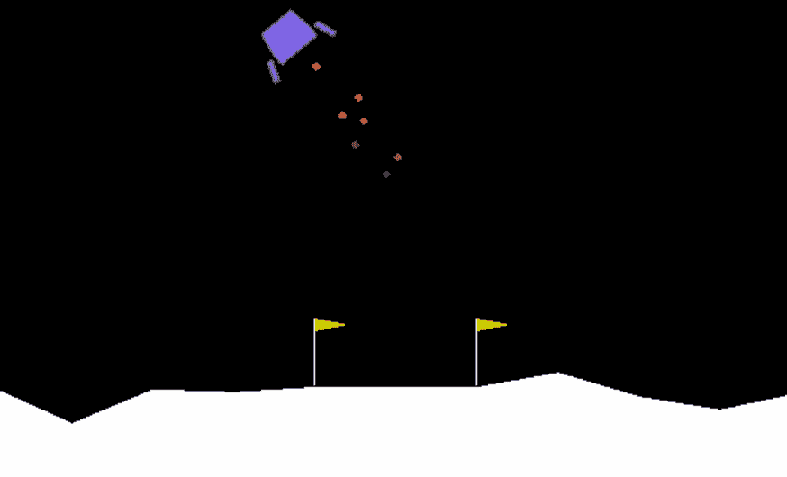
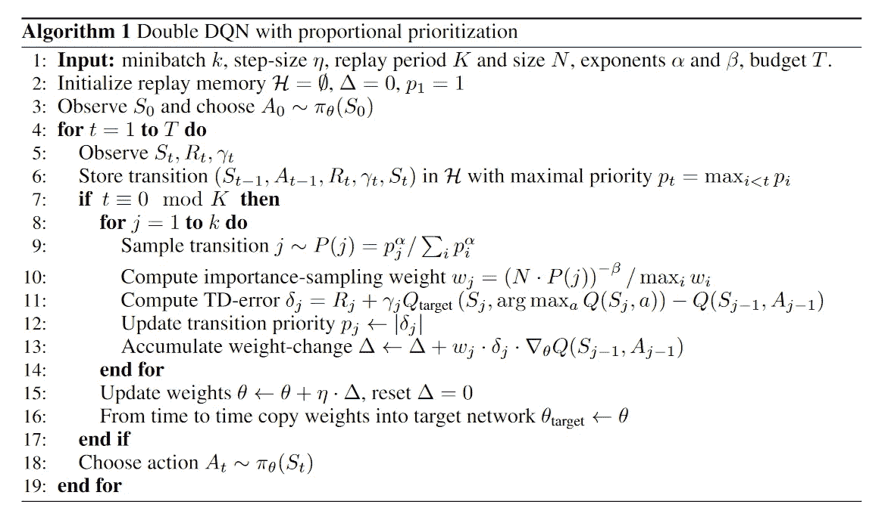
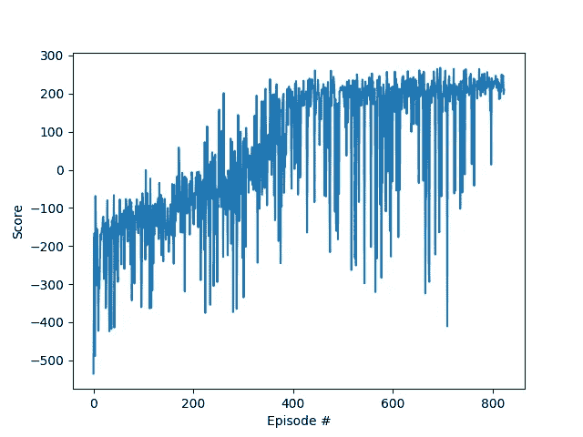
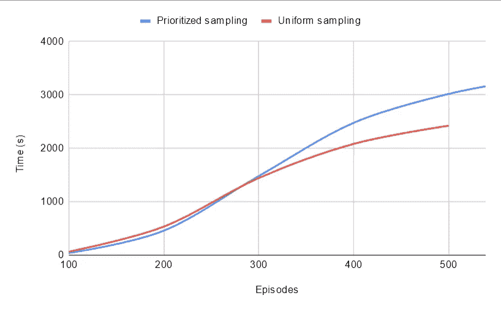
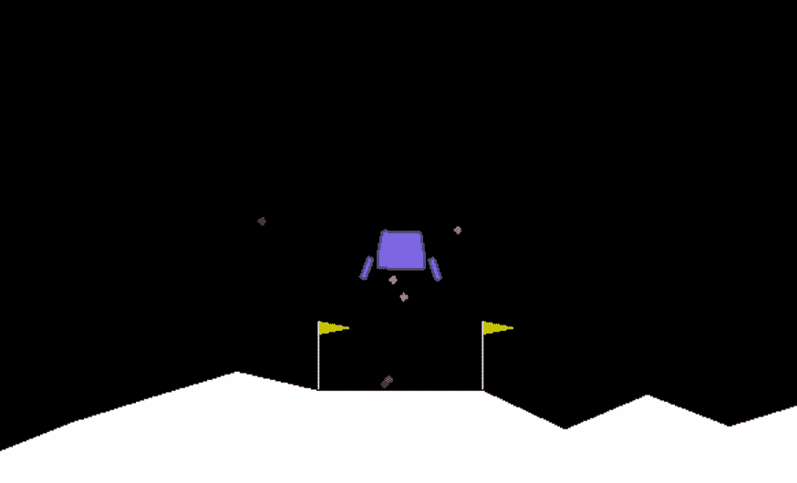

# 如何实现深度 Q 网络的优先化体验重放

> 原文：<https://towardsdatascience.com/how-to-implement-prioritized-experience-replay-for-a-deep-q-network-a710beecd77b?source=collection_archive---------2----------------------->

## 学习如何训练一个智能代理人降落飞船

在本文中，我们将使用名为 Lunar Lander 的 OpenAI 环境来训练一个代理像人类一样玩！为了做到这一点，我们将实现一个名为优先体验重放的深度 Q 网络算法版本。

SpaceX 在 [Unsplash](https://unsplash.com?utm_source=medium&utm_medium=referral) 上拍摄的

为了对我们想要完成的事情有一个概念，让我们看一个未经训练的代理人玩这个游戏。当目标落在两个黄旗之间时，我们可以看到代理仍有许多要学习的地方！

首先，让我们回忆一下，把事情放在上下文中。什么是深度 Q-网络(DQN ),我们为什么要使用它？在全球范围内，我们想要解决什么样的问题？

深度 Q 网络属于强化学习算法家族，这意味着我们将自己置于环境能够与代理交互的情况下。代理能够采取一个动作，将它从一个状态带入另一个状态。然后，环境会为达到这种新状态提供奖励，奖励可以是积极的，也可以是消极的(惩罚)。我们想要解决的问题是能够为每个状态选择最佳行动，从而使我们的总累积回报最大化。

归功于 Lilian Weng @ Lilian Weng . github . io/

对于强化学习算法来说，给定一个状态，提供最佳累积奖励的动作不应该依赖于过去访问过的状态。这个框架被称为马尔可夫决策过程。通过多次访问各州，并用我们实际获得的奖励来更新我们的预期累积奖励，我们就能够找出对每一种环境状态采取的最佳行动。这是 Q 网络算法的基础。

现在，当我们有有限数量的状态时，这是非常好的，例如当一个代理在一个网格中移动时，状态是由它所在的情况定义的。我们现在希望解决的问题是非有限状态变量(或动作)的情况。例如，机器人手臂的环境状态是关节位置和速度的列表。由于状态是不确定的，所以我们不太可能多次访问一个状态，从而无法更新对最佳行动的估计。我们需要某种东西，在给定两个与我们当前状态足够接近的已知状态的情况下，能够预测在我们当前状态下应该采取的最佳行动。你猜对了，解决方案是某种形式的插值。当线性插值只是“在两个状态之间画一条线”时，我们需要能够以更高的复杂度进行预测。这就是神经网络登场的地方。神经网络为我们提供了利用非线性模型预测给定已知状态(及其最佳行动)的最佳行动的可能性。这就是深度 Q 网。DQN 提出了几个与神经网络的训练部分相关的实现问题。这个“技巧”被称为经验重放，基本上是指我们偶尔停止访问环境，以首先收集一些关于过去访问状态的数据，然后根据收集的经验训练我们的神经网络。换句话说，它在探索阶段和训练阶段之间交替，将这两个阶段解耦，从而允许神经网络向最优解收敛。

既然我们已经很好地理解了是什么把我们带到了 Q-Network，那就让乐趣开始吧。在本文中，我们想要实现一个名为优先体验重放的 DQN 的变体(参见发布链接)。这个概念非常简单:当我们对经验进行采样以输入神经网络时，我们假设一些经验比其他经验更有价值。在一个统一的抽样 DQN 中，所有的经历都有相同的概率被抽样。因此，在培训结束时，每项经验的使用次数都大致相同。如果我们用权重进行采样，我们可以让一些更有益的体验平均被采样更多次。现在我们如何分配每次经历的权重呢？该出版物建议我们计算一个抽样概率，该概率与神经网络正向传递后获得的损失成比例。这相当于说，我们希望保留那些导致预期奖励和实际获得的奖励之间存在重要差异的经历，或者换句话说，我们希望保留那些让神经网络学到很多东西的经历。

好了，现在我们有了概念，是时候在一个真实的案例场景中实现了。我们将尝试解决名为“月球登陆者”的 OpenAI 健身房环境。在这个环境中，代理人是一艘受到重力作用的宇宙飞船，它可以采取 4 种不同的行动:什么也不做或启动左、右或底部引擎。如果宇宙飞船降落在正确的位置，我们会得到奖励，如果着陆器坠毁，我们会受到惩罚。每次我们使用底部油门时，我们也会受到一点惩罚，以避免收敛到人工智能将着陆器保持在空中的情况。

现在我们可以质疑我们解决这个问题的方法。这里为什么要用深 Q 网？这种环境的状态由 8 个变量描述:x，y 坐标和速度，着陆器的旋转和角速度，以及两个布尔变量来说明着陆器的腿是否与地面接触。正如我们所看到的，大多数变量是连续的，因此 Q 网络的离散方法是不够的，我们需要能够插入我们期望在一个状态下获得的总回报，以选择最佳行动，这里使用神经网络。

现在出现了另一个问题，在这种情况下，对一些经历进行优先排序如何帮助我们获得更好或更快的结果？当我们开始训练我们的算法时，着陆器很可能会在大多数情况下崩溃。然而，着陆器可能会在不坠毁的情况下接触地面，或者在极少数情况下正确着陆。在这种情况下，预期结果(负回报)和实际产出(正回报)之间的差异将是显著的，导致这种体验被抽样的概率高得多。在某种意义上，我们希望多次使用这种经验来训练神经网络，作为什么在起作用以及我们应该采取什么方向来提高网络权重的例子。

太好了，我们现在确信我们的方法是有效的。让我们深入研究一下实现的细节。我们将把重点放在类“ReplayBuffer”上，因为它包含了与优先体验重放相关的大部分实现，但其余代码可在 GitHub 上获得。我们将设定的目标是提高算法的快速性(能够用更少的情节来解决环境)，而不会由于额外的计算复杂性而牺牲运行时间。为了做到这一点，我们将会小心使用哪些类型的容器来存储我们的数据，以及我们如何访问和整理数据。该出版物引用了两种存储优先级的方法，一种是使用常规容器，另一种是使用 sum 树，sum 树是一种自定义数据类型，可以在复杂度为 o(1)的优先级上授予写和访问权限。在这里，我们将尝试把重点放在使用常规容器的实现上，因为优化以降低复杂性似乎更具挑战性，这提供了一个很好的编码练习！

这里，我们假设深度 Q 网络的实现已经完成，也就是说，我们已经有了一个代理类，它的作用是通过在每一步将经验保存在重放缓冲器中来管理训练，并且不定期地训练神经网络。神经网络也已经被定义，这里我们选择了一个神经网络，其具有两个分别具有 256 和 128 大小的具有 ReLu 激活的神经元的隐藏层，以及最后的线性激活层。

在统一采样 DQN 中，我们通过线性分布随机采样体验，这意味着我们只需要一个容器来存储体验，而不需要任何额外的计算。对于优先体验重放，我们确实需要将每个体验与附加信息、其优先级、概率和权重相关联。

根据神经网络前向传递后获得的损失更新优先级。概率是从经验优先级中计算出来的，而权重(校正在神经网络反向传递期间由不均匀采样引入的偏差)是从概率中计算出来的。论文引入了另外两个超参数α和β，它们控制了我们想要优先化的程度:在训练结束时，我们想要统一采样，以避免由于一些经验被不断优先化而导致的过度拟合。这些等式可以在下面找到:

P =优先级，P =概率，w =权重，N =经历次数

根据作者的说法，仅在优先体验重放的情况下，权重可以被忽略，但是当与双 Q 网络(另一种 DQN 实现)相关联时，权重是强制性的。这里仍将实现权重，以用于与双 Q 网络结合的潜在用途。

因此，与统一的 DQN 相比，我们现在有 3 个与体验相关联的值。更糟糕的是，我们需要能够更新这些变量。在实现方面，这意味着在随机抽样我们的经验后，我们仍然需要记住我们从哪里获得这些经验。具体地说，就是在我们采样的时候记住容器中经验的索引(啊，如果我们有指针就好了)。所以我们现在有 4 个相关的变量。我们选择的容器是一本字典。实际上有两个字典，一个用于体验本身，一个用于相关数据，这很好，因为我们无论如何都需要记住索引。因为我们需要在神经网络中处理完数据后再找回来，所以字典是一个很好的选择，因为它的访问器的复杂度是 o(1)量级，因为我们不需要浏览整个容器。对于这两个字典，值都是命名元组的形式，这使得代码更加清晰。我们还添加了一个小的 for 循环来初始化字典索引。

接下来，让我们剖析一下可能是计算量最大的一步，随机采样。这是很昂贵的，因为为了进行加权采样，我们可能需要对包含概率的容器进行排序。为了进行采样，我们使用 random.choices 函数，让我们看看这是如何实现的。

如果我们浏览 Python 文档中的平分函数，我们可以看到这一点:“该模块支持按排序顺序维护列表，而不必在每次插入后对列表进行排序”。答对了。无需深入研究代码，该函数确实需要在每次调用 random.choices 时至少对容器排序一次，这相当于 o(n)量级的复杂性。我们的字典有 10e5 大小，这一点远非微不足道。我们真的负担不起对每个样品进行分类，因为我们每四步取样一次。解决这个问题的一个方法是在 prevision 中对多个神经网络训练一次采样多个批次。我们看到 random.choices 是用 bissect 函数实现的，它确保容器只排序一次，因此对更多批次进行采样不会增加任何复杂性。

这种方法有两个缺点:

*   当我们对第一批以外的其他批次进行采样时，我们使用的优先级不是最新的。这实际上是没问题的，因为下一批采样的优先级仍然是更新的，所以在多次采样迭代后不会看到这种差异。
*   Python 的 random.choices 将对相同的值进行多次采样。如果我们只对收集的状态的一部分进行采样，这实际上并没有什么不同，但是如果我们一次对太多批次进行采样，一些状态将会被过度采样。对实现进行的测试表明，采样大小为 2000(与大小为 10e5 的容器相比)显示出最好的结果。

让我们看看这是如何在 ReplayBuffer 类中实现的:

这里，变量 update_mem_every 和 update_nn_every 分别表示我们希望计算一组新的经验批次的频率以及我们希望训练网络的频率。current_batch 变量表示当前用于向神经网络提供数据的批次，此处重置为 0。

我们现在能够用概率权重有效地对经验进行抽样。让我们看一下 PER 算法，以了解如何将我们的采样包含在更大的画面中。

我们可以注意到对于计算复杂度优化来说很棘手的两件事:能够记住每一步的最大优先级和最大权重。这看起来很容易做到，基本上只是在每一步比较新更新的值和最大值。但这忘记了容器是固定大小的，这意味着每一步我们还将删除一个体验，以便能够再添加一个。现在，如果我们删除最大值，我们如何找到第二高的值？我们应该总是跟踪容器中值的顺序吗？当然不是！这意味着每一步的复杂度为 o(n)。实际上，每次删除最大值时，我们可以简单地找到最大值。因此，我们跟踪最大值，然后将每个删除的条目与它进行比较。通常，要删除的体验已经被使用过几次了，所以它们的优先级应该很低，因为它实际上是最大值的机会。所以我们可以偶尔对容器进行分类。请参见下面第 9 行的代码:

要指出的是，我们还有一个名为 priorities_sum_alpha 的变量。从抽样概率的定义中可以看出，每次都需要计算所有记录的经验优先级的总和的α次方。当然，我们不希望每次都从头开始计算这个值，所以我们会跟踪它，并在添加/删除体验时更新它。

我们的代码被优化了很多，总的来说我们应该有 o(n/T)的复杂度，T 是我们一次采样的批次数量。当然，复杂性取决于那个参数，我们可以利用它来找出哪个值会导致最佳效率。

是时候测试我们的实现了！我们运行了两个测试，一个使用优先体验重放实现，另一个使用统一采样 DQN。我们绘制了如下所示的图表:

优先体验重放分数的演变

均匀抽样得分的演变

不，这不是一个错误，均匀抽样优于优先抽样！两种算法都使用相同的超参数运行，因此可以比较结果。我们发现，通过使用优先采样，我们可以在大约 800 集内解决环境问题，而在均匀采样的情况下，我们可以在大约 500 集内解决环境问题。尽管我们研究了理论，发现优先化经验是有益的！有几个原因可以解释这里的问题:

*   我们可以从出版物中看到，优先化体验在多种环境中有不同的结果。特别地，在基于等级和比例的两种提出的方法之间已经存在性能上的差距。还不确定月球着陆器是否会从优先体验中受益。
*   在该出版物中，所有的实验都是在双 Q 网络算法的基础上优先考虑体验。作者没有详细说明这种实现对 PER 结果的影响。有可能实现两个决斗 Q 网络将使优先体验重放释放其全部潜力。
*   我们不能不注意到，月球着陆器是一个相当简单的解决环境，大约需要 400 次经验。Atari 系列的其他游戏可能需要多几个数量级的体验才能被考虑解决。毕竟，在我们的情况下，最重要的经历，比如说在没有摔倒的情况下获得高额奖励，并不罕见。对它们进行过多的优先排序会使神经网络过度适应这一特定事件。换句话说，你将学会正确地接触地面，但不知道如何接近地面！

事实上，我们试图调整算法，以便只优先考虑积极的体验。这背后的原因是，当学习如何玩时，算法崩溃的可能性比正确着陆的可能性大得多，而且由于我们可以在比我们可以着陆的更广的区域崩溃，我们往往会记住更多的崩溃经历。为此，我们尝试进行如下调整:我们查看神经网络实际输出和期望值之间的符号差。如果是积极的，我们实际上获得了比预期更好的回报！然后我们应用一个 ReLu 函数，如果差值为负，则赋为 0，否则不做任何事情。在重放缓冲器中，为了不仅仅删除具有负差异的体验，我们给它们分配平均优先级。

从理论上来说，这将导致简单地优先考虑更多具有高积极回报差异(着陆)的经历。在实践中，这是一个不同的故事…算法甚至不再收敛！说实话，对经历进行优先排序是一个危险的游戏，很容易产生偏见，也很容易一遍又一遍地对相同的经历进行优先排序，从而导致网络过度适应一部分经历，无法正确地学习游戏。该出版物确实建议将 alpha 值(控制您对优先级的依赖程度)退火为 0，以便我们倾向于使用均匀采样，但在我们的情况下，这只会导致算法在足够的迭代后收敛。

即使该算法没有带来更好的学习性能，我们仍然可以验证我们的另一个目标，降低计算复杂性，是满足。为此，我们将使用我们所知的解决环境问题的统一采样算法，以及优先化经验实现的一个修改版本，其中参数α被赋值为 0。这样，我们可以统一采样，同时保持区分经验优先级的复杂性:我们仍然需要加权采样，更新每个训练批次的优先级，等等。由于这两个实验是相似的，我们可以安全地直接比较训练持续时间

优先和均匀采样的经验处理中计算时间的演变

正如我们所看到的，我们的实现确实将求解环境的总计算时间从 2426 秒增加到了 3161 秒，这相当于大约增加了 34%。考虑到我们要做的事情的复杂性，这是一个可以接受的代价(在每次迭代中访问和修改容器的元素，命令容器经常从中采样)。从图表中可以看出，在 300 集之前，这两种算法需要的处理时间大致相同，但之后就出现了分歧。这是可以理解的，因为 10e5 元素的容器大约在这个阶段变满。还记得如果我们删除了最高优先级值，就必须更新所有容器的小细节吗？这没关系，因为这几乎不会发生。在这里，所有的优先级都是一样的，所以每次容器装满时都会发生。因此，为了进行真正的比较，我们可以将自己限制在前 300 次体验中，这两种实现之间几乎没有区别！要注意的是，该出版物提到它们用和树的实现导致大约 3%的额外计算时间。看来我们的实现可以提供类似的结果，这是相当令人满意的。

当然，这些结果取决于为优先化体验重放实现选择的超参数，即您想要一次采样多少批次，以及您想要多频繁地更新参数α和β(需要更新缓冲区中的每个概率)。这两个值越大，算法的计算速度就越快，但这可能会对训练产生不可忽略的影响。由于我们的算法在这一部分没有提供好处，因此很难定义最佳参数，但应该可以对一组参数进行基准测试，并确定最佳的整体折衷方案。

在这个实验中我们能得出什么结论？首先，我们能够在几乎没有额外计算复杂度的情况下实现深度 Q 网络的优先化体验重放。第二，这种实现似乎没有提高代理在这种环境下的学习效率。那么接下来我们能做什么呢？

*   实施决斗 Q-网络和优先体验重放。
*   在其他环境中尝试这个代理，看看在给定的实现下，优先化的体验重放是否可以提高结果。
*   实施基于等级的优先体验重放(使用 sum 树的那种),因为它声称可以提供更好的结果。

最后但同样重要的是，让我们观察一个训练有素的代理玩游戏！经过那些可怕的计算后，我们应该得到这些。当然，我们使用优先内存重放实现中训练有素的代理，这花费了更多的时间，但它仍然训练有素！

为了提高…

完整代码:[https://github.com/Guillaume-Cr/lunar_lander_per](https://github.com/Guillaume-Cr/lunar_lander_per)

出版地:【https://arxiv.org/abs/1511.05952 