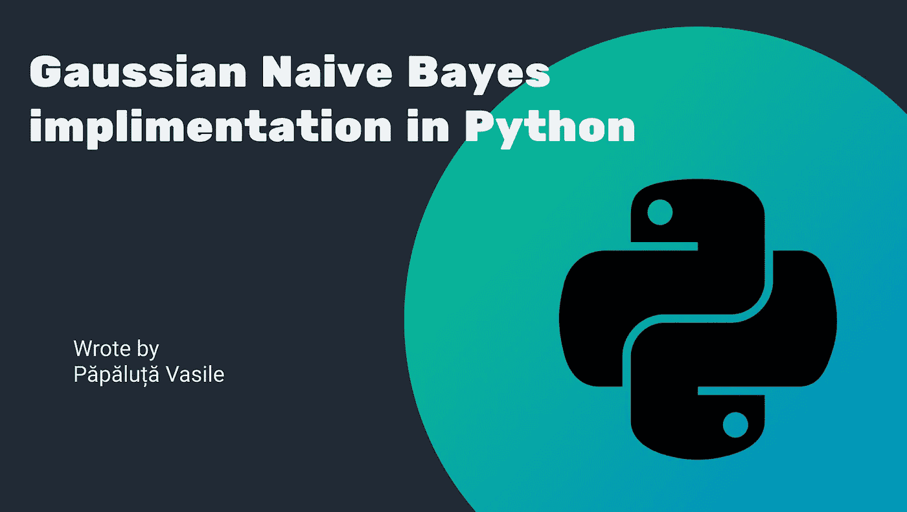
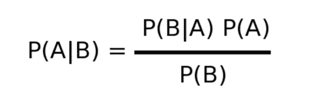
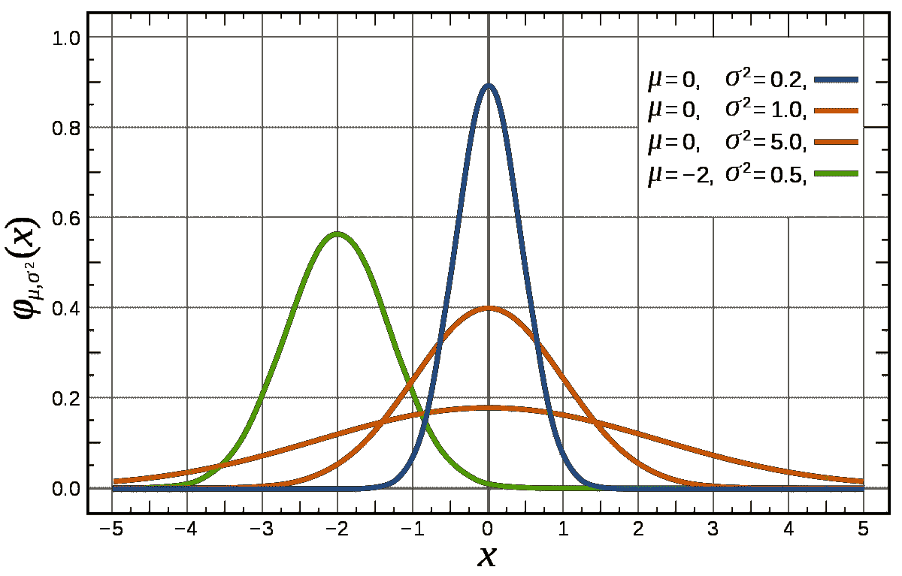
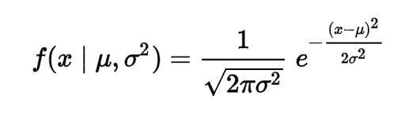

# 如何从零开始用 Python 实现一个高斯朴素贝叶斯分类器？

> 原文：<https://towardsdatascience.com/how-to-impliment-a-gaussian-naive-bayes-classifier-in-python-from-scratch-11e0b80faf5a?source=collection_archive---------6----------------------->



**你有没有问过自己最古老的机器学习算法是什么？**

今天，我们有很多机器学习算法，从简单的 KNN 到集成算法，甚至神经网络。有时它们看起来如此复杂，以至于你可以认为它们是最近几年开发的，而机器学习，总的来说，是一种新事物。但是第一个算法出现的时间比你想象的要早。

## 朴素贝叶斯算法。

朴素贝叶斯算法是最古老的机器学习形式之一。贝叶斯理论(该算法的基础)和统计学基础是在 18 世纪发展起来的。从那以后，直到 50 年代，计算都是手工完成的，直到出现了第一台计算机实现这种算法。

**但是这个算法有什么简单到可以手动使用的呢？**

该算法的最简单形式由两个主要部分组成:

*   朴素贝叶斯公式(定理)。
*   和分布(在这种情况下是高斯分布)。

# 朴素贝叶斯理论。

朴素贝叶斯理论在大多数情况下可以简化为一个公式:



朴素贝叶斯公式[来源—[https://miro . medium . com/max/640/1 * 7lg _ ul M8 _ 1 fygjxpbtrqfq . png](https://miro.medium.com/max/640/1*7lg_uLm8_1fYGjxPbTrQFQ.png)]

这个公式意味着事件 A 发生的概率知道事件 B 已经发生了..

不知何故，对朴素贝叶斯理论的解释超出了本文的范围，这就是为什么我强烈推荐你阅读这篇关于 NB 理论的文章。

# 什么是发行版？

分布，基本上是显示数值是如何在数列中分散的，以及它们在这个数列中出现的频率。这里有一个例子:



高斯分布[来源—[https://upload . wikimedia . org/Wikipedia/commons/thumb/7/74/Normal _ Distribution _ pdf . SVG/1200 px-Normal _ Distribution _ pdf . SVG . png](https://upload.wikimedia.org/wikipedia/commons/thumb/7/74/Normal_Distribution_PDF.svg/1200px-Normal_Distribution_PDF.svg.png)]

从上图中可以看出，高斯分布或正态分布取决于一个系列的两个参数——平均值和标准差。知道这两个参数的序列，我们可以找到它的分布函数。它有下一种形式:



高斯分布函数[来源—[https://i.stack.imgur.com/bBIbn.png](https://i.stack.imgur.com/bBIbn.png)

但是，我们为什么需要这个功能呢？很简单，世界上大多数数据都表示为连续值，但是你猜怎么着，你不能计算 X 值的概率来得到 v 值，它会是 0。为什么？从技术上来说，当你将某物除以无穷大时，你会得到什么？正确——零。

那么，我们该如何解决这个问题呢？当然，使用高斯分布函数，如上图所示。输入一个序列的平均值和它的标准偏差，而不是 x 值，你可以找出 x 值出现的概率。瞧。

# 那么这一切是如何协同工作的呢？

我不知道为什么，但对我个人来说，有时候通过在代码中实现算法会更容易理解算法是如何工作的。让我们开始吧:

1.  首先，让我们导入所有的依赖性:

```
# Importing all needed libraries
import numpy as np
import math
```

就这些，是的，我们需要纯粹的数字和数学库。

2.现在让我们创建一个类，该类将实现算法和第一个函数，该函数将按类分离我们的数据集。

```
# gaussClf will be the class that will have the Gaussian naive bayes classifier implimentation
class gaussClf:
    def separate_by_classes(self, X, y):
        *''' This function separates our dataset in subdatasets by classes '''* self.classes = np.unique(y)
        classes_index = {}
        subdatasets = {}
        cls, counts = np.unique(y, return_counts=True)
        self.class_freq = dict(zip(cls, counts))
        print(self.class_freq)
        for class_type in self.classes:
            classes_index[class_type] = np.argwhere(y==class_type)
            subdatasets[class_type] = X[classes_index[class_type], :]
            self.class_freq[class_type] = self.class_freq[class_type]/sum(list(self.class_freq.values()))
        return subdatasets
```

separate_by_classes 函数按类分离出数据集，分别为每个类计算每列的平均值和标准偏差。

3.拟合函数。

```
def fit(self, X, y):
    *''' The fitting function '''* separated_X = self.separate_by_classes(X, y)
    self.means = {}
    self.std = {}
    for class_type in self.classes:
        # Here we calculate the mean and the standart deviation from datasets
        self.means[class_type] = np.mean(separated_X[class_type], axis=0)[0]
        self.std[class_type] = np.std(separated_X[class_type], axis=0)[0]
```

接下来是拟合函数，我们只计算每一类每一列的平均值和标准差。

4.高斯分布函数。

```
def calculate_probability(self, x, mean, stdev):
    *''' This function calculates the class probability using gaussian distribution '''* exponent = math.exp(-((x - mean) ** 2 / (2 * stdev ** 2)))
    return (1 / (math.sqrt(2 * math.pi) * stdev)) * exponent
```

calculate_probability 函数使用一个序列的平均值和标准差来计算一个函数在一个序列中出现的概率。

5.预测函数。

```
def predict_proba(self, X):
    *''' This function predicts the probability for every class '''* self.class_prob = {cls:math.log(self.class_freq[cls], math.e) for cls in self.classes}
    for cls in self.classes:
        for i in range(len(self.means)):
            print(X[i])
            self.class_prob[cls]+=math.log(self.calculate_probability(X[i], self.means[cls][i], self.std[cls][i]), math.e)
    self.class_prob = {cls: math.e**self.class_prob[cls] for cls in self.class_prob}
    return self.class_prob
```

这个函数返回一个字典，其中包含样本属于某个类的概率。在经典的 sklearn 估计器中，predict_proba 函数获取样本列表并返回标签列表。为了使它更容易使用，我决定只在一个例子中实现它。

同样，在这个函数中，我不计算先验概率，以避免无用的计算，因为对于每个类估计，你需要除以上面得到的相同值。

6.预测函数。

```
def predict(self, X):
    *''' This funtion predicts the class of a sample '''* pred = []
    for x in X:
        pred_class = None
        max_prob = 0
        for cls, prob in self.predict_proba(x).items():
            if prob>max_prob:
                max_prob = prob
                pred_class = cls
        pred.append(pred_class)
    return pred
```

在这里，我决定使用经典的实现方法。列出来，列出来。

你可以在我的 github 库上看到代码。

# 对比 sklearn。

现在让我们将我们的实现与 sklearn one 进行比较。在 sklearn 库中，Gaussian Naive Bayse 实现为 GaussianNB 类，要导入它，您应该编写以下代码:

```
from sklearn.naive_bayes import GaussianNB
```

我们会让你来实施，你可以在[那里](https://scikit-learn.org/stable/modules/generated/sklearn.naive_bayes.GaussianNB.html)找到怎么做。那么在[虹膜](https://archive.ics.uci.edu/ml/datasets/Iris)数据集上有什么结果呢？

我们的实现:0.00000000001

Sklearn 实现:1.0 精度。

发生这种情况是因为 sklearn 模型使用了一个比我们使用的模型稍多的其他实现，你可以在 sklearn 网站上阅读更多内容。

# 结论。

因此，在本文中，我向您展示了如何实现实际上最古老的机器学习算法的最简单形式——高斯朴素贝叶斯算法，并简要介绍了它的工作原理。我强烈建议您学习 sklearn 实现的工作原理，并尝试自己实现 BernoulliNB。

谢谢你。