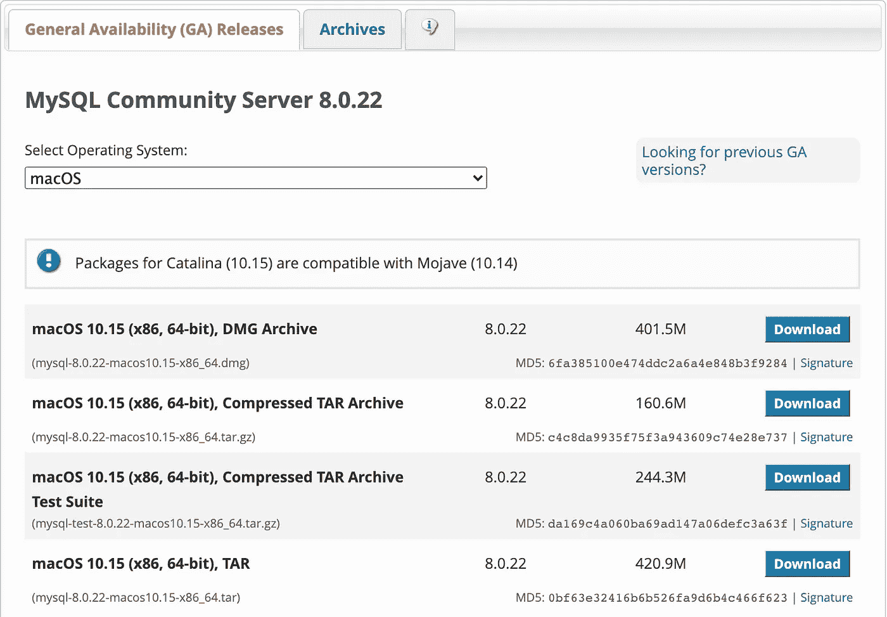

# 如何将 CSV 文件导入 MySQL Workbench

> 原文：<https://towardsdatascience.com/how-to-import-a-csv-file-into-mysql-workbench-17cb120169c8?source=collection_archive---------3----------------------->

## 入门指南

## 没有错误

照片由[诺亚·博耶](https://unsplash.com/@emerald_?utm_source=unsplash&utm_medium=referral&utm_content=creditCopyText)在 [Unsplash](https://unsplash.com/s/photos/dolphin?utm_source=unsplash&utm_medium=referral&utm_content=creditCopyText) 拍摄

如果你熟悉求职过程，你可能已经注意到一些公司喜欢用带回家的作业来决定候选人是否合适。因为大多数公司都使用 SQL，所以他们通常想看看你是否能使用 SQL 解决问题。然而，并不是所有的公司都会给你提供数据集。很可能一家公司只提供了一个表模式，您可能想知道您的查询是否能实际运行。因此，将数据集导入数据库会非常有帮助。

在本文中，我将介绍如何一步一步地安装 MySQL Workbench 并将数据导入 MySQL Workbench。

# 入门指南

MySQL Workbench 是数据库架构师、开发人员和 DBA 的统一可视化工具。在这篇文章中，我将使用 Mac OS X 系统。要开始，你需要安装 [MySQL](https://dev.mysql.com/downloads/mysql/) 和 [MySQL Workbench](https://dev.mysql.com/downloads/workbench/) 。

使用软件包安装程序安装 MySQL:

下载包含 MySQL 包安装程序的磁盘镜像(`.dmg`)文件(社区版本可从[这里](https://dev.mysql.com/downloads/mysql/)获得)。连按文件以装载磁盘映像并查看其内容。

MySQL 安装页面(作者截图)

不要忘记这个密码，因为您稍后将需要它来登录您的 MySQL workbench！(作者截图)

安装完**[MySQL](https://dev.mysql.com/downloads/mysql/)和 [MySQL Workbench](https://dev.mysql.com/downloads/workbench/) 之后，现在就可以打开 MySQL Workbench 了。我犯了一个错误，没有安装 MySQL，因为我忘记了我安装的 SQL 是 Postgresql。如果你没有安装 MySQL，你将无法连接到数据库。**

****

**MySQL Workbench 检测不到任何 MySQL **→** **下载 MySQL 的时间。**(作者截图)**

**如果您成功下载 MySQL，您将看到一个弹出窗口，输入您之前设置的相同密码。输入密码后，您应该会看到类似这样的内容:**

****

**耶！你连上了 MySQL(作者截图)**

**现在，您可以点击进入 MySQL 实例。**

**如果在安装 MySQL 后仍然看到这个错误，可以点击屏幕右上角的“**停止**按钮或者点击“启动/关机”按钮。**

****

**未建立连接错误消息(作者截图)**

****

**(作者截图)**

# ****创建**一个模式/表**

**如果您想让表格更有条理，可以为您正在处理的每个项目创建一个模式。这样，您将更容易为每个项目找到不同的表格。您可以简单地右键单击并选择**创建模式**。"**

****

**如何创建模式(作者截图)**

**现在您已经创建了一个模式，您可以选择“**创建表**或“**表** **数据导入向导**”来在模式中构建一个表。**

****

**如何创建表格(作者截图)**

**下面是您创建表格时将看到的内容:**

****

**创建空表格(作者截图)**

# **导入 CSV 文件**

**首先，找到要导入的 CSV 文件的文件路径。**

****

**找到数据的路径(作者截图)**

****

**您可以创建一个新表，也可以添加到现有的表中(作者截图)**

**不幸的是，我无法导入数据，因为“**表格数据导入向导在 UTF-8 编码的带 BOM 的文件上失败。”**我不明白为什么会这样，因为我确实将文件保存为 UTF-8 CSV 格式。**

**最后，我发现对于 Mac OSX 系统，我们需要使用**数字/记事本、**打开 CSV 或 excel 文件，然后将文件导出为。csv 格式。**

****

**将文件保存为 CSV 文件(作者截图)**

****

**有时候只有把编码改成别人才管用(作者截图)**

**恭喜你！！！你做到了！现在您已经成功地将 CSV 文件加载到 MySQL workbench，您可以开始编写查询了！**

****

**简单查询的结果(作者截图)**

**如果你觉得这很有帮助，请关注我，看看我的其他博客。❤️**

**下次见，快乐学习！[👩🏻‍💻](https://emojipedia.org/woman-technologist-light-skin-tone/)**

** [## 用例子理解和选择正确的概率分布

### 举例说明最常见的离散概率分布

towardsdatascience.com](/understanding-and-choosing-the-right-probability-distributions-with-examples-5051b59b5211)  [## 作为分析师如何准备商业案例面试？

### 作为数据分析师或数据科学家，我们不仅需要知道概率和统计，机器学习算法…

towardsdatascience.com](/how-to-prepare-for-business-case-interview-as-an-analyst-6e9d68ce2fd8)  [## 为电子商务建立一个产品推荐系统:第一部分——网络搜集

### 今天，如果我们想到机器学习在商业中最成功和最广泛的应用，推荐者…

medium.com](https://medium.com/@kessiezhang/building-a-product-recommendation-system-for-e-commerce-part-i-web-scraping-798b6251ab51)  [## 如何将 Jupyter 笔记本转换成 PDF

### 用几行代码将 Jupyter 笔记本转换为 pdf(调试“500:内部服务器错误”)

towardsdatascience.com](/how-to-convert-jupyter-notebooks-into-pdf-5accaef3758)**