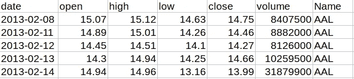

# 如何使用 pandas read_csv 命令导入数据

> 原文：<https://towardsdatascience.com/how-to-import-data-with-the-pandas-read-csv-command-a7befde122f1?source=collection_archive---------47----------------------->

## 熊猫基础:读取数据文件


马库斯·斯皮斯克在 [Unsplash](/s/photos/analysis?utm_source=unsplash&utm_medium=referral&utm_content=creditCopyText) 上拍摄的照片

在任何数据分析项目中，我们都试图从一组给定的数据中发现有用的、可操作的见解。如果我们幸运的话，这些数据可能已经为我们打包好了；如果没有，我们可能需要自己收集。无论哪种方式，一旦数据被存储，我们将需要把它读入一个程序来执行分析。

软件包 *pandas* 经常用于此目的。这是一个功能强大的库，可以与 Python 编程语言一起工作。在 *pandas* 中，选择读入数据文件的工具是无处不在的`read_csv`函数。

> 在本文中，我们将探索 pandas 的`read_csv`命令的基础:标题选项、指定子目录(如果适用的话)、使用逗号以外的分隔符、标识要用作索引的列、定义字段类型以及处理缺失值。

# 数据

与任何熊猫项目一样，我们首先使用标准别名`pd`导入熊猫。让我们也使用数字包 NumPy 的标准别名来导入它。

对于我们的例子，让我们读入股票价格[数据](https://www.kaggle.com/camnugent/sandp500)。这个数据集列出了交易的日期、开盘价、收盘价、最高价和最低价、交易量以及交易代码。

在电子表格程序中显示的前几行数据如下所示。



# 什么是. csv 文件？

如果我们在文本编辑器中查看数据文件(与上面的电子表格程序相反)，前几行如下。

```
date,open,high,low,close,volume,Name
2013–02–08,15.07,15.12,14.63,14.75,8407500,AAL
2013–02–11,14.89,15.01,14.26,14.46,8882000,AAL
2013–02–12,14.45,14.51,14.1,14.27,8126000,AAL
2013–02–13,14.3,14.94,14.25,14.66,10259500,AAL
2013–02–14,14.94,14.96,13.16,13.99,31879900,AAL
```

我们看到第一行由列名组成，也称为*字段*名称。包含列名的这一行被称为*标题*。接下来的行列出了对应于该行中每个字段的数据。因此，第一行数据的日期为 2013 年 2 月 8 日，开盘价为 15.07 美元，以此类推。每个数据点与下一个数据点之间用逗号分隔，因此称为“逗号分隔值”(csv)文件。

# 标题选项

pandas 命令从文件中读取数据并将其存储在一个名为`stocks_df`的数据帧中，这是一个简单的命令行程序。

为了确保该命令按预期工作，让我们使用`head`检查数据帧的前几行。

您可能不会对。csv 文件。在这种情况下，通过使用`usecols`选项指定想要读入数据框的列。例如，如果您只对日期、成交量和股票名称感兴趣，请指定`usecols=['date', 'volume', 'Name']`。

正如预期的那样，只有我们指定的列包含在数据框中。

默认情况下，pandas 假设数据的第一行是一个标题。当然，并不是每个数据文件都有标题。例如，假设我们有一个没有标题的数据文件，如下所示。

```
2013-02-08,15.07,15.12,14.63,14.75,8407500,AAL
2013-02-11,14.89,15.01,14.26,14.46,8882000,AAL
2013-02-12,14.45,14.51,14.1,14.27,8126000,AAL
2013-02-13,14.3,14.94,14.25,14.66,10259500,AAL
2013-02-14,14.94,14.96,13.16,13.99,31879900,AAL
```

如果我们像以前一样尝试读取文件，我们将不会得到我们想要的结果。

pandas 假定第一行是一个标题，并照此读入。在这种情况下，这不是我们想要的，因为第一行是数据。幸运的是，修复很容易——只需指定选项`header=None`。

现在熊猫从 0 开始给这些列编号。如果您喜欢使用命名列，使用`names`选项来指定您自己的列名。

# 目录

在上面的例子中，我将数据文件保存为与我的 Python 程序相同的目录中的`stocks.csv`。为了保持有序，通常将数据文件保存在子目录中。在这种情况下，在`read_csv`语句中指定数据子目录。

像以前一样，让我们检查前几行，以确保一切顺利。

# 分隔符

并非所有数据文件都使用逗号分隔值。可以使用制表符、空格或任何其他字符。例如，我们的数据文件可能是用分号而不是逗号设置的。

```
date;open;high;low;close;volume;Name
2013-02-08;15.07;15.12;14.63;14.75;8407500;AAL
2013-02-11;14.89;15.01;14.26;14.46;8882000;AAL
2013-02-12;14.45;14.51;14.1;14.27;8126000;AAL
2013-02-13;14.3;14.94;14.25;14.66;10259500;AAL
2013-02-14;14.94;14.96;13.16;13.99;31879900;AAL
```

要指定逗号以外的分隔符，使用`sep`选项。

# 指定要作为索引的列

如果不需要默认索引，可以指定一列作为数据框的索引。例如，要将索引指定为`date`列，可以使用`index_col='date'`。

现在，根据需要，日期列就是索引。

# 类型

让我们检查每个列的类型。

假设我们想要将数字数据存储为 32 位类型以节省空间。为此，将选项`dtype`设置为一个字典，其中键是列，值是所需的类型。

尽管我们知道数据由日期组成，但是`date`列是作为通用对象类型读入的。要以日期类型读取列，使用设置为包含列索引的列表的`parse_dates`选项。

# 缺少值

数据包含缺失值是很常见的。用某种指示符(如问号或单词“missing ”)来指示缺失值也很常见。

如您所见，第一行数据中缺少两个值，第二行缺少一个值。此外，第三个数据行的一个条目中有一个问号。我们该如何应对？

正如我们所预料的那样，缺失的值被 pandas 读入为“非数字”(NaN)，所以我们对这些值没有进一步的要求。然而，pandas 不知道如何处理表示缺少值的问号。为了纠正这种情况，我们可以将列表中被视为缺失值的值列表传递给`na_values`选项。

现在问号已经被念成 NaN 了。

# 进一步阅读

`read_csv`命令非常灵活，有很多选项。要进一步了解这些选项，请参考[文档](https://pandas.pydata.org/pandas-docs/stable/reference/api/pandas.read_csv.html)。