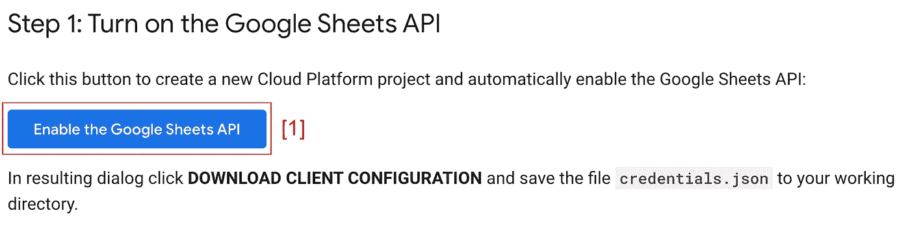
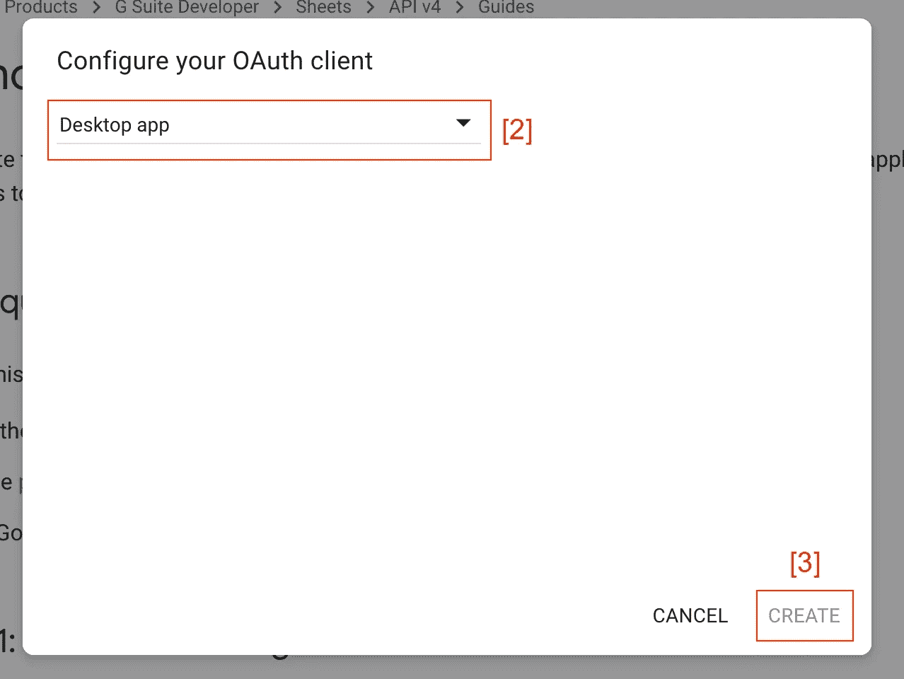
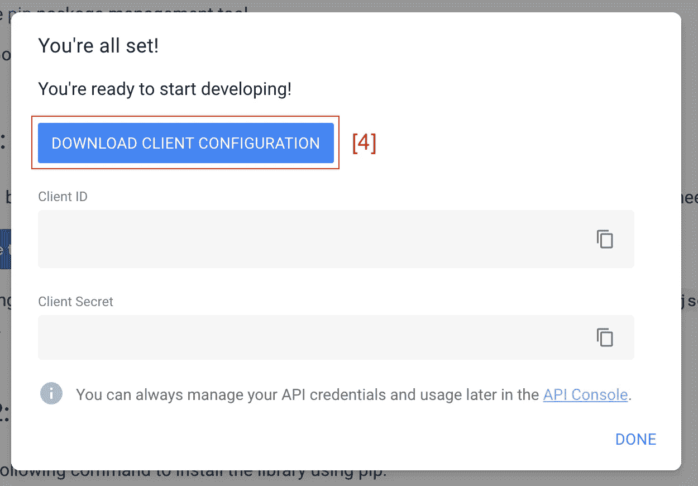
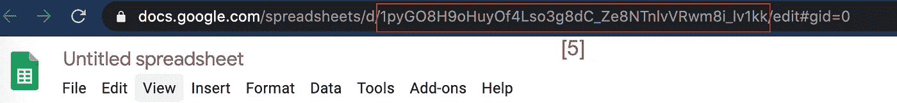

# 如何使用 Google 的 API v4 (2020)将 Google Sheets 数据导入熊猫数据框架

> 原文：<https://towardsdatascience.com/how-to-import-google-sheets-data-into-a-pandas-dataframe-using-googles-api-v4-2020-f50e84ea4530?source=collection_archive---------3----------------------->


图片来自 Pixabay

## 将 Google 工作表数据导入熊猫数据框架

Google Sheets 是一种共享数据和远程协作的有用方式。但是定期将数据转移到 Python 这样的环境中会很麻烦。这篇文章将介绍如何为 Python 设置最新的 Google Sheets API，即 2020 年 6 月的 v4。我们还将介绍如何从 Google 工作表范围(甚至整个工作表)中提取数据到 Pandas 数据框中。

## 开始之前:

开始之前，您需要以下材料:

*   Python 2.6 或更高版本(建议使用 Python 3)
*   Pip/pip3 包管理工具(Python 2 >= 2.7.9 或 Python 3 >= 3.4 的标准配置)
*   一个谷歌账户(和包含你感兴趣的数据的谷歌表单)。

## API 设置:

首先，你需要在你的 Gmail 账户上启用 Google Sheets API，Google Sheets 就存储在这里。登录您的 Gmail 帐户，访问[Google Sheets API Python 快速入门指南](https://developers.google.com/sheets/api/quickstart/python)。你会看到一个蓝色的“启用 Google Sheets API”按钮。点击按钮(下图中标为[1]):



作者图片

从下拉菜单中选择“桌面应用程序”(下图中标为[2])，然后单击“创建”(下图中标为[3])。这将创建一个客户端配置，我们需要通过 API 设置初始连接:



作者图片

单击蓝色的“下载客户端配置”按钮(在下图中标为[4])。



作者图片

您现在应该已经下载了一个名为“ *credentials.json* 的文件。您需要将该文件移动到您的工作目录中。

## 安装 Google 的客户端库:

接下来，我们需要使用 pip 安装 Google 的客户端库:

```
pip install — upgrade google-api-python-client google-auth-httplib2 google-auth-oauthlib
```

**注意:**我们将使用他们脚本的修改版本，而不是运行 Google 在其指南中提供的示例 Python 代码。

## 生成我们的 API 用户令牌:

首先，我们将设置我们的 *gsheet_api_check()* 函数。它查找现有的*令牌。pickle* 文件(存储我们的用户访问和刷新令牌)。如果没有找到 *token.pickle* 文件，该功能将提示您登录您的 Google Gmail 帐户。**您的工作目录中必须有 *credentials.json* 才能启动 *token.pickle* 创建/刷新**。该函数生成我们将用来进行 API 调用的凭证:

```
import pickle
import os.path
from google_auth_oauthlib.flow import InstalledAppFlow
from google.auth.transport.requests import Requestdef gsheet_api_check(SCOPES):
    creds = None
    if os.path.exists('token.pickle'):
        with open('token.pickle', 'rb') as token:
            creds = pickle.load(token) if not creds or not creds.valid:
        if creds and creds.expired and creds.refresh_token:
            creds.refresh(Request())
        else:
            flow = InstalledAppFlow.from_client_secrets_file(
                'credentials.json', SCOPES)
            creds = flow.run_local_server(port=0) with open('token.pickle', 'wb') as token:
            pickle.dump(creds, token) return creds
```

**注意:**完成初始凭证设置后，我们可以丢弃 *gsheet_api_check()和*在以后的 api 调用中直接加载我们的令牌。或者，保留 *gsheet_api_check()* 可能是有益的，因为该函数检查我们的令牌是否过期和/或丢失。如果令牌过期/丢失， *gsheet_api_check()* 将开始刷新用户令牌(通过提示您重新登录您的 Google 帐户)。您可以决定是继续使用 *gsheet_api_check()* 还是直接加载令牌。

## 进行 API 调用:

接下来，我们将定义一个函数，该函数进行 API 调用并从 Google Sheets 中提取我们想要的数据。 *pull_sheet_data()* 函数建立 API 调用，拉取我们想要的数据。如果没有找到数据，该函数将显示“没有找到数据”，否则它将通过打印“完成:数据已复制”来确认数据已被检索，并返回我们的数据:

```
from googleapiclient.discovery import builddef pull_sheet_data(SCOPES,SPREADSHEET_ID,DATA_TO_PULL):
    creds = gsheet_api_check(SCOPES)
    service = build('sheets', 'v4', credentials=creds)
    sheet = service.spreadsheets()
    result = sheet.values().get(
        spreadsheetId=SPREADSHEET_ID,
        range=DATA_TO_PULL).execute()
    values = result.get('values', [])

    if not values:
        print('No data found.')
    else:
        rows = sheet.values().get(spreadsheetId=SPREADSHEET_ID,
                                  range=DATA_TO_PULL).execute()
        data = rows.get('values')
        print("COMPLETE: Data copied")
        return data
```

**注意:** *可以修改 pull_sheet_data()* 来定义其他 API 任务，比如将数据追加到 google 工作表，更新现有数据，或者创建新的电子表格。

## 运行我们的 API 调用并将数据保存为 Pandas DataFrame:

接下来，我们需要两条信息。首先，我们需要找到并复制感兴趣的电子表格的 ID。这可以在您的谷歌电子表格的 URL 中找到(在下图中标记为[5]):



作者图片

其次，我们需要从中提取数据的电子表格选项卡的名称。或者，如果希望从电子表格中提取特定的数据部分，可以明确定义要检索的单元格范围(下面提供了示例):

```
#Pulls data from the entire spreadsheet tab.
DATA_TO_PULL = 'spreadsheet_tab_name'or#Pulls data only from the specified range of cells.
DATA_TO_PULL = 'spreadsheet_tab_name!A2:C6'
```

最后，我们将通过指定 *pull_sheet_data()* 参数，运行函数，然后将检索到的数据存储到 Pandas DataFrame 中，从而将所有代码组合在一起。确保用您复制的电子表格 ID 替换'*电子表格 _url_ID* ，并替换'*电子表格 _tab_name！*'以及您的电子表格选项卡名称(如有必要，还有范围):

```
import pandas as pdSCOPES = ['[https://www.googleapis.com/auth/spreadsheets'](https://www.googleapis.com/auth/spreadsheets')]
SPREADSHEET_ID = 'spreadsheet_url_ID'
DATA_TO_PULL = 'spreadsheet_tab_name'data = pull_sheet_data(SCOPES,SPREADSHEET_ID,DATA_TO_PULL)
df = pd.DataFrame(data[1:], columns=data[0])df
```

现在，您可以在 Python 中探索检索到的数据，而无需手动下载或导入数据集！