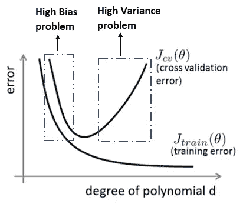
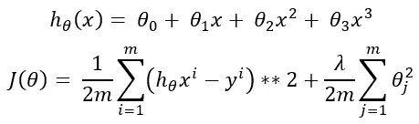
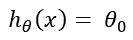
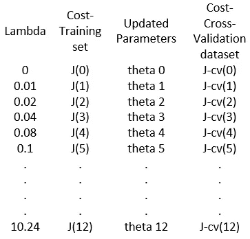

# 如何改进机器学习算法:偏差、方差和正则化

> 原文：<https://towardsdatascience.com/how-to-improve-a-machine-learning-algorithm-regularization-144a6697c2be?source=collection_archive---------53----------------------->

## 偏差和方差都是机器学习中的常见问题。它们也可以被称为欠拟合和过拟合。本文解释了如何诊断偏差和方差，以及如何调整算法来解决偏差和方差问题。

如果机器学习算法不像你预期的那样工作，几乎所有的时间都是因为偏差或方差而发生的。该算法可能会出现欠拟合或过拟合，或者两者兼而有之。重要的是找出问题来改进算法。

## 偏差与方差

想想多项式回归。众所周知，如果增加多项式的次数，精度会更高。但是这个精度是在训练集上的。如果多项式的次数足够高，则算法可以很好地学习训练数据，从而可以完美地适应训练数据集。看下图。多项式的次数越高，训练误差变得越低。

来源:作者

交叉验证数据在这里扮演了一个有趣的角色。当多项式的次数较低时，训练误差和验证误差都将较高。这被称为**高偏置问题**。你也可以称之为**不适应**问题。因此，高偏差问题的标志是，训练集精度和验证集精度都很低。

另一方面，当多项式的次数太高时，训练数据将非常适合算法。所以，训练误差会很低。但是该算法在交叉验证数据上表现很差。所以，交叉验证误差会很大。这被称为**高方差问题**或**过拟合**问题。过度拟合问题或高方差问题的标志是，训练集精度将非常高，而交叉验证集精度将很差。

## 正规化

正则化有助于处理过拟合或欠拟合问题。选择正则化参数λ可能是关键的。

这是多项式回归的假设方程(顶部)和成本函数(底部)。如果我们选择太大的λ，例如 10000，除了θ0 之外的θ值将是不重要的。因为所有的θ值都是 0 到 1 之间的随机初始化值。在这种情况下，假设将是:

因此，我们将面临高偏差(欠拟合)问题。如果λ太小，在高阶多项式中，我们会遇到通常的过拟合问题。所以，我们需要选择一个最佳的λ。

## 如何选择正则化参数

花一些时间选择一个好的正则化参数是值得的。我们需要从零开始取几个λ值。以下是一步一步的过程:

1.  选择一些λ值，如 0，0.02，0.04，0.08，0.1，…10.24.
2.  使用这些 lambdas，并使用训练集训练模型，使成本最小化。因此，我们将得到最小化的成本和每个λ值的θ值。
3.  使用优化的θ值并计算交叉验证数据集的成本函数。
4.  找出交叉验证集中哪个 lambda 值的成本最小。λ值应该是我们最终的正则化参数。在下图中，比如说，j-cv(3)是最小的。最终的正则化参数λ将是 0.04。在这张图表中，我试图列出所有的步骤。

5.最后，检查正则化参数和θ值，找出它在测试数据集上表现如何。

我希望这是有帮助的。

推荐阅读:

1.  [Python 中从头开始的多项式回归](/polynomial-regression-from-scratch-in-python-a8d64845495f)

[2。Python 中的线性回归算法:一步一步](/the-most-basic-machine-learning-algorithm-in-python-linear-regression-ace0f7f8f02)

[3。如何用 Python 开发电影推荐模型](/how-to-develop-a-movie-recommendation-model-in-python-93132ba4a341)

[4。Python 中的情感分析](/sentiment-analysis-in-python-with-amazon-product-review-data-b4e75b5d8e78)

[5。Python 中两个栈的队列实现:数据结构](/implementation-of-queue-from-two-stacks-in-python-data-structure-c35da025eaf6)