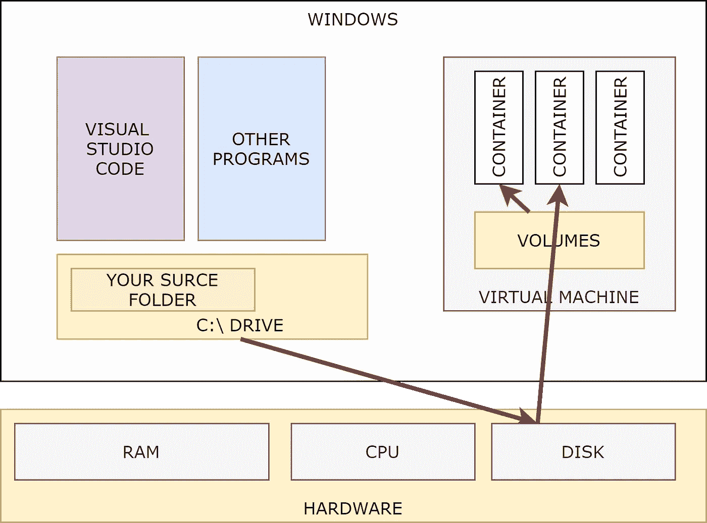
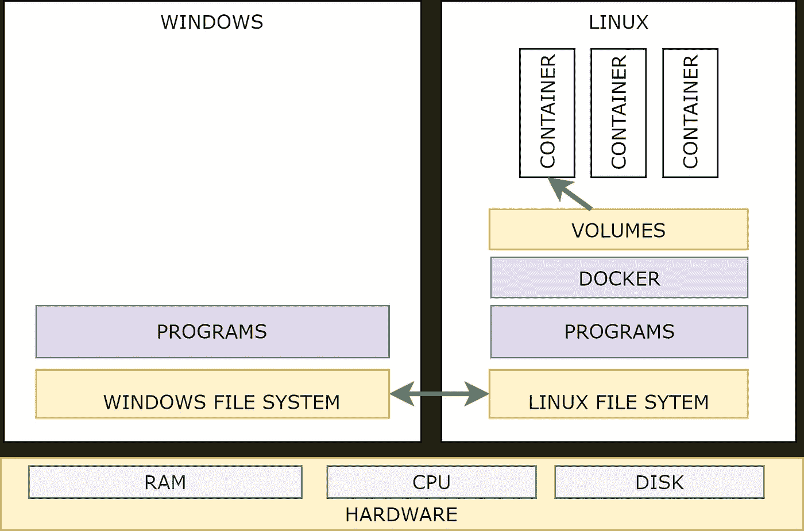
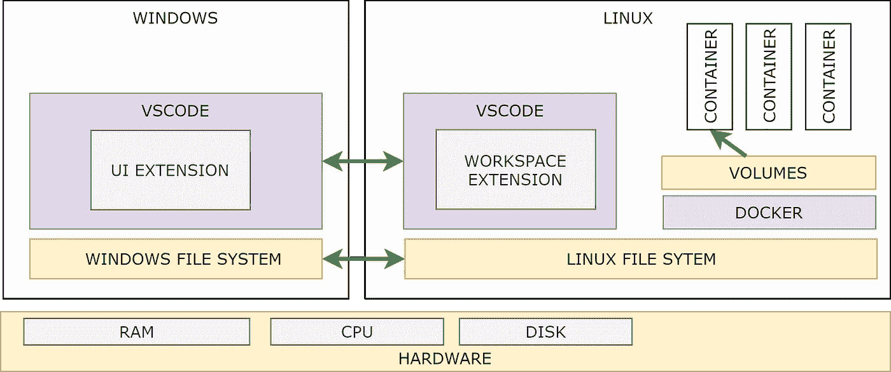
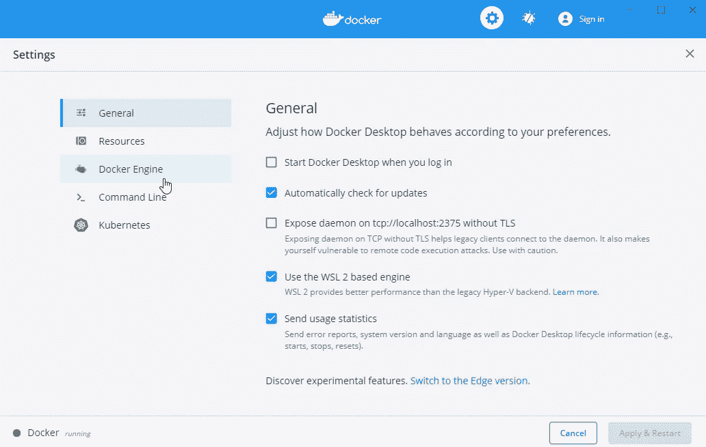
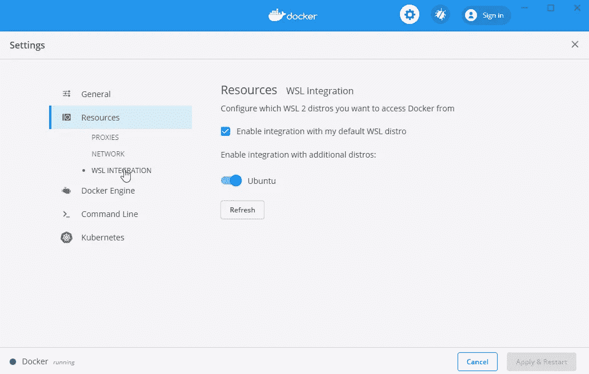
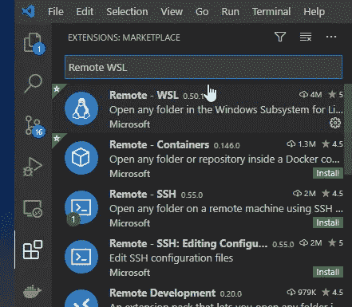
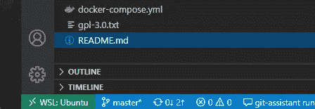

# 如何用 WSL2 提升 Docker

> 原文：<https://towardsdatascience.com/how-to-improve-docker-performance-with-wsl2-3a54402ab0f2?source=collection_archive---------4----------------------->

## WSL 为 docker 带来了显著的性能提升，但是在开启之前需要知道一些事情

Docker 被认为是建立本地开发环境的领先解决方案。由于 docker-compose 文件的简单性，您可以为每个项目创建一个独立的环境，它反映了生产环境的相同配置。

此外，该解决方案使开发独立于您拥有的操作系统。在 poo word 中，即使你的容器将是 Linux 镜像，你也可以使用 Windows 或 Mac 进行开发。

无论如何，在某些设置中，性能可能会降低，从而影响生产率。

从上一次 Docker 更新开始，Docker 工程师增加了使用 WSL2 技术提升性能的可能性，在所有平台上提供相同的开发体验，包括 windows。

本文解释了为什么我们在 Windows 上可能会有性能问题，以及如何正确安装 WSL2 来提高性能。


由 [Unsplash](https://unsplash.com?utm_source=medium&utm_medium=referral) 上的 [CHUTTERSNAP](https://unsplash.com/@chuttersnap?utm_source=medium&utm_medium=referral) 拍摄

# WSL2 如何改变 Docker

## docker 如何工作

Docker 是领先的容器解决方案，自 2013 年开始使用。我不想花太多时间讨论 docker 是什么。如果您在这里，可能已经使用过它，所以我将花一些时间来介绍 WSL2 克服的限制。无论如何，如果你想了解更多关于 docker 的信息，你可以阅读这篇文章，我试图用简单的语言解释“[到底是什么 docker](https://medium.com/swlh/what-is-docker-28bd2b618eee?source=friends_link&sk=168017493c8e11295103e01a1f34f02e) ”。

关于 Docker 要注意的中心部分是它在 windows 下是如何工作的。因为它共享操作系统，而不是硬件，所以你不能在 Windows 上有任何基于 Linux 的容器。那就是。但是每个人都在 windows 上使用 Linux 容器，这怎么可能呢？Docker 工程师用一招解决了这个问题。我们不能在 windows 上有一个 Linux 容器，但是我们可以通过使用一个管理程序把 Linux 放在 Windows 机器上。因此，解决方案很快被创造出来。Docker Desktop for windows 使用虚拟机管理程序(通常是 Microsoft HyperV)来运行虚拟机，它将 VM OS 共享给 Docker 容器。事情就是这样运作的，我试图用图表来解释。



docker 开发如何在“Linux over Windows”模式下工作。作者是❤️from。

这种架构的主要问题是:

*   **资源限制。虽然 docker 是为共享操作系统而设计的，但管理程序仍然使用硬件，你需要为它分配资源。这导致了我们在使用虚拟机时遇到的同样的性能问题。**
*   **磁盘开销。**容器映像位于虚拟机内部，它将文件存储在卷中，但您可能希望从 Windows 环境中共享文件夹，尤其是在开发时。这是图中的红色箭头往返及其影响性能。

作为在 Windows 上运行 Linux 容器的 Docker，如果主要在开发环境中使用，性能不是很重要。事实上，大多数解决方案一次处理一个请求只需要很少的资源。无论如何，有些情况下这种性能很重要。

具有应用程序状态的平台，其中可执行文件被编译和加载一次，不提供太多关于磁盘延迟的信息。发展中。net 或 java，你只需按下播放按钮，等一分钟，然后你的应用程序准备好进行测试，所有编译的源代码或多或少都在 RAM 中，你不需要给硬盘增加压力。

相反，对于 PHP 或 Python 应用程序，情况就不同了。由于它们没有任何应用程序状态，每个请求都是独立解释的，所以每次都需要扫描并加载所有需要的文件。这意味着大量的文件读取，因此大量的文件会增加您的延迟。

对于这个系统，在 windows 上使用体积映射是非常昂贵的，并且会降低性能。您可以使用挂载到 Linux 操作系统的卷，但是在这种情况下，从 Windows UI 进行编辑会有问题。

这就是为什么在大多数情况下，我们接受了最慢的性能(大多数情况下对于开发环境来说是可以接受的)，或者在其他情况下，我们被迫切换到 Linux，抵消了使用 Docker 获得多操作系统可用性的优势。

## 什么是 WSL2

WSL (Windows Subsystem for Linux)是一个兼容层，用于在 Windows 上本地运行 Linux 二进制可执行文件。它从 Windows 10 开始工作，让你在不使用虚拟机的情况下在 Windows 内部使用 Linux。自 2019 年 6 月以来，Windows 10 提供了 WSL 的增强版本(WSL 2)。此更新通过一组优化的 Hyper-V 功能带来了大量性能改进。

简而言之，你现在在你的 Windows 机器中有一个比运行虚拟机更快的 Linux 发行版。

好消息是 Docker 桌面支持它，它可以提升你的容器。

## WSL2 如何改变 Docker

使用 WLS2 和 Docker 组合，我们几乎跳过了一个步骤。

windows 和 Linux 文件系统是相互共享的:您可以从 Windows 访问共享驱动器\\WSL$\看到 Linux，或者从/mtn/c 看到 Windows)

docker 容器使用 Linux WSL，没有任何资源限制，性能更好。



Docker 如何使用 WSL2 工作。作者和❤️一起做的

在这种情况下，有巨大的坏消息。共享 windows 文件夹仍然是可能的，但是比标准情况下的性能更差。这在 Java 或者。或者说是一个可以忍受的问题，但是却使得 PHP 开发变得不可行。

幸运的是，有一个解决方案将使用 WSL2 的好处和良好的开发体验结合在一起。事实上，Visual Studio 代码能够远程处理 WSL2 子系统，因此您可以执行以下操作:

*   将 WSL2 中的卷保持为常规卷挂载，以便获得文件系统访问的最佳性能。
*   像往常一样，在 Windows 上工作，在 Linux 上编辑代码。

很明显，如果您在双击 IDE 中的某个项目或保存它时会为访问该文件支付更多的费用，这是一个非常好的解决方案。这个问题伴随着大量的文件加载而来，而这并不是一个开发人员同时写十几个时间的代码的情况。

总之，Visual Studio 做得更好。它有一个扩展，可以与他们的远程子系统远程交互，所以您可以将 UI 保留在 Windows 中，但从 Linux 中的实例使用引擎。因此，作为开发人员，您的用户体验是安全的。



如何使用 WSL2 编码？作者和❤️一起做的

好吧，一旦我们理解了如何以及为什么我们可以提高 Docker 的性能，我们只需要遵循一些简单的步骤来完成事情。

我们需要执行几个步骤，但是，从更高的角度来看，我们必须:

1.  启用 WSL2 环境
2.  配置 IDE 并开始编码。

# **启用 WSL2 环境**

本节解释了如何安装 WSL2 版本，并为使用 Docker 和 WSL2 开始编码做好准备。

## 启用 WSL

第一步是启用窗口子系统。您必须使用管理权限在命令行上运行它。

```
dism.exe /online /enable-feature /featurename:Microsoft-Windows-Subsystem-Linux /all /norestart
```

## 启用 WSL 虚拟机

第二个命令激活虚拟机平台(是的，WSL 仍然使用 hyper-v)。如果您的电脑没有开启虚拟化功能，您可能需要从 BIOS 进行设置。

```
dism.exe /online /enable-feature /featurename:VirtualMachinePlatform /all /norestart
```

在第二步之后，欢迎重新启动。

## 安装 WSL2 更新

安装和配置 WSL2 的最后一步是安装更新。这是一个简单的 MSI 包，所以你可以下载它并双击安装。

文件托管在[这里](https://docs.microsoft.com/it-it/windows/wsl/install-win10)来自微软。

## 将 WSL2 设置为默认值

一旦我们确定了 WSL2，只需将版本 2 设置为所有子系统的默认版本。

```
wsl --set-default-version 2
```

## 从微软市场安装 ubuntu

要在子系统上运行 Docker，我们需要下载一个 Linux 发行版。既然[微软+开源](https://medium.com/u/940e606ec51a?source=post_page-----3a54402ab0f2--------------------------------)现在已经成为现实，那就有可能直接从微软商店获得。我用的是 Ubunto，它只有 440MB，所以不用担心用完你的磁盘空间。

在这一步之后，您将看到所有的操作系统都作为一个子系统安装。

```
wsl --list --verbose
```

你应该在 WSL 2 上看到 docker，docker-data，ubuntu。

## **激活 Docker WSL2 扩展**

在 Docker Desktop 中，只需检查配置并启用 WSL2 特性。它可能需要一些 docker 重启或 PC 重启。

**警告:**当您从标准模式切换到 WSL2 时，您将需要重新下载所有的图像(您已经位于 Hyper-v VM 中，而不是 WSL2 中)。此外，命名卷中的数据存储在 VM 中，所以您不会在新的 WSL2 机器中找到它们。所以，首先，从 Docker 容器中提取并备份所有相关数据。根据您的本地设置，您可能会丢失数据。

第一步是检查“使用基于 WSL2 的引擎”。



激活 WSL2 功能。作者和❤️一起做的

然后你解锁 WSL 集成面板，在那里你可以激活 Ubuntu 发行版。



激活 ubuntu 发行版。作者和❤️一起做的

## 安装 VsCode 扩展

最后一步是安装和下载 Visual Studio 插件。通常，您可以通过从网站或 Visual Studio 代码用户界面单击“安装”来完成此操作。



从 Visual Studio 代码扩展安装远程 WSL。作者和❤️一起做的

你也可以在这里找到[的扩展。](https://marketplace.visualstudio.com/items?itemName=ms-vscode-remote.remote-wsl)

# **WSL2 用法**

这时候所有的步骤都完成了，就可以开始编码了。当你看到表演时，你会感谢这段时间的！最后的平衡将是仅仅在工作的第一天节省大量的时间。

对于开始编码，您有两种选择:从 WSL 开始或者从 Windwsow 开始。

就我个人而言，我更喜欢第二个，因为它非常独立。

## 表单命令行:

1.打开 WSL 终端或在 shell 中输入命令“WSL”。由于 Ubunto 是首选的子系统，你将在其中。

2.键入“代码”这将在您的 windows 计算机上打开 Visual Studio 代码。

## 从用户界面:

1.打开 visual studio 代码。

2.单击 WSL 框(左下角，底部工具栏的绿色按钮)或 F1 + Remore WLS+ New Window



从 Visual Studio 代码扩展安装远程 WSL。作者和❤️一起做的

3.新窗口与 Linux 操作系统连接

从那时起，您就可以使用 Visual Studio 代码做所有您需要的事情了。事实上，您可以从文件树中打开一个终端。终端将位于 WSL 机器内部，如果您运行 docker-compose up，您将激活主机 docker 系统上的容器。您还可以使用 git 工具来处理提交，所以这可能就是您开始编码所需的全部内容。

# 摘要

出于多种原因，许多开发人员使用 Windows 作为开发环境。这是获得最佳程序兼容性或比 Linux 更好的用户体验的常见选择。其他人使用 Windows 来获得比 Mackbook 更便宜的笔记本。

Docker 有助于在所有操作系统上获得相同的开发体验，但在某些情况下可能会导致 Windows 上的性能问题。

WSL2 提高了性能，但是需要注意将文件放在哪里以及如何创建卷。

一旦完成了这些步骤，您就可以获得与在 Linux 中相同的性能，同时获得舒适的 Windows 用户体验。

**免责声明:**我不想将 Linux、Windows 和 Mac 支持者之间的分组主义动画化。每个开发人员应该可以自由选择他们喜欢的操作系统，拥有相同的用户体验。这不是 Docker 的主要目的，而是一个令人舒服的副作用。本文的目的只是为喜欢使用 Windows 的人打开一个新的机会，避免被迫更换操作系统。

*喜欢这篇文章吗？成为* [*中等会员*](https://daniele-fontani.medium.com/membership) *继续无限制学习。如果你使用下面的链接，我会收到你的一部分会员费，不需要你额外付费。*

[](https://daniele-fontani.medium.com/membership) [## 通过我的推荐链接加入 Medium-Daniele Fontani

### 作为一个媒体会员，你的会员费的一部分会给你阅读的作家，你可以完全接触到每一个故事…

daniele-fontani.medium.com](https://daniele-fontani.medium.com/membership) 

**参考文献:**

*   官方 [docker 指南，用于将 docker 与 WSL2 一起使用](https://docs.docker.com/docker-for-windows/wsl/)
*   [Visual Studio 代码远程开发架构](https://code.visualstudio.com/blogs/2020/03/02/docker-in-wsl2)