# 如何用机器学习改善假期行程

> 原文：<https://towardsdatascience.com/how-to-improve-holiday-itinerary-with-machine-learning-6b3cd3c79d1?source=collection_archive---------20----------------------->

## 用这个超棒的策略完善你的旅行计划——省时、省力、省钱！


希腊圣托里尼岛的 Oia【图片由[洪晶](https://medium.com/u/641197e9ee36?source=post_page-----6b3cd3c79d1--------------------------------)

【2019 年 10 月，我和我的朋友们正在计划我们在[希腊和阿马尔菲](https://drive.google.com/open?id=1klLY2yu88v6EpUkSP_vuOD4j1Dqi2ZHr&usp=sharing)的史诗假期。我们计划完美假期行程的方式是使用谷歌地图。我们搜索要去的地方，并在谷歌地图上标出我们可能感兴趣的景点。

对我来说，最大限度地优化我们的假期，尽可能多地去旅行；我有三个问题:

*   我应该在一个地方呆几天？
*   我每天应该去哪些景点/地点？
*   从一个地方到另一个地方的最佳路线是什么？

让我给你看看我的算法为我们提出的路线。它每天都在推荐最佳的旅游地点。

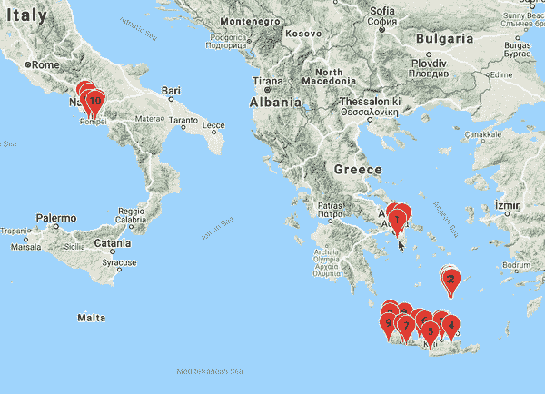

从雅典、圣托里尼和克里特岛开始，然后是阿马尔菲、拉韦洛、索伦托和那不勒斯。

*   从**雅典**出发，参观雅典卫城和其他历史古迹。这是一个很好的开始！
*   前往圣托里尼岛(Santorini)旅行，这是一个美丽的岛屿，有粉刷一新的房屋和完美的日落。
*   航行到克里特岛，进行一生一次的公路旅行冒险，探索隐蔽的角落，品尝最好的希腊美食。
*   飞往意大利，前往阿马尔菲和拉韦洛，那里的梯田沿着悬崖与最壮观的海岸风景融为一体。
*   前往**索伦托**和**那不勒斯**，尽情享用最好的意大利面、披萨、柠檬酒和冰淇淋。

很棒的假期行程，不是吗？！这个位置序列完全由算法生成。你想在下一个假期试试这个吗？我已经为你准备好了的代码。

在这篇文章中，我将向你展示如何在你的下一个假期中做到这一点。


在前往拉韦洛的徒步旅行中，阿特拉尼的日出景色

# 准备

P **在谷歌地图上的位置。**访问[我的地图](https://www.google.com/maps/d/u/0/home)，为您的下一个度假目的地创建新地图。寻找你想去的地方。景点？主题公园？餐馆？通过搜索这些地方并用标记填满您的地图，然后“*添加到地图*”。继续这样做，直到你在地图上找到所有你想去的地方。我会等你。

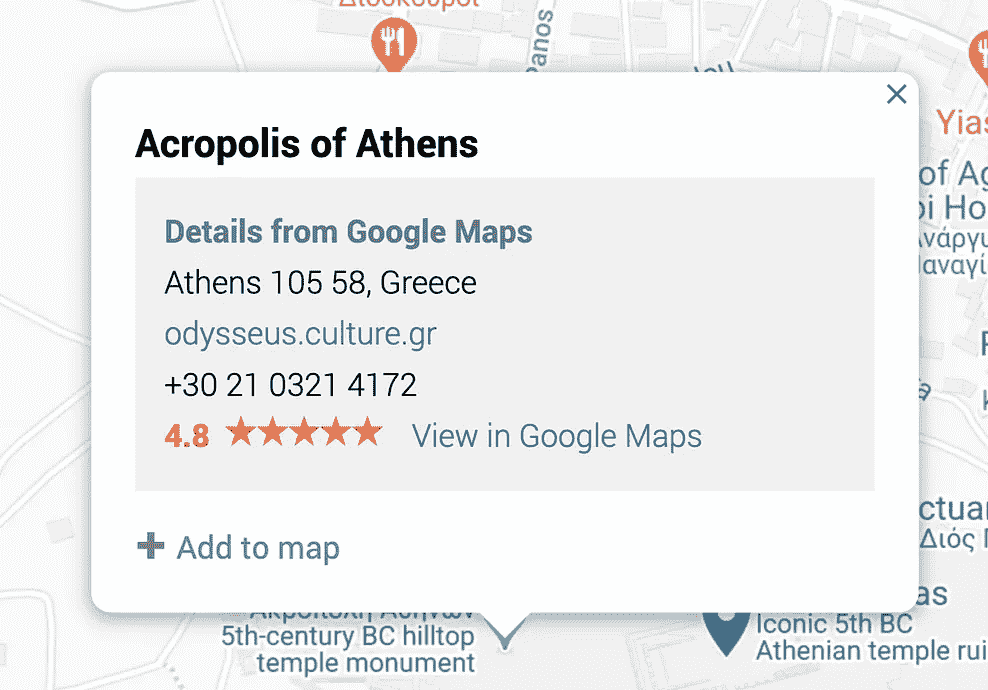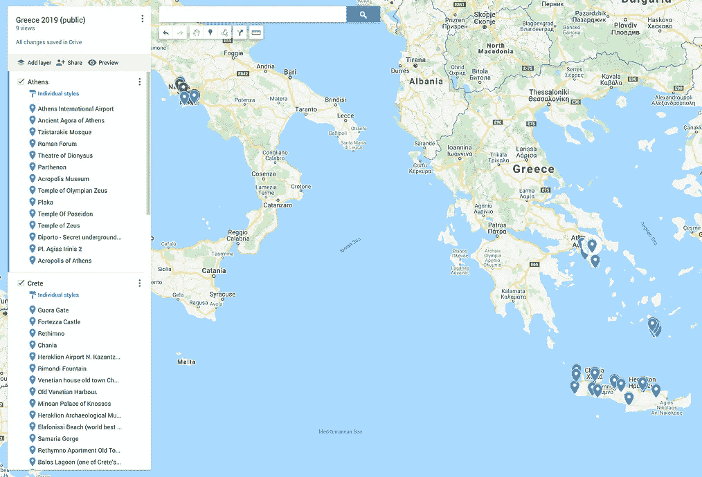

在[谷歌地图上添加标记](https://www.google.com/maps/d/u/0/home)

E **导出地图并上传至 Colab。**经过研究和确定要去的地方的艰苦工作后，我们准备导出地图。选择“*出口到 KML/KMZ* ”，记得勾选“*出口为 KML* ”。你将下载一个 KML 文件。

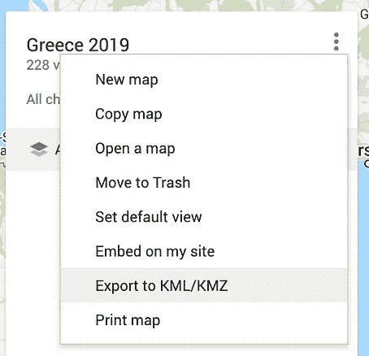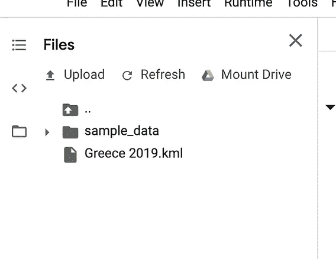

从[谷歌地图](https://www.google.com/maps/d/u/0/home)中导出 KML 文件并上传到 [Colab](https://colab.research.google.com) 中

接下来进入 [Colab](https://colab.research.google.com) ，一个由 Google 维护的优秀笔记本环境。打开左边的文件抽屉，上传你下载的 KML 文件。稍后我们将加载这个带有 [BeautifulSoup](https://pypi.org/project/beautifulsoup4/) 的 KML 文件。

Get Google API 键。我们将在谷歌地图上绘制标记，所以我们需要一个 API 键。你可以从[开发者 API 页面](https://developers.google.com/maps/documentation/javascript/get-api-key)获取。按照说明操作，您应该会得到一个如下所示的密钥:

```
ZIzkSyDwhp5B0_3eLYmPLY_tH1$Is@fAkeAp1keY
```

*Psst:这是一个假的 API 密匙*🙃


意大利阿马尔菲【图片来自[英](https://medium.com/u/f11516ac310b?source=post_page-----6b3cd3c79d1--------------------------------)

# Colab 上的代码演练

你可以获取[代码](https://gist.github.com/jinglescode/418a7ef75471dd891ae8621f36db6b62)并在 Colab 上运行它。

D定义参数。让我们为你期待已久的假期设置 API 键、KML 文件名和期望天数。

API 键用于在 Colab 上绘制交互式谷歌地图。KML 文件包含您在谷歌地图上标注的名胜。最后，算法会根据你设定的天数来决定你每天应该去哪里。

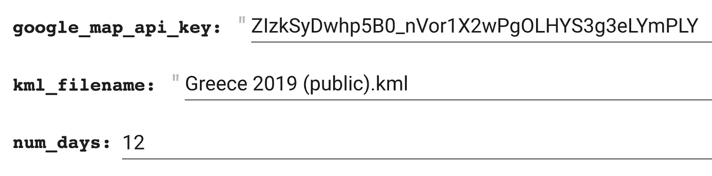

在 Colab 上定义参数[代码](https://gist.github.com/jinglescode/418a7ef75471dd891ae8621f36db6b62)

L **oad 数据。** KML 文件是 XML，我们可以用 [BeautifulSoup](https://pypi.org/project/beautifulsoup4/) 解析它。我们感兴趣的地方在“*地标*标签内，所以我们将从每个“*地标*”中提取“*名称*”和“*坐标*”。

让我们看看数据框中是否包含我们计划去的地方。

G **按接近程度分组位置。**利用数据帧中每个位置的坐标，我们可以将它们分组。如果两个地方彼此靠近，它们将在同一个集群中。聚类有几种方法，我将介绍 K-Means、谱和均值漂移聚类。

[**K-Means 聚类**](https://scikit-learn.org/stable/modules/generated/sklearn.cluster.KMeans.html) 旨在将数据点划分成指定数量的簇。其中每个数据点属于它最接近的聚类。

[**谱聚类**](https://scikit-learn.org/stable/modules/generated/sklearn.cluster.SpectralClustering.html) 在单个聚类的结构高度非凸的时候很有用。它先执行降维，然后在更少的维度上进行聚类。

[**均值漂移聚类**](https://scikit-learn.org/stable/modules/generated/sklearn.cluster.MeanShift.html) 是一种基于质心的算法，旨在发现平滑密度的数据点中的斑点。它的工作原理是将候选质心更新为区域内点的平均值。

我最后用的是哪一个？**K-表示**。因为它很简单，也是最常见的一种。但是你可以随意选择你喜欢的，这三个我都试过了。你也可以开发自己的并与我分享。

P在谷歌地图上拍吧！现在，我们准备在谷歌地图上绘制出 12 个主要区域(因为我们计划度假 12 天)。如果你在 [Colab](https://gist.github.com/jinglescode/418a7ef75471dd891ae8621f36db6b62) 上运行这个，这个地图是交互式的。

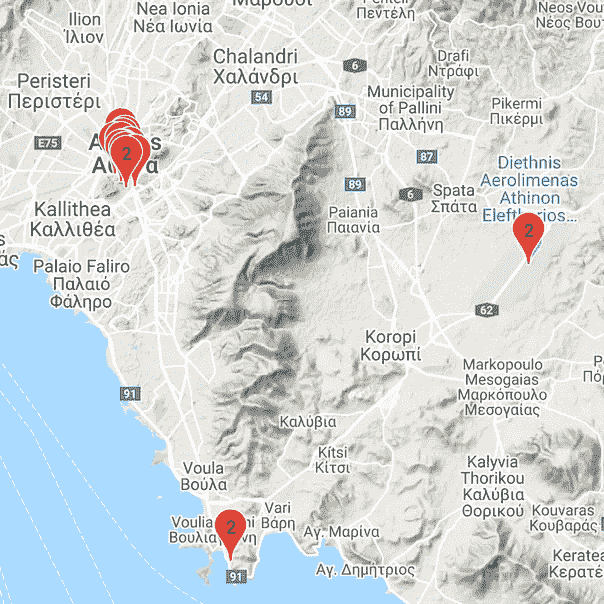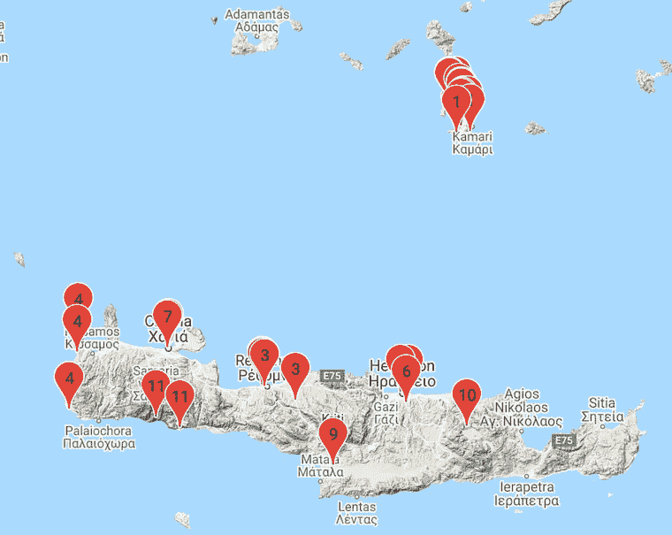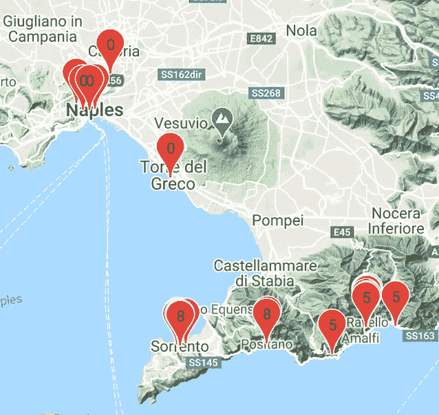

左图:雅典。中间:圣托里尼岛和克里特岛。右图:阿马尔菲和那不勒斯。

聚类算法在按邻近程度分组位置方面做得很好。接下来，我对找出从一个地区到另一个地区的最佳路线感兴趣。

找到每个集群的中间。我们可以用[熊猫](https://pandas.pydata.org/pandas-docs/stable/reference/api/pandas.DataFrame.groupby.html)函数:`places.groupby(‘cluster’).mean()`来做到这一点。这将为我们提供一个数据框架，其中每一行代表一组位置，以及经度和纬度。

F查找集群之间的距离。我们可以使用每个聚类的中点，用 [Scipy](https://docs.scipy.org/doc/scipy/reference/generated/scipy.spatial.distance.cdist.html) `cdist`函数计算聚类之间的距离。

这将为我们提供一个数据框架，显示每个星团与其他星团之间的距离。让我们称这个矩阵为**距离矩阵**，其中每个值代表两个簇之间的距离。较小的值意味着两个集群彼此更接近。

找到最短的路线。有了这个距离矩阵，我们就可以找到最短的路径了。下面是计算最短路径的代码。

最初，我使用的是[旅行推销员算法](https://en.wikipedia.org/wiki/Travelling_salesman_problem)，但是我发现[代码的](https://developers.google.com/optimization/routing/tsp)有点矫枉过正和过于复杂，所以我自己写了。这是基于**最短路径算法**的结果，一个簇到一个簇的序列。

```
2 -> 1 -> 6 -> 10 -> 9 -> 3 -> 11 -> 7 -> 4 -> 5 -> 8 -> 0
```

S **如何推荐行程。**现在我们准备在谷歌地图上标出我们的标记。它推荐我们从**雅典**、**圣托里尼**和**克里特**出发。然后到**阿马尔菲**、**拉韦洛**、**索伦托**和**那不勒斯**。如果你在 [Colab](https://gist.github.com/jinglescode/418a7ef75471dd891ae8621f36db6b62) 上运行这个，这个地图是交互式的。

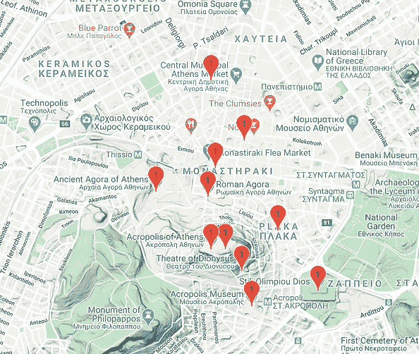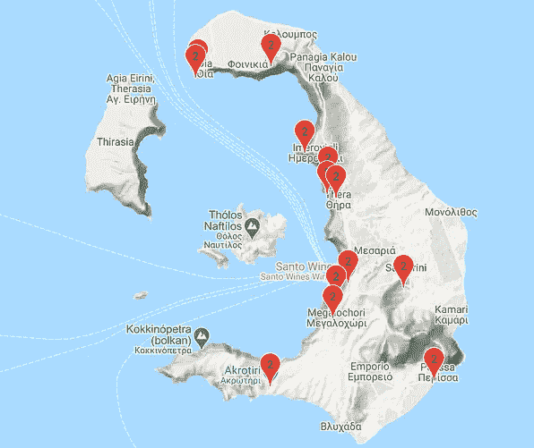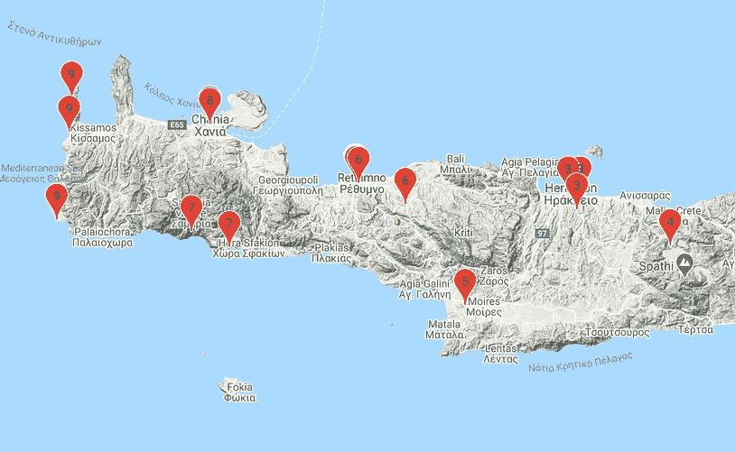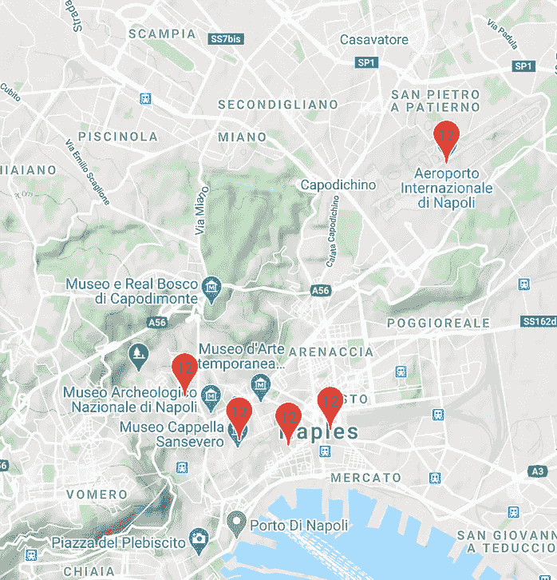

从雅典、圣托里尼岛开始，然后是克里特岛。去阿马尔菲，拉韦洛，索伦托和那不勒斯。

如果你喜欢看表格形式的，你可以用熊猫来展示。

```
pd.set_option(‘display.max_rows’, None)
places.sort_values(by=[‘days’])
```


希腊圣托里尼岛的 Oia【照片由 [Clement Lim](https://medium.com/u/4455aa7806f7?source=post_page-----6b3cd3c79d1--------------------------------) 拍摄】

# 有哪些可以改进的地方？

该算法不考虑一个区域中景点的数量。例如，我们绝对不想在一天之内探索雅典的一切！仅仅在圣托里尼呆一天是不够的。

我们需要一种聚类算法来限制一个聚类中的最大点数。使得每个集群应该具有大约相同数量的位置。如果一个集群变得过于密集，它会将该集群分成两个或更多个集群。如果你有，一定要和我分享。🤝

但是如果你在一个城市旅行，结果可能是有希望的。这是为纽约市生成的路线。随意下载我的[行程](https://drive.google.com/open?id=1SSy8rwXf-Z7UKwPT1Jv_yZDNisHqR3H2&usp=sharing)自己试试。

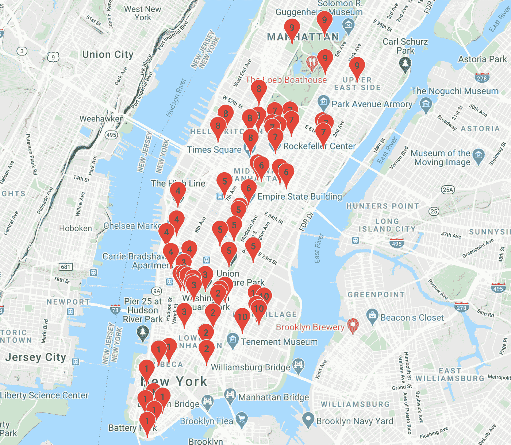

纽约市


纽约市的日落，从洛克斐勒中心的岩石顶端[照片由[洪晶](https://medium.com/u/641197e9ee36?source=post_page-----6b3cd3c79d1--------------------------------) ]

# 资源

你想在你的下一个假期尝试这个吗？这里是[代码](https://gist.github.com/jinglescode/418a7ef75471dd891ae8621f36db6b62)。*不客气。*😉

如果你喜欢这件作品，你可能也会喜欢这件。

[](/predict-movie-earnings-with-posters-786e9fd82bdc) [## 用海报预测电影收入

### 用电影海报确定电影的类型和收益

towardsdatascience.com](/predict-movie-earnings-with-posters-786e9fd82bdc) [](/data-scientist-the-dirtiest-job-of-the-21st-century-7f0c8215e845) [## 数据科学家:21 世纪最肮脏的工作

### 40%的吸尘器，40%的看门人，20%的算命师。

towardsdatascience.com](/data-scientist-the-dirtiest-job-of-the-21st-century-7f0c8215e845) 

不确定去希腊或者阿马尔菲哪里玩？继续使用我们的[希腊 x 阿马尔菲旅程](https://drive.google.com/open?id=1klLY2yu88v6EpUkSP_vuOD4j1Dqi2ZHr&usp=sharing)。

不确定在[纽约市](https://drive.google.com/open?id=1SSy8rwXf-Z7UKwPT1Jv_yZDNisHqR3H2&usp=sharing)去哪里玩？

感谢阅读。😃
希望你能像我准备这篇文章时一样喜欢它。

[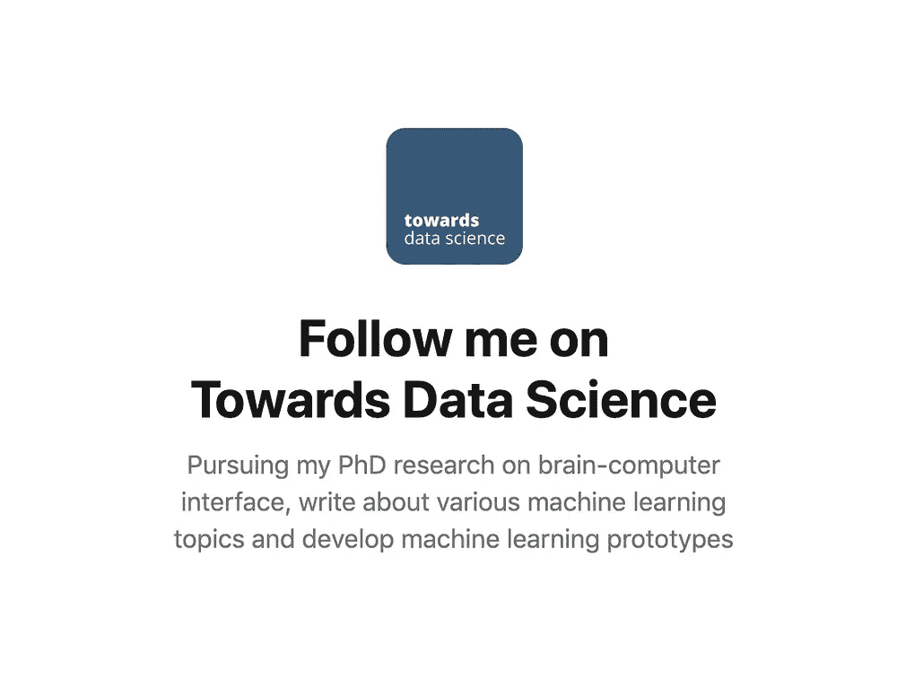](https://towardsdatascience.com/@jinglesnote)[](https://jingles.substack.com/subscribe)