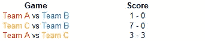
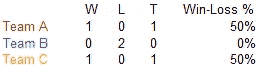
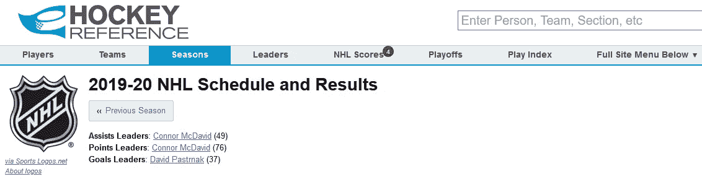
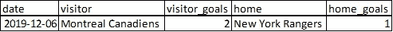
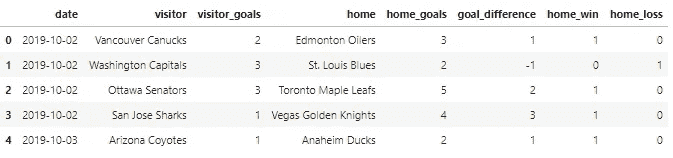
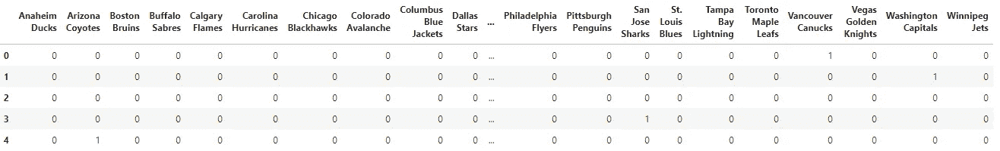
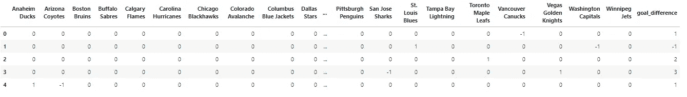
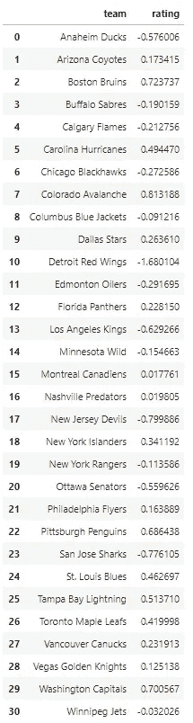
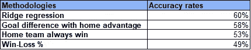

# 如何提高体育博彩赔率 Python 中的分步指南

> 原文：<https://towardsdatascience.com/how-to-improve-sports-betting-odds-step-by-step-guide-in-python-94626b852f45?source=collection_archive---------3----------------------->

## 我用数据科学策略在体育上赌了 20，000 美元。

来源:[突发](https://burst.shopify.com/photos/a-french-bulldog-in-a-hoodie-with-boxing-gloves?q=fighting)

W 当我还是一名学习统计学的学生时，我尝试过用数据科学技术进行体育博彩。通过这样做，我在那一年从体育博彩中获利 20，000 美元。

体育博彩可能不仅仅是利用你的直觉。通过增加适当的数据分析和预测模型，你可以有更大的胜算。

本指南将向你展示使用 Python 的**一步一步的算法，以及更多的技巧。**

让我们开始吧！

来源:[giphy.com](https://giphy.com/gifs/andersonpaak-money-pool-lptjRBxFKCJmFoibP3)

# 传统方法

首先，让我们回顾一下体育网站上的传统统计数据。

想象今天是本赛季的最后一场比赛。A 队要面对 c 队了，你觉得哪个队夺冠的胜算更大？你会把赌注压在谁身上？

以下是甲队和丙队的季后赛记录。

像 NHL.com 这样的体育网站经常提供这样的统计数据:

W —总赢数，L —总输数，T —总平手数

传统的球队排名方法是看输赢百分比，也就是赢的比赛占总比赛的百分比。在这种情况下，A 队将与 C 队打成平手，因为他们都有相同的 50%的胜率。

但当你仔细观察比赛数据时，C 队击败 B 队(7–0)的次数多于 A 队击败 B 队(1–0)的次数。所以 C 队这次打败 A 队的几率应该比较大。

当游戏数量很少时，研究每个结果是很容易的。但是当有很多球队和比赛的时候，我们需要一个系统的方法来分析数据。

> 我们如何整合过去比赛中的进球差异等细节，以获得更好的球队排名？

如果决赛在 A 队的主场进行呢？主队通常比客队受益。有了这条额外的信息，你觉得现在哪个队胜算更大？

> 我们如何在评估游戏时融入主场优势？

# 统计方法—逐步

为了回答上面的问题，我们使用 NHL 数据(从[曲棍球参考网站](https://www.hockey-reference.com/leagues/NHL_2020_games.html)下载)建立了一个统计模型。你也可以为其他运动进行修改。

来源:[曲棍球参考](https://www.hockey-reference.com/leagues/NHL_2020_games.html)

用于模拟评级的算法被称为**调整后的正/负评级系统**。你可以在这里阅读[系统的详细描述。或者按照下面的三个步骤来实现它。](http://www.82games.com/comm30.htm)

## **步骤#1:加载数据**

*   **下载 CSV 格式的数据**

该数据有 640 行，包括 2019 年 10 月 2 日至 2020 年 1 月 3 日之间的比赛结果。它有五个变量— *日期、访问者、访问者 _ 目标、住宅和住宅 _ 目标*。

例如，下面的行记录了 2019 年 12 月 6 日的比赛。蒙特利尔加拿大人队(客队)和纽约流浪者队(主队)比赛，最终比分是 2 比 1。

*   **将数据读入 Python**

## 步骤# **2:转换数据**

*   **添加新功能**

首先，我们创建 *goal_difference* 变量作为 home_goals 和 visitor_goals 之间的差异。当主队获胜时大于 0，当主队失败时小于 0，当两队打平时为 0。

我们还增加了两个指标 *home_win* 和 *home_loss* 来考虑主场优势对球队的影响。

数据看起来像这样:

*   **转换数据**

接下来，我们创建两个虚拟变量矩阵 *df_visitor* 和 *df_home* 来记录客队和主队。

df_visitor 的头是这样的:

这是一个矩阵，以球队名称为列，每场比赛的客队虚拟变量为行。行 0 具有值为 1 的列 Vancouver Canucks 和值为 0 的其他列。它显示了在这场比赛中客队是温哥华加人队。

df_home 矩阵具有类似的结构，但是指示相应游戏中的主队。

接下来，我们进一步转换这两个矩阵，以成为最终的数据集。

*   **合并之前的结果以获得最终数据集**

我们从 df_home 中减去 df_visitor，得到最终的数据集叫做 *df_model* 。df_model 的每一行都显示客队的值为-1，而主队的值为 1。

此外，我们从原始数据集 df 添加回变量 goal_difference。

最终数据集 df_model 如下所示:

例如，第 4 行说阿纳海姆鸭队(主队)对阵亚利桑那狼队(客队)。而阿纳海姆鸭队(主队)以一球的优势赢得了比赛。

通过这种方式，**最终数据集包括关于目标差异和主场优势因素**的信息。

现在我们准备将数据输入到模型中！

## 步骤# **3:建立预测模型**

我们用[岭回归](https://www.google.com/url?sa=t&rct=j&q=&esrc=s&source=web&cd=16&cad=rja&uact=8&ved=2ahUKEwjdnsjszpLnAhWWWc0KHf_oCJoQFjAPegQIBBAB&url=https%3A%2F%2Fncss-wpengine.netdna-ssl.com%2Fwp-content%2Fthemes%2Fncss%2Fpdf%2FProcedures%2FNCSS%2FRidge_Regression.pdf&usg=AOvVaw3e7V5ejCjSpJfehTOlIb7o)模型作为演示。

这是一个线性回归模型，增加了一项作为惩罚。由于自变量之间的多重共线性，传统的线性回归不能产生稳定的结果。

*   **拟合岭回归模型**

我们使用 goal_difference 特性作为目标变量。

*   **显示结果**

让我们打印模型的系数。

结果如下:

每个团队的这些系数可以被认为是对每个团队的评级。

> **系数/等级越高，队伍越强。**

根据这个模型，科罗拉多雪崩队是收视率最高的最佳球队。我最喜欢的多伦多枫叶队也被模特评为优秀团队！

来源:[giphy.com](https://media.giphy.com/media/13zeE9qQNC5IKk/giphy.gif)

你做到了！

也就是说，在将这种算法应用于体育博彩之前，让我们考虑几件其他事情。

# 这种方法与传统方法相比如何？

统计方法似乎比传统方法更复杂。但是性能如何比较？

让我们看看另外三种常规方法:

## **方法#1:输赢百分比**

正如我们在本文前面部分所讨论的，这是一个经常出现在体育网站上的基本统计数据。对于每个特定的团队，*输赢百分比=赢的游戏总数/玩的游戏总数*。

## **方法二:主队获胜**

正如这个方法的名字所暗示的，它是一个总是选择主队获胜的赌注。

## **方法 3:利用主场优势净胜球**

这是一个复杂的方法，包含了关于净胜球和主场优势的信息。

然而，当提出团队评级时，它并不考虑团队对手的实力。岭回归的方法会考虑这一点，因为它把所有的球队和所有的比赛放在一起看。

*** *如果你讨厌公式，跳过这些* ***

首先，对于每个特定的团队*、*，我们计算:

*球队每场净胜球=(球队进球-球队允许进球)/(球队出场场次)*

接下来，我们使用所有过去的比赛结果来获得一个关于该队所有主场优势的统计数据:

*主场优势净胜球=(所有主队进球-所有客队进球)/(所有球队比赛场次)*

有了这些统计数据，我们可以预测主队或客队是否会赢得某场比赛。

再次使用开头的例子。A 队(主队)将和 C 队(客队)比赛。我们使用下面的统计数据来预测结果:

*Margin =**A 队场均净胜球——C 队场均净胜球+主场优势净胜球*

如果 Margin > 0，那么我们赌 A 队(主队)赢。如果余量< 0, we choose Team C (the visiting team).

******************************

To compare these methods, we use [交叉验证](https://en.wikipedia.org/wiki/Cross-validation_(statistics))进行评估。

> 我们的统计模型是赢家！
> 
> 它预测曲棍球比赛结果的准确率高达 60%!

但是，在赛季的初始阶段，最好依靠其他指标。因为模型的结果只会随着赛季的进行(当有更多的数据可用时)而改进，变得比其他方法更好。

# 还有哪些可以进一步改善结果的技巧？

当然，我们的预测结果仍有改进的余地。

## 提示 1:考虑团队最近几天的日程安排

考虑到球队最近的赛程，你可以增加一些变数。在过去的几天里，球队有没有打比赛或者休息？团队是否经常外出旅行？

## 技巧 2:权衡游戏结果

球队的情况总是随着赛季的变化而变化。所以最近的比赛应该比早期的比赛更有知识性。为此增加一个指标会有所帮助。

## 技巧 3:使用不同的模型

我们以岭回归模型为例。然而，为了获得更好的结果，您可以测试并结合其他机器学习/统计模型，如[神经网络](https://en.wikipedia.org/wiki/Artificial_neural_network)、 [GBM](https://en.wikipedia.org/wiki/Gradient_boosting) 。

## 技巧 4:加入你自己的判断

这些模型不能包含所有的信息。作为一个有经验的体育迷，你必须有宝贵的知识。结合统计方法和你的经验对于做出更好的预测是至关重要的。

体育博彩是一种在娱乐的同时练习数据科学技能的绝佳方式。

在芯片掉落前拟合模型！

祝大家好运！

来源:[giphy.com](https://media.giphy.com/media/3olG8oUgwZBaRO64y1/giphy.gif)

感谢您的阅读。我希望你发现这个体育博彩指南有帮助。

现在我想听听你要说什么。请随时在下面留下你的评论。

更多来自 Lianne & Justin 的数据科学文章:

 [## 剧透警告:康纳·麦格雷戈 vs 牛仔？谁会赢？

### 应用 Elo 评级系统预测 UFC 246

towardsdatascience.com](/spoiler-alert-conor-mcgregor-vs-cowboy-who-will-win-7c3eee6389b0)  [## 根据模拟，30 岁退休需要多少钱

### 很多人年纪轻轻就有辞掉工作的梦想，活在世上没有经济上的牵挂。怎么…

towardsdatascience.com](/how-much-do-you-need-to-retire-at-age-30-based-on-simulation-424fa9e0922b)  [## 如何像老板一样在 Python 中操纵日期和时间

### 常用的日期时间函数及示例

towardsdatascience.com](/how-to-manipulate-date-and-time-in-python-like-a-boss-ddea677c6a4d)