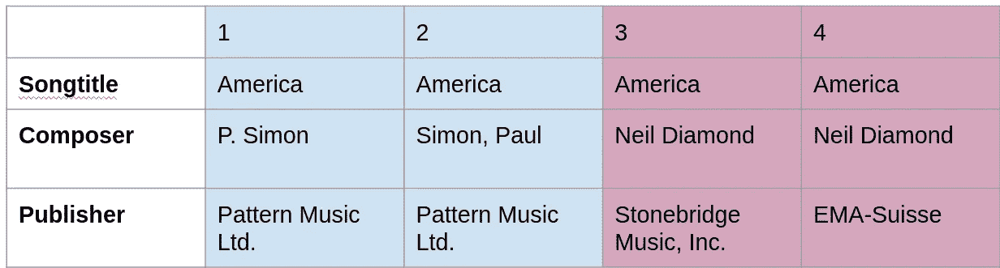
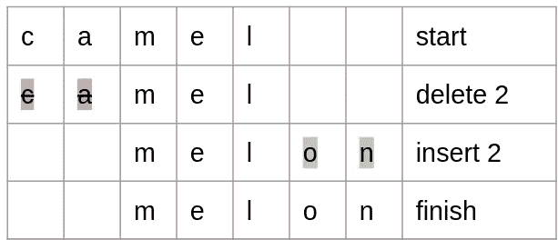
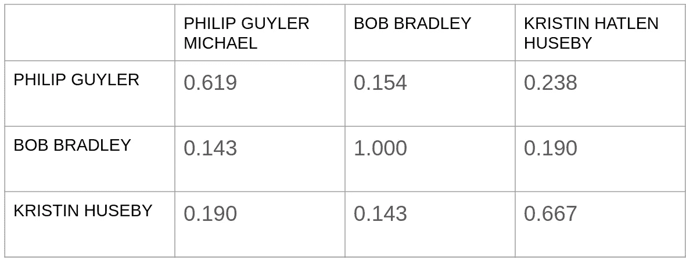
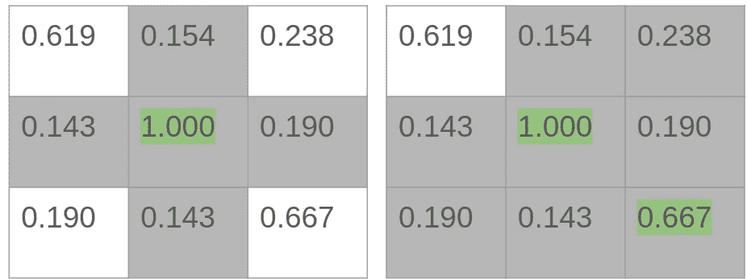

# 如何通过采用 Levenshtein 距离的后处理来提高机器学习模型的性能

> 原文：<https://towardsdatascience.com/how-to-improve-the-performance-of-a-machine-learning-model-with-post-processing-employing-b8559d2d670a?source=collection_archive---------24----------------------->

## 用作度量的 Levenshtein 距离通过验证条目中的每个命名实体来提高 NLP 模型的准确性

我目前正在开发一个 NLP 解决方案，用于匹配不同领域(广播、电视、音乐会)的音乐使用报告，以便正确分配音乐创作者的版税。对已经在音乐作品和版权所有者的数据库中使用的一段音乐的正确匹配的搜索是通过对文本进行矢量化并对最相似的向量进行向量搜索来完成的。(我可能稍后会写这部分解决方案)

矢量搜索解决方案做得很好，找到了由矢量化定义的最相似的条目。然而，这个用例也有一些非常具体的需求需要满足，以确保版税分配给正确的个人。这些要求中的一些可以通过简单的逻辑将报告与匹配的音乐作品进行比较来检查。在匹配可以被批准之前，必须进行检查，例如计算权利所有者的数量是否相同，出版商是否相同。此外，我们必须验证每个权利所有者都是高度可能的匹配。这比听起来要复杂一点，因为我们无法控制这些名字在数据集中的书写方式。可以先写姓，后写姓，或者相反的顺序。可以有缩写，昵称，拼写错误和错别字。如果我们需要一个字对一个字的精确匹配，我们将丢弃大部分建议的匹配，这些匹配实际上是正确的。“弗雷德里克·约翰逊”在报告中可能会拼成“约翰逊·弗雷德”。所以直接检查相同的文本是行不通的。此外，单词袋的比较也不会令人满意，因为单词本身在许多情况下并不相同。

那么，我们该怎么做呢？检查的要求是相似的名字应该被批准，而太不相似的名字应该被标记为不是同一个人，并且报告的音乐作品和登记的作品之间的匹配不应该被批准。

潜在匹配的示例，所有这些条目都有一个共同的标题。只有 1 和 2 可作为匹配被接受，因为作曲者和出版商是相同的，即使作曲者姓名的拼写不同。3 和 4 不应该被批准，因为它们的出版商是不同的，即使作曲者是相同的。

字符串之间差异的度量是编辑距离或 Levenshtein 距离(以苏联数学家 Vladimir Levenshtein 的名字命名)。简而言之，编辑距离是我们必须对一个字符串进行多少次更改才能将其转换为我们要比较的字符串的度量。举例来说," Frederic "和" Fred "之间的差别是 4，因为我们可以把" Frederic "改成" Fred ",去掉字母" e "、" r "、" I "和" c "。

总共需要 4 次编辑才能将“骆驼”变成“甜瓜”

使用 Levenshtein 距离作为度量并为 Levenshtein 距离设置阈值的一个挑战是，它的值只对差异的数量敏感，而对被比较的字符串的长度不敏感。例如，“波诺”和“邦·乔维”可以说是非常糟糕的匹配，具有 4 的编辑距离，而“**埃尔顿·赫拉克勒斯·约翰爵士**”和“**埃尔顿·约翰爵士**”具有 9 的编辑距离。直接使用 Levenshtein 距离进行比较显然不会有很好的效果。然而，如果我们通过除以两个字符串中最长的一个来“标准化”这一点，我们将获得一个相似性度量，这对于比较来说要方便得多。

当比较名字时，我们必须考虑到包含名字的字符串中单词的顺序可以是任意的，因为有不同的约定。为了避免将“John Smith”判断为与“Smith，John”完全不同的名字，我们需要对每个字符串中的单词进行排序，以相同的方式进行比较。最简单的方法是按字母顺序排列字符串中的标记。按字母顺序排列标记后，不同的约定将不再是比较的问题。

在可用的数据中，报告名称的顺序是任意的，那么我们如何知道应该比较哪些字符串呢？事实上，我们永远无法确切知道，但这个问题的解决是相当顺利的。如果我们计算报道的姓名和来自匹配作品的姓名之间的所有可能匹配之间的 Levenshtein 距离，我们可以建立匹配矩阵。

从这里开始，很容易找到最佳匹配=最高分，然后通过屏蔽最高分的行和列从比较中删除匹配的名称。重复，直到矩阵中只剩下一个分数。这是示例中得分最低的字符串比较，因为我们已经确保从要比较的名称中选择了可能的最佳匹配。这将是我们需要考虑的分数，以决定比赛是否可以通过。

消除与集合中的最佳匹配相对应的分数的步骤，直到我们剩下一个活动分数来评估。最佳匹配以绿色突出显示。

现在我们只剩下一个数字要评估，以决定是否可以批准这个匹配，所以最后要决定的是如何设置阈值。由于这是针对特定问题的定制解决方案，因此我从系统用户那里获得了如下要求:

*   不接受虚假批准
*   应该允许省略中间名
*   应该允许其中一个名称的缩写

当然，在某个地方会有一个折衷，但是与用户讨论后处理步骤给了我一些非常重要的理解。因为我们的目标是自动化，所以不批准任何实际上不匹配的东西是最重要的。如果我们错过了一些可以被认可的比赛，这不是什么大问题。如果我们对所做的匹配有很高的信心，我们可以建立对系统的信任，并通过系统自动传递所有批准的匹配，从而节省大量劳动力。

为了给 Levenshtein 测量找到一个好的阈值，我收集了一个小样本的名字和它们的替代拼写，缺少中间名和缩写，并计算了它们的归一化 Levenshtein 距离，并使用这些来设置一个合理的阈值。我发现对于我的情况，0.5 是一个很好的阈值，其中一个缺少的名字或一个缩写的名字通常会允许匹配被批准，但是如果，例如，我们在相同的名字中有一个缺少的中间名和一个缩写，匹配通常不会被批准。

当归一化时，Levenshtein 距离可以有效地用于验证机器学习结果中列出的专有名称之间的匹配。对每个列出的名称进行额外的验证，即使是一个无序的列表，也能增强对结果的信心，实现查找过程的自动化。

# 关于我

我是梅塔咨询公司的数据科学家。专注于应用数据科学、人工智能，尤其是 NLP。