# 优步的机器学习让我失望

> 原文：<https://towardsdatascience.com/how-to-improve-uber-machine-learning-c83051d6e57f?source=collection_archive---------22----------------------->

## 实时对抗优步黑客&给优步的建议

克林特·帕特森在 [Unsplash](https://unsplash.com/?utm_source=unsplash&utm_medium=referral&utm_content=creditCopyText) 上拍摄的照片

**TL；博士**——在 6 个多小时里，我看着有人入侵了我的[优步](https://medium.com/u/b97b1b381b5a?source=post_page-----c83051d6e57f--------------------------------)账户，并实时消费了 1000 多美元。优步的先进和著名的技术和 ML 解决方案在活动期间和之后都失败了。在这篇文章中，我回顾了我的经历，并提供了三组浅显的建议。对于数据科学家来说，这是一个很好的提醒:当遇到混乱的世界时，ML 可能会失败。

**目录:**

1.  语境
2.  如何修复全渠道客服
3.  如何简化混合欺诈检测工作流程和算法
4.  如何保护多目标和基于图的推荐系统

*免责声明:所有观点都是我的，不代表我雇主的观点。*

***喜欢读什么？*** *跟我上* [*中*](https://medium.com/@ianxiao)*[*LinkedIn*](https://www.linkedin.com/in/ianxiao/)*，以及*[*Twitter*](https://twitter.com/ian_xxiao)*。**

# *从天堂到地狱的短暂旅程*

*尽管是新冠肺炎，但和许多人一样，我和我的狗决定冒险享受 2020 年 5 月 3 日的天气。多伦多海滨是一个天堂。*

**

*遛狗，作者照片*

****

*多伦多海滨的早晨和下午，作者自己的照片*

*当我们走向水边时，我的电话响了。**是 UberEat 的通知。看来我妻子晚餐点了披萨。虽然比萨饼不是我们最喜欢的菜，但我太沉迷于对海滨的怀旧记忆了。***

*我把手机塞进口袋，开始带着我的狗向水边慢跑。与此同时，我的电话一直在响。*

*十分钟后，我再次看手机时陷入了地狱。时间停止了:笑声减弱了；太阳的温暖冻结了；我的狗消失了；短暂的自由消失了。*

*不可能的。**有人黑了我的优步账户**，即使有双因素验证**。**最糟糕(也是最有趣)的部分:我可以像观看**直播一样观看。***

*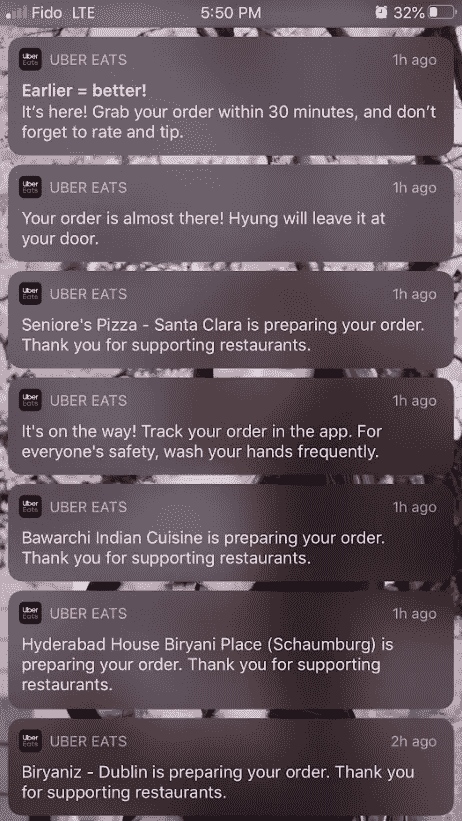*

*作者手机截图，拍摄于 2020 年 5 月 3 日*

*困惑，害怕，孤独。一个新的通知不断传来:“杰森说谢谢你的提示！”*

*我发出了无声的沮丧和求助的呼喊。*

*吉菲*

*我深深吸了一口春天的新鲜空气。沉稳。我应该修改我的密码并注销黑客。预料到我歇斯底里的干扰，黑客改变了我的密码，把我锁在外面。我又慌了。*

*崩溃了。看起来唯一的选择是联系优步的客户服务。*

*与此同时，每份超过 100 美元的新 UberEat 订单的通知以及来自餐馆和司机的感谢不断涌入——我无法停止想象黑客嘲笑的脸。*

*[吉菲](https://media.giphy.com/media/7N0dxx0I8rxZe/giphy.gif)*

# *问题和建议*

*我毫不怀疑优步(或万事达)会退款，他们最终也退款了。然而，这个过程既漫长又令人困惑。后果令人非常尴尬。*

*总的来说，考虑到优步的技术进步，这是一个令人不快的惊喜。*

*回想起来，我看到了三个问题:*

1.  *优步的客户服务不够无缝和“智能”。*
2.  *优步的欺诈检测解决方案太慢了。*
3.  *优步的推荐引擎并不那么感同身受。*

*让我强调这些问题是有规律的，但是有爱心的，用户和作为有爱心的数据的极客 T21 提供一些建议。*

## *1.客户服务*

*出现问题时，客户服务是第一联系点。这是所有公司中最关键、最复杂、最具挑战性的运营——优步也不例外。*

***A .手机 app 上没有客服。***

*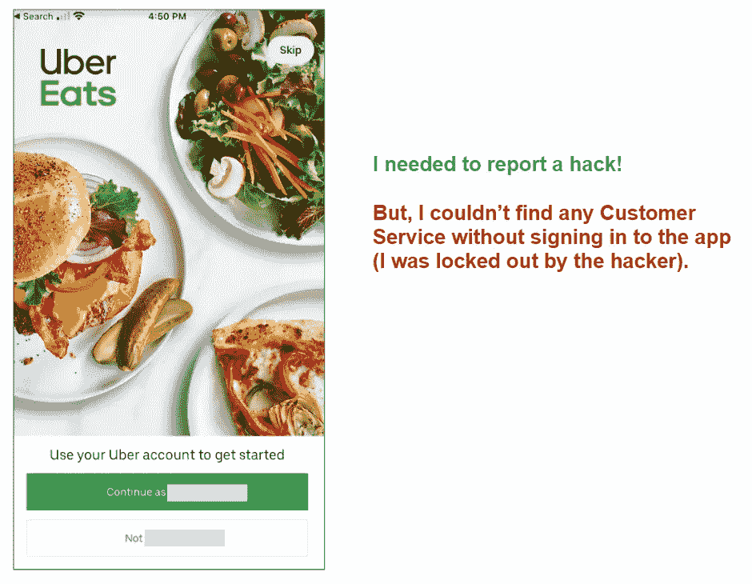*

*UberEat app 截图，拍摄于 2020 年 5 月 10 日*

*在优步的帮助下很难找到合适的支持者。*

*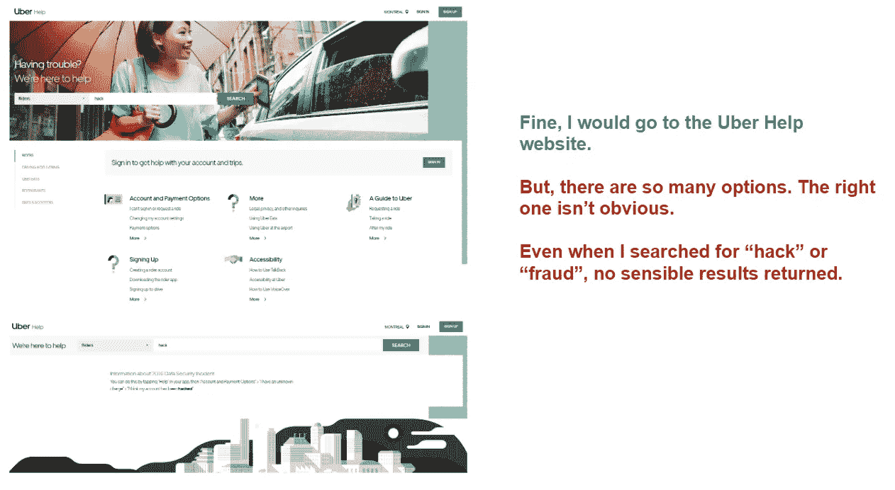*

*优步求助网站截图，拍摄于 2020 年 5 月 10 日*

*来自其他渠道的缓慢且不连续的响应。*

*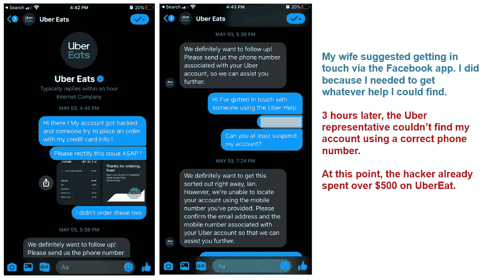*

*作者于 2020 年 5 月 10 日在脸书 Messager 上与 UberEat 的聊天记录截图*

*与此同时，我焦急地阅读了优步帮助上的选项，并在“我有一个未知的费用”下提交了一个请求这似乎是最相关的。*

***D .令人困惑的电子邮件支持。***

*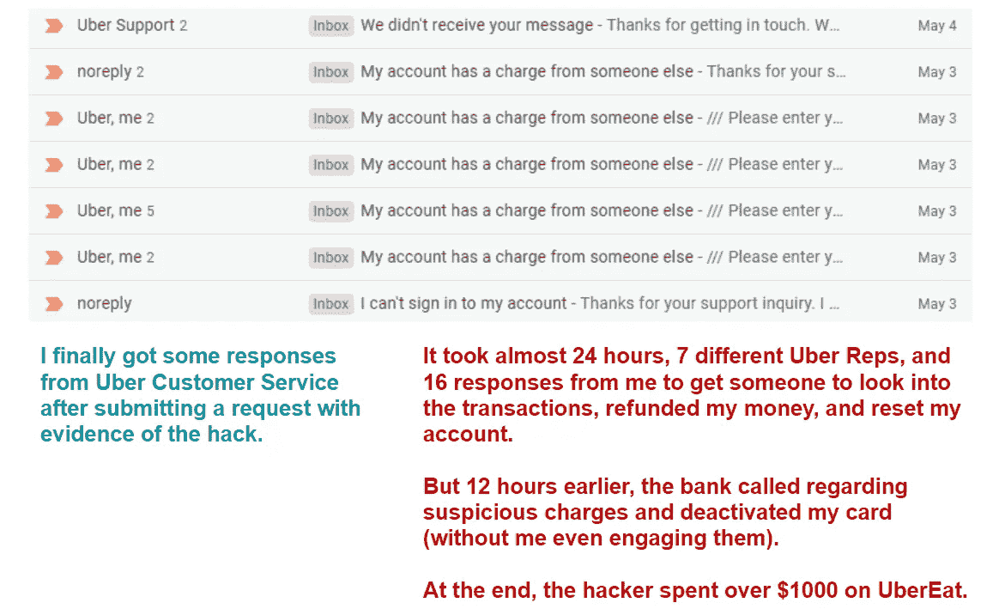*

*邮件往来截图，作者拍摄于 2020 年 5 月 10 日*

## *对客户服务的建议*

*以下是我改善[优步](https://medium.com/u/b97b1b381b5a?source=post_page-----c83051d6e57f--------------------------------)客服体验的实用建议。*

*   ***在 app 登陆页面添加客服移动界面**。用户不需要登录就可以使用这个特性。*
*   ***改进优步帮助上的内容标记**。“黑客”或“欺诈”可能是低频搜索词，但它们具有紧迫性和巨大的财务影响。要求用户手动检查每个选项似乎不合理。*
*   ***(或许)连接通道。**共享代表从非网络渠道对集中式用户信息和案例管理系统的访问。我不是 100%确定为什么脸书·梅桑格的优步代表找不到我的资料，并且花了很长时间才回复。我猜脸书频道不打算解决这样的问题。因此，它缺乏系统集成、培训和能力。*
*   ***改进模板化邮件回复**。以下是模板回复，以确认我报告的欺诈交易确实属于我的帐户。等等。什么？这有什么帮助？*

*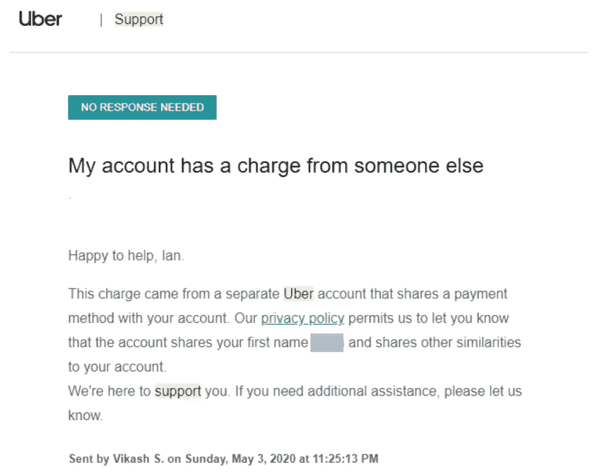*

*回复截图，捕捉于 2020 年 5 月 10 日*

*我又提出了三个请求，又花了七个小时才弄明白我需要做些什么不同:我必须用优步文件上的同一个电子邮件地址提交请求和回复。优步本可以发送更明确的电子邮件指示或使用个人回复。如果设计不当，自动化会以牺牲用户的时间为代价来节省优步的时间。*

## *2.欺诈检测系统*

*我长期关注优步工程博客。不断的技术突破和创新概念总是令人惊叹。*

*根据优步的博客，该公司收集 GPS 数据，并使用最先进的混合工作流、行为分析和深度学习模型(行为特征被编码到 LSTM 模型中)。*

****注*** *:这是针对优步乘车的解决方案，而不是针对 UberEats。我假设解决方案的许多组件是共享的。**

*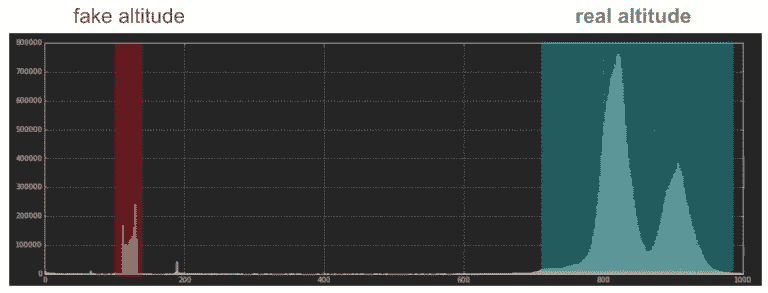*

*基于 GPS 的欺骗检测，[优步工程博客](https://eng.uber.com/advanced-technologies-detecting-preventing-fraud-uber/)*

*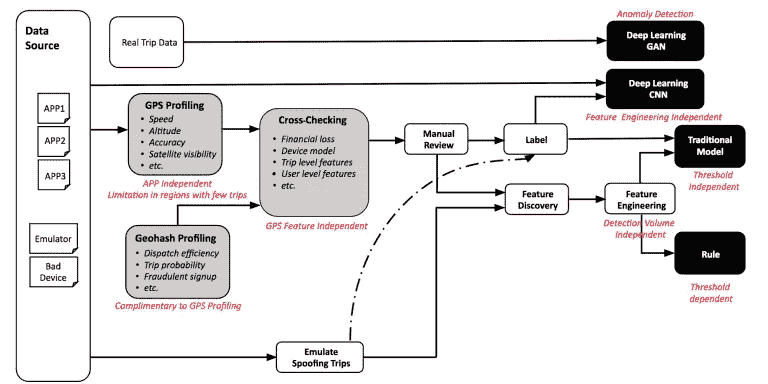*

*优步的欺诈检测工作流程，[优步工程博客](https://eng.uber.com/advanced-technologies-detecting-preventing-fraud-uber/)*

*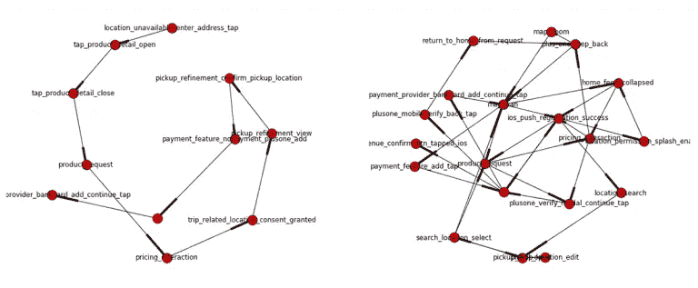*

*行为分析，[优步工程博客](https://eng.uber.com/advanced-technologies-detecting-preventing-fraud-uber/)*

*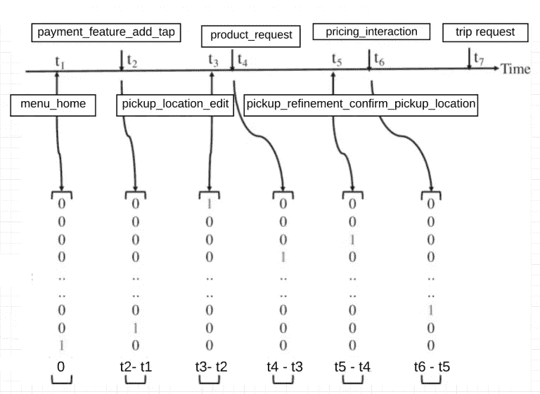*

*LSTM 编码和模型，[优步工程博客](https://eng.uber.com/advanced-technologies-detecting-preventing-fraud-uber/)*

*然而，即使没有我的干预，一家低技术含量的加拿大银行也能在一半的时间里发现并纠正欺诈行为。我不能停下来想为什么。是不是工程过度了？*

## *对优步欺诈检测的建议*

*除了花哨的工程设计，我们都应该同意一件事:**检测和应对欺诈应该快速有效。否则，对所有参与者来说成本都更高(例如，用户的时间和信心、公司的运营努力和声誉)。***

*我对[优步](https://medium.com/u/b97b1b381b5a)的建议是**保持简单和愚蠢**(接吻原则)并牢记 [**80/20 原则**](https://en.wikipedia.org/wiki/Pareto_principle) 。*

*根据我为低技术银行设计和部署欺诈引擎的经验，**基于规则的引擎往往比复杂的洗钱解决方案更好用**,原因有二:a)简单的解决方案往往更快、更容易更新(KISS ); b)一小组规则通常可以捕获大多数欺诈案例(80/20 原则)*

*一些欺诈者可能很老练。因此，必须有一个更新规则的过程。优步可以通过每月或每季度回顾遗漏的案例来做到这一点。然后，团队可以相应地更新规则。*

*看看我的案例，下面是我对一个基于规则的解决方案的谦逊和天真的建议，它分析了优步秩序的三个基本方面。*

*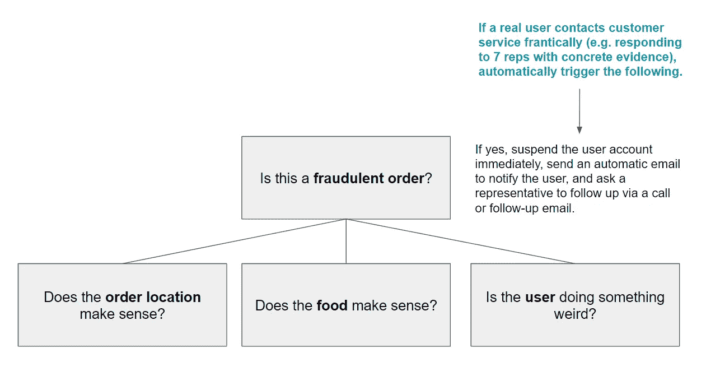*

*作者的分析*

***订单位置有意义吗？***

*   *订单是否送达用户所在城市？*
*   *用户经常出差吗？*
*   *用户不在的时候会点 UberEat 吗？*

*我住在多伦多，我去过几次旅行，但是我从来没有在我主要居住地以外的城市点过 UberEat。黑客发出的所有命令都在我的家乡城市之外。所以，不，我的位置说不通。*

***用户偏好背景下的食物有意义吗？***

*   *用户是探索型的吗？(例如，不同菜肴的数量、相对于其他用户的排名等。)*
*   *食物是否符合用户的喜好？(例如，菜肴、平均订单规模等。)*

***举例:**我不是探索型的；我通常在多伦多我家附近的 4-6 家餐馆点日本和韩国食物。我的平均订单大小约为 30-40 加元，黑客的平均订单大小为 108 美元。所以，不，食物细节说不通。*

***用户是否在做一些奇怪的事情？***

*   *用户是否在短时间内下单过多？(查看用户的平均订购频率)*
*   *用户是否在可疑地点下单？(检查到用户主要城市的餐馆和送货地点、最后 X 个订单中不同城市的数量等。)*

***例如:**我一个月通常订购 1-2 次，黑客在 5 个小时内订购了 11 次(每月约 1650 个订单)。黑客从至少 5 个美国城市的餐馆点餐，这些城市相距数千英里。所以，是的，用户显然在做一些奇怪的事情。*

*最后，这个分析能在近实时的时间内完成吗，比如 30-60 分钟，这样我就不用被黑客折磨 6 个小时了。许多计算都很简单，它们不需要很长时间来收集足够的数据来做出决策，并且与基于 ML 的方法相比，它不需要大量的训练数据和很长的推理时间。*

*在看到优步推送表扬通知和反馈请求的速度后，我确信优步可以将这一技术发挥巨大作用！*

*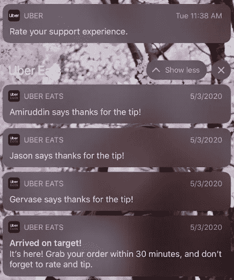*

*作者手机截图，拍摄于 2020 年 5 月 10 日*

*尽管这次的支持经历很糟糕，但我对优步的工程团队充满信心，相信他们会做得更好。*

## *3.不那么感同身受的提醒*

*自黑客事件以来，优步的推荐算法继续发挥着它的魔力:它在完美的时机发送通知和建议来满足我的胃口，只是这些建议都是基于黑客的品味，而不是我的。*

*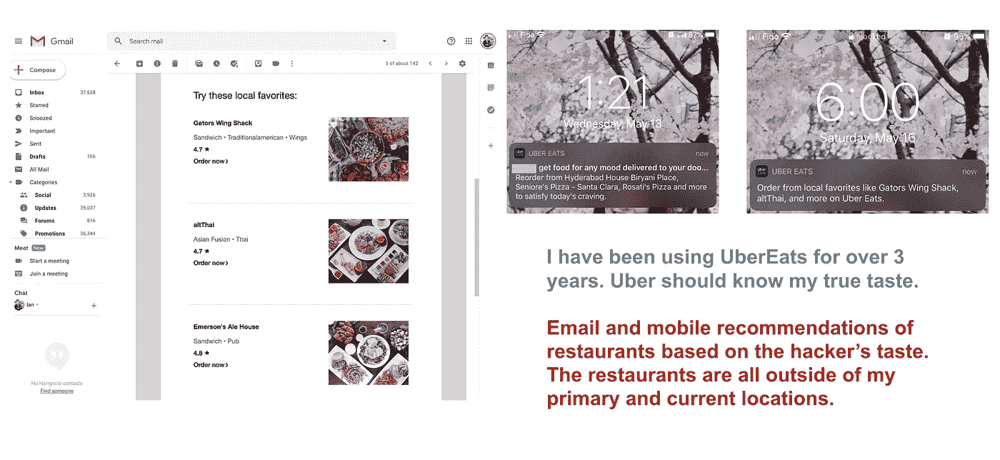*

*过去两周的电子邮件和移动推荐，作者截图*

*最近两周收到的每一个 UberEat 推荐**都让我觉得尴尬和沮丧。**就好像黑客从来没有放过我，他(或她)不祥的存在依然在每一个频道，每时每刻萦绕着我。*

*[吉菲](https://media.giphy.com/media/q8AiNhQJVyDoQ/giphy.gif)*

*由于我的专业经验和兴趣，优步的推荐设计和实现是我在优步工程博客上的最爱。创新的想法、创意的设计和清晰的解释总是给我留下深刻的印象。*

*下图描述了 UberEat 推荐引擎的核心组件和流程。*

*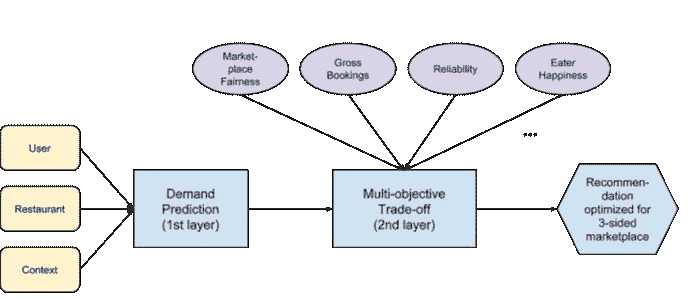*

*多目标推荐设计，[优步的工程博客](https://eng.uber.com/uber-eats-recommending-marketplace/)*

*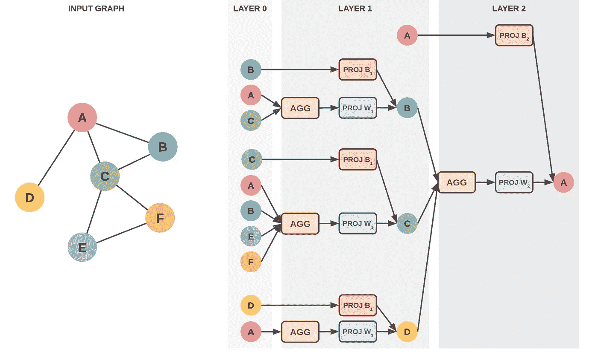*

*基于图形的推荐系统，[优步的工程博客](https://eng.uber.com/uber-eats-graph-learning/)*

*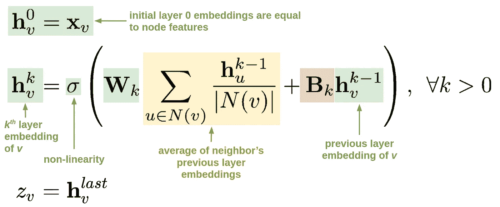*

*图-学习方程，[优步工程博客](https://eng.uber.com/uber-eats-graph-learning/)*

*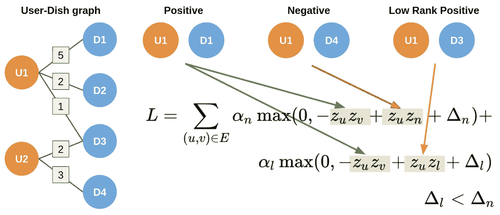*

*基于图的推荐器的损失函数，[优步工程博客](https://eng.uber.com/uber-eats-graph-learning/)*

*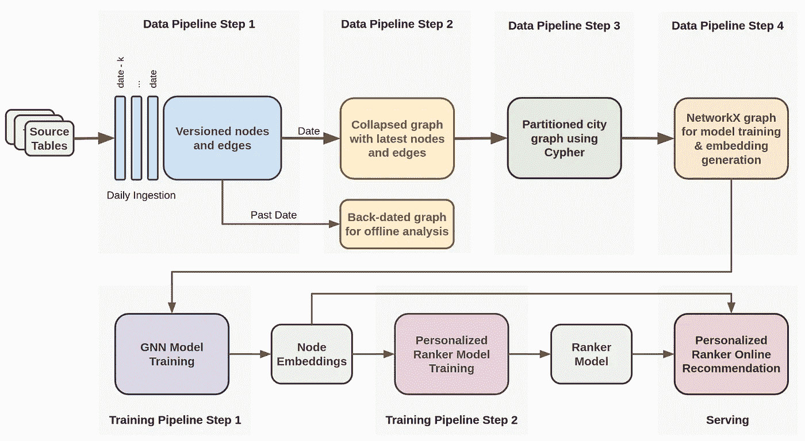*

*基于图的推荐系统的工作流设计，[优步工程博客](https://eng.uber.com/uber-eats-graph-learning/)*

*但是，抛开所有抽象的想法和复杂的设计，一些简单的东西似乎不见了。*

## *对优步保荐制度的几点建议*

*   ***添加或更新数据验证标准。**通过将此添加到数据管道，步骤 1 可以从训练和/或推断中移除坏数据。优步应该把我的记录贴上例外的标签，把它们从军情六处的管道里移走。*
*   ***调整模型训练和验证中的总预订权重。**我使用 UberEat 已经三年多了。优步的建议是“正常的”但黑客入侵后一切都关闭了。这表明该模型对某些特征特别敏感。我相信总预订量(例如，根据[工程博客文章](https://eng.uber.com/uber-eats-recommending-marketplace/)所述，食客和餐厅之间的订单金额)可能会影响模型。黑客在所有的餐馆下了大订单(100 多美元，而我正常的订单是 30 美元)。*
*   ***新增或更新保障业务逻辑。在我讨论人工智能最后一英里问题的文章中，我强烈建议企业在推理和服务之间建立一个业务逻辑层。这样做有助于避免像我这样的情况，即建议没有意义(例如地点和口味)。我们应该也能够在帮助用户探索使用 ML 和不无关(或错误)之间取得平衡。***
*   ***启用用户驱动的推荐。**目前，我没有办法改变优步的建议，除了不点击任何建议。我希望这样做将有助于系统的自我纠正。哦，等等，我确实打开了邮件或者点击了通知。我希望这不是他们对“成功建议”的定义如果这样，我就会陷入恶性循环。我强烈主张提供一个用户界面，让用户积极参与推荐过程。这是我的[文章](/how-to-design-search-engines-24e9e2e7b7d0)，提供了一个解决方案(这是一个不同的问题，但机制仍然适用)*

# *最后的话*

*[优步](https://medium.com/u/b97b1b381b5a?source=post_page-----c83051d6e57f--------------------------------)，你是一家伟大的公司。你们的成功故事和技术创新鼓舞了我和许多其他人。真心希望我的经历不会发生在其他用户身上。*

*随着我们适应新常态，我相信您的服务将成为许多行业和我们生活许多方面的核心组成部分。保持下去。
如果你们中的任何人看到了这篇文章，请将这篇文章转发给正确的团队。*

*[吉菲](https://media.giphy.com/media/1etWrCB7INreZfz8i2/giphy.gif)*

****喜欢读什么？*** *跟我上* [*中*](https://medium.com/@ianxiao) *，* [*领英*](https://www.linkedin.com/in/ianxiao/) *，* [*推特*](https://twitter.com/ian_xxiao) *。查看我的《* [*用机器学习影响*](https://www.bizanalyticsbootcamp.com/influence-with-ml-digital) *》指南。它帮助数据科学家更好地解决问题、设计和交流。**

*您可能也会喜欢这些文章:*

* [## 我们应该留在数据科学领域吗？

### 数据科学家的 4 个现实职业选择

towardsdatascience.com](/the-most-realistic-data-science-career-guide-d12c4af87cc8)  [## 下一个最佳数据科学工作

### 数据科学家最受欢迎的过渡路线

towardsdatascience.com](/the-best-data-science-transition-routes-e809254934d0)  [## 最有用的 ML 工具 2020

### 每个懒惰的全栈数据科学家都应该使用的 5 套工具

towardsdatascience.com](/the-most-useful-ml-tools-2020-e41b54061c58)  [## 被遗忘的算法

### 用 Streamlit 探索蒙特卡罗模拟

towardsdatascience.com](/how-to-design-monte-carlo-simulation-138e9214910a)  [## 12 小时 ML 挑战

### 如何使用 Streamlit 和 DevOps 工具构建和部署 ML 应用程序

towardsdatascience.com](/build-full-stack-ml-12-hours-50c310fedd51)  [## 数据科学很无聊

### 我如何应对部署机器学习的无聊日子

towardsdatascience.com](/data-science-is-boring-1d43473e353e)  [## ML 和敏捷注定的联姻

### 如何不对 ML 项目应用敏捷

towardsdatascience.com](/a-doomed-marriage-of-ml-and-agile-b91b95b37e35)*