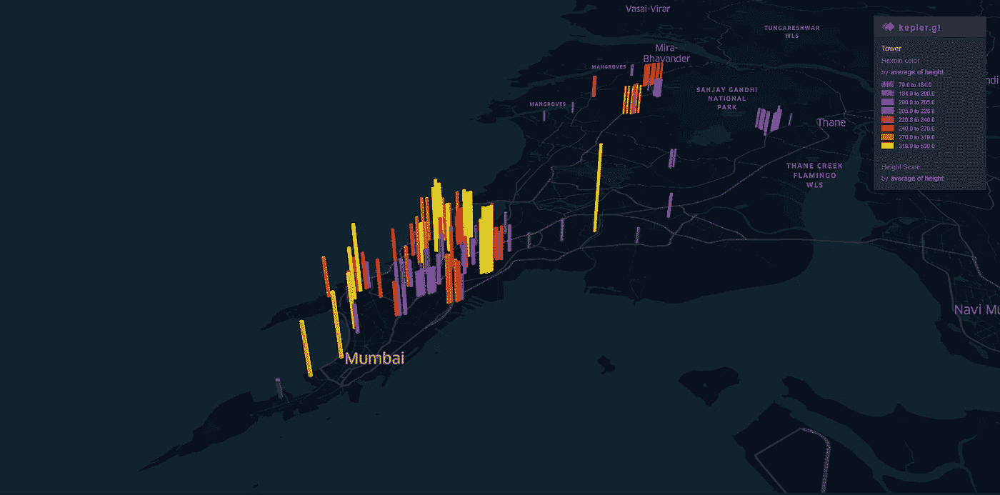

# 如何使用位置分析提高用户获取和转化

> 原文：<https://towardsdatascience.com/how-to-improve-user-acquisition-conversion-using-location-analytics-5e1859d4b828?source=collection_archive---------59----------------------->

## 地理空间分析和洞察

## 对于“位置”至关重要的基于 app 的交付+物流+移动公司。

[来源](https://medium.com/@benjaminjiang/playing-with-ubers-kepler-db394e92ba6f)

一家基于应用程序的送货公司可以随时将用户通过应用程序订购的任何东西送到用户的位置。按需公司，如食品配送公司、电子商务公司等供应链公司、超本地配送公司和移动公司都属于这一类别。

所有这些公司都有一个共同点:它们都在地面上运营和移动资产。因此，*位置*作为一个包含在策略和决策中的参数变得非常重要。

但是，我们如何利用位置分析来增加用户的获取、转化和保留呢？信不信由你，关于这些指标的地理模式可以告诉我们很多关于我们的业务和用户的信息。例如:

> 不是每个安装你的应用的人都使用它或者打开你的应用订单。在这种情况下，是否存在客户流失密度非常高的位置？

在这篇文章中，我们将讨论如何使用位置分析来了解如何提高我们的用户获取、转化和保留。

资料来源:优步

# 案例 1:用户获取

在已经有需求的地方获取用户将有助于我们降低 CAC(客户获取成本)。因此，在选择下一个扩张地点时，一个很好的问题是:

> 在应用程序安装、搜索、订单等方面，我已经看到很多潜在需求的位置在哪里？？

我们可以利用这种洞察力来决定我们需要在哪个领域与商店或餐馆建立合作关系，或者在哪里开设新的车辆或充电站，或者在哪个位置提供服务。

同样，如果您是一家拥有大量高级用户的移动公司，您脑海中浮现的下一个问题是:

> 这些电力用户是如何移动的，他们从哪里来，去哪里？

理解这些特征可以决定我们需要加倍关注什么样的位置和用户角色。比如这些用户是上班族还是学生？

[来源](https://dataforgood.fb.com/tools/disease-prevention-maps/)

# 案例二:用户转化

转化的核心是客户流失的事实。今天，当人们做流失分析时，他们只看人物角色和漏斗的步骤。每一个没有转化的用户都是我们眼前的收入损失。

> 然而，分析客户流失发生在哪里是至关重要的，因为这有助于我们确定我们需要在哪里改善运营、提供供应或进行线下营销。

从用户打开应用程序到最终为订单付款，应用程序中有大量的步骤。

**预约乘车:**
输入目的地→搜索最近的自行车→选择自行车→开始行程。

**点菜:**
选择菜系→选择餐厅→选择菜品→结账→付款

例如，我们正在合作的一家食品杂货公司意识到，人们在看到 SLA 后，会从订购流程中大量生产，并且他们意识到他们可以在其他地方获得更好的 SLA！当我们绘制流失数据时，我们注意到一些城市中的高密度集群，团队开始专注于在这些地区提供更多的交付合作伙伴。

群组创建

# 案例三:用户留存

一旦转化了用户，如何确保可重复性和留存率？毕竟，我们都知道，保留是一个公司最重要的指标之一，因为它可以确保稳定的收入。但是，在这个世界上，用户只需点击一个按钮，就可以在多个竞争对手之间切换，而且他们要求最高质量的服务，因此确保留住客户越来越难。

不同的公司有不同的挽留策略。一些公司做向上销售:让用户以更高的频率订购同一目录，而一些公司做交叉销售:让用户订购不同的类别和目录。

> 位置可以帮助留住用户，也可以根据用户的位置和行为推出非常有针对性的促销活动。

例如，让我们回到我们的移动公司的例子。假设我们发现我们最有价值的用户是从宿舍到大学乘坐我们的车辆的学生。我们可以发起一场运动来补贴这些路线！

[来源](http://qutonik.com/keplergeo.html)

户外广告也是一种非常受欢迎的营销策略，用来培养和留住用户，这种策略的成功取决于正确的信息和位置。

# 你如何开始？

[Locale](http://locale.ai/) 是一个位置分析平台，这意味着我们可以将所有数据库和格式的原始纬度数据转换为有意义的见解，以便决策者可以就其地面运营做出非常精确的数据驱动型决策。

网络分析工具已经利用点击流数据帮助你改善了这些指标。然而，对于在地面上有移动资产的公司来说，不从地理空间的角度看问题是非常有害的！让我们更深入地探讨如何使用位置分析来增加用户获取、转化和保留。

## 获得物ˌ获得

需求制图允许您叠加搜索数据并安装可用于分析不同区域的空间和时间趋势的数据。成长负责人可以利用这些见解来确定哪些领域尚未开发，以及不同类别的业务。

## 转换

流失分析有助于您分析不同事件在地理空间上发生的位置，以及人们在非常精细的级别上生产最多的位置。你是否需要开设一个车辆站枢纽来提供更多的站，或者给准备时间最长的餐厅经理打电话，或者做一些线下活动——决定权在你。

## 保留

工作流模块帮助您在达到特定指标和阈值时采取措施。公司利用这一点向他们的用户发送非常有针对性的地理促销信息，或者在他们的 KPI 观察到异常情况时收到警报。

*在* [*场所*](http://locale.ai/) *，我们正在创建通过地理空间分析提高单位经济性、每次交付成本和利用率的公司范例。如果你是一名增长型经理，希望提高用户的获取、保留和转化，请在此处联系我进行演示***或通过*[*LinkedIn*](https://www.linkedin.com/in/aditi-sinha-6b774ba9/)*或*[*Twitter*](https://twitter.com/aditi1002)*联系我。**

**原贴* [*此处*](https://blog.locale.ai/how-to-improve-user-acquisition-conversion-using-location-analytics/) *。**

## *类似阅读:*

* [## 面向有地面业务的运输和移动公司的位置分析

### 供求分析帮助你解码供求之间的差距出现在哪里，什么时候，为什么会出现。每单位的…

blog.locale.ai](https://blog.locale.ai/location-analytics-for-delivery-mobility-companies-with-ground-operations-2/)  [## 在新冠肺炎期间使用 Locale.ai 为您的供应链进行位置分析

### TL；DR:如果你是一家物流或送货公司，我们想帮助你监控和弥补差距…

blog.locale.ai](https://blog.locale.ai/location-analytics-for-your-supply-chain-using-locale-ai/)*