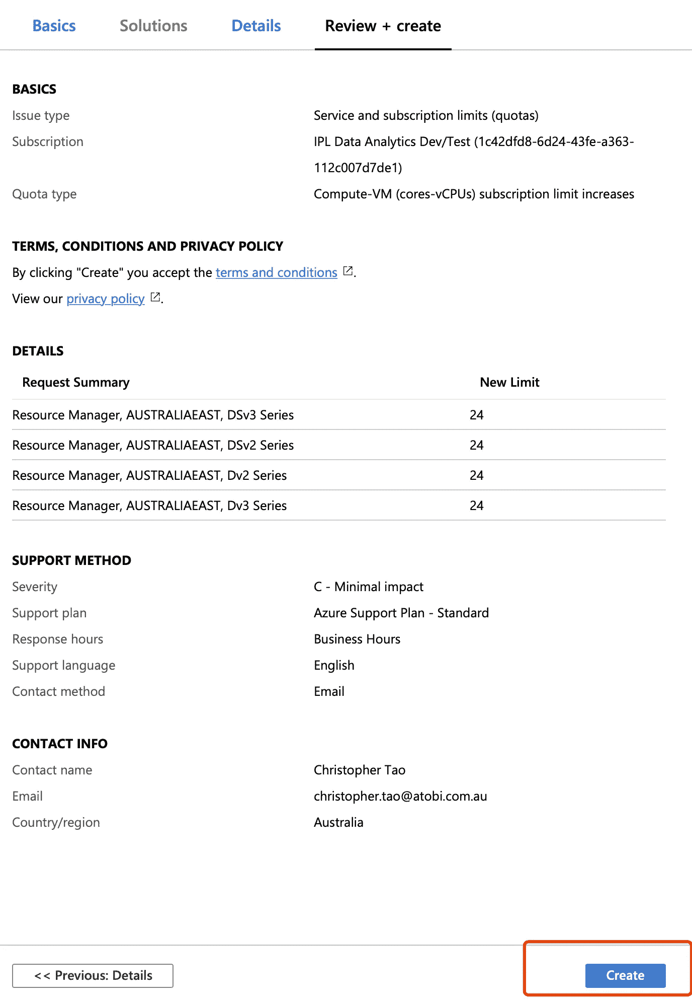

# 如何提高 Azure Databricks 集群 vCPU 内核限制

> 原文：<https://towardsdatascience.com/how-to-increase-azure-databricks-cluster-vcpu-cores-limits-37beb07f3905?source=collection_archive---------15----------------------->

Alexandre Debiève 在 [Unsplash](https://unsplash.com?utm_source=medium&utm_medium=referral) 上的照片

## Azure Databricks“此帐户可能没有足够的 CPU 内核来满足此请求”警告的解决方案

我的客户经常会问我:

> 为什么我的 Azure Databricks 集群受到限制？

具体来说，对于一个默认的 PAYG Azure 订阅，当你想在 Azure Databricks 中创建一个集群时，你可能会被这样一个问题困扰:

> 此帐户可能没有足够的 CPU 核心来满足此请求
> 估计可用:10，请求:**

如下图所示。

即使您单击链接“了解更多关于 CPU 配额的信息”，该文档中也没有直接的答案。然而，如果你耐心地钻研官方文件，你会发现微软故意为所有 PAYG 订阅默认设置这些配额限制，以避免任何令人震惊的账单。

然而，这对于 Azure Databricks 集群来说非常不方便。vCPU 核心的数量被限制在 10 个，这也限制了 Azure Databricks 的能力。在大多数情况下，集群通常需要多个节点，每个节点可能至少有 4 个内核运行(推荐的工作虚拟机是 DS3 v2，它有 4 个虚拟内核)。

因此，集群将总是被限制为只有一个节点在运行，这变得毫无用处，因为 Spark 需要它的分布式特性来加速计算。请注意，如果我们选择“与 worker 相同”，驱动程序节点将需要另外 4 个内核。因此，发生了以下情况:

*   驱动节点(4 核)+1 *工作节点(4 核)= 8 核< 10 cores limitation
*   Driver node (4 cores) +2 * Worker node (8 cores) = 12 cores > 10 核限制**(不允许)**

我们必须增加限制，数据块才能按预期运行。

解决这个问题的方法是增加配额，这并不复杂，但是我发现在官方文档页面上并没有直接说明。现在，我将演示如何增加配额和消除约束。

# 增加配额的步骤

1.  进入 Azure 门户>点击搜索资源字段>输入“帮助”>选择“帮助+支持”

2.在左侧导航中，选择“**新支持请求**”。然后，在右侧窗格的“**基础**选项卡中，

*   **发行类型**:选择“服务和认购限额(额度)”
*   **订阅**:选择您的订阅
*   **配额类型**:选择“计算-虚拟机(核心-虚拟 CPU)订阅限额增加”

选择所有必填字段后，点击“**下一步:解决方案> >** ”。请注意，对此不会有任何“解决方案”，因为它需要一个支持人员来审查您的请求并手动批准它。所以“**解决**选项卡将被跳过，直接跳转到“**详细信息**”。

3.在“**详细信息**选项卡中，单击链接“**提供详细信息**”将“**配额详细信息**”刀片窗口移至右侧。然后，在窗口:

*   **部署模式**:选择“资源管理器”。
*   **位置**:选择您的位置。请注意，您可以一次请求增加多个地点的配额。
*   **类型**:选择“标准”。
*   **标准**:选择要增加配额的虚拟机系列。请注意，您可以一次为多个虚拟机系列请求配额增加
*   **新 vCPU 限额**:输入您想要增加的新配额

填写完所有要求的信息后，点击**保存并继续**。

4.现在，请求的配额增加显示在“**请求摘要**”中。还有一些其他需要填写的信息。根据自己的喜好输入即可，然后点击“**下一步:审核+创建> >** ”。

5.审核一切输入完毕后，点击**创建**创建该票。

## 来自 Azure 支持的响应

根据您选择的“严重程度”，工作人员会及时与您联系。通常，配额增加会在没有任何问题的情况下获得批准，随后会收到支持团队的电子邮件，以便在关闭票证之前进行确认。

# 总结和提示

[塔达斯·萨](https://unsplash.com/@stadsa?utm_source=medium&utm_medium=referral)在 [Unsplash](https://unsplash.com?utm_source=medium&utm_medium=referral) 上拍摄的照片

事实上，微软 Azure 对各种服务设置了巨大的配额限制。您可以在这里找到详细信息:

 [## Azure 订阅限制和配额— Azure 资源管理器

### 本文档列出了一些最常见的 Microsoft Azure 限制，有时也称为配额。为了学习…

docs.microsoft.com](https://docs.microsoft.com/en-us/azure/azure-resource-manager/management/azure-subscription-service-limits) 

当然，使用我在本文中演示的方法，您不仅可以增加 vCPU 核心的配额，还可以增加上面的官方文档中列出的其他服务配额。

现在，你的 Azure Databricks 集群没有任何限制，但请三思而后行，不要在以后产生令人震惊的账单:)

 [## 通过我的推荐链接加入 Medium 克里斯托弗·陶

### 作为一个媒体会员，你的会员费的一部分会给你阅读的作家，你可以完全接触到每一个故事…

medium.com](https://medium.com/@qiuyujx/membership) 

如果你觉得我的文章有帮助，请考虑加入 Medium 会员来支持我和成千上万的其他作者！(点击上面的链接)