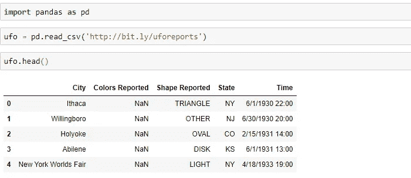
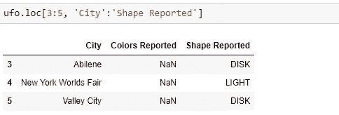

# 如何用 Python 索引 Pandas 中的数据

> 原文：<https://towardsdatascience.com/how-to-index-data-in-pandas-with-python-4437c24ff332?source=collection_archive---------23----------------------->

## 如何在 Python 中使用 loc 和 iloc 方法


伊利亚·巴甫洛夫在 [Unsplash](https://unsplash.com?utm_source=medium&utm_medium=referral) 上的照片

## 介绍

为熊猫的数据帧建立索引是一项非常重要的技能。索引仅仅意味着在数据帧或系列中选择特定的行和/或列。在本教程中，我们将介绍 loc 和 iloc 方法，这是在 pandas 中索引数据帧的两种最常见的方法。我将使用在 jupyter 笔记本上[这里](http://bit.ly/uforeports)找到的 ufo 目击数据集。

在我们开始之前，让我们将数据读入数据帧，看看 ufo 数据帧的前 5 行:



我们 ufo 数据帧的前 5 行

让我们看看关于我们的数据框架的其他一些信息:


*我们使用 shape 和 columns 属性分别获取数据帧的形状(行数、列数)和列名。*

# 锁定方法

索引数据帧最通用的方法可能是 [loc](https://pandas.pydata.org/pandas-docs/stable/reference/api/pandas.DataFrame.loc.html) 方法。loc 既是 dataframe 又是 series 方法，这意味着您可以对这些 pandas 对象中的任何一个调用 loc 方法。当在 dataframe 上使用 loc 方法时，我们使用以下格式指定我们需要的行和列:data frame . loc[指定的行:指定的列]。有不同的方法来指定我们想要选择的行和列。例如，我们可以传入单个标签、标签列表或标签数组、带标签的切片对象或布尔数组。让我们来看一下这些方法！

## 使用单一标签

我们可以指定我们想要的行和/或列的一种方法是使用标签。对于行，标签是该行的索引值，对于列，列名是标签。例如，在我们的 ufo 数据帧中，如果我们只想要第五行以及所有的列，我们将使用如下:

```
ufo.loc[4, :]
```


单一标签

因此，我们通过使用特定行的标签(即 4)来指定我们想要的行，因为我们想要所有的列，所以我们只需使用冒号。

*注意:我们可以省略冒号，我们会得到相同的输出，但是，为了代码可读性，最好保留冒号，以明确显示我们需要所有列。*

## 标签的列表或数组

假设我们需要多行和/或多列。我们如何指定它？使用标签，我们可以输入一个标签列表，或者使用类似于你可能熟悉的切片符号。

让我们从**标签列表**开始:


标签列表

*注意我们如何用标签列表指定行和列标签。*

[](https://betterprogramming.pub/display-progress-bars-using-tqdm-in-python-c81484be9390) [## 在 Python 中使用 tqdm 显示进度条

### 使用流行的 Python 包添加智能进度条

better 编程. pub](https://betterprogramming.pub/display-progress-bars-using-tqdm-in-python-c81484be9390) 

## 切片对象

我们也可以使用**切片符号**，格式如下:**开始标签:停止标签**。然而，与使用带列表或字符串的切片标记相比，**开始**和**停止标签都包含在我们的输出中，如下所示:**



带标签的切片对象

*注意行标签 3、4 和 5 是如何包含在我们的输出数据帧中的。还要注意 City、Colors Reported 和 Shape Reported 列是如何包含在内的，即使我们使用 slice 对象停止在 Shape Reported。记住，ufo.columns 返回了一个列表，其顺序为城市、报告的颜色、报告的形状、州和时间。我们包括从城市标签到形状报告标签的所有内容，其中还包括颜色报告标签。*

[](/a-skill-to-master-in-python-d6054394e073) [## 如何在 Python 中分割序列

### 了解如何在 Python 中分割列表和字符串

towardsdatascience.com](/a-skill-to-master-in-python-d6054394e073) 

## 布尔数组

最后，我们可以使用一个布尔值数组。但是，这个布尔值数组的长度必须与我们使用它的轴的长度相同。例如，根据我们上面使用的 shape 属性，我们的 ufo dataframe 的形状为(18241，5)，这意味着它有 18241 行和 5 列。因此，如果我们想使用一个布尔数组来指定我们的行，那么它需要有 18241 个元素的长度。如果我们想使用一个布尔数组来指定我们的列，它需要有 5 个元素的长度。创建这个布尔数组最常见的方法是使用条件。

例如，假设我们希望只选择包含阿比林的行，该城市是 ufo 目击事件发生的城市。我们可以从以下情况开始:

```
ufo.City == ‘Abilene’
```


注意这是如何返回长度为 18241 并且由布尔值(真或假)组成的熊猫序列(或类似数组的对象)的。这是我们需要使用这个布尔数组来使用 loc 方法指定我们的行的值的确切数目。想象你把这一系列真值和假值覆盖在我们的 ufo 数据帧的索引上。只要这个序列中有一个真的布尔值，这个特定的行将被选中并显示在我们的数据帧中。在这里，我们可以看到索引或标签 3 为真(在第 4 行)，这意味着一旦我们使用 loc 方法使用这个布尔值数组，我们将看到的第一行是标签为 3 的行(或 ufo 数据帧中的第 4 行)。

```
ufo.loc[ufo.City == ‘Abilene’, :]
```


阿比林的不明飞行物目击事件

这正是我们所看到的！我们已经使用长度等于原始数据帧中的行数的布尔值数组指定了我们想要的行。

请记住，我们可以组合这些不同的指定行和列的方法，这意味着我们可以对行使用一种方法，对列使用另一种方法。例如:

```
ufo.loc[ufo.City == ‘Abilene’, ‘City’:’State’]
```


*注意我们如何使用返回布尔值数组的条件来指定行，以及如何使用标签来指定列的切片对象。*

[](/two-ways-to-create-tables-in-python-2e184c9f9876) [## 在 Python 中创建表的两种方法

### Python 中制表和熊猫数据帧函数的性能比较

towardsdatascience.com](/two-ways-to-create-tables-in-python-2e184c9f9876) 

# iloc 方法

[iloc](https://pandas.pydata.org/pandas-docs/stable/reference/api/pandas.DataFrame.iloc.html) 方法也是数据帧和序列方法，可用于索引数据帧(或序列)。iloc 中的 I 代表整数，因为我们使用基于行和列位置的基于整数位置的索引，而不是标签。就像使用 loc 方法一样，我们可以输入一个整数或整数列表、一个带有整数位置的 slice 对象或一个布尔数组。让我们来看一下 loc 和 iloc 方法之间的一个关键区别:

在我们的 ufo 数据帧中，我们没有改变索引，所以数据帧的默认索引只是我们行的整数位置。但是，让我们尝试使用 slice 对象通过 iloc 方法来指定我们的行:

```
ufo.iloc[3:5, :]
```


请注意，在 iloc 方法中使用 slice 对象时，停止整数位置不包含在我们的数据帧中。所以我们只能看到第 3 行和第 4 行，而看不到第 5 行。这与 loc 方法形成对比，在 loc 方法中，开始和停止标签都包含在我们的数据帧中。

让我们使用 iloc 方法来指定我们想要的列:

```
ufo.iloc[3:5, 1:3]
```


*如果我们查看数据帧的列作为参考，我们可以看到我们正在从索引 1(或报告的颜色)到索引 2(报告的形状)对列进行切片。我们不包括站点的索引，在本例中，State 的值为 3。*

注意:我们可以为 loc 或 iloc 方法使用一个可调用的函数，返回一个有效的索引输出(我们上面讨论的任何输入)。然而，我们将把它留到另一个教程中。

本教程中使用的所有代码都可以在这里看到:

本教程中使用的所有代码

[](/json-and-apis-with-python-fba329ef6ef0) [## 使用 Python 的 JSON 和 API

### 使用 Python 的 JSON 和 API 介绍

towardsdatascience.com](/json-and-apis-with-python-fba329ef6ef0) 

如果你喜欢阅读这样的故事，并想支持我成为一名作家，考虑注册成为一名媒体成员。每月 5 美元，你可以无限制地阅读媒体上的故事。如果你用我的 [*链接*](https://lmatalka90.medium.com/membership) *注册，我会赚一小笔佣金。*

[](https://lmatalka90.medium.com/membership) [## 通过我的推荐链接加入媒体——卢艾·马塔尔卡

### 阅读卢艾·马塔尔卡的每一个故事(以及媒体上成千上万的其他作家)。您的会员费直接支持…

lmatalka90.medium.com](https://lmatalka90.medium.com/membership) 

## 结论

在本教程中，我们学习了如何使用 loc 和 iloc 方法索引数据帧。我们学习了 loc 方法如何主要处理行和列的标签，而 iloc 方法处理整数位置。我们还看到了如何使用布尔数组来索引或指定我们的行和列。