# 如何使用 IBM Watson NLC 服务推断预训练的图像分类器

> 原文：<https://towardsdatascience.com/how-to-inference-a-pre-trained-image-classifier-using-watson-autoai-a63894a06458?source=collection_archive---------30----------------------->

## 使用预先训练的模型进行推理

约翰·西门子的图片——Unsplash

## 分类

图像分类是属于数据科学和机器学习的另一项任务，其中我们为每个图像分配一个或多个类别或种类。

## 推理

在 IBM Watson 上创建一个项目。您应该能够看到您的项目列表。单击其中一个项目开始。

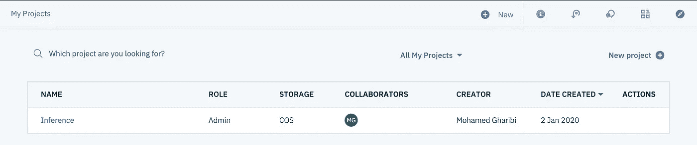

单击“添加到项目”以添加服务

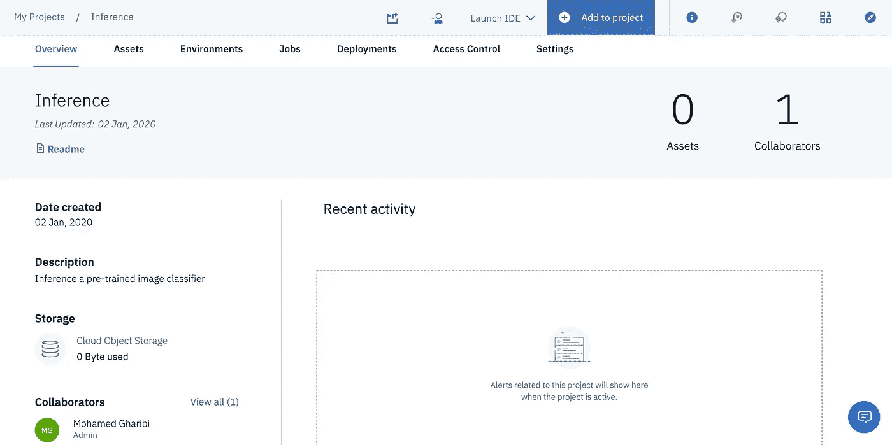

选择*【视觉识别模式】*

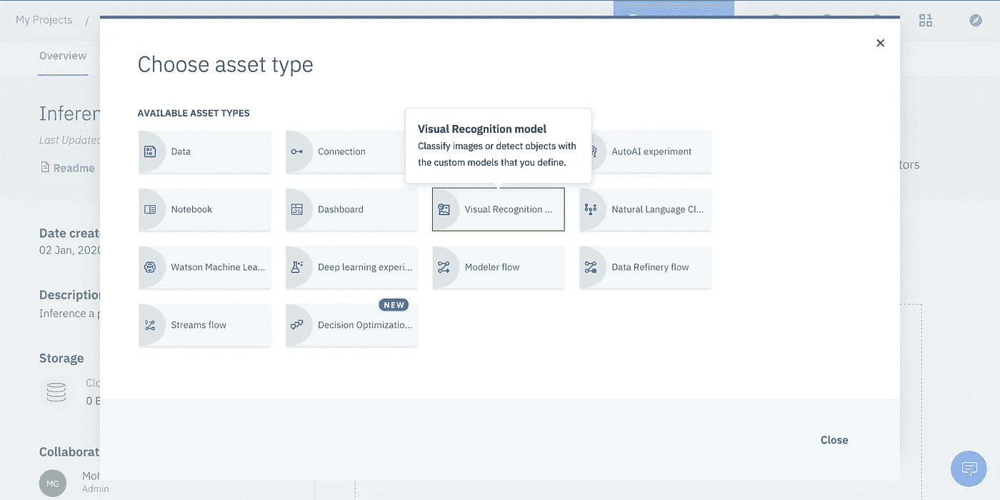

如果这是您的第一次，那么您将被重定向到创建服务。点击*【此处】*

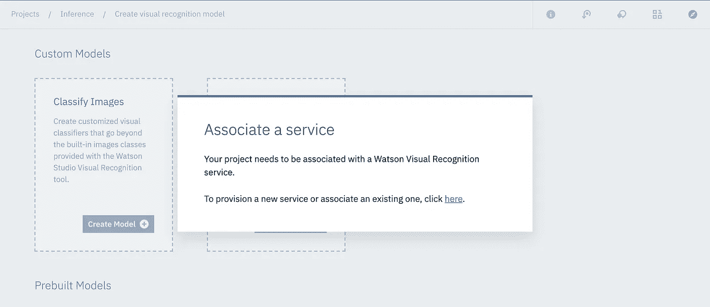

您可以选择一个以前的服务(如果有)或创建一个新的服务。

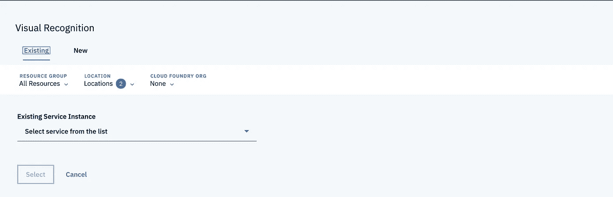

选择一个符合你需求的计划。

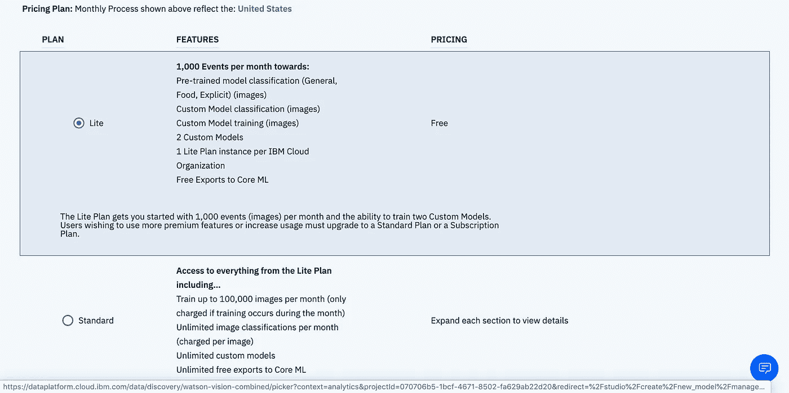

您可以选择更改区域、计划、资源组等。我更喜欢默认值。

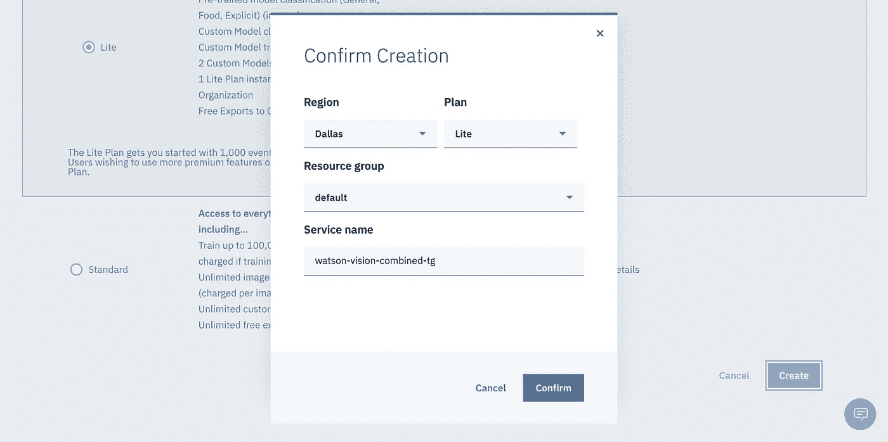

之后，您应该能够看到三种不同的训练模型，您可以使用。

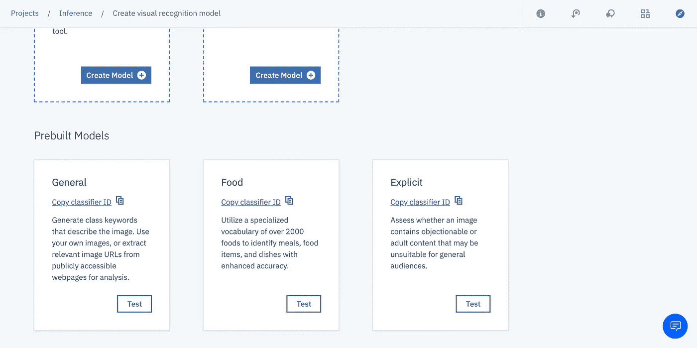

先说*“将军”。*点击*“常规”后，*会看到三个选项卡。概览将显示型号信息。

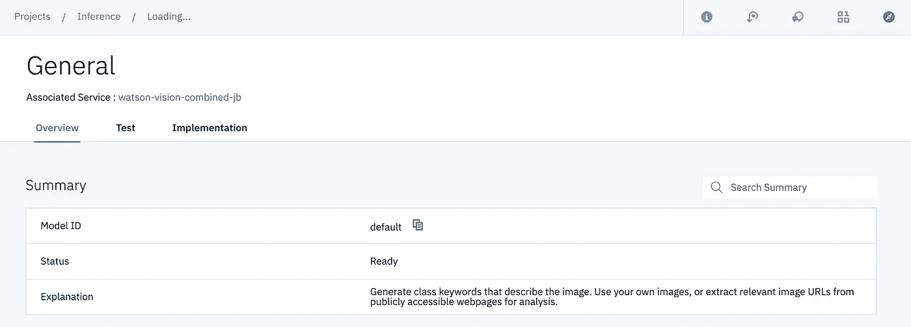

点击*“测试”*开始推理模型

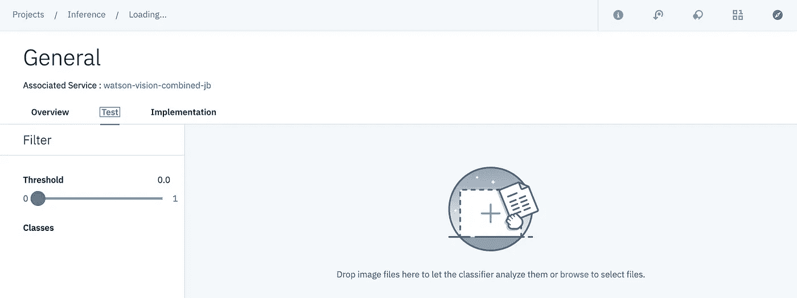

拖放你想要推论的图像。每幅图像都将显示其相关类别及其置信度得分。

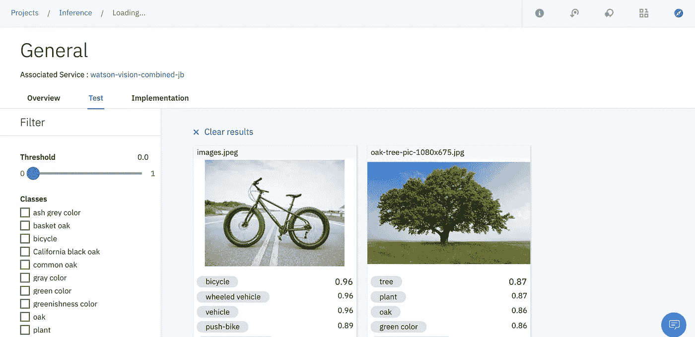

点击*“实现”*，将提供几种使用终端远程推断您的模型的方法。

让我们试试*【食物】*模式。

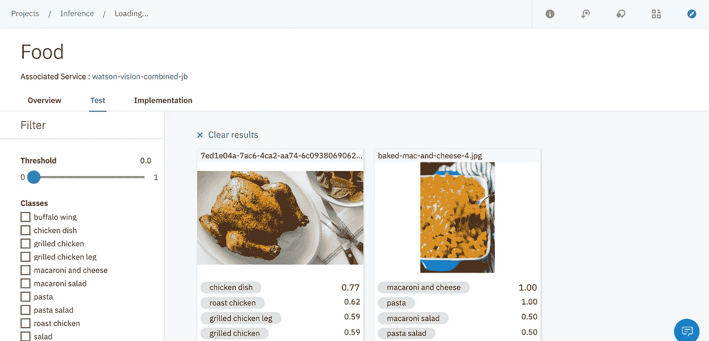

*【显式】*模型预测

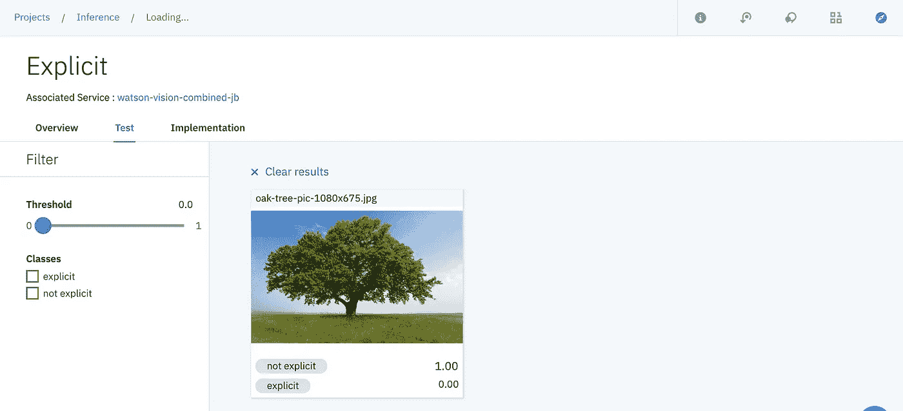

## 资源

*   [IBM Watson AutoAI 文档](https://dataplatform.cloud.ibm.com/docs/content/wsj/analyze-data/autoai-overview.html)
*   Youtube 上的 IBM 沃森学习中心