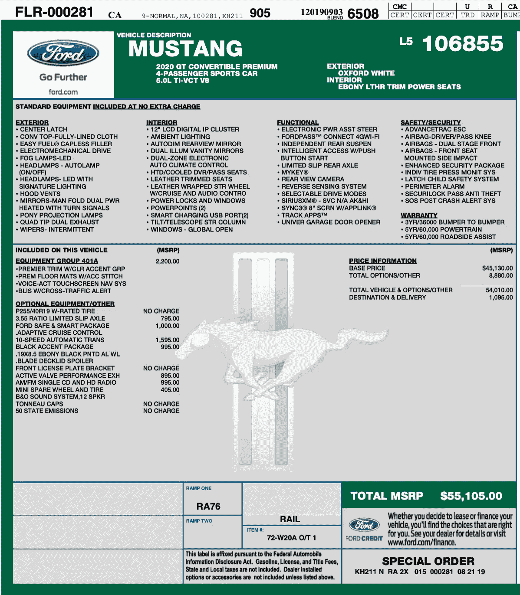
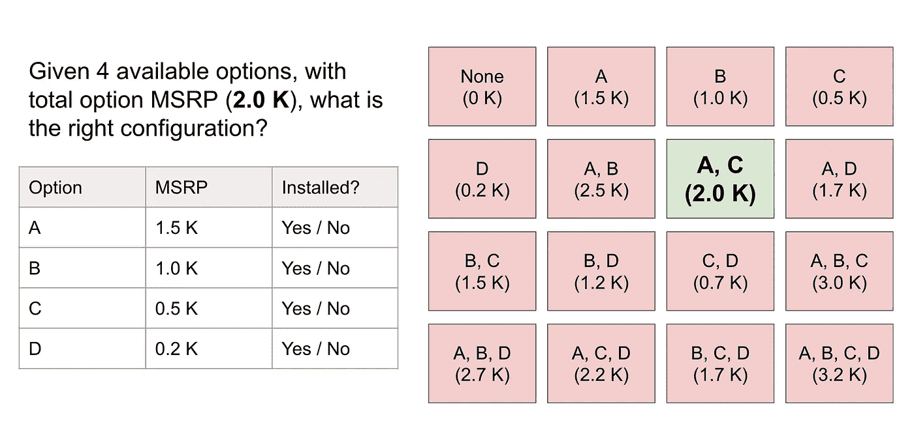
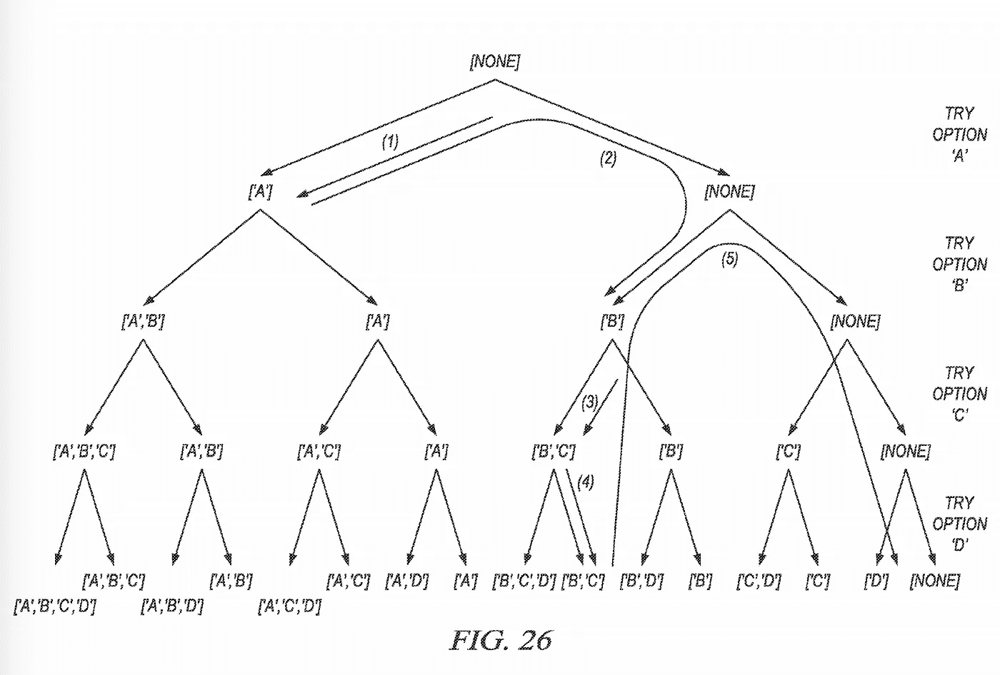
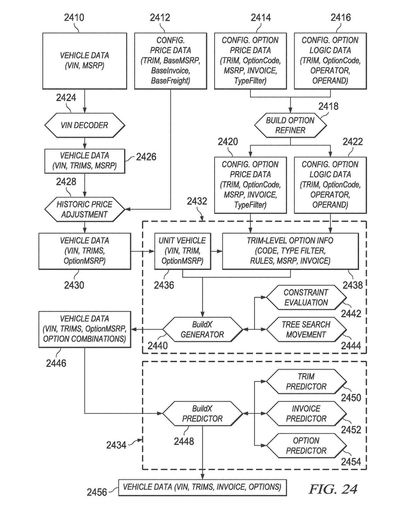

# 如何在数据科学中创新

> 原文：<https://towardsdatascience.com/how-to-innovate-in-data-science-2d166d64df31?source=collection_archive---------20----------------------->

## 分享我对创新的想法，以及 2014 年最喜欢的一个数据科学项目

由 [Unsplash](https://unsplash.com/s/photos/idea?utm_source=unsplash&utm_medium=referral&utm_content=creditCopyText) 上的[absolute vision](https://unsplash.com/@freegraphictoday?utm_source=unsplash&utm_medium=referral&utm_content=creditCopyText)拍摄

世界上每天都有数百万的创新发生。创新创造新产品、服务、商业模式、技术，甚至新的科学领域；如果没有创新，我们将生活在一个完全不同且无聊的地方。创新在数据科学领域也至关重要:数据科学家将数据转化为可操作的产品/见解，这种转化不断要求人们超越现状进行创新。

> **创新是**生产或采用、吸收和利用**一种在经济和社会领域中具有附加值的新奇事物**；产品、服务和市场的更新和扩大；开发新的生产方法；以及建立新的管理系统。([维基百科](https://en.wikipedia.org/wiki/Innovation#Definition))

同时，创新不是自然的:是的，我们都有自己的观点和想法，但是，创新是一种“增值的新奇事物”；因此，“新奇”本身并不等于“创新”。那么，创新有哪些类型，我们怎样才能把创新发展成一种技能呢？

# 两种类型的创新

在我看来，创新有两种类型:

*   类型 1。找出更好的替代方案来解决现有问题
*   类型 2。将现存的问题重新定义成一个更有意义的问题，用任何方法解决它

这里有一个例子可以更好地说明这些概念。假设:你想要一台计算能力更强的计算机，一个已知的问题是 CPU 速度慢。第一类创新是通过将半导体制造尺寸从 800 纳米降低到 130 纳米，再降低到 14 纳米来提高 CPU 速度，现在它在 2020 年接近 5 纳米！所以计算能力也相应增加。第二类创新是 a)支持多核 CPU 架构，或者 b)将 GPU 集成为协处理器，以加速通用科学和工程计算的 CPU。最终目标是一样的:更强的计算能力:而类型 1 创新专注于一种已经定义好的方式，类型 2 创新扩展到替代路径。

两种类型的创新都创造商业价值，然而，它们通常与不同的观点相关联。

*   第一类创新需要一个有很强领域专业知识的人，这样才能推进技术边界；更集中的观点。专注于全合成的大学顶级研究实验室( [wiki](https://en.wikipedia.org/wiki/Total_synthesis) )可以很好地代表这种创新。
*   第二类创新要求一个人对相关的知识空间有全面的了解，并有将点与点连接起来的心态；更全面的观点。许多传奇的商业故事，如 iPhone 的诞生，都可以用这种创新类型来描述。

现在我们定义了创新的类型，接下来的问题是:如何主动发展创新技能？有没有一个公式，像“A + B =创新”？我不想直接给出我的主观答案，我想先分享一个故事:这是我第一份工作中最喜欢的项目之一，我认为这比干巴巴的声明更有背景。

# 关于 BuildX 的故事

## 背景

我在 2013 年 8 月开始了我的数据科学职业生涯，我的第一家公司运营着一个汽车定价和信息网站。2014 年，该公司启动了一项战略计划，其成功取决于获取所有库存车辆的详细配置数据，而这些数据是不可用的。例如，给定一个 VIN 号码“1FATP8FF4L5106855”，根据 VIN 字符串模式，我们知道它是一辆福特野马，2020 GT 敞篷高级版；然而，汽车上安装了许多选项，如“福特安全和智能包”，这些选项无法从 VIN 图案本身提取:尽管这是该公司最需要的详细车辆选项配置。

VIN 的半个车窗贴纸:1FATP8FF4L5106855。来源:【http://vin.maniacs.info/FordSticker.html? title=1FATP8FF4L5106855

产品团队开始通过与第三方数据提供商和制造商(如福特、丰田等)的合作，努力获取此类信息。数据科学团队参与评估数据质量、评估可用性，并就新获取的数据是否充分涵盖了我们的库存提供见解。很明显，数据科学团队起到了支持的作用，这从项目的性质来看是可以理解的。该项目的目标是实现高于某个阈值(例如 80%)的数据覆盖率，以便可以构建其他下游产品。不幸的是，几个月过去了，团队开始意识到数据覆盖率仍然远远低于阈值。

作为团队中的一名数据科学家，我学到了很多关于业务如何运作的知识，甚至扮演了一个支持角色，并且在数据评估和集成方面与多个团队合作是一次很棒的经历。然而，我有一种感觉，数据科学可以提供一些额外的东西。

## 用虚拟解决方案重新定义问题

我想到的一个想法是:我们花了这么多精力购买数据，有可能在内部生成吗？鉴于当时我在公司的任期有限(不到 1 年)，我决定检查一下之前是否有这种想法。这是一次定期的同步会议，产品总监刚刚分享了数据采集的状态，以及修改我们目标的潜在需求。在会议结束时，我非常谨慎地提出了我的问题:“这可能有点天真，但是，有可能在内部生成完整的车辆信息吗？”。答案是:“我们考虑过，但是 VIN 不包含那么多信息；你怎么看？”因为我也还没有一个清晰的想法，所以会上没有太多的讨论；但至少我知道这是一个未触及的想法，我要求一周的时间来探索这个方向。

一周的时间肯定非常紧张，所以我的第一个方法是寻找可以立即提高数据覆盖率的业务逻辑。经过一番挖掘，我找到了一个“解决方案”:如果我们知道某个特定的车辆型号根本没有可用的选项，那么我们可以声明我们知道这个车辆的完整配置。这在某种意义上感觉像是欺骗，然而，从产品的角度来看，知道我们有完整的配置是有帮助的，即使配置什么也没有。

> 我的论点:虽然它什么都没有，但现在我们知道了这个事实；这很有价值。

接下来的一周，我与团队分享了这一见解，每个人都很高兴看到这一简单探索带来的“免费”覆盖率提升。然而，我们也知道这不是一个通用的解决方案，只有这么多的车辆型号没有可用的选项，我们不能将其扩展到所有的车辆。所以我要求额外的两周时间来寻找一个更具可扩展性的解决方案，并且得到了批准:这个“虚拟解决方案”给我带来了更多的时间:)

## 证明概念是一个简单但可扩展的解决方案

事实是:除非我们有一些额外的信息，否则没有办法完全根据 VIN 号来识别所有的车辆选项。因此，我深入研究，发现了一些有用的东西:每个 VIN 都与一个固定的制造商建议零售价(MSRP)相关联，同时，每个车型也有一个固定的基础版本 MSRP，因此“VIN MSRP”和“基础 MSRP”之间的差异是“总选项 MSRP”，这将是我们所有库存车辆的额外信息。

现在让我们考虑以下情况:你有一辆汽车，VIN 显示 22K 的建议零售价，车辆型号(例如丰田凯美瑞 le)有 20K 的基本建议零售价，现在所有增加的选项都有 22K-20K=2K 的建议零售价。假设该车辆模型有 4 个可用选项:它们的 MSRP 标签分别为 1.5K、1.0K、0.5K、0.2K。汽车上安装的正确选项是什么？

给定 4 个可用选项的情况，找出答案是非常简单的:我们只需列举所有可能的选项组合，并检查每个组合是否具有相同的总选项 MSRP。如果它是唯一的匹配，我们可以声称该选项组合是正确的车辆配置。

您可能会立即看到这种方法有两个挑战:1 .同一个 MSRP 可能有多个配置匹配，那么如何找到合适的呢？2.选项组合随着可用选项#呈指数增长，这可能是一个大问题。然而，我可以执行以下两条规则来绕过挑战:1 .如果只有一个配置与 MSRP 匹配，则仅声明正确的配置；2.设置超时阈值(例如，每个 VIN 30 秒)以确保计算按时完成。现在，我们有了解决方案！该解决方案非常简单，可扩展至所有车辆库存。虽然我们没有完全解决上述已知的挑战(我们只是绕过它们)，但这已经比我们的“虚拟解决方案”前进了一大步。

我们很快测试了这个想法，事实上，覆盖范围有了很大的提高；但是，我们离目标还有差距。这主要是因为许多车型有 30 ~ 60 种选择，极端情况下可达 100 种。在 40 个可用选项的情况下，需要评估 2⁴⁰配置，这超过一万亿个配置！许多 vin 达到超时阈值，并且根本不返回任何选项组合。现在我们知道指数级增长的计算成本是一个限制因素，并且根据定义这是一个 NP-hard 问题，我们应该如何进一步进行？

## 为可扩展的解决方案开发高级算法

当面临如此严峻的挑战时，我会在圣莫尼卡海滩外面散步，让新鲜空气清理我的思绪。由于我在业余时间上了各种课程，有一门恰好是离散优化，一个算法跳入我的脑海:[约束编程](https://en.wikipedia.org/wiki/Constraint_programming)。

关于约束编程的高级概念是，您不需要穷尽搜索所有的配置空间。您可以构建约束，以便某些配置永远不会被访问。例如，如果总选项 MSRP 为 1K，则不可能添加 1.5K 选项，因此没有必要评估任何具有 1.5K 选项的配置；另一方面，如果总选项 MSRP 是 10K，一个选项“A”是 5K，所有其他选项 MSPR 加起来是 8K，那么你知道选项“A”肯定在这个车辆上，没有“A”的任何配置都不必考虑。

以下可视化说明了这样一个事实，即约束编程算法通过避免进入违反约束的节点，充当搜索所有配置(表示为二叉树)的智能向导。在这个例子中，配置空间具有 2⁴ = 16 个组合，并且该算法仅需要 5 次移动。

在 Python 的帮助下，我把算法编码成了一个包(一个最小可行的数据产品)，把一个现有车辆库存的样本注入到流程中:有效！现在我有充分的信心，我们可以达到覆盖目标！这对团队来说是一个大新闻，每个人都期待着算法的生产:现在，项目从“业务开发驱动”转变为“数据科学驱动”，我们得到了构建数据产品的全面支持。

## 为了推广我们的成果，我将其命名为“BuildX 项目”

构建一个数据产品有多层复杂性:算法只是其中的一部分。最终，我们交付了它。为了向外部团队推销这个数据产品和我们的成果，我给它起了个名字:“BuildX 项目”。“构建”部分代表了我们正在重建车辆配置的事实，而“X”部分编码了所有的算法复杂性，并使其感觉神秘而强大。人们可以在我们提交的[专利](http://www.freepatentsonline.com/y2015/0363838.html)中看到关于该架构的更多细节，下面的图表显示了高级系统架构。

我们的合作团队喜欢这个名字！在他们倡导数据产品的力量的帮助下，我们将代码与其他后端系统集成，最终，团队实现了数据覆盖的目标。这个故事有一个快乐的结局。

# 创新的公式

回顾过去，一切看起来都是如此精心策划:创新就发生在那里！“为什么”的问题，简单的解决方案，然后神奇的海滩漫步导致了“可扩展的解决方案”。然而，在发生这种事情的时候，感觉很没有计划:我问了几个“为什么”的问题，因为我对现有的系统不太了解；我碰巧早几个月上了[离散优化课](https://www.coursera.org/learn/discrete-optimization)，因为它刚刚在 Coursera 上发布；我开始有规律的沙滩漫步是因为公司组织了一次“散步比赛”(而我没有赢…)。那么这些随机的东西，一旦放在一起，是如何变成“增值”创新的呢？有没有一个创新的秘密公式，不知何故我准确地执行了它？

不幸的是，创新没有神奇的公式，*没有确定的公式。从积极的一面来看，我发现了几个有助于促进创新的元素:有了这些元素，你就更有可能给项目带来创新。这些要素是:*

*   **挑战现状，恭敬地**。这通常与“为什么”这个问题相吻合:不管现状的解决方案有多好，在问了几个“为什么”之后，你会发现有些地方可以改进。
*   **不断学习**。你舒适区之外的任何知识都值得学习:深入某个领域有助于第一类创新，拓宽相关领域有助于第二类创新。
*   **把点点滴滴**。“点”指任何知识、经验、教训。放松你的思维，让你的大脑把相关的点联系在一起。一旦它们连接起来，奇迹就会发生。

为了结束这个故事，我想再分享一个关于创新的“不确定性”本质的评论:你可能会问很多很棒的“为什么”问题，学习 10+门与你的领域相关的课程，并不断思考如何将“点”与特定项目联系起来。然而，该项目只是让所有组件运行良好，你不能带来革命。这会是一个悲伤的创新故事吗？我不这么认为。尽管成功创新的结果是有回报的，但通往创新的道路才是最重要的。当一个人开始创新，就像在沙滩上散步，你开始环顾四周，突然注意到沙滩上有一个闪亮的物体；你把它捡起来，掸掉灰尘，擦掉污垢，发现它是意想不到的东西。它可能是一颗巨大的珍珠，如果是这样，你真幸运！它也可能是一个漂亮的、形状良好的贝壳，你可以把它装饰在书桌上。偶然发现的时刻会带来更多的快乐，这是创新最令人兴奋的部分；我希望你喜欢。

照片由 [Aaron Burden](https://unsplash.com/@aaronburden?utm_source=unsplash&utm_medium=referral&utm_content=creditCopyText) 在 [Unsplash](https://unsplash.com/?utm_source=unsplash&utm_medium=referral&utm_content=creditCopyText) 上拍摄

*该文章也可在 LinkedIn[https://www . LinkedIn . com/pulse/how-innovate-data science-pan-Wu](https://www.linkedin.com/pulse/how-innovate-datascience-pan-wu/)上查阅