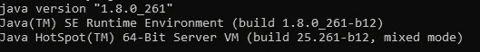
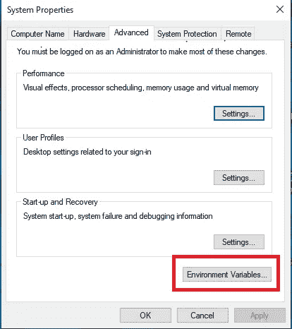
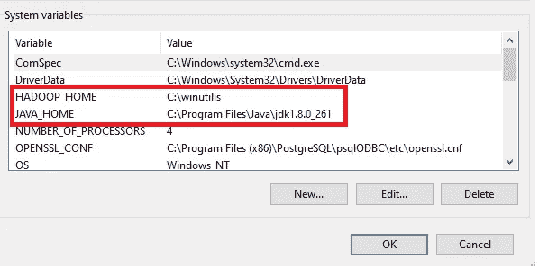
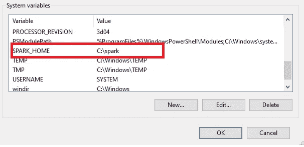
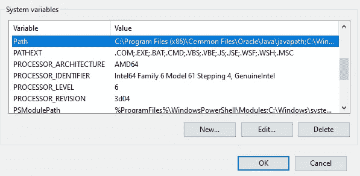
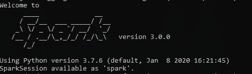

# 如何为 Python 轻松安装 Spark

> 原文：<https://towardsdatascience.com/how-to-install-easily-spark-for-python-d7ca6f5e729c?source=collection_archive---------30----------------------->

## 分三步在 Windows 10 上安装 PySpark


费德里科·贝卡里在 [Unsplash](https://unsplash.com/s/photos/connection?utm_source=unsplash&utm_medium=referral&utm_content=creditCopyText) 上的照片

**简介**

当我们处理大数据时，我们需要更多的计算能力，这可以通过多台计算机的分布式系统来实现。此外，为了有效地融入大数据生态系统，我们还需要一个集群计算框架，允许我们在大型数据集上快速执行处理任务。

两个最著名的集群计算框架是 Hadoop 和 Spark，它们都是免费开源的。

如果要比较 Apache Spark 和 Hadoop，可以说 Spark 在内存上快 100 倍，在磁盘上快 10 倍。

对于 on-perm 安装，Hadoop 需要更多的磁盘内存，Spark 需要更多的 RAM，这意味着建立一个集群可能非常昂贵。

今天，我们可以通过 AWS 和 Azure 提供的云计算服务来解决这个问题。如果您有兴趣了解更多关于它们的信息，特别是像云数据仓库这样的主题，让我向您推荐我的文章，您可以在这里找到。

相反，在本文中，我将向您展示如何安装名为 Pyspark 的 Spark Python API。在 Windows 10 上安装 Pyspark 需要遵循一些不同的步骤，有时我们会忘记这些步骤。所以，通过这篇文章，我希望给你一个有用的指南，让你毫无问题地安装 Pyspark。

**第一部分:检查您的 Java 版本并下载 Apache Spark**

我假设你的电脑上至少有 Python 版本。

所以，要运行 Spark，我们首先需要安装的是 Java。建议有 Java 8 或者 Java 1.8。

因此，打开命令提示符，用下面的命令控制 Java 的版本。如果你有老版本，可以在这里下载[。](https://www.oracle.com/java/technologies/javase/javase-jdk8-downloads.html)

```
Java -version
```

出局:



作者图片

现在，我们必须下载 Spark，您可以在这里轻松找到。以下框架显示了您在站点中看到的步骤。

```
Download Apache Spark1\. Choose a Spark release: 3.0.0(Jun 18 2020)--selected2\. Choose a package type: Pre-built for Apache Hadoop 2.7 --selected3\. Download Spark: [spark-3.0.0-bin-hadoop2.7.tgz](https://www.apache.org/dyn/closer.lua/spark/spark-3.0.0/spark-3.0.0-bin-hadoop2.7.tgz)
```

上面你可以观察到我如何设置我的 Spark 版本。我选择了最近的 Spark 版本和 Apache Hadoop 2.7 的预构建包。

然后在第三步中，我们可以通过点击链接来下载我们的 Spark 版本，这将打开另一个网页，在该网页中，您必须点击建议的第一个下载版本。

下载完成后，将压缩文件解压到名为 **spark** 的文件夹中。记住这个文件夹的路径将在下一部分使用。

**第二部分:下载 winutils.exe 并设置您的环境**

第二步是下载**winutils.exe**你可以在这里[找到](https://github.com/steveloughran/winutils)。我的情况是选择了 hadoop-3.0.0 的版本，我[下载了](https://github.com/steveloughran/winutils/blob/master/hadoop-3.0.0/bin/winutils.exe)。你可以创建一个名为 **winutils** 的文件夹并把它放在那里。

现在，是时候建立我们的环境了。首先要做的是进入 windows 搜索栏，输入**“编辑系统环境变量”**。

去点击**环境变量。**



作者图片

当你将在**系统变量**的组中，创建三个名为 **HADOOP_HOME** 、 **SPARK_HOME** 和 **JAVA_HOME** 的变量。

*   在**HADOOP _ HOME**→放之前创建的位置 **wintulis 文件夹**的路径。
*   在**SPARK _ HOME**→放入你之前创建的 **spark 文件夹**的位置路径。
*   在 **JAVA_HOME** 中→放入你的 JAVA 程序的位置路径。

在下图中，你可以看到如何设置你的变量。



作者图片



作者图片

然后在变量**路径**下面可以看到，我们可以添加以下两条路径:

*   **%SPARK_HOME%\bin**
*   **%JAVA_HOME%\bin**



作者图片

**第三部分:在你的蟒蛇身上运行它，飞到朱庇特**

现在您可以打开 Anaconda 提示符，将目录更改为 **SPARK_HOME** 目录，并键入 **bin\pyspark。**

出局:



作者图片

所以，你准备飞往 Jupyter，用下面的代码尝试 Pyspark。如果没有错误，这意味着您的 Pyspark 已经正确安装。

```
import findspark

findspark.init()
```

**结论**

现在您已经有了 Pyspark，您可以开始通过进行一些数据操作来学习和练习它是如何工作的。如果你在安装上有困难，请随时联系我。

我发出一份期刊简讯。如果你想加入，请点击此链接报名。

除了我的**简讯**，还可以在我的电报群 [**数据科学初学者**](https://t.me/DataScienceForBeginners) **中取得联系。**