# 如何安装 MySQL 并创建雇员示例数据库

> 原文：<https://towardsdatascience.com/how-to-install-mysql-and-create-an-employees-sample-database-80dd9c5d4767?source=collection_archive---------22----------------------->

## 安装数据库以练习 SQL 的分步指南


数据科学家和分析师应该能够用 SQL 编写和执行复杂查询。如果您刚刚开始使用 SQL，或者正在寻找一个沙盒来测试查询，那么本指南就是为您准备的。

有一些很棒的 SQL 资源，比如 [HackerRank](https://www.hackerrank.com/domains/sql) 、 [LeetCode](https://leetcode.com/problemset/database/) 和 [W3Schools](https://www.w3schools.com/sql/) ，但是我认为提高熟练程度的最好方法之一是使用您选择的 SQL 编辑器来练习您自己的数据库。

在本指南中，我们将完成以下步骤:

*   在 macOS 上安装 MySQL
*   添加 MySQL shell 路径
*   创建用户帐户
*   使用雇员数据创建示例数据库
*   编写 SQL 查询

## 什么是 MySQL？

MySQL 是最流行的开源 SQL 数据库管理系统，由 Oracle 公司开发。由
Stack Overflow 进行的 2020 年开发者调查从受欢迎程度方面证实了这一说法，如下所示。


[https://insights . stack overflow . com/survey/2020 #技术-数据库](https://insights.stackoverflow.com/survey/2020#technology-databases)

## 在 macOS 上安装 MySQL

我们将使用位于磁盘映像中的本地包来安装 MySQL 社区服务器 8.0.x。dmg)。

下载。dmg 版本从[这里](https://dev.mysql.com/downloads/mysql/)(找 DMG 存档)。这个版本将初始化数据目录并创建 MySQL 授权表。

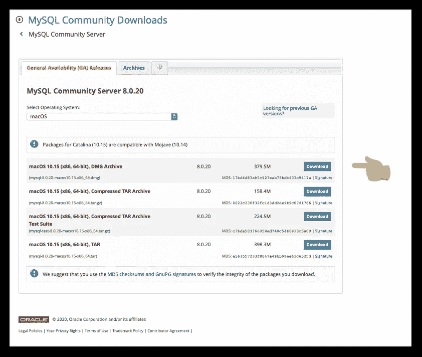

[https://dev.mysql.com/downloads/mysql/](https://dev.mysql.com/downloads/mysql/)

点击`Download`按钮后，你将被带到一个页面，要求你“登录”或“注册”一个免费账户。点击
`No thanks, just start my download`可以绕过。

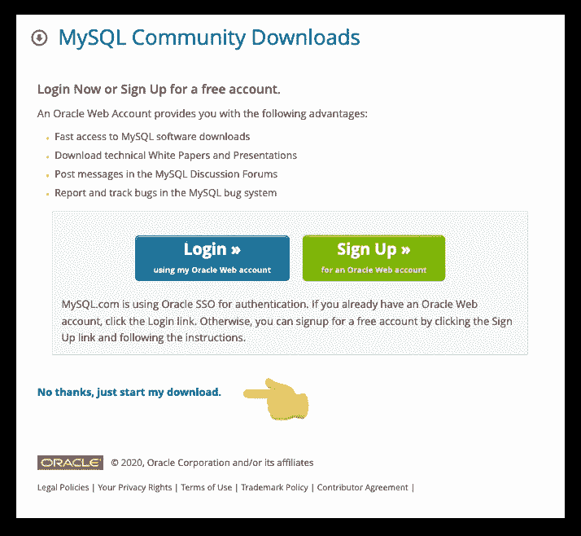

转到下载的文件，`right click`和`Open.`

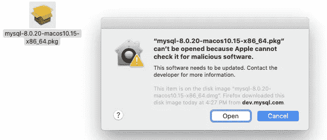

跟着指示走，直到你到达`Configuration.`

对于`Configuration`，选择默认的`Use Strong Password Encryption`。点击[这里](https://dev.mysql.com/doc/mysql-installer/en/server-authentication-method.html)阅读更多关于 MySQL 密码的信息。

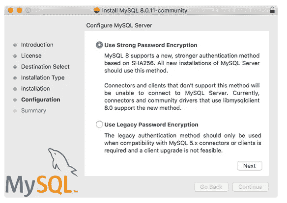

输入`root`用户的密码。root 帐户是默认的超级用户帐户，拥有所有 MySQL 数据库的所有权限。

MySQL 现已安装。如果你打开`System Preferences`，你应该在你的面板中看到 MySQL，如下图所示。

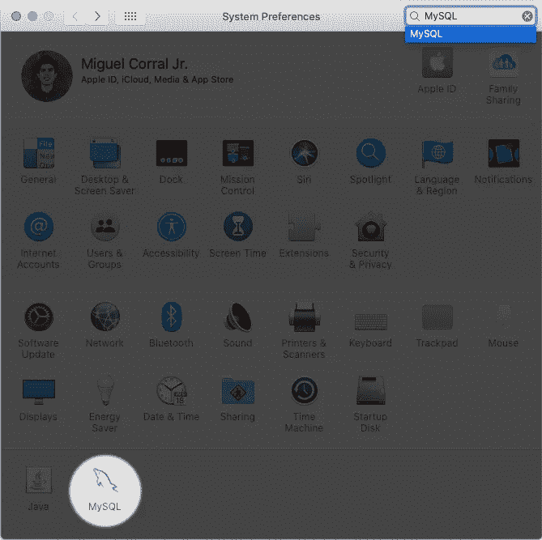

macOS '系统偏好设置'

MySQL 偏好设置面板使您能够在 MySQL 安装的引导过程中启动、停止和控制自动启动。

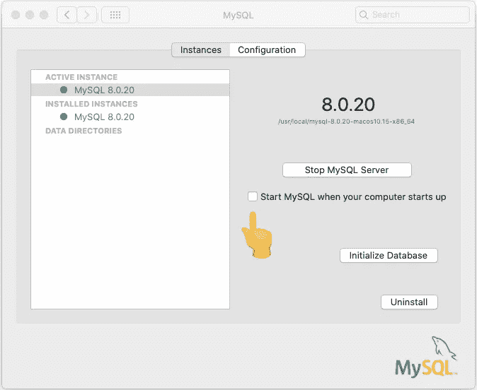

MySQL 偏好设置面板

如果实例是*而不是*已经在运行，打开它并点击
`Start MySQL Server`。绿点表示服务器正在运行。

为了节省内存`Start MySQL when your computer starts up`，我个人没有选中这个框*。*

记得重启后启动服务器就行了。

## 在 macOS 中添加 MySQL Shell 路径

macOS 中用户的外壳路径是文件系统中的一组路径，由此用户有权使用某些应用程序、命令和程序，而无需在终端中指定该命令或程序的完整路径。

以下步骤将使我们能够在命令行(终端)的任何工作目录中输入命令`mysql`。

注意 zsh (Z shell)是 **macOS Catalina** 的默认 shell。如果你在不同的版本上，你可以试着使用下面的 **bash** 命令。

1.  打开终端(`⌘+Space`，输入`Terminal`)
2.  一旦你进入终端，输入`cd`进入主目录
3.  如果你正在使用 **zsh** ，键入`nano .zshrc`T28【如果你正在使用 **bash** ，键入`nano .bash_profile`
4.  复制并粘贴这两个别名:

```
alias mysql=/usr/local/mysql/bin/mysql
alias mysqladmin=/usr/local/mysql/bin/mysqladmin
```

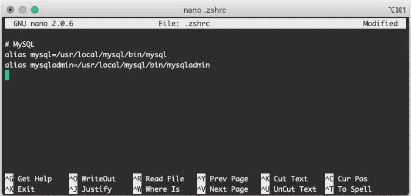

请注意，MySQL 前的井号(#)是注释行

5.保存文件`control + O`，用`Enter`确认，用`control + X`退出。
6。`Quit` ( `⌘+Q`)终端并重新打开它

要测试服务器，请输入以下命令(您需要输入安装 MySQL 时创建的密码):

```
mysqladmin -u root -p version
```

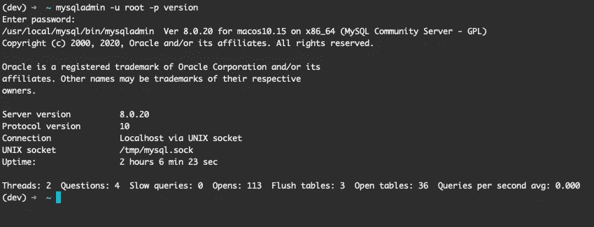

## 创建用户帐户(可选)

您可能不想一直使用 root 帐户。您可以创建各种帐户并授予不同级别的权限。以下是步骤:

以 root 用户身份登录:

```
mysql -u root -p
```

在下面的命令中，用您选择的用户名和密码替换`user`和`password`。我建议您使用与 macOS 系统用户名相同的名称创建一个帐户。

```
CREATE USER ‘user’@‘localhost’ IDENTIFIED BY ‘root-password’;
```

以下语句将授予用户帐户对所有数据库的所有权限。用您选择的用户名替换`user`。使用引号(')。

```
GRANT ALL ON *.* TO ‘user’@‘localhost’ WITH GRANT OPTION;
```

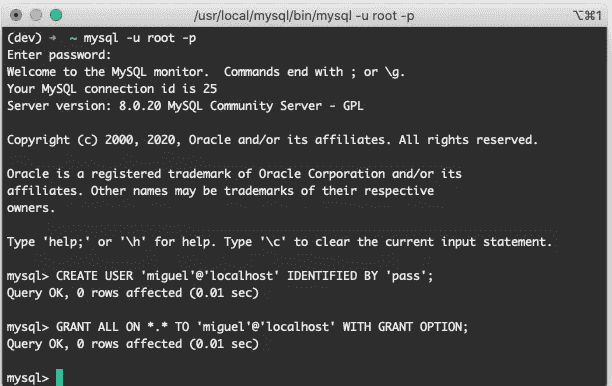

这里有一个示例用户(miguel ),使用密码(pass)创建，并被授予完全访问权限(*。*)

尝试使用新创建的用户登录。首先，键入`QUIT`结束当前会话，并使用新凭证登录。例如:

```
mysql -u miguel -p
```

> 提示:因为‘Miguel’也是我的系统用户名，我可以简单地输入`mysql -p`并省略`-u miguel`部分。

键入`QUIT`，但停留在终端并继续下一部分。

## 创建雇员数据库

雇员样本数据库由帕特里克·克鲁斯和朱塞佩·马霞开发，包含 400 万条记录。它包含虚假的员工数据，如工资、姓名、职称等。以下是模式:

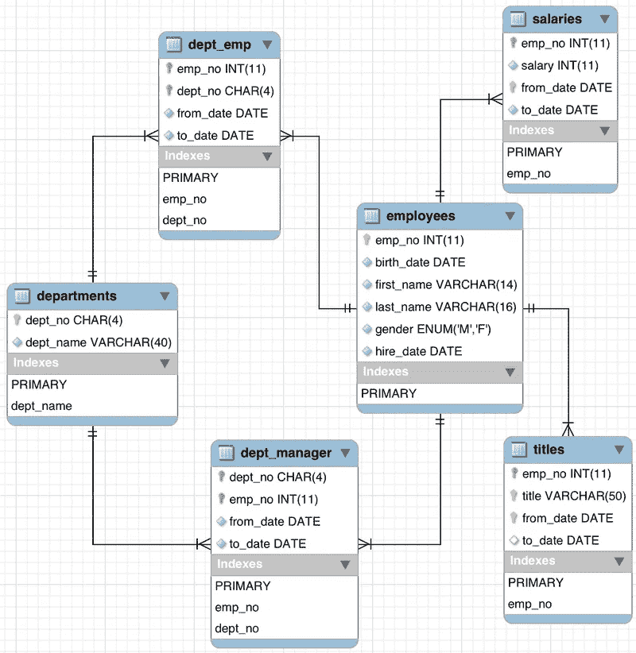

[https://dev.mysql.com/doc/employee/en/sakila-structure.html](https://dev.mysql.com/doc/employee/en/sakila-structure.html)

首先，去 GitHub 上的[员工数据库下载回购。](https://github.com/datacharmer/test_db)

点击`Code`下载回购协议👉`Download ZIP`。

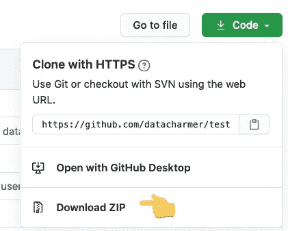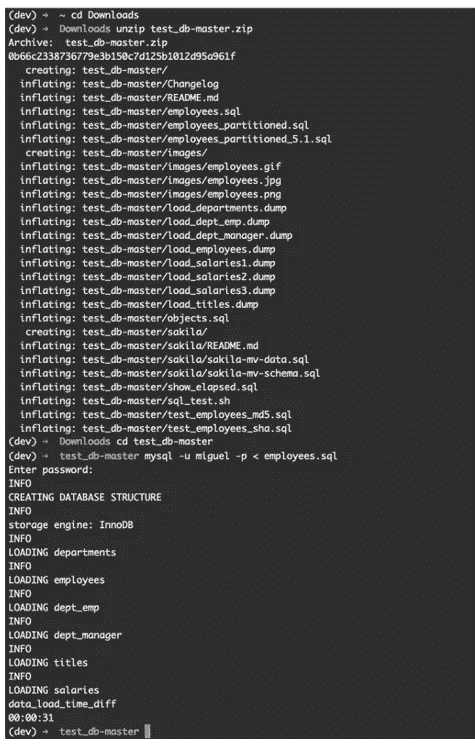

用户“miguel”在终端中的逐步过程

在“终端”中，切换到您存储文件的目录。就我而言:
`cd Downloads`

运行以下命令解压文件:`unzip test_db-master.zip`
如果不成功，您可以在 Finder 中手动打开文件`test_db-master.zip`。

将目录切换到解压后的文件夹:
`cd test_db-master`

现在您已经准备好安装数据库了。键入以下命令(用您自己的用户名替换`user`)。

```
mysql -u user -p < employees.sql
```

要测试安装，运行以下命令(替换`user`)。

```
mysql -u ‘user’ -p < test_employees_md5.sql
```

## 编写 SQL 查询

下面的笔记本包含几个简单的问题，让你开始。

你也可以在 [Jupyter Nbviewer](https://nbviewer.jupyter.org/gist/corralm/7508d7120f36a13f68774fab13656dd7#Select-all-the-rows-in-the-employees-table) 上查看笔记本:

[](https://nbviewer.jupyter.org/gist/corralm/7508d7120f36a13f68774fab13656dd7#Select-all-the-rows-in-the-employees-table) [## nbviewer 笔记本

nbviewer.jupyter.org](https://nbviewer.jupyter.org/gist/corralm/7508d7120f36a13f68774fab13656dd7#Select-all-the-rows-in-the-employees-table) 

如果您对在 Jupyter 中运行 SQL 查询感兴趣，请查看我的指南:

[](https://medium.com/@corraljrmiguel/how-to-run-and-analyze-sql-queries-with-pandas-in-jupyter-7f02503cf46) [## 如何在 Jupyter 中用 Pandas 运行和分析 SQL 查询

### 在 Jupyter 笔记本中运行 SQL 并在 Pandas 中进行分析的快速指南。

medium.com](https://medium.com/@corraljrmiguel/how-to-run-and-analyze-sql-queries-with-pandas-in-jupyter-7f02503cf46) 

如果您有任何问题或意见，请告诉我。谢谢！