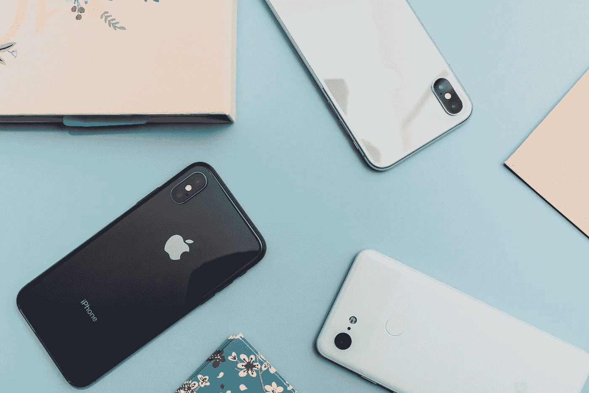
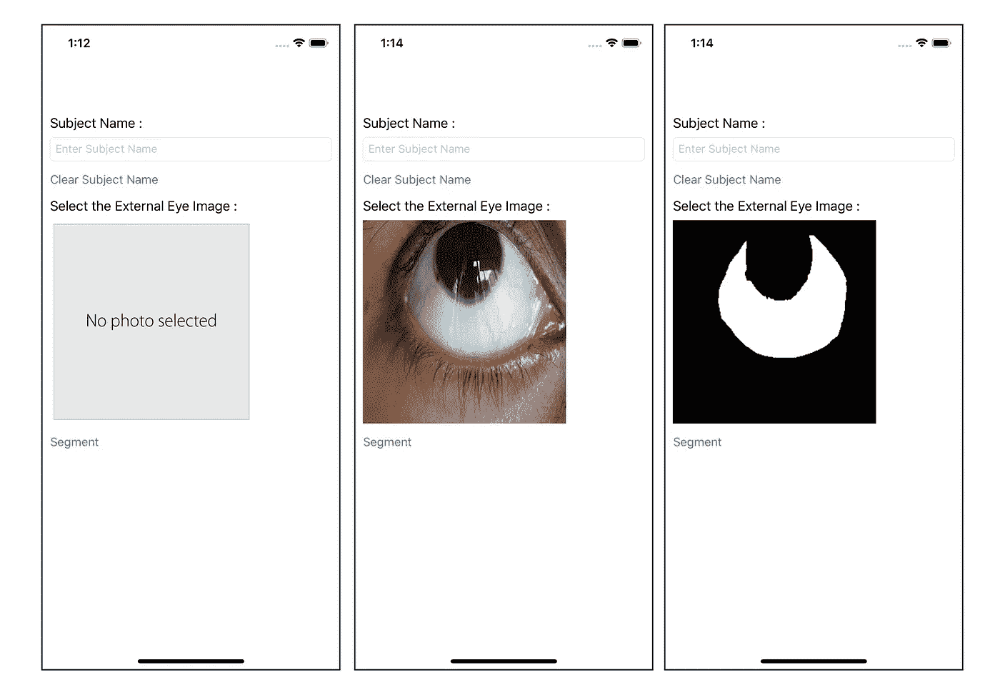

# 如何将细分网络模型与您的 iPhone 应用程序集成

> 原文：<https://towardsdatascience.com/how-to-integrate-a-segmentation-network-model-with-your-iphone-app-5c11736b95a?source=collection_archive---------56----------------------->



Arnel Hasanovic 在 [Unsplash](https://unsplash.com/s/photos/iphone?utm_source=unsplash&utm_medium=referral&utm_content=creditCopyText) 上拍摄的照片

分割图像中的感兴趣区域(ROI)是计算机视觉中的一个关键问题。随着深度学习的兴起，许多网络架构被提出来克服语义分割的挑战。几年前，在智能手机中部署一个经过训练的细分网络模型还远远不现实。然而，由于最近智能手机中的强大硬件加上我们可以使用的强大软件工具，在您的智能手机应用程序中部署一个分段网络只需要几行代码！

本文将带您完成将一个经过训练的细分模型与您的 iPhone 应用程序集成的过程。这个过程包括两个步骤:(1) **将模型转换为。mlmodel 格式**和(2) **使用转换后的模型分割 ROI。**为了让我们自己熟悉这两个步骤，我们将使用(使用 Keras 框架)训练的 U-Net 模型来分割外部眼睛图像的巩膜区域。

## **第一步:将模型转换为移动兼容格式**

将 keras 模型转换为。mlmodel 格式，我们可以使用`coremltools` python 库。可以使用以下命令安装它。

```
pip install coremltools
```

安装库之后，下面的代码片段允许您执行转换，并将转换后的模型保存在指定的位置。

将. h5 模型文件转换为. ml 模型文件

## **步骤 2:使用转换后的模型分割 ROI**

在获取。mlmodel 文件，将其拖放到 Xcode 导航区域的项目文件夹中。swift 中的`Vision` 库允许您使用。mlmodel 文件，当您将它与应用程序集成时。

我们首先将库——在本例中是`UIKit`和`Vision`——导入我们的代码，如下所示。

```
import UIKit 
import Vision
```

然后我们用`UIImagePickerControllerDelegate`定义我们的 `**class** ViewController`，允许我们从我们的照片库中挑选一张图片。为了简单起见，我们不会在应用程序中添加任何文本字段或标签。

```
**class** ViewController: UIViewController, 
                      UIImagePickerControllerDelegate,
                      UINavigationControllerDelegate { }
```

在这个类中，我们可以开始定义构建我们的应用程序的函数。首先，我们定义`UIImageView`属性，该属性将显示从照片库中选择的外部眼睛图像和分割结果。

```
**@IBOutlet** **weak** **var** photoImageView: UIImageView!
```

然后，我们可以通过下面的命令来定义分割模型。

```
**let** SegmentationModel = ScleraUNet()
```

然后我们定义视觉属性`request`和`visionModel`。

```
**var** request: VNCoreMLRequest?
**var** visionModel: VNCoreMLModel?
```

现在我们写一个设置 `SegmentationModel`和`request`的函数。

建立模型

这里你可以注意到`VNCoreMLRequest`的`completionHandler`被设置为一个我们还没有定义的叫做`visionRequestDidComplete`的函数。在`visionRequestDidComplete`功能中，我们可以包括在`request`使用分割模型输出分割掩模后应该执行的动作。我们将在本文后面定义`visionRequestDidComplete`函数。

为了在应用程序加载后设置模型，我们在`**class** ViewController`中添加了以下代码片段

```
**override** **func** viewDidLoad() {**super**.viewDidLoad()print("Setting up model...")
setupModel()
print("Model is ready")nameTextField.delegate = **self**}
```

现在我们可以编写函数，让我们从照片库中选择一个外部眼睛图像。

这样，我们可以通过`photoImageView.image`访问所选图像。

此外，我们希望有一个交互式按钮，将执行按下分割过程。

```
**@IBAction** **func** segementImage(**_** sender: UIButton){print("Segmenting... ")**let** input_image = photoImageView.image?.cgImagepredict(with: input_image!)}
```

按下按钮时，上述功能激活并运行`predict`功能。我们将在后面定义这个`predict`函数。

将上述代码片段添加到我们的代码中后，它会是这样的:

现在我们的代码差不多完成了。但是我们必须定义前面留下的`visionRequestDidComplete`和`predict`函数。我们将它们定义在`**class** ViewController`下面的`**extension** ViewController`中，如下所示。

在`visionRequestDidComplete`中，我们定义了模型预测分割结果后必须完成的任务。在这种情况下，我们希望将分割结果二值化并显示在我们之前定义的`photoView`上。

在我们的代码中添加了`**extension** ViewController`之后，它看起来会如下所示。

为了进一步完善我们的工作，我们可以在 UI 中添加一些标签、按钮和文本字段。在本例中，我们添加了几个标签、一个清除按钮和一个文本字段，该字段接受外部眼睛图像所属的主题名称。这里有一些我们新创建的简单应用程序运行的截图，它可以从给定的外部眼睛图像中分割巩膜区域。



左:应用程序的打开视图，中:从照片库中选择外部眼睛图像后的视图，右:巩膜区域被分割后的视图。(图片由作者提供)

也可以在原始图像上叠加分割蒙版，但不包括在这项工作中。

本文到此结束！希望它能帮助你将一个细分模型恰当地整合到你的 iPhone 应用中。