# 如何在 Visual Studio 代码中集成 Python 和 R

> 原文：<https://towardsdatascience.com/how-to-integrate-python-and-r-in-visual-studio-code-496a47c90422?source=collection_archive---------3----------------------->

我最近在 Coursera 上开始了 IBM 数据科学课程，发现自己正在努力在我的 VSCode 中安装所需版本的 Python 和 R。由于我花了一个令人沮丧的晚上和几个 whiskys 来为我的 Windows 系统找到一个工作解决方案，我决定最好分享它，省得你在网上搜索正确的部分。

# 你需要什么？

1.  [微软的 Visual Studio 代码](https://code.visualstudio.com/)
2.  [Python 语言](https://www.python.org/)
3.  [微软的 Python 扩展](https://marketplace.visualstudio.com/items?itemName=ms-python.python)
4.  [Don jaya manne 的 Python 扩展包](https://marketplace.visualstudio.com/items?itemName=donjayamanne.python-extension-pack)
5.  [R 语言](https://www.r-project.org/)
6.  Randy Lai 和 Kun Ren 的 R languageserver 包
7.  [上田祐挥的 VSCode R 扩展](https://marketplace.visualstudio.com/items?itemName=Ikuyadeu.r)
8.  [弧度作者兰迪·赖](https://github.com/randy3k/radian)

# 步骤 1:安装 Visual Studio 代码

VSCode 通常是免费的，但更多的选项(如 Azure DevOps Server)可以通过专业版或企业版许可证购买。然而，在我看来，免费版本对于个人使用来说已经足够了。

要安装免费版本的 VSCode，您需要首先从[微软官方网站](https://code.visualstudio.com/download)下载您各自平台的执行文件。

下载完成后，启动执行文件并遵循安装指南。安装不需要任何管理权限。然后启动 VSCode，主屏幕将弹出。

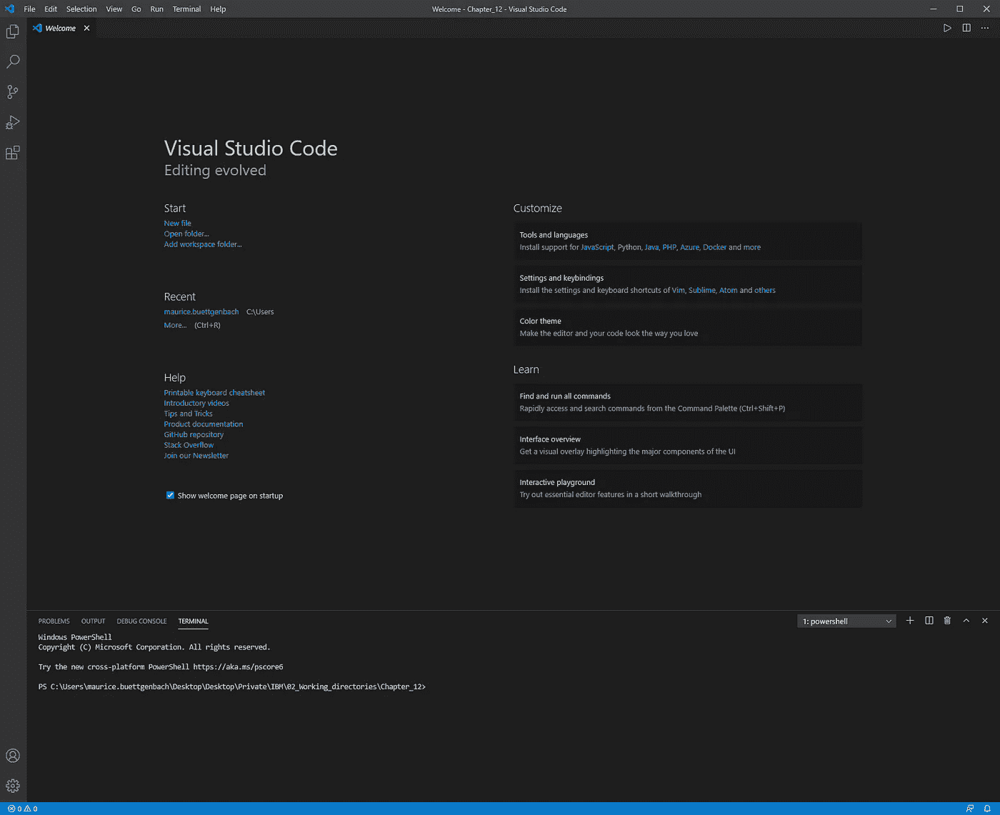

VSCode 主屏幕。图片作者。

# 步骤 2:安装 Python 语言

要在 VSCode 中安装 Python，首先需要下载并安装一个 Python 解释器。您需要哪个解释器取决于您的具体需求，但是，您可以在 Python 的[官方下载页面](https://www.python.org/downloads/)上找到所有可用的解释器。在我写这个故事的时候，版本是 3.9.0。是最新的。

下载完执行文件后，打开它，您将看到以下窗口。

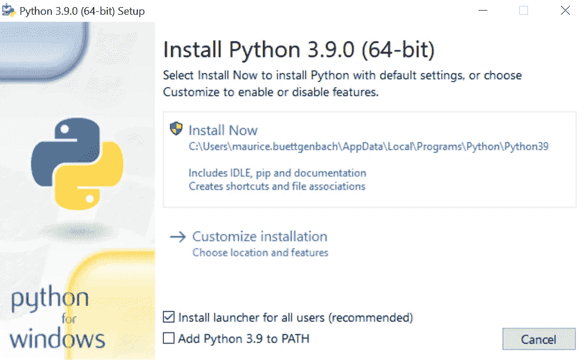

Python 3.9.0 安装程序。图片作者。

如果您对所使用的机器没有任何管理员权限，请确保在单击“立即安装”之前取消选择“为所有用户安装启动器(推荐)”选项。

要检查安装是否成功，请打开命令控制台并执行以下命令:

```
py -3 --version
```

输入命令后，应该可以看到以下输出:

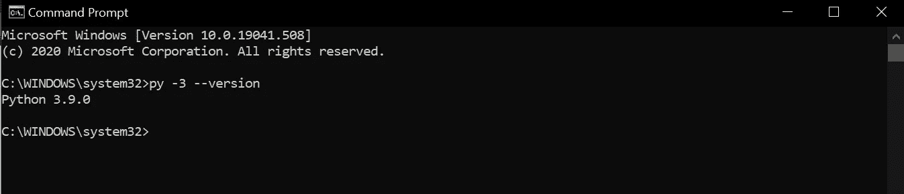

显示当前 Python 版本的 Windows 命令控制台。图片作者。

# 步骤 3:在 VSCode 中包含 Python

打开 VSCode，然后按 Ctrl + Shift + X 打开扩展选项卡。在搜索栏中键入“Python ”,选择 Microsoft 的 Python 扩展并安装。

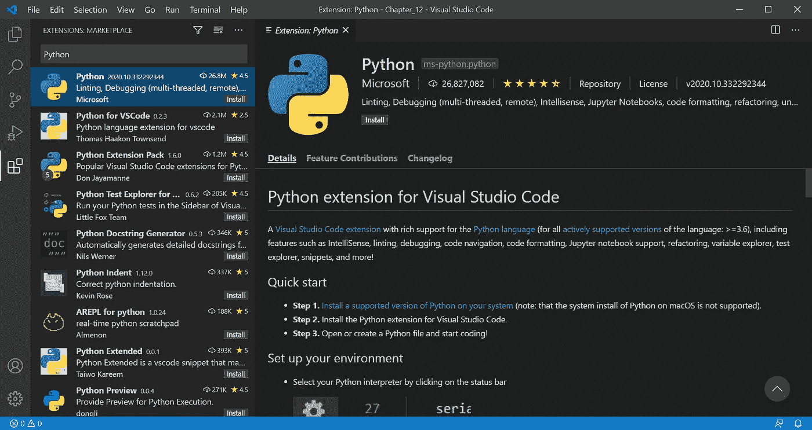

微软的 Python 扩展包。图片作者。

理论上，您现在已经准备好通过 VSCode 用 Python 编码了。不过我会强烈推荐安装之前 Don Jayamane 的 Python 扩展包。它包括进一步的扩展，通过添加不同的语法高亮选项和基于人工智能的完成项目建议，使您的生活更加轻松。要安装 Don 的扩展包，只需在搜索功能中输入“Python 扩展包”，点击安装即可。

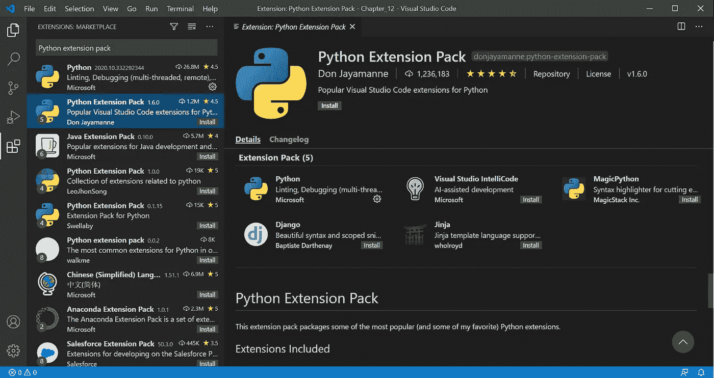

Don Jayamanne 的 Python 扩展包。图片作者。

要启动新的 Python 项目，请按 Ctrl + Shift + P 打开 VSCode 中的命令行，然后键入“Python:Create New Blank Jupyter Notebook”。按回车键，VSCode 将为您打开一个新的 Jupyter 笔记本:

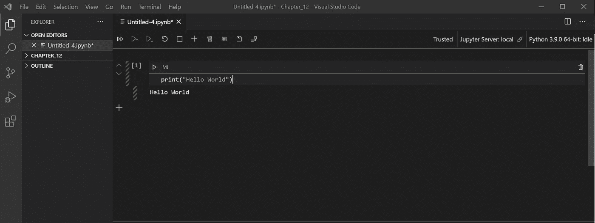

VSCode 中的 Jupyter 笔记本。图片作者。

如果您想在不同的 Python 解释器之间切换，您不需要导入或卸载不同的版本。您可以简单地在 VSCode 中链接不同的 Python 解释器，然后随意在它们之间切换。为此，请按 Ctrl + Shift + P 打开命令行并键入“Python: Select interpreter”。VSCode 将显示当前活动的解释器和其他选项。要添加一个新的解释器，只需将路径复制到相应的执行文件，然后按回车键。

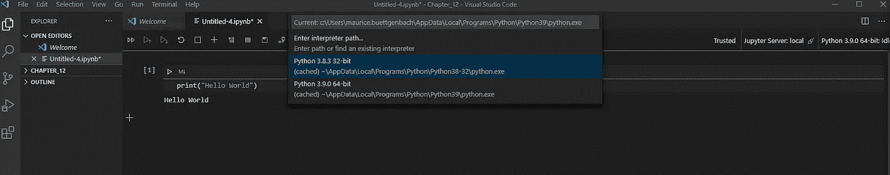

VSCode 中的 Python 解释器选择命令。图片作者。

# 步骤 4:安装 R 语言

首先，你需要去 R-Project 的官方网站选择一个你附近的 CRAN 服务器位置。一旦你选择了 Windows 版的下载，点击“第一次安装 R”然后“下载 R 4.0.3 for Windows 版”。版本号可能会有所不同，这取决于您阅读本文的时间。

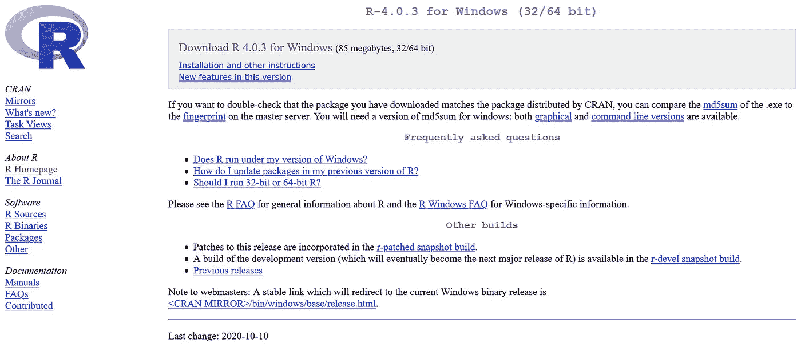

R-Project 4 . 0 . 3 Windows 版的下载页面。图片作者。

拥有管理员权限的每个人都可以执行下载的文件，遵循安装说明并跳到步骤 5。对于没有管理员权限的每个人，您需要执行以下操作。

打开一个文件窗口，转到 c 盘上的用户文件夹。在这里，创建一个文件夹，您可以在其中解压缩安装。我把我的名字命名为“R”。

```
C:\Users\<user_name>\R
```

创建文件夹后，正常安装 R，但选择新创建的文件夹作为安装位置，而不是默认位置。安装程序将在您的位置下创建一个名为的新文件夹:

```
C:/Users/<username>/R/R-<version number>
```

接下来，在“R”文件夹下创建一个新文件夹，并将其命名为“R-library”:

```
C:\Users\<username>\R\R-Library
```

然后导航到 R 执行文件并打开它:

```
C:\Users\<username>\R\R-<version number>\bin\R.exe
```

运行 R 终端后，输入以下代码并复制目录。

```
path.expand("~")
```

这将告诉你启动时 R 在哪个目录下工作。在我的例子中，它看起来如下:

```
[1] "C:\\Users\\maurice.buettgenbach\\Documents"
```

打开各自的目录，创建一个名为“”的新文本文件。RProfile”。你可以通过记事本应用程序做到这一点，但要确保文件没有附加经典的。txt "扩展名。将以下代码粘贴到文件中，并将文件路径与 R-Library 的用户文件夹交换:

```
.First <- function() {
  path_to_libraries <- "C:/Users/<username>/R/R-Library" 
  .libPaths(c(path_to_libraries, .libPaths()))
}
```

r 将运行。First()函数，并执行。libPaths()函数告诉 R 安装并访问 R-Library 文件夹中的包。继续之前关闭 R。

# 步骤 5 **:将 R 整合到 VSCode**

为了使 R 在 VSCode 中的集成成为可能，我们必须首先安装 Randy Lai 和 Kun Ren 开发的[语言服务器协议](https://cran.r-project.org/web/packages/languageserver/index.html)。R 的 LSP 提供了一个框架，在这个框架下，语言能够与我们选择的编辑器进行通信。

要安装该软件包，请打开 R 并在控制台中输入以下命令:

```
install.packages(“languageserver”)
```

接下来，打开 VSCode 并安装上田祐挥的“R”扩展。这个扩展增加了快捷方式，使您能够直接在工作区中运行代码，并更容易地查看数据帧。它现在还包括支持代码语法和高亮显示的功能(类似于旧的 LSP 客户端)。

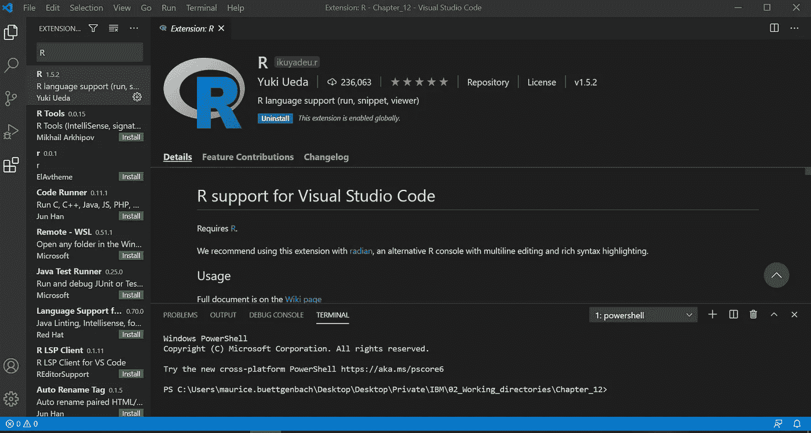

r 上田祐挥的延期。图片作者。

你现在需要安装的最后一个东西是 Randy Lai 的 Radian。Radian 是 R 程序的另一个控制台，具有多行编辑和语法突出显示功能。因为 Radian 是用 python 编写的，所以您可以通过 Python pip 命令轻松安装它。要安装 Radian，请在 VSCode 中打开一个 Jupyter 笔记本并执行以下命令:

```
pip install -U radian
```

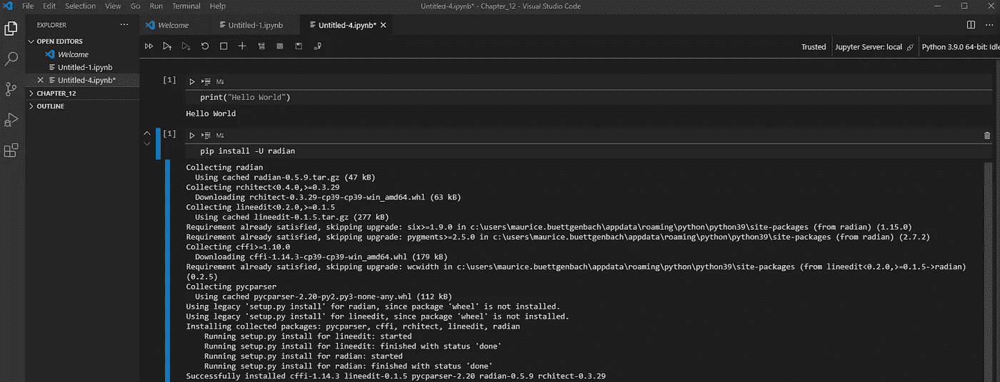

在 VSCode 中为-U radian 执行了 pip 安装命令。图片作者。

最后，您需要更改 VSCode 设置，以便在编辑器中启用 R。为此，请按 Ctrl + Shift + P，输入“首选项:打开设置(JSON)”，然后按 Enter 键。这将打开编辑器的 settings.json。将以下代码添加到 JSON 文件中，调整到您的设置的相应路径并保存文件。

```
"r.bracketedPaste": true,"r.rterm.windows": "<Path_to_radian_.exe","r.lsp.path": "<Path_to_R_.exe>","r.lsp.debug": true,"r.lsp.diagnostics": true,"r.rterm.option": ["--no-save","--no-restore","--r-binary=<Path_to_R_.exe>"],
```

下面是它在我的 settings.json 中的样子:

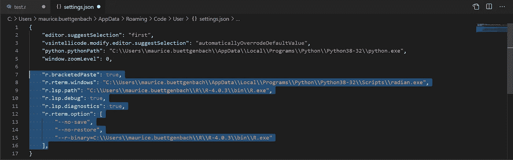

我个人 VSCode 的 Settings.json。图片作者。

然后关闭设置文件并打开浏览器。为了测试是否一切都正常工作，创建一个测试文件，并确保它有各自的”。r "结尾。用 VSCode 打开文件，并键入:

```
print("Hello world", quote = FALSE)
```

现在，您可以通过按 Ctrl + Shift + S 来运行代码。结果，您应该在终端中收到“Hello world”作为输出，如下图所示。您现在可以在 VSCode 中使用 R 了！

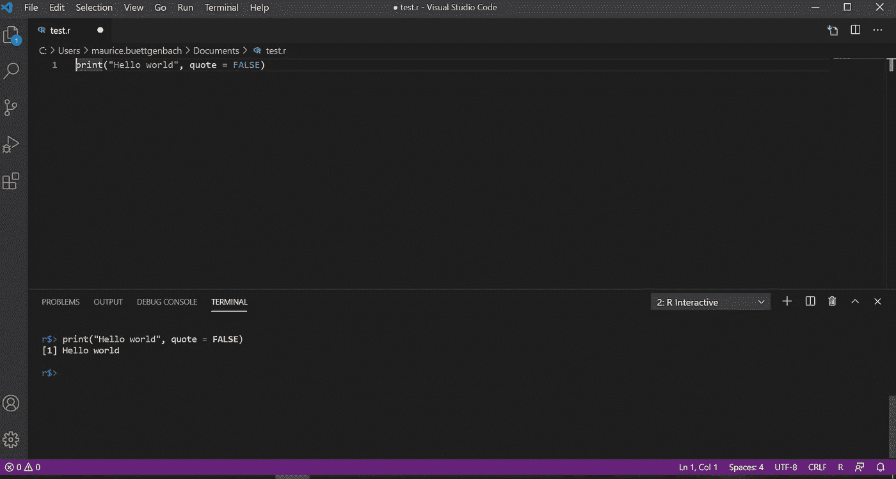

在 VSCode 中执行 R 代码。图片作者。