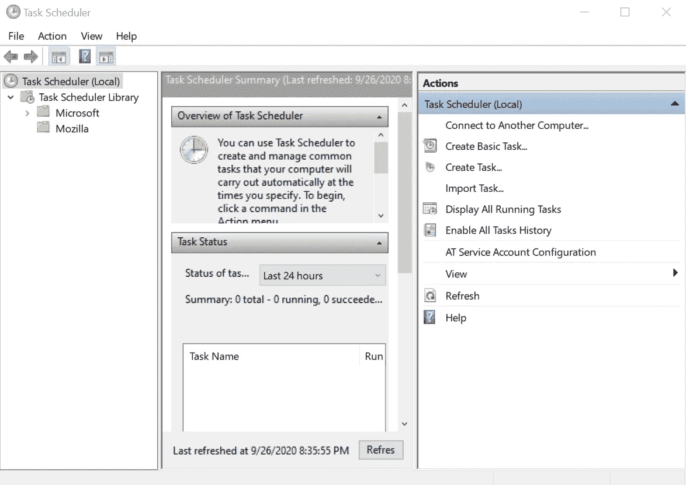
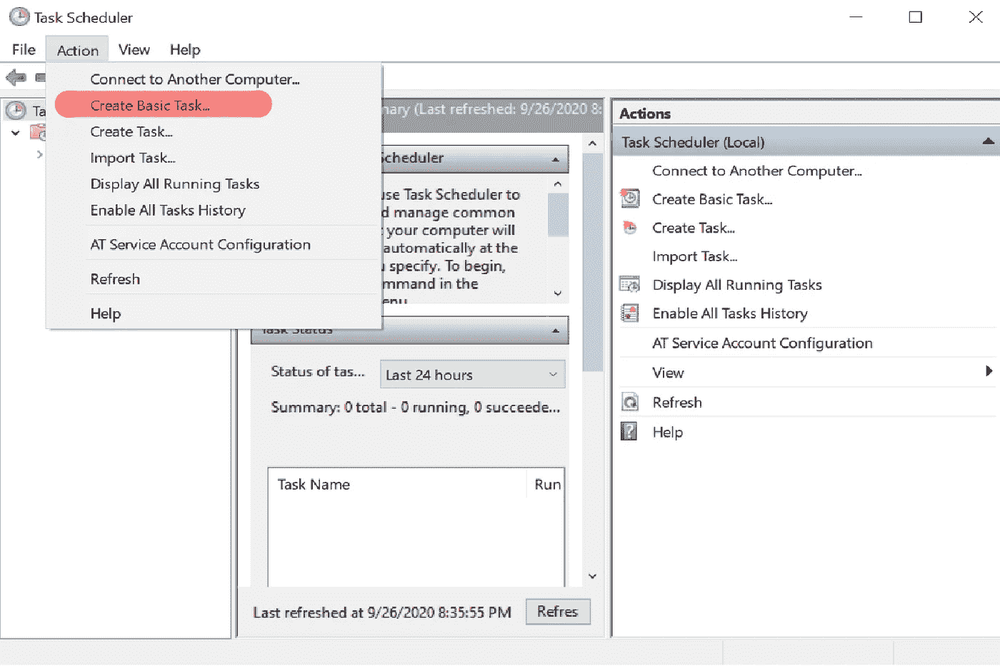
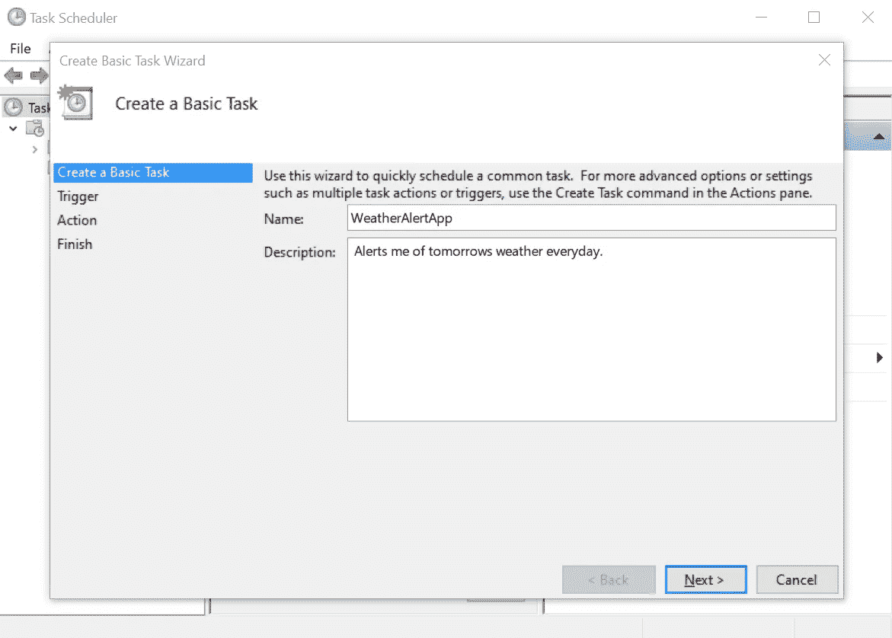
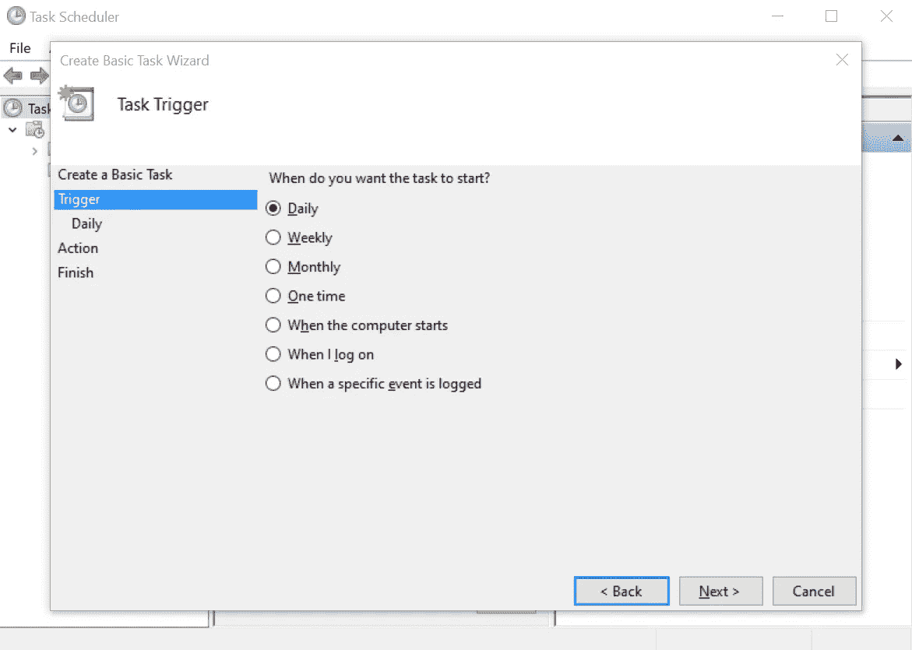
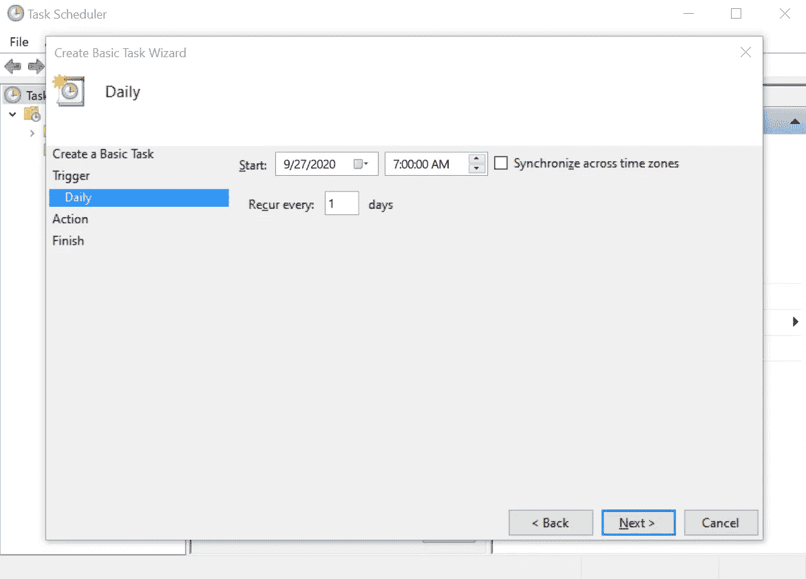
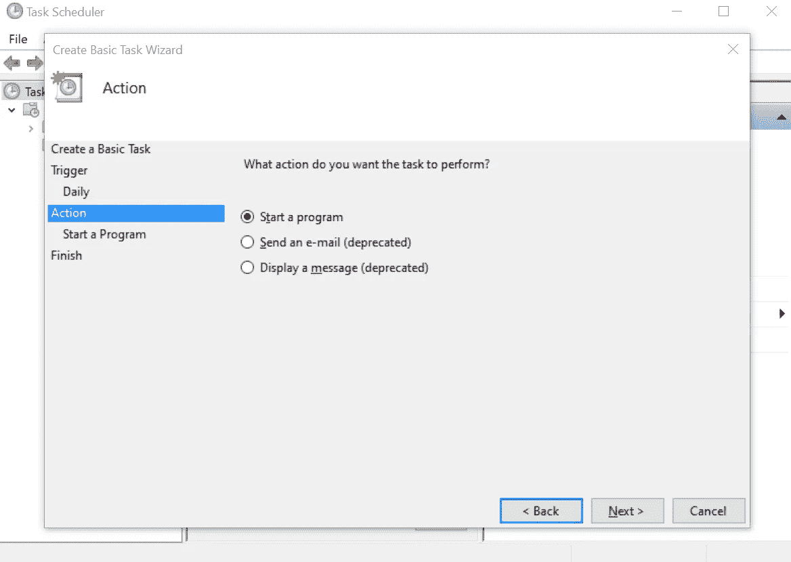
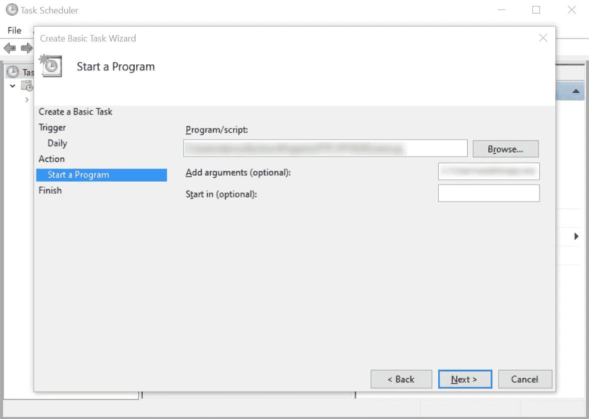
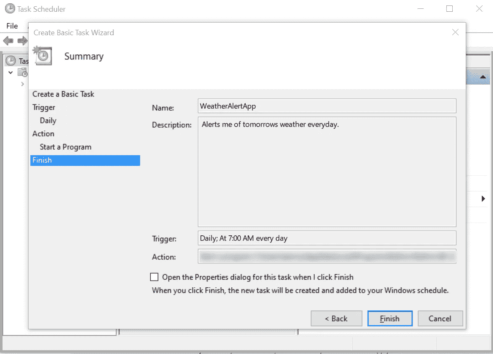
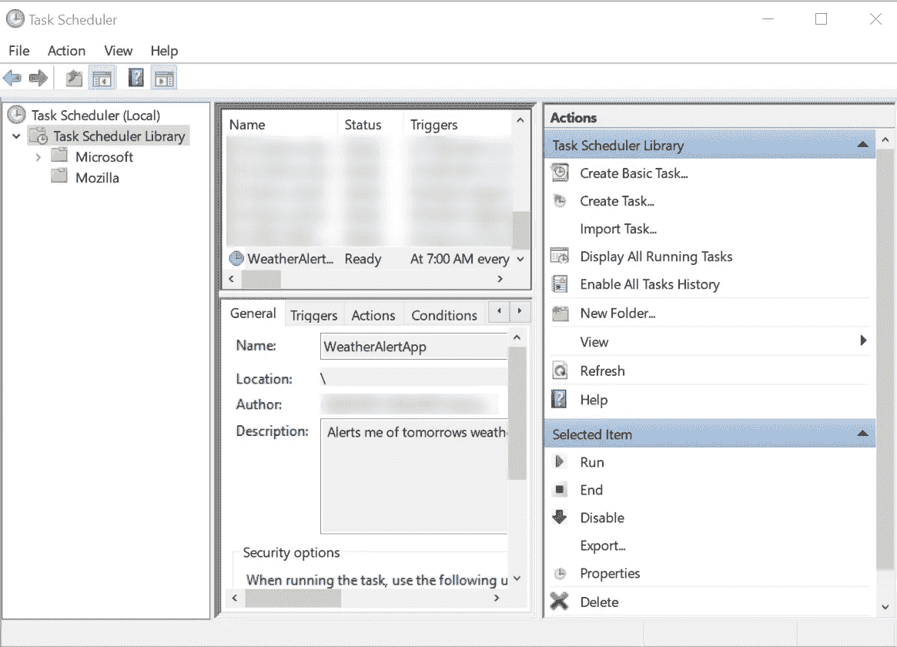

# 如何在 Python 中与 API 交互

> 原文：<https://towardsdatascience.com/how-to-interact-with-apis-in-python-10efece03d2b?source=collection_archive---------4----------------------->


## [实践教程](https://towardsdatascience.com/tagged/hands-on-tutorials)

## 本文介绍了如何用 Python 编程语言处理 API 调用

答 PIs(应用编程接口)对开发、软件和编程社区有着巨大的影响。API 不仅有用，而且很多 API 在进行基本交互时都非常简单。编程语言可以与 API 交互，并执行任务以实现特定的结果。在本文中，我们将使用 Python 来实现这一目的。Python 是我最喜欢的语言之一，它有特别有用的模块来与 API 交互。如果你还没有看过我的一些关于 Python 语言的历史、概述、基础知识和 ide 的文章，我会把它们放在下面。

我将在这里包含我的 GitHub 库的相关代码[。](https://github.com/third-eye-cyborg/PythonWeatherApp)

[](https://medium.com/python-in-plain-english/a-brief-history-of-the-python-programming-language-4661fcd48a04) [## Python 编程语言的简史

### Python 编程语言是一种通用的编程语言，它已经在主流编程语言中占有一席之地

medium.com](https://medium.com/python-in-plain-english/a-brief-history-of-the-python-programming-language-4661fcd48a04) [](https://medium.com/python-in-plain-english/python-basic-overview-76907771db60) [## Python 基本概述

### Python 有许多独特的特性，这些特性帮助它成为现在的样子。这些功能包括:

medium.com](https://medium.com/python-in-plain-english/python-basic-overview-76907771db60) [](https://medium.com/python-in-plain-english/python-beginners-reference-guide-3c5349b87b2) [## Python 初学者完全参考指南

### Python 是一种很好的初学者语言，但也适合高级用户。我将深入核心…

medium.com](https://medium.com/python-in-plain-english/python-beginners-reference-guide-3c5349b87b2) [](https://medium.com/analytics-vidhya/the-best-ides-and-text-editors-for-python-872ff1176c92) [## Python 的最佳 ide 和文本编辑器

### 我无法告诉你正确的 IDE(集成开发环境)对任何编程项目有多重要。只是…

medium.com](https://medium.com/analytics-vidhya/the-best-ides-and-text-editors-for-python-872ff1176c92) 

如果你以前从未使用过 API，你应该学习 HTTP 方法。在这篇文章中，我将只讲述基础知识。我还建议 Postman 在开始使用 HTTP 方法时学习并完成基本任务。Postman 还有其他几个用途。

[](https://www.postman.com/) [## postman | API 开发的协作平台

### 进行任何种类的 API 调用——REST、SOAP 或普通 HTTP——并轻松检查最大的响应。邮递员也有…

www.postman.com](https://www.postman.com/) 

## 我们将在本文中介绍的主要 HTTP 方法如下:

*   **GET —** HTTP 客户端使用 GET 方法从服务器单向检索数据到客户端。
*   **POST —** HTTP 客户端使用 POST 方法向服务器单向发送数据到服务器。(尽管我们使用 Python 方法来实现这一点)

本文将只介绍在 Python 中使用 HTTP 方法的基础知识。我们也将只讨论 REST APIs。我将在这个项目中使用 JetBrains PyCharm IDE。

[](https://www.jetbrains.com/pycharm/) [## py charm:JetBrains 为专业开发人员提供的 Python IDE

### 在 PyCharm 处理日常事务时节省时间。专注于更大的事情，拥抱以键盘为中心的方法…

www.jetbrains.com](https://www.jetbrains.com/pycharm/) 

因此，假设我们想每天获取一次第二天的天气，并自动获取包含该内容的电子邮件。

为此，我们将使用 [OpenWeatherMap](https://openweathermap.org/) API 和 Google Gmail API:

[](https://openweathermap.org/api) [## 天气 API

### 简单快速和免费的天气 API，你可以访问当前的天气数据，每小时，5 天和 16 天…

openweathermap.org](https://openweathermap.org/api) [](https://developers.google.com/gmail/api/) [## Gmail API |谷歌开发者

### 这个视频向开发人员展示了编程访问电子邮件的历史，以及为什么要开发一个…

developers.google.com](https://developers.google.com/gmail/api/) 

首先，你必须在 [OpenWeatherMap](https://openweathermap.org/) 注册一个账户，这意味着根据他们的政策，你必须符合条件。创建帐户后，您将被带到主页面板。导航至 *API 键*选项卡。这是我们用 Python 编写 GET 请求时需要的关键。然后去他们[网站](https://openweathermap.org/api)的 API 版块。点击[一个调用 API](https://openweathermap.org/api/one-call-api) 。

```
https://api.openweathermap.org/data/2.5/onecall?lat={lat}&lon={lon}&exclude={part}&appid=[{API key}](https://home.openweathermap.org/api_keys)
```

现在我将`requests`模块导入 Python。我还需要`pandas`模块。

```
import requests
import pandas as pd
```

然后，我将使用来自 requests 模块的 GET 请求来检索关于天气的数据，我想从这些数据中获取信息。使用 OpenWeatherMap One Call API，您可以构建一个查询字符串。查询字符串是 URL(统一资源定位符)的一部分，它使用键和值来执行大量的过程和功能。`?`之后的所有内容都是查询字符串。

```
response = requests.get("https://api.openweathermap.org/data/2.5/onecall?lat=42.937084&lon=-75.6107&exclude=current,minutely,hourly,alerts&appid=redacted&units=imperial").json()
```

我使用参数`exclude=`和值`current,minutely,hourly,alerts`向服务器请求每日数据，以过滤我的结果。在这个例子中，我将使用纽约的坐标，但是您可以使用您选择的任何纬度和经度。

我现在将使用来自`pandas`模块的`json_normalize()`方法将我们的数据正确地格式化成 Pandas 数据帧。我还将使用`record_path=`参数来关注对我所需要的重要的元数据。

```
responseData = pd.json_normalize(response, record_path="daily")
```

您可以通过在 [API 文档的](https://openweathermap.org/api/one-call-api)响应数据部分中查找来找出您需要的元数据。现在，我将通过对数据进行切片来获取我需要的信息。

```
**# get only tomorrows data
responseData = responseData[1:2]****# convert the precipitation to a percentage
responseData[’pop’][1] *100**
```

打印结果。我使用 alt 命令来获取度数符号。
ALT 248 | ALT 0176。

```
print(f"Tomorrow will have a low of: {responseData['temp.min'][1]}°.")
print(f"Tomorrow will have a high of: {responseData['temp.max'][1]}°.")
print(f"Tomorrow will have a {responseData['pop'][1]}% chance of precipitation.")msg_text = f"Tomorrow will have a low of: {responseData[’temp.min’][1]}°, a high of: {responseData[’temp.max’][1]}°, and a {responseData[’pop’][1]}% chance of precipitation."[out]
Tomorrow will have a low of: 56.95°.
Tomorrow will have a high of: 75.43°.
Tomorrow will have a 20.0% chance of precipitation.
```

因此，我现在有了一种格式的天气数据，我将在每天早上 7:00 使用 Gmail API 向自己发送一次，详细说明第二天的天气。为此，我们需要在您的 google 帐户中执行一些操作。请确保您遵循 Gmail API 快速入门指南中关于验证您的访问权限和下载您的凭据的指南。

[](https://developers.google.com/gmail/api/quickstart/python) [## Python 快速入门| Gmail API | Google 开发者

### 完成本页剩余部分描述的步骤，创建一个简单的 Python 命令行应用程序，使…

developers.google.com](https://developers.google.com/gmail/api/quickstart/python) 

首先，您需要导入适当的包

```
import pickle
import os
import base64
import googleapiclient.discovery
from email.mime.multipart import MIMEMultipart
from email.mime.text import MIMEText
import pickle
import os
from google_auth_oauthlib.flow import InstalledAppFlow
```

接下来，您需要设置权限:

```
# set permissions
SCOPES = ['https://www.googleapis.com/auth/gmail.send',
          'https://www.googleapis.com/auth/gmail.modify']
```

然后，我将设置凭据:

```
home_dir = os.path.expanduser('~')

json_path = os.path.join(home_dir, 'Downloads', 'credentials.json')

flow = InstalledAppFlow.from_client_secrets_file(json_path, SCOPES)

creds = flow.run_local_server(port=0)

pickle_path = os.path.join(home_dir, 'gmail.pickle')
with open(pickle_path, 'wb') as token:
    pickle.dump(creds, token)

home_dir = os.path.expanduser('~')
pickle_path = os.path.join(home_dir, 'gmail.pickle')
creds = pickle.load(open(pickle_path, 'rb'))
```

我现在可以构建服务了:

```
service = googleapiclient.discovery.build('gmail', 'v1', credentials=creds)
```

最后，您需要发送消息:

```
message = MIMEMultipart('alternative')
message['Subject'] = "Tomorrow's daily weather alert"
message['From'] = '<youremail@email.com>'
message['To'] = '<youremail@email.com'
messagePlain = msg_text
messageHtml = '<b>Weather Update!</b>'
message.attach(MIMEText(messagePlain, 'plain'))
message.attach(MIMEText(messageHtml, 'html'))
raw = base64.urlsafe_b64encode(message.as_bytes())
raw = raw.decode()
body = {'raw': raw}

message_first = body
message_full = (
    service.users().messages().send(
        userId="me", body=message_first).execute())
print('Message sent!')
```

这将打开你的 bowser，要求你登录到你的帐户，然后要求你的应用程序的权限和访问，以发送和修改你的帐户上的消息。如果你不想要这个烦人的消息，那么你会希望在谷歌云开发者平台中给你的应用程序权限。

[](https://cloud.google.com/) [## 云计算服务|谷歌云

### 谷歌是云基础设施和平台服务 Gartner 魔力象限的领导者。谷歌是 Gartner 的领导者…

cloud.google.com](https://cloud.google.com/) 

我建议阅读这方面的文档。

[](https://cloud.google.com/docs/authentication/) [## 认证概述|谷歌云

### 该页面为应用程序开发人员提供了 Google Cloud 平台中身份验证的概述(以前称为…

cloud.google.com](https://cloud.google.com/docs/authentication/) 

我还想用任务调度程序自动运行脚本。

我首先在任务栏的搜索栏中输入*任务计划*。这将打开一个可以安排不同节目的应用程序。



任务调度程序

点击*动作*菜单，从列表中选择*创建基本任务…* 。



动作菜单

我继续填写关于申请的基本信息。完成后选择下一个的*。*



创建基本任务窗口

然后选择触发器为*每日*。选择下一个的*。*



触发窗口

我把这一天定为我目前撰写这篇文章的第二天。选择下一个的*。*



每日窗口

保持*开启，启动程序*并选择*下一个*。



动作窗口

*程序/脚本:*应该是要去`python.exe`文件。*添加参数*应该是你的 Python 脚本的路径。选择下一个的*。*



选择 python.exe 和 python 脚本路径

我单击“完成”,查看我的任务是否在任务计划程序库中。



完成窗口



检查您的应用程序是否在任务计划程序库中

该脚本现在应该自动在每天早上 7:00 运行。

带有 HTTP 和 API 的 Python 比这更进一步，但是如果您对这种类型的项目或主题感兴趣，希望这将是一个很好的切入点。如果你有任何问题，评论或更正，请在下面的回复中留下。感谢您阅读这篇文章，希望对您有所帮助。