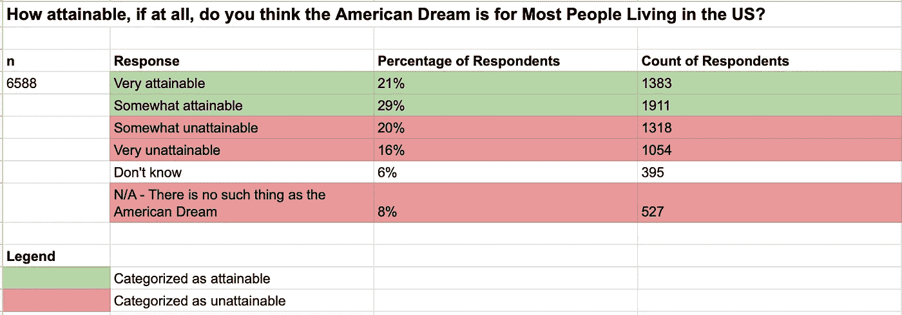

# 如何解释和计算“可能性增加 X 倍”的统计数据

> 原文：<https://towardsdatascience.com/how-to-interpret-and-calculate-x-times-more-likely-statistics-daf538a9e0f4?source=collection_archive---------2----------------------->

吸烟的人患肺癌的可能性是普通人的 15-30 倍。黑人男性和女性死于新冠肺炎相关疾病的可能性是白人的 1.9 倍。

很有可能，你已经在标题或报纸文章中看到过这些“可能性增加 x 倍”的说法。虽然这些数字中有许多是经过充分研究和翔实的，但肯定有来源使用优势比来制造轰动效应和制造恐慌(即[这里是你感染冠状病毒的 19 倍以上的地方](https://www.msn.com/en-ca/health/medical/this-is-where-youre-19-times-more-likely-to-get-coronavirus/ar-BB13D114)🙄).今天我给大家简单介绍一下这些统计数据是什么，如何计算，如何解读，并讨论一些弊端。

# 这些统计数据是什么？

这些统计数据被称为**优势似然比**，它们通常被用来描述特定人群经历某事的可能性。优势比的一些好处是，它们很容易被广泛的受众解释(即 2x 对大多数人来说意味着大于 0.7 的回归系数)，并且可以突出单一变量对两个人群的影响(即吸烟者和非吸烟者的癌症发病率)。

比值比有时会与概率混淆(即[10–15%](https://www.reuters.com/article/us-cancer-lung-nutrients-sb/nutrients-may-be-why-some-smokers-avoid-cancer-idUSTRE65E5JW20100616)的吸烟者被诊断为肺癌)，但它们不是一回事。优势比表示一个事件比另一个事件发生的可能性更大或更小，而概率表示一个事件在所有可能的结果中发生的可能性。

为了展示这种差异，我将使用 YouGov 对 6500 多名受访者的调查来了解美国人相信大多数生活在美国的人相信美国梦的可能性和概率。

杰克从不放手，现在他是杰伊·盖茨比#upwardMobility。图片来自 [Pinterest](https://www.pinterest.ca/pin/379709812304072282/)

美国梦是一种信念，即任何美国人都可以通过努力工作和奉献获得成功和向上流动，无论种族、社会阶层或宗教信仰如何。这是美国的基本概念之一，也是我最喜欢的一本书——《了不起的盖茨比》的主题。

图片作者。

回答者认为 A.D.i.O .的概率是**可获得的回答总数/所有回答**，或(1383 + 1911) / 6588。结果是 51%,这意味着大约有 1/2 的美国人认为是 A.D.i.O

回答者认为 A.D.i.O 与不可获得的概率是**可获得的回答总数/不可获得的回答总数**，或(1383 + 1911) / (1318 + 1054 + 527)。结果是 1.13，这意味着美国人更倾向于认为 A.D.i.O。

计算比值比的一般公式是**事件 A 发生次数/事件 B 发生次数。**

# **如何计算多组的似然比**

在我上面的例子中，在我的优势比计算中，我只有一组(所有受访者)。然而，这些比率最好在调查变量对两个不同群体的影响时使用。调查数据还记录了受访者的政治倾向，因此我将调查民主党和共和党的回答分组后，优势比是否有任何变化。

与上面使用的数据集相同，但这次是按政治派别分组的。免责声明:数据集没有按缔约方统计的原始回复数，因此我将使用回复的百分比进行计算。数字加起来不是 100%，因为我去掉了“不知道”的回答。图片作者。

第一步是计算民主党的优势比。利用**事件 A 发生次数/事件 B 发生次数的一般公式，**我得到 0.38 / 0.57 = 0.66。这可以解释为每 66 名民主党人相信 ADI o，就有 100 人不相信。根据调查结果，民主党人实际上更有可能认为美国梦对于大多数生活在美国的人来说是无法实现的。

然而，这只是等式的一半，现在我们对共和党的回应重复这个过程。用同样的公式，我得到 0.79 / 0.17 = 4.64。这是一个相当大的优势比——每 464 名共和党人相信 ADI o，就有 100 人不相信。

最后一步是相互比较这些几率，因为现在两者都是在同一组内计算的(即所有共和党或民主党的回答)。这可以通过获得共和党优势与民主党优势的比率来完成，该比率为 4.6/0.66 (6.96)。

图片作者。

这意味着共和党人相信美国梦的可能性是民主党人的 7 倍，相信美国梦的可能性是不相信美国梦的 4.6 倍。

如果这项调查的纵向数据可用，那将会很有趣，因此我们将能够调查这种支持美国梦的分裂是最近发生的，还是逐年变得更加两极分化的。

# 解释优势似然比

**比值比为 1 或接近 1** 意味着两个事件都不比另一个事件的可能性更大或更小，被调查的变量(即政治派别)与事件(相信美国梦)没有关系。

**比值比大于 1** 意味着事件 A 比事件 B 更有可能发生，变量很可能与事件相关。但统计显著性仍需检验。

**比值比小于 1** 意味着事件 A 发生的可能性小于事件 B，变量很可能与事件相关。但统计显著性仍需检验。

# 似然比的缺点

在解释这些比率时，需要注意的是**你不能直接用概率**乘以几率。在我们的例子中，共和党人相信 A.D.i.O .的可能性是 6.96 倍，你不能用相信 A.D.i.O .的民主党人的百分比(38%)乘以 6.96 来得到相信 A.D.i.O .的共和党人的百分比(这将导致 264%，这没有意义)。这是因为 6.96 指的是一个事件的几率如何优于另一个事件的几率，而不是一个事件发生在另一个事件之上的概率。这似乎是一件奇怪的事情，但是已经有一些有声望的报纸将优势比误报为概率，然后不得不撤回他们的文章并澄清！

我在本文开头简单提到的另一个缺点是优势比容易引起轰动。特别是当被调查事件的频率很低时，比值比会误导你相信一个罕见事件的可能性比实际情况更普遍。在我下面虚构的例子中，喝日本酸奶获得超能力的几率是不喝酸奶获得超能力的 3 倍。

图片由作者提供，数据(不幸的是)也由作者提供。

听起来不错，对吧？我正要去搜查最近的养乐多工厂。但是等等——即使在最好的情况下，我的机会仍然是 3/10，00，003，或者 0.000029%。我会有更好的机会去科学中心找一只放射性蜘蛛。

另一个缺点是，比值比有时被解释为因果关系(即变量 A 导致事件 A)，但事实往往并非如此。优势比仅仅意味着一个变量和一个事件之间有关系，但是可能有许多潜在的变量，一些甚至没有包括在最初的分析中，它们实际上造成了这种影响。

总之，比值比是总结研究结果并与广大受众分享的快速有效的方法。然而，它们也可能被耸人听闻和曲解。如果你看到一个比值比似乎太高或太低，尝试找到原始数据源或类似的研究与实际频率计数。这将让你更好地意识到一个事件在整体上的可能性有多大。这样做的人在数据解释方面的体验要好 95-100 倍😉