# p 值:对非统计学家的直观解释

> 原文：<https://towardsdatascience.com/how-to-interpret-p-value-with-covid-19-data-edc19e8483b?source=collection_archive---------6----------------------->

## 如何找到 P 值并最终拒绝零假设

如果你阅读任何科学论文，例如医学、人工智能、气候、政治等。，或者任何一个民调结果，有一个术语几乎总是会出现——p 值。

但是到底什么是 p 值呢？为什么它会出现在所有这些上下文中？

下表显示了 COVID 和 ICU 入院的症状及其 p 值(新冠肺炎)。

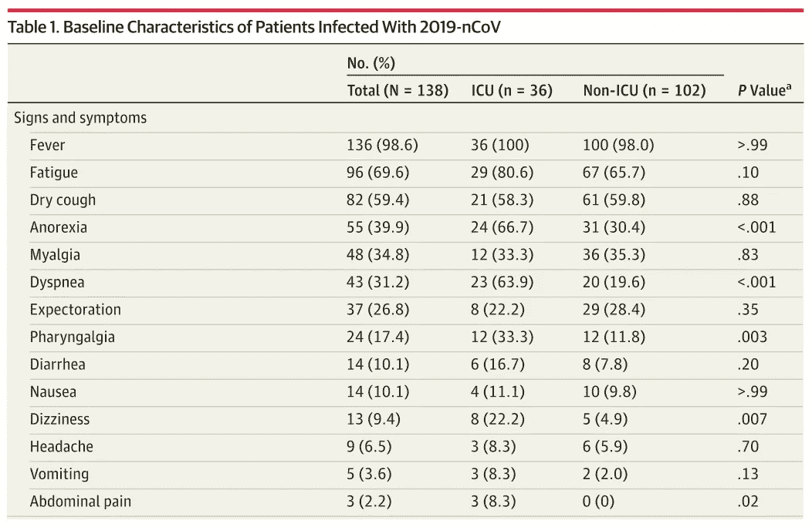

表 1。来自被引用最多的新冠肺炎论文之一— [中国武汉 2019 新型冠状病毒感染肺炎 138 例住院患者的临床特征](https://www.ncbi.nlm.nih.gov/pubmed/32031570)

在本文中，作者对该表唯一说的是*“分类变量的比例使用χ2 检验进行比较。p 值表示 ICU(重症监护病房)和非 ICU 患者之间的差异。”*

假设医院里所有的医生都得了冠状病毒病，而你(！)负责决定哪些病人需要进重症监护室。因为 ICU 的床位有限，你不能接纳所有人。您也可以使用这张表格作为参考。

您将如何使用表中的 p 值？根据 p 值，你能预测某人需要入住 ICU 的相关症状吗？在学校，我们了解到小的 p 值(通常小于 0.05)意味着证据是强有力的。但这是为什么呢？

# 1.什么是 P 值？

P-value 中的“P”表示“概率”——你的样本数据*仅仅*是因为随机抽样，而不是因为实际差异的可能性有多大。

所以，如果 p 值很小，那很好，因为它告诉你，你的实验结果不仅仅是由于偶然。

本文中武汉医院收治的新冠肺炎患者总数为 N=138。假设我们从纽约、意大利和韩国的医院中抽取了另外三组 138 名患者。

> 每次我们取样时，重症监护室和非重症监护室的厌食症患者数量会有很大不同吗？

每次我们**从不同医院**抽取一组病人，都是一次***随机*** 抽样。即使厌食症与 ICU 入院无关，由于随机抽样误差，这两者也可能出现关联。巧合的是，他们看起来像是亲戚。

**如果我们要声称差异不仅仅是因为随机** [**抽样误差**](https://en.wikipedia.org/wiki/Sampling_error) **而是因为实际差异，我们需要证明什么？**

**我们需要证明差异太大，不可能是随机的。我们需要表现出“惊人的不同”。**

当我们假设一个统计量为正态分布时，我们可以用均值的标准差来衡量任何一点。同样，**我们可以对差异**(或归一化差异—检验统计量)假设某种分布。**如果我们显示差异在尾部**进一步下降，无论是右边还是左边，我们可以说该事件发生的概率很低。

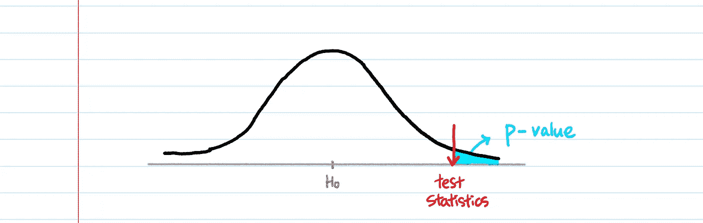

p 值是**分布曲线下测试统计值向右或向左的区域。**

# 2.手工计算 p 值

为了计算 p 值，您需要 **3 样东西** — **数据、一个零假设和一个检验统计量。**

## 一.数据

很明显。

## 二。虚假设

无效假设表明两组之间没有关系**。****零假设被认为是正确的，直到数据显示足够的证据证明它不是。**

```
**H0** : The anorexia and ICU admission are **independent**.**H1** : The anorexia and ICU admission are **NOT independent**.
```

美国刑事司法系统使用同样的理念；**“无罪推定”**。零假设永远不会被证明是真的；你只是没有拒绝它。

## 三。检验统计量

检验统计是我们用来拒绝零假设的武器。在这种情况下，为了查看这两个变量是否相关，我们将使用卡方检验。

# **卡方检验统计公式的直觉**

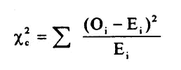

卡方检验统计量。“c”:自由度。“O”:一种观察。“E”:一个期望值。

H0 *“厌食症和 ICU 没有关系。”* **表示无论是否在 ICU，厌食症患者的比例都是一样的。**

那么，为了拒绝 H0，我们需要展示什么？

我们需要证明重症监护室和非重症监护室患者中厌食症患者的比例有显著差异。

上面的测试统计就是基于这个思路。**如果厌食和 ICU 是独立的，(观察-预期)两者各小。如果你还不清楚，请继续阅读下面的推导。**

# **如何从头开始计算卡方检验统计量**

1.  **根据给定数据**绘制表格(又名列联表)

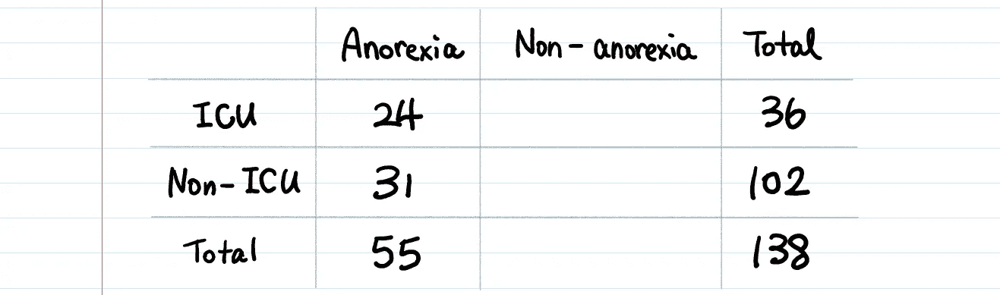

根据表 1，在总共 138 名患者中，36 名患者去了 ICU，102 名患者没有去 ICU。在总共 55 名厌食症患者中，24 人去了 ICU，31 人没有去 ICU。

**2。填写表格**

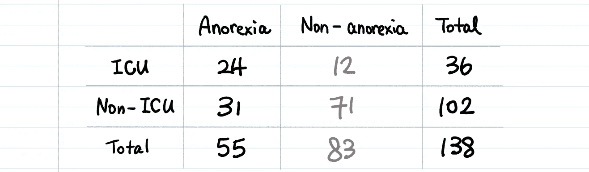

**3。计算每个单元格的期望值。(这是关键！)**

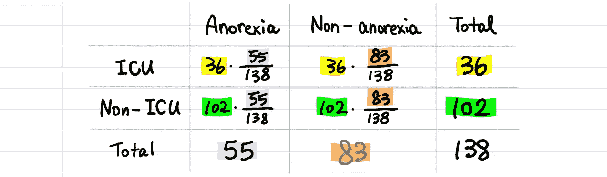

如果你观察细胞[ICU，厌食症]，它计算:在总共 36 名 ICU 患者中，36 名* (55/138)患者预计患有厌食症。

我们为什么要这样计算？

因为，**如果实际观察值 24 与 36 * (55/138)相差很大，那么厌食症和 ICU 之间一定发生了什么。反过来，如果 36 * (55/138)和 24 相差不是太大，那么 ICU/非 ICU 对厌食症没有太大影响。**

如果你计算表 1 中“干咳”的期望值，你不会看到期望值和观察值之间有很大的差别。(试试吧！)

**4。正常化吧&总结一下。【直觉】(T3)**

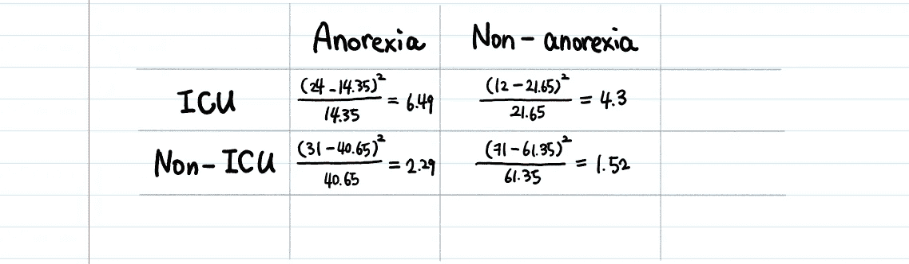

应用检验统计公式。**卡方检验统计:6.49 +4.3 +2.29+1.52 = 14.6**

这个公式没有让你想起什么吗？

方差——观察值和平均值之间的平方差之和。我们用期望值来衡量这个偏差，就像任何标准化一样。它会计算与预期值的偏差。

**卡方分布是独立标准正态随机变量的平方和(类似卡方检验统计)。**

假设你有一个来自正态分布的随机样本。**考虑到中心极限趋势(如果样本超过 30 个，均值趋于正态)，这不是一个不切实际的假设。**那么，(观察—期望)值也会遵循正态分布，因为 E 是确定性的。

**这种正态分布假设在 p 值教学中经常被忽略，但这种假设使得卡方 p 值范式成为可能。**

**卡方检验统计量:6.49 + 4.3 + 2.29 + 1.52 = 14.6**

这是一个单一的数字，它告诉您观察到的计数和预期的计数之间存在多少差异。

5.获得“自由度”。

对于具有 r 行和 c 列的表，卡方检验的自由度计算公式为

```
**Degrees of Freedom = (# of rows − 1) × (# of columns − 1)**
```

在我们的数据中，列联表中有 2 行 2 列，因此 df 为 1。

**为什么卡方检验的自由度是这样定义的？**

首先，自由度是为了使统计量保持不变而可以变化的元素数量。

例如，在公式` **a + b + c = 10** '中，您可以将 **a** 和 **b** 更改为任何数字，但是一旦设置了 **a** & **b** ，就不能更改 **c** 、，因为总和应该保持为 10。所以，在这种情况下，df 是 2。

卡方检验的 df 是**列联表中可以变化的单元格数量。在我们的例子中，列联表是 2 乘 2。如果设置单元格【ICU &厌食】为 24，则确定其余单元格。我们将(row-1)和(column-1)相乘，因为我们需要分类变量的所有可能的组合。**

**为什么我们需要考虑自由度？**

**因为自由度影响分布的形状。**

如果您查看卡方表，不同的自由度对于相同的 alpha(显著性水平)具有不同的测试统计值。

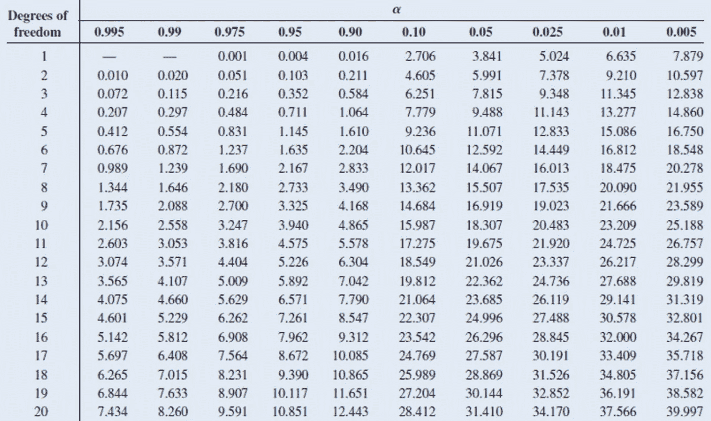

随着样本规模变大，自由度也变大。所以自由度越大，分布越接近正态分布。

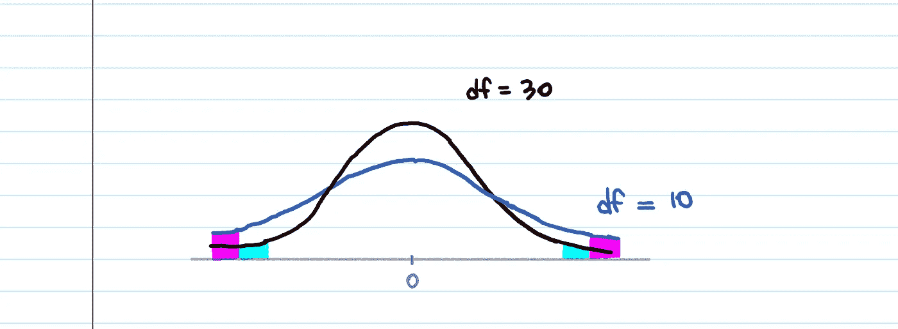

这也意味着，随着自由度变大，尾部的面积变小。它更倾向于平均值(较小的标准差)。而**这意味着 0.05 p 值的截止点会更远。因为当你的样本量越小时，不确定性就越多。**

6.查卡方表，或者用 python 或者计算器做。

如果查看卡方表，检验统计量越大，p 值越小。


还是计算器:[https://stattrek.com/online-calculator/chi-square.aspx](https://stattrek.com/online-calculator/chi-square.aspx)

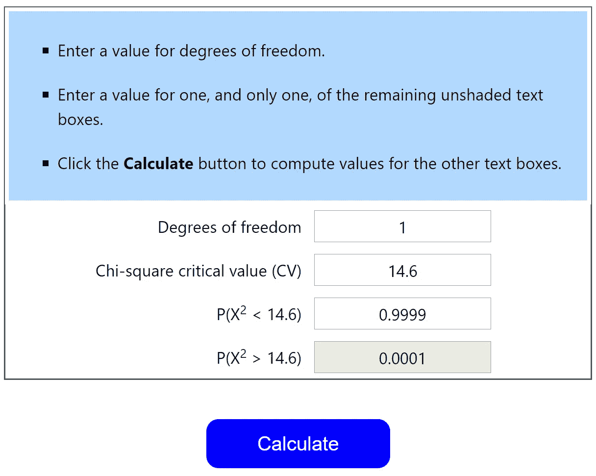

或者，用 Python，也就几行。

```
from scipy.stats import chi2_contingencytable = [[24, 12], [31,  71]]alpha = 0.05test_statistic, p_value, dof, expected = chi2_contingency(table)if p_value <= alpha:
    print('Variables are not independent (reject H0)')
else:
    print('Variables are independent (fail to reject H0)')
```

测试统计越极端，结果偶然发生的可能性就越小。

# 3.如何解读 P 值

p 值地址**只有**一个问题:

> 假设你的零假设为真，你的数据有多大可能？

66.7%的 ICU 患者有厌食症，但 30.4%的非 ICU 患者也有厌食症。其 p 值小于 0.001。p 值 0.001 意味着**如果你对 1000 个不同的组进行抽样，**你只会看到 1 次相同的统计数据(或更极端的情况)，**鉴于厌食症和 ICU 确实是独立的。**

# 4.P 值无关紧要。

*   p 值经常被误解为零假设为真的概率。但严格来说不是。 **P 值不能告诉你零假设是否为真**，因为它已经假设零假设为真。(还记得上面的分布曲线吗？曲线的中心意味着 H0=0。)
*   **无显著性 p 值不一定排除 ICU 与非 ICU 患者的差异。**这只能说明我们手头的数据没有足够的证据表明存在差异。
*   p 值也没有说你的结论是正确的。它只是告诉你结果是多么的罕见，仅仅是因为随机的机会，而不是因为其他重要的因素。注意 p 值是关于测试(因此拒绝)零假设的。这只是拼图的一部分。
*   p 值不是 1 类错误的概率。**显著性水平(α)为。**

有时候维基百科没有最好的解释…

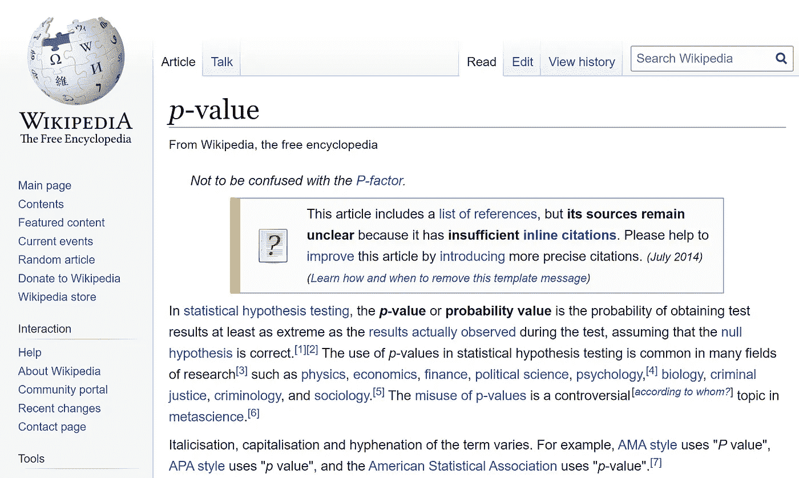

需要注意一些事情:

1.  在研究中，人们投入了大量的精力来获得 p 值< 0.05 because that’s the threshold which the study result can be declared as “statistically significant”. That is, the result wasn’t a fluke, or by random chance.
2.  We use the chi-square test only for categorical data. We don’t use it on numerical data. There are many different types of hypothesis tests.

```
**Different Hypothesis Tests**Comparing means → t, z test
Comparing 2 sample variances → F test
Determining independence → Chi-square test
Determining goodness of fit → Chi-square test
```

3\. Setting alpha (the significance level) is arbitrary. Different people use different significance levels. Therefore, we can arrive at different conclusions from the same data depending on what we choose as our significance level. By convention, α is set to 0.05, or 0.01.

We set our significance level before we see any data. Alpha should not be derived from data nor depend on the underlying hypothesis.

4\. Chi-square distribution is a special case of the [伽马分布](/gamma-distribution-intuition-derivation-and-examples-55f407423840)。具有 n 个自由度的卡方分布等于 a = n / 2 且 b = 0.5(或β = 2)的伽马分布。