# 如何像数据科学家一样投资

> 原文：<https://towardsdatascience.com/how-to-invest-like-a-data-scientist-bada78787d57?source=collection_archive---------3----------------------->

## 数据科学是一种思维模式和技能组合，可以让你通过投资致富

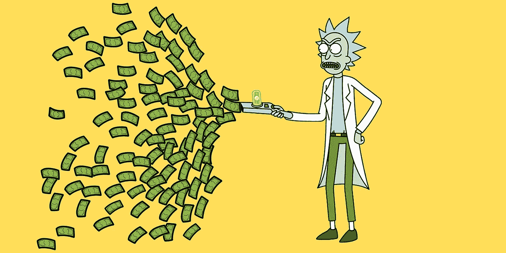

图片来自 Rick & Morty，已编辑

众所周知，数据科学是一个涉及统计学、数学、计算机科学和商业知识的多学科领域。

成为数据科学家所需的**思维**和**多学科技能**是强有力的工具。他们不是博士学位，而是一个优秀数据科学家的资质。它们不仅有利于你的职业生涯，还会对你如何处理生活中的事情产生巨大而积极的影响。

对于任何寻求财务自由的人来说，投资都是一生的任务。无论是投资股票还是投资自己，都有一些原则应该牢记在心。这些原则很重要，但也很容易忘记。为什么？因为“感谢”人性，可以肯定的是，一个人需要一次不成功的投资经历，才能体会到它们的重要性。

有没有不经历失败就能真正掌握这些原则的方法？是的，有了这种心态和多学科的技能，优秀的数据科学家应该知道捷径。希望你会惊讶于这两项技能是如何让你的投资方式受益的。

> "整个科学只不过是日常思维的提炼."
> 
> ——阿尔伯特·爱因斯坦

# 1.永远不要贪婪→用数学证明

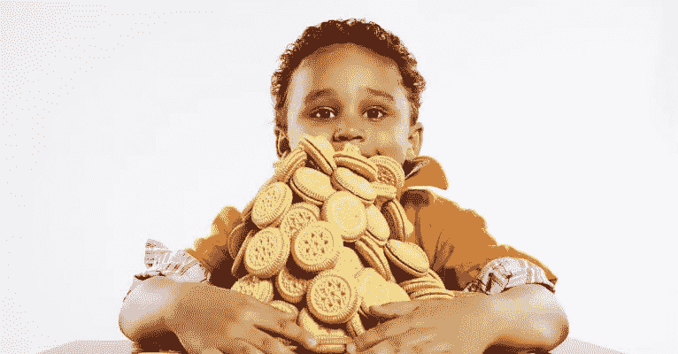

图片来自[https://arlenepellicane.com/](https://arlenepellicane.com/)

赌场是一个非常有利可图的行业，它甚至可以养活整个城市的福利系统，就像在拉斯维加斯。除了游客和临时访客，赌场赚取的最大利润来自赌徒的贪婪。

你很少在赌场看到数据科学家。如果你这样做了，他们要么为赌场工作，要么只是假装与他们的非数据科学家朋友“社交”😲。为什么？因为一个好的数据科学家懂**数学**。

让我们看一个简化的例子:

1.  一个赌徒玩一个游戏，有正好 50%的机会赢和输
2.  如果他赢了，他赚 1 美元；如果他输了，他就输了 1 美元
3.  赌徒在开始时有 X 美元
4.  只有两种方式来完成游戏:1)失去所有的 X 美元，2)总的钱达到他的目标，Y 美元

这个游戏看起来很简单，但是揭示了所有赌博游戏的两个属性。首先，它们看起来都是公平的游戏，这让你觉得如果你的运气一般，你会简单地以平局告终。其次，赌徒很贪婪。

假设，失去所有$X 的概率是 P(X)

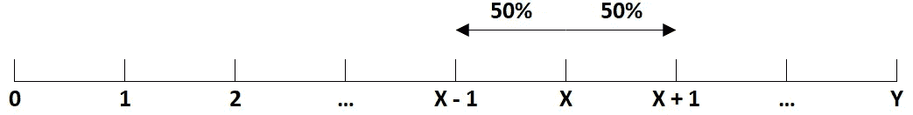

一个人有 50%的机会从$X 到$X-1，有 50%的机会从$X 到$X+1

因此

*   P(X) = 50% × P(X - 1) + 50% × P(X + 1)
*   即 2 × P(X) = P(X - 1) + P(X + 1)
*   即 P(X) - P(X - 1) = P(X + 1) - P(X)，*这满足了典型等差数列*的性质

众所周知，对于任何算术级数，

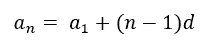

即数列的第 n 项=第一项+第 1 项和第 n 项之间的距离，可以看成是(n - 1) ×任意两项之间的公距。

我们还知道:

*   P(0) = 1，当一个人有 0 美元时，失去一切的概率是 100%
*   P(Y) = 0，当一个人有 Y 美元时，游戏就结束了，所以输掉一切的概率是 0%
*   因此，d = 1 / Y

该序列现在可以转换为以下形式:

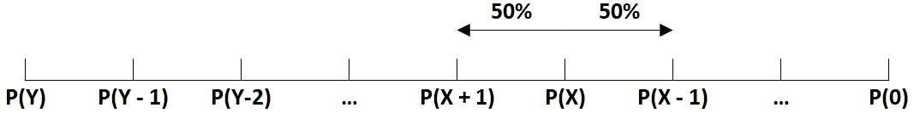

使用上面的公式，

**P(X)= P(Y)+(n-1)d = P(Y)+(Y-X)1/Y =(Y-X)/Y**

也就是说，如果 X = 1000 美元

1.  如果 Y = 1200 美元，P(X) = 1/6
2.  如果 Y = 1500 美元，P(X) = 1/3
3.  如果 Y = 2000 美元，P(X) = 1/2
4.  如果 Y = 5000 美元，P(X) = 4/5

如果你想赚 200 美元，相对容易实现。然而，如果你变得贪婪，想赚 5 倍，有 80%的机会你会失去一切。

> “*见好就收*”—古老的中国智慧

# 2.小心密码和细价股→用博弈论论证

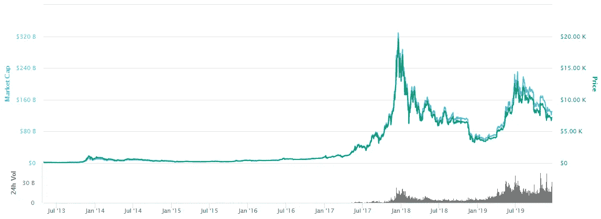

来自 https://coinmarketcap.com/[的比特币图表](https://coinmarketcap.com/)

你可能听说过 2017 年加密货币的疯狂，当时比特币的价值在一年内增长了 20 倍，随后发生了大崩盘，直到今天。

让我们从一个简单的例子开始，你可能会看到如何在未来动荡的市场中投资:

1.  索菲亚邀请诺亚玩一个游戏，给他们每人一枚硬币
2.  在每一轮中，他们都展示硬币的一面
3.  如果结果是 2 头，诺亚赢得 3 美元
4.  如果结果是 2 条尾巴，诺亚赢得 1 美元
5.  如果结果是 1 头 1 尾，那么诺亚损失 2 美元

不难想象，抛硬币的结果是 50–50，所以有 25%的次数结果是 2 头，25%是 2 尾，50%是 1 头 1 尾。

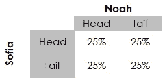

投掷 2 枚硬币的概率

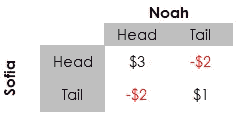

不同结果的奖励

因此，诺亚和索菲亚的报酬的期望值是 0 美元:

25%*×*$ 3+25%*×*$ 1-50%*×*$ 2 = 0

是的，这似乎是一个公平的游戏加上诺亚总是想和一个迷人的女士玩游戏，像索菲亚，所以为什么不玩呢？但是，经过几个小时的游戏日期，结果显示，诺亚几乎失去了他钱包里的一切，包括钱包。那是怎么发生的？

诀窍是:索菲亚可以控制概率，而不是每轮随机展示硬币。她用了什么策略？索菲亚是这样做的:

假设 A 代表索菲亚展示头部的事件，B 代表诺亚展示头部的事件。

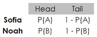

对诺亚报酬的期望:

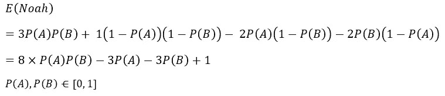

绘制这个等式:

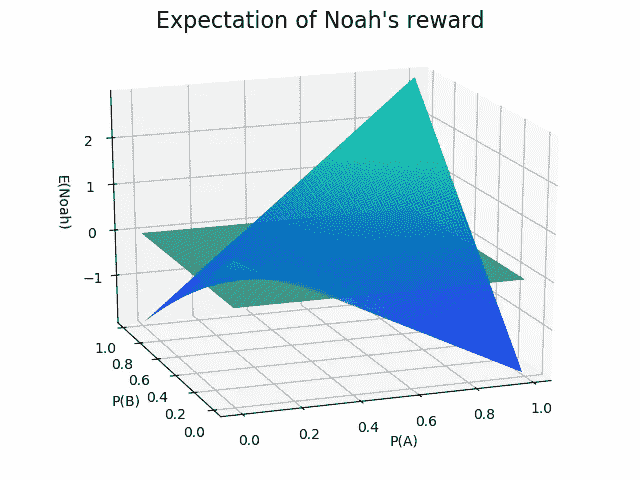

绘制诺亚奖励的功能

平面下的区域代表负的 E(Noah)，并且有一定范围的 P(A)，Sofia 的露头概率，使得 E(Noah)总是负的！这是索菲亚的诡计。下面的代码揭示了范围:

让诺亚赔钱的代码

```
[0.34 0.35 0.36 ... 0.38 0.39 0.4]
```

就是这样。如果索菲亚设法迫使概率落在 0.34 和 0.4 之间，她将永远使诺亚赔钱！

这个博弈是博弈论中的问题。这是一个完美的类比，告诉我们如何从一个“公平”的游戏中受骗。在这里，游戏可以被视为一种投资，诺亚代表个人投资者，索菲亚代表机构投资者，也就是大鲸鱼。在小型资本投资中，如加密货币和细价股，大鲸鱼可以轻松地用大量资金**操纵**市场，即大量抛售或买入。如果个人投资者幸运地跟随“鲸鱼”的运动，他们可以赚钱，但最终个人投资者会亏损，因为他们只是被操纵了。

# 3.总是比你想象的更快“放弃”→客观思考

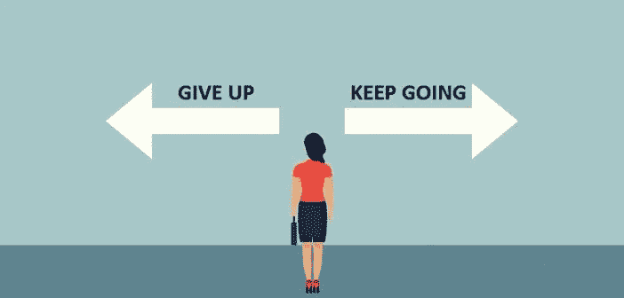

图片来自 https://www.aconsciousrethink.com/

在一项投资中，在不同的时间点既赢又输是最常见的事情。当你赢的时候，永远不要贪婪(前面已经证明了)。当你亏损时，明智地止损。

萨姆一直持有价值 1 万美元的股票。最近该公司并没有落入坏人之手，股价突然跌破收购价格，现在它只值 8k 美元。

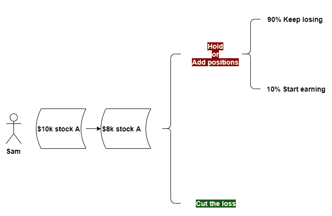

山姆应该减少损失吗？

如果山姆继续持有或加仓，90%的机会他会损失更多。显然，减少损失是我们应该做的。然而，许多人没有做到这一点，即使他们事先得到了统计数据。这都是因为人的自我，比如“*你不卖*就不会亏钱”，“*永远不会亏钱*”。不要武断地看待这些话。

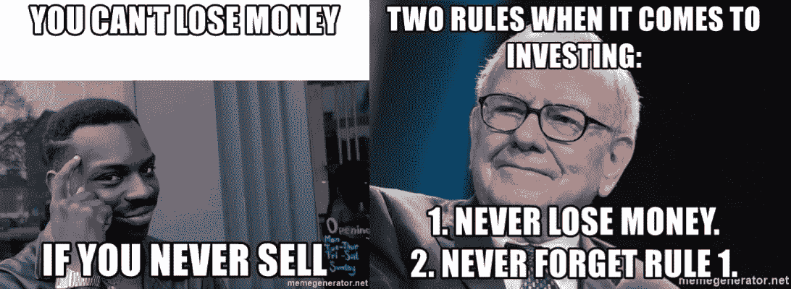

图片来自[https://memegenerator.net](https://memegenerator.net)

把自我放在一边，也就是客观思维，并不像看起来那么简单，它需要定期的训练和一个人的坚持。这种技能是任何科学家和研究人员的基本要求。

当损失无法挽回时，比如公司是骗局/泡沫，不要希望它会很快好转，承认损失已经成为**沉没成本**，立即抽身。尽管有时损失可能会被霍德林挽回，但考虑到**机会成本**，即你等待投资回到之前水平所花费的时间，如果你选择将资金转移到其他地方，你可能已经将仓位翻倍了。

说到投资生存，总是建议对股票进行更多的研究，做一些计算来支持投资决策。另一个简单而聪明的方法是把股票当成是免费送给你的。你会发现，如果 Sam 收到一只免费的 10000 美元的股票，但有一天这只股票跌到 8000 美元，几乎没有机会再涨回来，这个决定就变得容易多了。

# 4.看穿“预期”→蒙特卡洛模拟

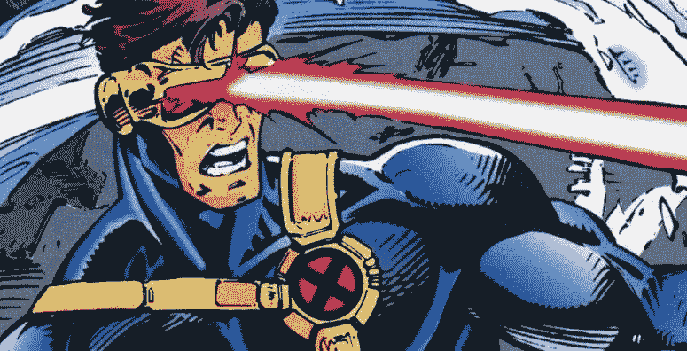

图片来自 https://screenrant.com/的漫威(独眼巨人)和

评估一项投资有无数种好的和坏的方法，上面列出了三种最差的方法。对于个人投资者来说，[价值投资](https://en.wikipedia.org/wiki/Value_investing)、[贴现](https://www.investopedia.com/terms/d/discounting.asp)、[记分卡](https://hbr.org/1993/09/putting-the-balanced-scorecard-to-work)、 [PB + PE + PEG](https://mystocksinvesting.com/lessons-learnt/how-do-i-value-a-stock/the-4-basic-elements-of-stock-value/) 都是很好的开始方式。我不会在这篇文章中详细阐述它们，请点击链接，你会发现它们是多么有用。

我想说的是一种有趣的、有时反直觉的方式，许多人包括专业人士都过于依赖这种方式——预期回报。下面显示了什么时候可以，什么时候不可以。

## 当它工作的时候

假设有一个掷硬币游戏。每一轮，如果是头，玩家赚 1 美元，如果是尾，玩家赚 2 美元。他玩一轮这个游戏应该付多少钱？

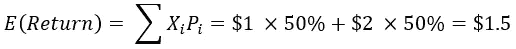

预期回报是 1.5 美元，所以只有入场费低于 1.5 美元，这个游戏才值得玩。

## 当它不起作用时

假设你有$X，有 50%的几率它在下一个单位时间内变成 0.9 × $X，有 50%的几率变成 1.11 × $X。是不是每次都要全进的道理？

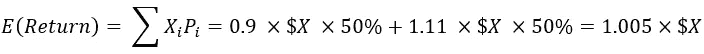

这意味着，在下一个单位时间内，你将从你拥有的$X 中获得 0.5%的收益。也就是说，每次投资，你都会获利，所以当然，你应该每次都全押！

然而，在现实中，如果你这样做，你会失去一切。反直觉对吗？下面告诉你为什么。

通过蒙特卡洛模拟，我在 500 个时间单位内创造了 10，000 个投资者，所有人的起点都是 100 美元。


图上的每个点代表投资者在特定时间单位的回报。从中我们可以看出，随着时间的推移，少数投资者取得了非常显著的回报，而大多数投资者却没有这么幸运。

他们有多倒霉？88.56%的投资者的回报率低于他们 100 美元的起点。更不幸的是，10000 个投资者中有 84.76%的人最后都是 0 美元。是的，大多数投资者最终会血本无归。

**看起来这项投资非常乐观，如果他(她)们继续玩下去，理论上应该可以获得无限的钱，但市场上几乎没有真正的赢家**。

下面的代码再现了模拟:

当预期回报不起作用时演示的代码

如果你不是 100%相信，下面从数学角度解释原因:

我们已经知道预期收益是


一个人的回报极限如何:

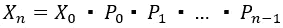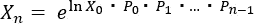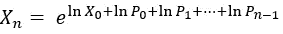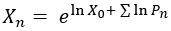

因为

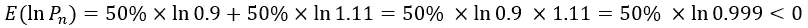

多亏了大数定律

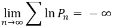

因此

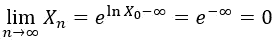

嘣！又反直觉了！预期收益为正，但极限为零。这是因为有些 x 最终非常大，但这是非常难以实现的。由于这些很少的大 x，平均回报被拖向正，但事实是大多数 x 几乎为零。

投资时，应该明智地使用工具。预期回报是一个简单而有用的工具，但过度依赖它会让你忽略某些重要信息，这有时可能是致命的。

# 最后

我想从这篇文章中传达两个信息:

1.  数据科学不仅仅是一项日常工作。成为一名优秀的数据科学家所需的思维模式和多学科技能是强大的设备，有利于一个人与生活中一切事物的交互方式。
2.  **不要变得贪婪，与波动的市场保持距离，减少损失，使用工具时首先要知道自己是什么**。这四个投资原则在许多投资者中可能是众所周知的。然而，没有多少人每次都记住它们，因为这些原则是通过语言传授的，而不是通过现实生活中的经验，也就是失败。我希望通过揭示数据和这些教训背后的科学，你不必经历成为投资大师的失败。

希望你喜欢并觉得有用。如果你想了解更多，请[跟随](https://medium.com/@noahxiao)和[连接](https://www.linkedin.com/in/mengnoahxiao/)。

# 参考

[1]中等，朝向数据科学。(2018).*数据科学需要研究生学历吗？*[https://towards data science . com/do-you-need-a-graduate-degree-for-data-science-8e 3d 0 ef 39253](/do-you-need-a-graduate-degree-for-data-science-8e3d0ef39253)

[2]维基百科。算术级数。[https://en.wikipedia.org/wiki/Arithmetic_progression](https://en.wikipedia.org/wiki/Arithmetic_progression)