# 如何发放更明智的贷款

> 原文：<https://towardsdatascience.com/how-to-issue-smarter-loans-d0eda750bed9?source=collection_archive---------29----------------------->

## 让您的用户满意并遵守联邦法规

在 [Unsplash](https://unsplash.com?utm_source=medium&utm_medium=referral) 上 [NeONBRAND](https://unsplash.com/@neonbrand?utm_source=medium&utm_medium=referral) 拍摄的照片

由于各种各样的原因，申请贷款可能是一次紧张的经历。在本帖中，我们将使用一个工作实例来理解如何利用数据科学来发放更好的贷款。

近期目标是从头到尾了解如何创造一个[金融科技](https://en.wikipedia.org/wiki/Financial_technology) ( *fintech* )产品。更大的目标是使贷款申请过程透明。

在介绍这个系统中的角色之前，请记住在头衔的背后，每个人都是人。这意味着并非一切都可以量化，在许多情况下，最终的决定可能是基于人的判断。

## 债权人

债权人是那些有钱可借的人，必须小心不要把他们的资产浪费在没有出路的努力上。传统上，贷方依赖于 5c 的信用:

*   性格；角色；字母
*   容量
*   资本
*   情况
*   抵押品

## 申请人

贷款申请人需要证明他们的信誉。所需的信息可能因贷款人而异，浏览申请流程可能会令人困惑。

因此，市场双方都需要理解风险和回报，这一点显而易见。在本帖中，我们将使用 Lending Club 数据来创建 **LoanHelp** :一个简单的网站，能够帮助债权人和借款人了解贷款是否值得。

*详细分析请随时查看 GitHub 回购:*[*https://github.com/NadimKawwa/loan-help*](https://github.com/NadimKawwa/loan-help)

# 数据采集

杰西卡·刘易斯在 [Unsplash](https://unsplash.com?utm_source=medium&utm_medium=referral) 上拍摄的照片

对于这个项目，我们将使用来自美国 P2P 贷款公司的 [Lending Club 的数据，这些数据是从 2007 年到 2018 年收集的。这些数据可以在](https://www.lendingclub.com/) [Kaggle](https://www.kaggle.com/wendykan/lending-club-loan-data) 上免费下载。这些文件包含所有已发放贷款的信息，如当前贷款状态和最新付款信息。

该数据还包含信用评分、金融查询次数、邮政编码和托收等特征。总的来说，我们有大约 890，000 个观察值和 75 个特征。重申一下，我们的目标是预测个人是否会偿还贷款或违约。

在执行任何步骤之前，我们按照发布日期进行排序，并将最后 10%的观察值作为测试集。为了更好的可视化，考虑图 1:

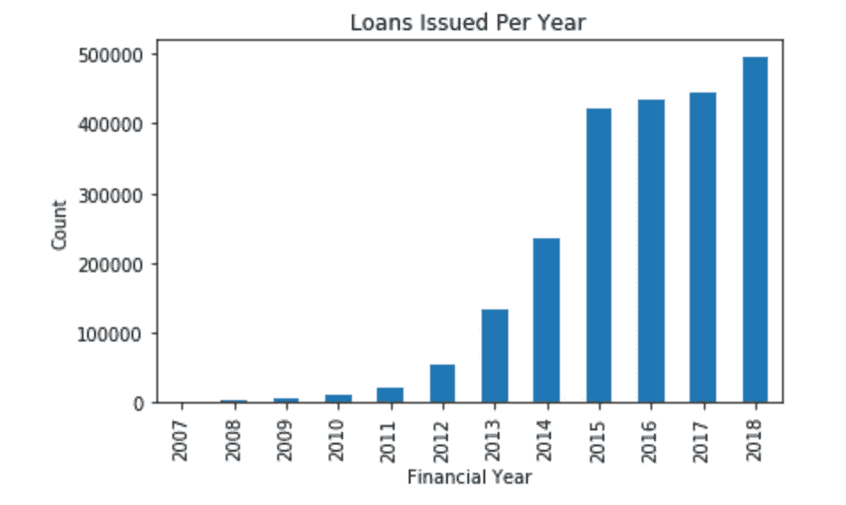

图 1:每年发放的贷款

这种方法要求在勘探阶段看不到测试数据，增加了另一种防止泄漏的安全措施。这是常见的做法，因为我们没有办法确切知道未来是什么。

> 我们的目标是预测个人是否会偿还贷款或违约

# 数据探索和特征工程

瑞安·昆塔尔在 Unsplash[上的照片](https://unsplash.com?utm_source=medium&utm_medium=referral)

## 未来泄漏

数据中的一些信息发生在贷款发放后的未来，比如`installment`:借款人在贷款发起的情况下所欠的月供。这些信息预示着未来，并构成数据泄漏，应该被丢弃。总的来说，在这一步中，我们从分析中丢弃了大约 **50 个**特征。

## 遗漏的观察

数据集包含大量缺失的输入，对于数据科学家来说，如果超过一半的输入缺失，就很容易放弃某个要素。但是，建议慢慢来，对每个特性进行尽职调查。在混乱中发现模式是一种乐趣，这是数据科学家的工作。

下面的图 2 显示了缺失观测值在每个特征中所占的百分比分布。我们做出判断，丢弃丢失值超过 50%的所有特征。对于那些少于 10%的缺失，我们填充该特征的模式。

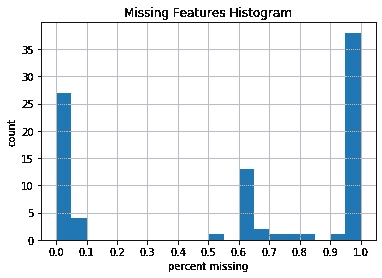

图 2:每列的平均缺失值

## 分类数据

一些特征是分类数据，例如职位。对于后者和类似的功能，我们设计了自己的功能，试图将作业分配到相关的类别。例如，像护士和医生这样的头衔被标记为健康职业。此外，我们为拥有总裁、首席执行官和区域经理等头衔的'**高管**创建了一个二元特性。

## 按地理位置定制功能缩放

对于许多机器学习算法来说，[标准规模](https://scikit-learn.org/stable/modules/generated/sklearn.preprocessing.StandardScaler.html) r 实例可以提升性能。在深入研究之前，请考虑下图:

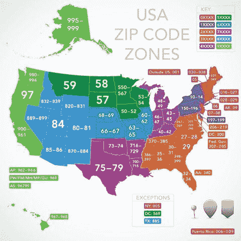

[资料来源:womansday.com](https://www.womansday.com/life/a51100/the-history-and-meaning-of-zip-codes/)

通过[大都市统计区](https://en.wikipedia.org/wiki/Metropolitan_statistical_area) (MSA)来衡量观察结果比全国更有经济意义。如果邮政编码的第一位数字代表一个州，那么后两位数字代表该地区的中央邮局。

因此，我们将跟踪统计数据，如按前两位数分组的样本的平均值和标准偏差，我们将称之为“宏观”统计数据。背后的原因是，20，000 美元在德克萨斯州奥斯汀的价值不同于在加利福尼亚州旧金山的价值(作者希望他支付的租金更少)。

## 用户配置文件

那么谁是 Lending Club 的债务人呢？该公司给每个人分配一个字母子等级(后面会有更多)，例如 A1 是最好的等级，G5 是最差的等级。分布似乎向右倾斜，大多数用户的分数为“好”到“好”。

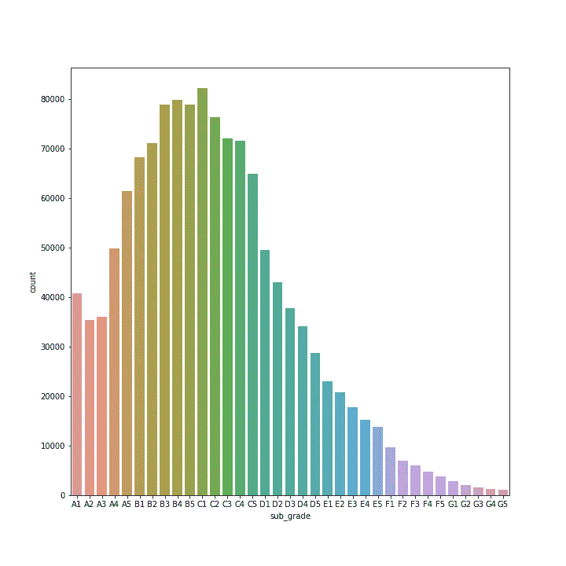

一个有趣的结果是下图比较了已付贷款和违约贷款的年收入。请注意，分布似乎是相同的，而那些倾向于违约的人平均收入略低。

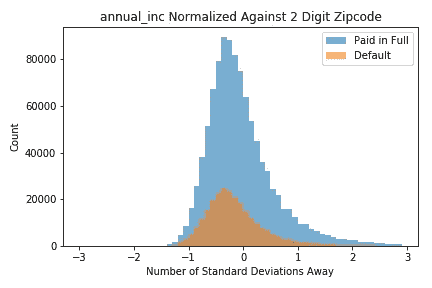

也许这两个情节更有意思。我们看到，较高的利率(int_rate)与较高的违约可能性相关。同时，较低的路基也表明可能违约。我们将这两个地块放在一起展示，因为申请人的子等级越低，风险就越大，利率就越高。因此，这是[特征相关性](https://en.wikipedia.org/wiki/Feature_selection)的一个例子。

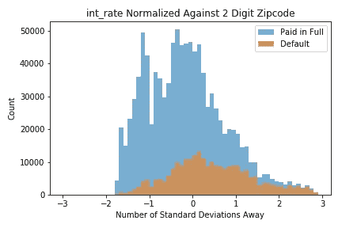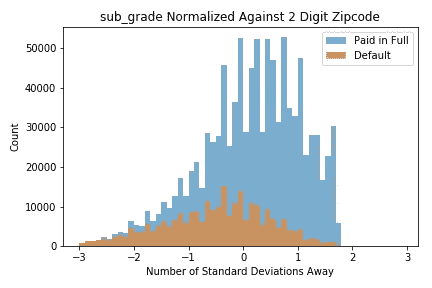

# 建模和性能指标

瑞安·昆塔尔在 [Unsplash](https://unsplash.com?utm_source=medium&utm_medium=referral) 上的照片

## 挑选模特

随着数据的清理，我们选择尝试几种监督学习算法，以选出一个赢家，并进一步发展它。

## 性能指标

鉴于数据集的不平衡性质，仅仅依靠准确性是不够的。诸如[接收器操作特性](https://en.wikipedia.org/wiki/Receiver_operating_characteristic) (ROC)和 [f1 分数](https://en.wikipedia.org/wiki/F1_score)等指标在不平衡数据集的情况下非常有用。下图 3 显示了不同模型的 ROC 曲线:

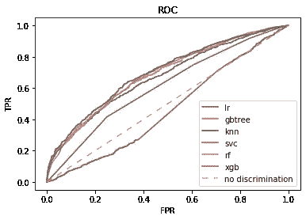

图 3:初步 ROC 曲线

请注意，每个分类器都是用默认参数实例化的，因此结果可能会因参数而异。在一项更深入的研究中，人们会将每个模型的最佳之处与其他模型的最佳之处进行比较。为了限制项目的范围，我们决定使用 XGBoost，因为它的整体性能更好。总体而言，XGBoost 能够实现 0.68 的 AUC。

## 优化结果

与所有机器学习算法一样，交叉验证和网格搜索是最大限度提高性能的有用工具。超参数调整可能是一个计算量很大的过程，因此最好用 [google colab](https://colab.research.google.com/) 笔记本来完成。然而，模型超参数仅针对少量试验进行了调整。

# 输出的解释

来源:[维基百科](https://en.wikipedia.org/wiki/United_States_fifty-dollar_bill)

美国联邦贸易委员会(FTC)是美国负责消费者保护和监管商业行为等事务的机构。取决于你住在哪里，大概有一个政府机构有类似的任务。

联邦贸易委员会可能会要求一个机构解释为什么某些贷款申请被拒绝或面临法律后果。因此，模型的可解释性对于法律遵从性是至关重要的。此外，如果任何特征与个人信息有关，如性别或种族:放弃它们。这不仅是不道德的，也是违法的。

从产品的角度来看，网站上的用户可能想知道为什么他们的申请没有通过。会不会是他们的年龄？信用评分？有什么对他们有利的因素吗？沮丧的用户倾向于完全放弃这个平台。不透明的机器学习模型注定会失去业务。可解释性不仅是法则，也是成长的关键。

因此，本节将讨论如何理解起作用的潜在特征，以及它们如何影响模型的决策。

> 不透明的机器学习模型注定会导致糟糕的决策

我们利用 SHAP 值来获得模型输出的逐例解释。注意，SHAP 特征重要性与特征排列重要性截然不同。事实上，排列是基于模型性能的下降，而 SHAP 是基于特征属性的大小。

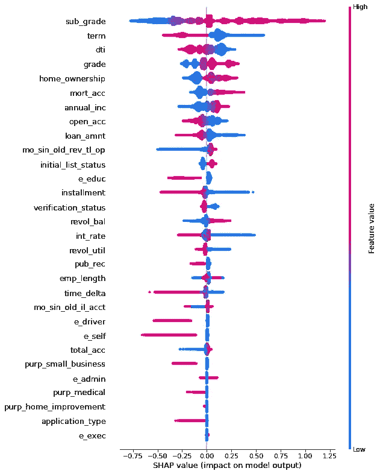

图 4: SHAP 汇总图

图 4 是每个特征的 SHAP 值的密度散点图，用于确定每个特征对训练数据集中个体的模型输出的影响程度。

图 4 将输出限制为前 30 个特征，这些特征按所有样本的 SHAP 值大小的总和排序。最大的特点是“路基”(贷款俱乐部指定的等级)，最好的等级是 A1，最差的是 G5。直觉上，让评级最高的申请人最有可能还清贷款是合理的。

下一个特性是“term ”,指的是贷款的还款次数，值以月为单位，可以是 36 或 60。第三个特征“dti”是“*一个比率，使用借款人每月总债务支付额除以借款人自我报告的月收入来计算总债务，不包括抵押贷款和要求的 LC 贷款“*。

我们将注意力转移到房屋所有权上，它可以是拥有、抵押贷款、租金、任何、其他或没有之一。在项目的特征工程部分，我们决定用一个数值来代替这些观察值，这样拥有一个家就有了最高的价值。我们之所以关注这一特性，是因为对于一部分用户来说，拥有房屋可能是即将发生违约的一个指标。这里值得注意的是，功能交互可能在这个评估中发挥作用。

# 把所有的放在一起

照片由 [Precondo CA](https://unsplash.com/@precondo?utm_source=medium&utm_medium=referral) 在 [Unsplash](https://unsplash.com?utm_source=medium&utm_medium=referral) 上拍摄

随着我们的模型得到训练，结果令人满意，我们可以将它包装成一个脚本，用户可以输入关于自己的信息，并接收信用评估。

> 更大的目标是提供一个个案解释，使贷款申请成为一个透明的过程

我们必须考虑我们可以合理地要求用户做什么。例如，C1 的子等级意味着什么？用户如何知道他们的立场？因此，我们参考 [Lending Club 的 SEC 文件](https://www.sec.gov/Archives/edgar/data/1409970/000089161808000318/f41480orsv1.htm#111)，该文件提供了一个子等级与 FICO 平均分数的表格(参见第 49 页)。下面是路基和 FICO 之间的关系图:

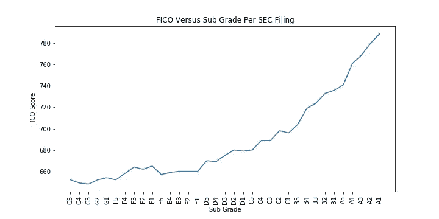

图 5

请注意，这个图表并不完全像我们希望的那样稳健。请注意，图中有违反逻辑的扭曲:F1 比 E5 有更好的 FICO 分数。我们预计 FICO 分数和次等级之间几乎完全呈线性正相关。关于如何计算次级评级，还有其他考虑因素，可能隐藏在 SEC 文件的其他部分。然而，在这项研究中，我们认为这些信息已经足够了。

我们还必须考虑到这部分用户的疲劳和我们的应用范围。在 app 开发方面，我们可以要求用户输入 30+条关于自己的信息进行初步评估吗？出于实际考虑，我们将限制关键项目所需的输入，例如:

*   FICO 评分
*   位置
*   债务收入比
*   贷款金额
*   岁入

## 示范

我们利用 python 的 [Flask](https://flask.palletsprojects.com/en/1.1.x/) 框架来创建一个简单的网站。然后，我们使用 [heroku](https://www.heroku.com/) ，一个支持多种编程语言的云平台服务，在线部署它:

 [## 贷款帮助:初步贷款审批帮助

### 预测贷款违约

loan-help.herokuapp.com](https://loan-help.herokuapp.com/) 

下面是如何使用该网站的演示。我们从填写信息开始:

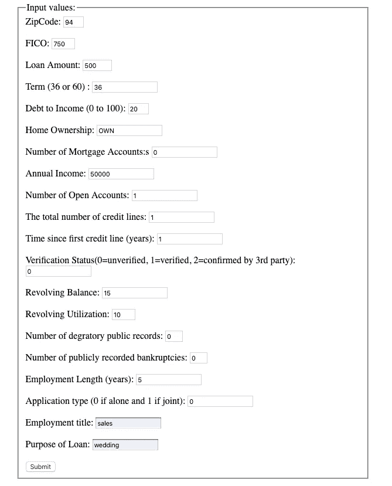

点击 submit 按钮会产生一个决定和关于贷款的信息:

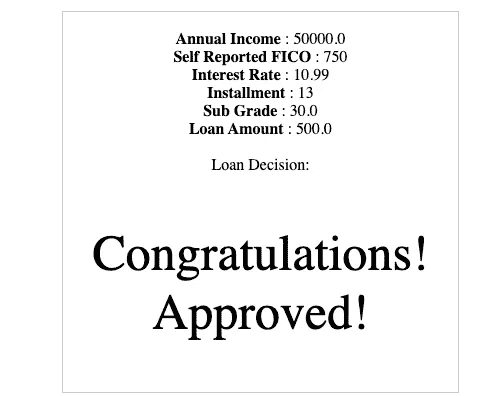

## 开发 Web 应用程序时的注意事项

在 Heroku 或其他任何地方开发应用程序的最重要的经验是:总是用明确指定的[版本来指定 python 依赖关系。](https://devcenter.heroku.com/articles/python-pip#best-practices)

此外，还要考虑预期的流量以及如何减少计算时间。例如，页面一打开就加载 pickled 模型，这样就省去了我们每次做预测时都要加载它的麻烦。另一方面，该网站托管在一个免费的域名上，30 分钟不活动后就会休眠。

最后，考虑我们期望的输入类型和值，并在需要的地方设置硬限制。W3schools 为那些想开始学习的人提供了一个简单的教程。

# 违约和保险

照片由 [Jp Valery](https://unsplash.com/@jpvalery?utm_source=medium&utm_medium=referral) 在 [Unsplash](https://unsplash.com?utm_source=medium&utm_medium=referral) 上拍摄

到目前为止，我们已经能够以债权人和贷款申请人易于理解的方式解释模型的输出。我们可以进一步将我们的发现扩展到评估风险和增加债权人收入的实际方法中。在本节中，我们将简要介绍如何将数据科学应用于贷款保险。

一些债权人可能希望为他们的资产投保以防违约。我们如何计算预期增益？让我们假设一个简单的案例，申请人获得 1000 美元的贷款。

每个月底，债务人都要连本带利地还钱。如果在任何月份有 5%的违约概率，那么债权人的预期利润是:

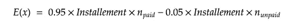

其中**n _ payed**是支付月末费用的次数，**n _ payable**是未支付的次数。如果所有的账单周期都还清了，信贷将收回他们的钱加上利息。如果在任何时候债务人拖欠贷款，任何未来的付款都被视为损失。

这如何在更大范围内应用？保险公司将有可靠的和不那么优秀的债务人。通过将这些投资组合汇集在一起，保险公司可以提供更低的利率，因为违约造成的损失被有价值的债务人全额支付的保费所抵消。数据科学在这里扮演了一个关键角色，因为它会产生每笔贷款的违约概率。

## 得分和信心

通常，我们希望展示我们的最佳绩效指标，然后就到此为止。但是，部署的模型会持续返回相同的结果吗？我们如何向利益相关者保证最低限度的绩效？

使用 Bradley Efron 和 Robert Tibshirani 的. 632 Bootstrap 方法，我们能够构建置信区间。我们发现 95%的时候，AUC 在 **(0.64，0.67)** 之间。

# 缩放产品

照片由 [Pepi Stojanovski](https://unsplash.com/@timbatec?utm_source=medium&utm_medium=referral) 在 [Unsplash](https://unsplash.com?utm_source=medium&utm_medium=referral) 上拍摄

机器学习模型最终将驻留在专用的网络服务器上，并由使用该服务的债权人和债务人调用。抛开加载网页和访问数据所需的时间，做一个决定需要多少时间？

我们对测试数据进行了这个测试，发现平均来说，预测是在 203 微秒内做出的，标准偏差是 62 微秒。性能可能会得到优化，但是时间是相当合理的。

# 总结和展望

[Fabian Blank](https://unsplash.com/@blankerwahnsinn?utm_source=medium&utm_medium=referral) 在 [Unsplash](https://unsplash.com?utm_source=medium&utm_medium=referral) 上拍摄的照片

利用消费者数据，我们能够帮助市场双方评估贷款结果，做出更明智的决策。输入和结果用简单的英语给出，不需要专业知识。

尽管我们尽了最大努力，我们还是无法实现一个几乎总是正确的模型。这部分是由于问题的模糊性。此外，一些关键特征在数据中不存在，如年龄、教育水平和微观/宏观经济因素。

与任何机器学习模型一样，定期更新我们的训练数据至关重要。随着时间的推移，消费者趋势发生变化，新产品出现，基本事实发生变化，因此我们的指标开始受到冲击。

我们重新训练模型的频率以及使用哪些数据超出了本文的范围，但是在生产部署之前必须考虑。

希望你喜欢阅读这篇文章！

*有问题吗？评论？反馈？或者你只是想进一步讨论事情？请随时联系我，我会尽我所能迅速回答你！*

# 参考

 [## 掌握信用卡的 5 C

### 虽然一个“C”的平均分在学术等级上可能感觉中庸，但获得五个 C 的学分是…

www.nerdwallet.com](https://www.nerdwallet.com/blog/5-cs-credit/)  [## Lending Club 贷款数据

### 分析 Lending Club 发放的贷款

www.kaggle.com](https://www.kaggle.com/wendykan/lending-club-loan-data)  [## 信贷和贷款

### 关于信贷和贷款的决定涉及很多因素，包括你需要多少钱，你能得到什么条件…

www.consumer.ftc.gov](https://www.consumer.ftc.gov/topics/credit-and-loans)  [## 5.10 SHAP (SHapley 附加解释)|可解释的机器学习

### 本章目前仅在此网络版本中可用。电子书和印刷品将紧随其后。SHAP(沙普利添加剂…

christophm.github.io](https://christophm.github.io/interpretable-ml-book/shap.html)  [## 贷款保障保险适合你吗？

### 贷款保障保险旨在通过在需要时提供经济支持来帮助投保人。是否…

www.investopedia.com](https://www.investopedia.com/articles/pf/08/loan-protection-insurance.asp)  [## 保险联营

### 保险联营是一种做法，其中一组小公司联合起来，以确保更好的保险费率和…

www.inc.com](https://www.inc.com/encyclopedia/insurance-pooling.html)  [## 预期值

### 在概率论中，随机变量的期望值是其概率分布的一个关键方面。的…

en.wikipedia.org](https://en.wikipedia.org/wiki/Expected_value) 

[交叉验证的改进:. 632+ Bootstrap 方法，Bradley Efron 和 Robert Tibshirani](https://www.cs.nmsu.edu/~hcao/teaching/cs488508/readings/EfronTibshirani_JASA_1997.pdf)

 [## 使用 Lending Club 免费了解您的 FICO 分数

### 信用评分贷款俱乐部(LC)是一个人对人的贷款网站，连接借款人和贷款人(LC…

www.doctorofcredit.com](https://www.doctorofcredit.com/use-lending-club-find-fico-score-range-free/) 

[https://www . sec . gov/Archives/Edgar/data/1409970/000089161808000318/f 41480 ors v1 . htm](https://www.sec.gov/Archives/edgar/data/1409970/000089161808000318/f41480orsv1.htm)