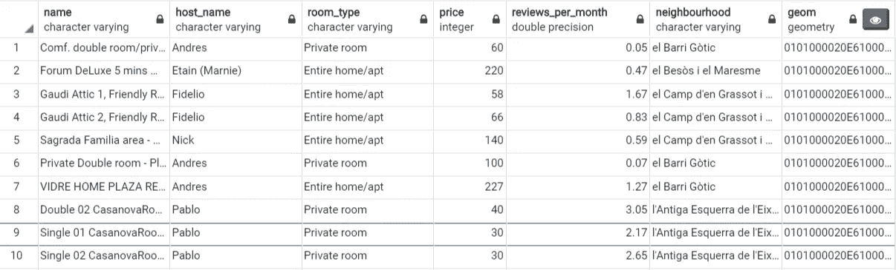
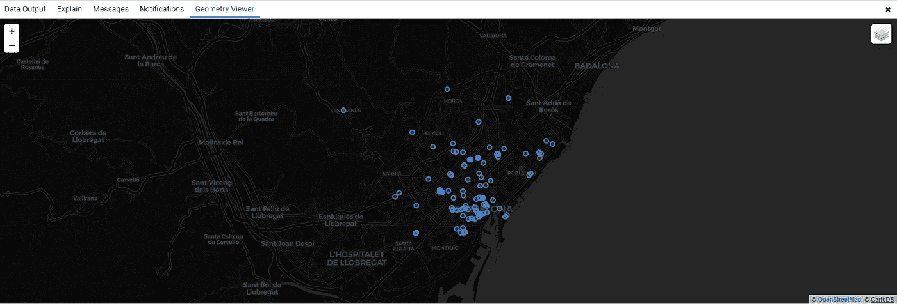
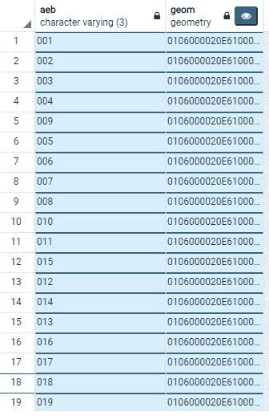
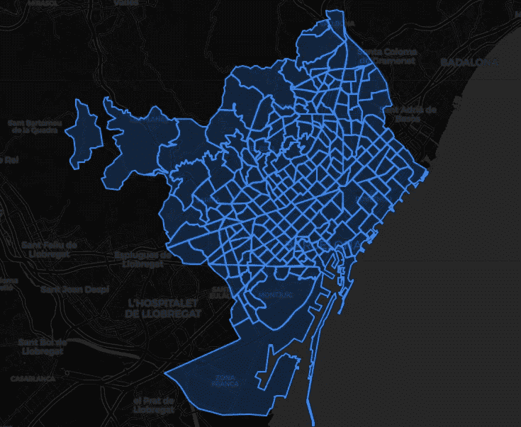
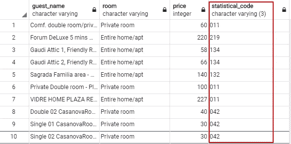
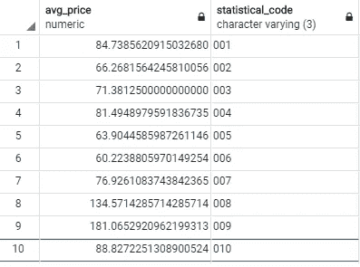
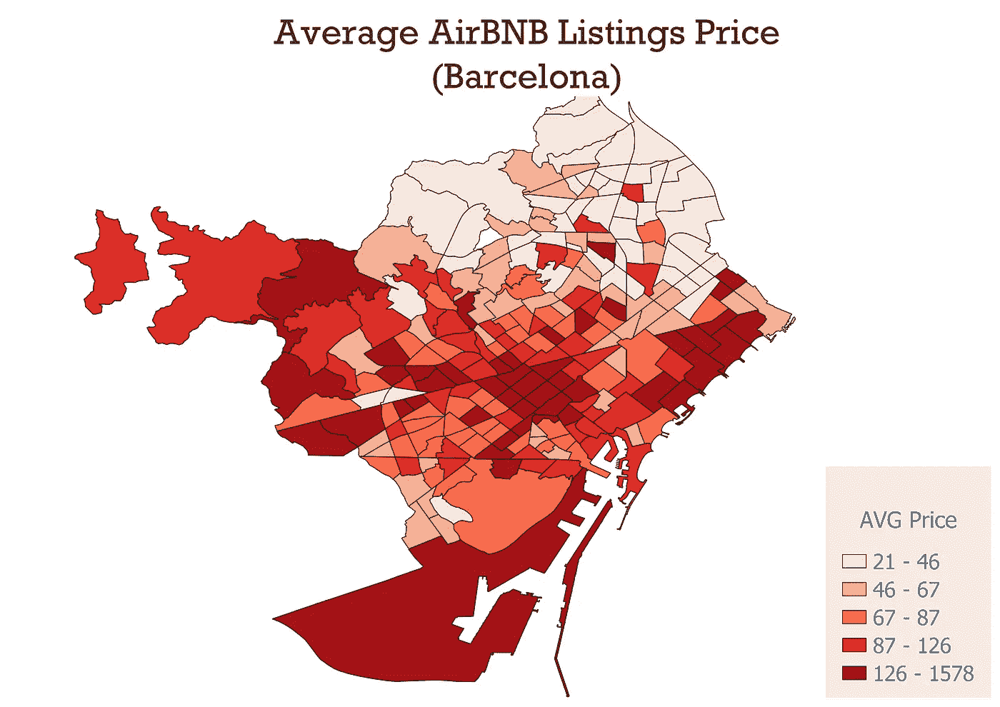

# 如何用 PostgreSQL/PostGIS 连接空间数据

> 原文：<https://towardsdatascience.com/how-to-join-spatial-data-with-postgresql-postgis-b2e25c93b4dd?source=collection_archive---------21----------------------->

## 初学者指南和教程


马克斯·拉罗彻尔在 [Unsplash](https://unsplash.com?utm_source=medium&utm_medium=referral) 上拍摄的照片

连接数据是数据科学领域的一项常见任务。虽然常规的 SQL 表连接是一个很好的特性，但空间连接的真正威力给我留下了深刻的印象。

通过空间连接，您可以基于不同表的几何关系关联它们的信息。在本教程中，我们将看到空间连接的示例以及空间连接后的要素汇总。

> 如果你是 PostgreSQL/PostGIS 世界的新手，我有一个初学者教程来设置你的环境，并通过一步一步的指导让你快速入门。

[](/spatial-data-science-with-postgresql-postgis-2f941c8c367a) [## 使用 PostgreSQL/PostGIS 的空间数据科学

### PostgreSQL 和 Python 空间数据入门实用指南。

towardsdatascience.com](/spatial-data-science-with-postgresql-postgis-2f941c8c367a) 

# 探索数据

我们在本教程中使用了巴塞罗那 Airbnb 数据集，统计面积较小。我们的任务是将 Airbnb 公共列表加入到它们所属的各自较小的统计区域中。换句话说，我们希望找出每个 Airbnb 指向的区域。最后，我们将汇总连接的数据，找出每个统计区域有多少 Airbnb 招待所。

在我们进行空间连接之前，让我们先熟悉一下数据集。我们通过查询这些列并将结果限制在前 100 个列表来查看公共列表。

```
SELECT name, host_name, room_type, price, reviews_per_month, neighbourhood, geom
FROM public.listings
LIMIT 100;
```

我们在下面显示了前十行的结果。我们有列表的名称、主机名、房间类型、价格、评论、邻居和几何图形(Geom)。几何列有一个小眼睛，允许您可视化空间数据。



Airbnb 列出巴塞罗那

这是 Airbnb 列表的几何查看器的输出。请注意，这仅限于前 100 分。



Airbnb 房源巴塞罗那 PgAdmin 4 几何查看器

现在，让我们看看统计区域数据集。我们简单地将列限制为几何图形和区域代码。

```
SELECT aeb, geom
FROM public.statistical_areas
```



巴塞罗那较小的统计区域

下图显示了使用 PgAdmin4 几何查看器可视化的统计区域多边形。



巴塞罗那统计区域 PgAdmin 4 几何查看器

在执行空间连接之前，请确保检查两个数据集的坐标参考系统(CRS)是否匹配。我们可以像这样简单地查询出每个数据集的空间参考系统。

```
SELECT ST_SRID(geom) 
FROM public.statistical_areas
LIMIT 1;
```

两个数据集都有 WGS84 CRS，因此我们可以继续执行空间连接。

# 使用 PostGIS 进行空间连接

我们已经看过数据集并检查了数据集的 CRS。现在一切都准备好了。为了连接两个数据集，我们可以使用不同的空间关系，包括`ST_Within`、`ST_Contains`、`ST_Covers`或`ST_Crosses`。在这个例子中，我们使用`ST_Within`来找出哪个点在哪个多边形内。

```
SELECT
 houses.name AS guest_name,
 houses.room_type as room, 
 houses.price as Price,
 areas.aeb AS statistical_code
FROM listings AS houses
JOIN statistical_areas AS areas
ON ST_Within(houses.geom, areas.geom)
```

结果是这个包含 Airbnb 列表的表格，其中有一个额外的列指示每个点属于哪个统计区域代码，如下表所示。



空间连接结果

太好了！如果您只想找出每个点的所属位置，那么空间连接可能就是您的最终结果。但是，我们可能需要汇总空间连接结果，以了解数据集的分布情况。

# 汇总空间连接结果

任何 SQL 聚合函数都可以在这里工作，以从空间连接的数据集中获得洞察力。假设我们想要找出每个统计街区的平均 Airbnb 列表价格。

我们只需要对标价使用平均聚合函数，并按统计区域对数据进行分组。

```
SELECT
 AVG(houses.price) AS AVG_Price,
 areas.aeb AS statistical_code
FROM listings AS houses
JOIN statistical_areas AS areas
ON ST_Within(houses.geom, areas.geom)
GROUP BY areas.aeb
```

结果就是这张表，其中显示了每个统计区域的平均价格。



这是一张显示巴塞罗那统计区域平均价格分布的地图。



巴塞罗那统计区域的 Airbnb 平均标价-使用 QGIS 创建的地图。

# 结论

在本教程中，我们了解了如何使用真实数据集通过 PostGIS 进行空间连接。我们使用几何关系成功地将 Airbnb 列表连接到它们各自的统计区域。您可以尝试使用`ST_Contains`来得到相同的结果。您可能还想尝试不同的聚合函数，比如计算每个统计区域中的列表数。