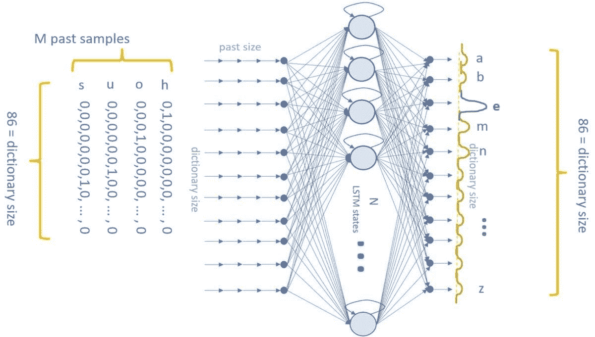
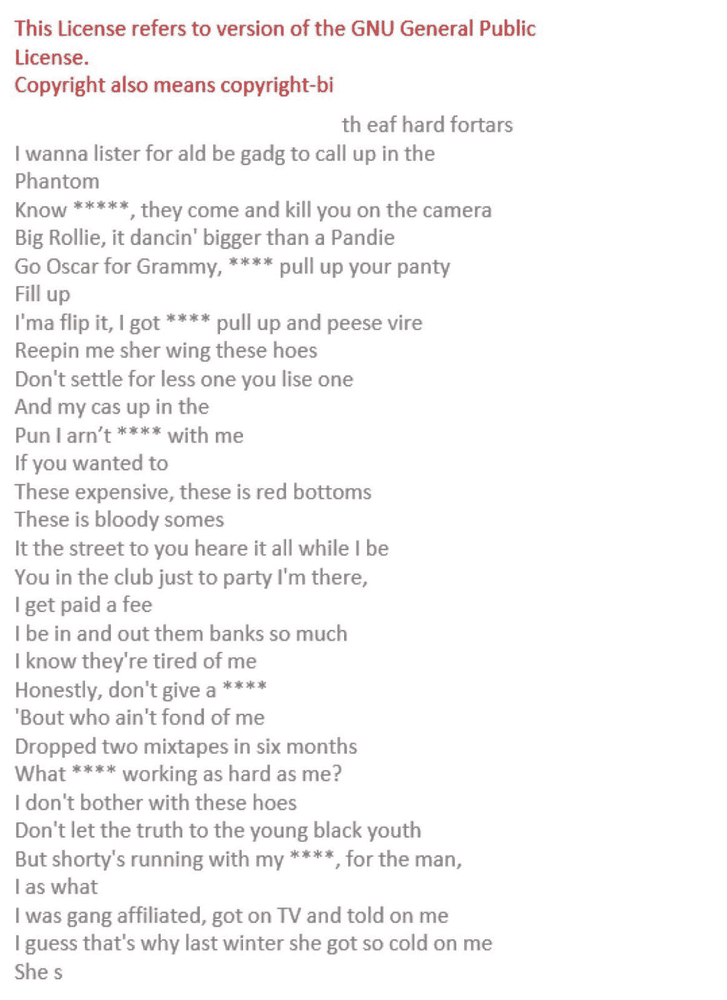

# 如何在你的人工智能模型中避免偏见

> 原文：<https://towardsdatascience.com/how-to-keep-bias-out-of-your-ai-models-1867f8a7b69?source=collection_archive---------38----------------------->

## 人工智能模型是空的，中立的机器。当用有偏差的数据训练时，他们会产生偏差

如今，人工智能(AI)中的偏见备受争议。从图像分类器[给人们的脸贴不正确的标签](https://www.theverge.com/2019/1/25/18197137/amazon-rekognition-facial-recognition-bias-race-gender)到雇佣机器人[在筛选求职者时歧视女性](https://www.reuters.com/article/us-amazon-com-jobs-automation-insight/amazon-scraps-secret-ai-recruiting-tool-that-showed-bias-against-women-idUSKCN1MK08G)，当试图自动复制它们时，人工智能似乎继承了人类最糟糕的做法。

风险在于，我们将利用人工智能创造一支种族主义、性别歧视、满嘴脏话的机器人大军，然后这些机器人会回来困扰我们。这是一个伦理困境。如果 AI 天生就有偏见，那么依赖它不是很危险吗？我们最终会塑造我们最糟糕的未来吗？

**机器将成为机器**

我先澄清一点:AI 只是一台机器。我们可以把它拟人化，但它仍然是一台机器。这个过程就像我们和孩子们在湖边玩石头一样，突然间，一块普通的石头变成了可爱的宠物石。

即使和我们的孩子一起玩，我们通常也不会忘记，一个宠物石，无论多么可爱，也只是一块石头。我们应该对人工智能做同样的事情:无论它的对话或外观多么像人类，我们都不应该忘记它仍然只是一台机器。

例如，前段时间，我做了一个机器人项目:[一个教师机器人](https://medium.com/@rosaria.silipo/emil-the-teacher-bot-ec6327e5b159)。这个想法是为关于开源数据科学软件 [KNIME Analytics Platform](https://www.knime.com/knime-analytics-platform) 的文档和特性的查询生成自动的信息答案。在所有的 bot 项目中，一个重要的问题是说话方式。

有许多可能的说话或写作风格。就机器人而言，你可能希望它友好，但不要过分友好——有礼貌，但有时会根据情况表现得很自信。博客文章“描述写作或说话风格的 60 个单词”列出了不同机器人说话风格的 60 种细微差别:从闲聊和对话到抒情和文学，从有趣和雄辩到正式，以及我最喜欢的不连贯。我的机器人应该采用哪种说话方式？

我选择了两种可能的风格:礼貌和自信。彬彬有礼到了诗意的极限。自信到近乎不礼貌。两者都是自由文本生成的问题。

作为这个教师机器人项目的一部分，几个月前我实现了一个简单的深度学习神经网络，它具有一个隐藏层的长短期记忆(LSTM)单元，以生成自由文本。

网络将 M 个字符的序列作为输入，并在输出层预测下一个最可能的字符。因此，给定输入层的字符序列“h-o-u-s ”,网络将预测“e”为下一个最可能的字符。在自由句子语料库的训练下，网络学会一次生成一个字符的单词甚至句子。

我没有从零开始构建深度学习网络，而是(跟随当前的趋势，在互联网上找到现有的例子)在 [KNIME Hub](https://hub.knime.com/) 中搜索类似的自由文本生成解决方案。我发现了一个例子，一个[类似的网络](https://kni.me/w/mGO9nXhmjzIKiqHU)在现有的真实山脉名称上进行训练，为一系列户外服装新产品生成虚拟的无版权的山脉候选名称。我下载了网络，并根据我的需要对其进行了定制，例如，将多对多转换为多对一架构。

该网络将在一组适当的自由文本上接受训练。在部署期间，将提供 M=100 个初始字符的触发语句，然后网络将继续自己组装它自己的自由文本。

*基于 LSTM 的深度学习网络，用于自由文本生成。*

**人工智能偏差的一个例子**

想象一下，一个客户或用户有着不合理但根深蒂固的期望和不可能的要求。我该怎么回答？机器人应该如何回答？第一项任务是训练网络变得自信——非常自信到不礼貌的极限。哪里可以找到一套坚定自信的语言来训练自己的人脉？

我最终在一组说唱歌曲文本上训练了我的基于 LSTM 的深度学习网络。我认为说唱歌曲可能包含这项任务所需的所有足够自信的文本。

我得到的是一个非常污言秽语的网络；以至于每次我向观众展示这个案例研究时，我都要请所有未成年人离开房间。你可能会认为我创造了一个性别歧视、种族歧视、不尊重——也就是公开有偏见——的人工智能系统。似乎我做到了。

下面是网络产生的说唱歌曲之一。前 100 个触发字符是手动插入的；这些是红色的。网络生成的文本是灰色的。当然，触发句对于为文章的其余部分设定合适的基调是很重要的。对于这个特殊的例子，我从英语中最无聊的句子开始:软件许可描述。

有趣的是，在所有可能的单词和短语中，神经网络选择在这首歌中包括“支付费用”、“昂贵”、“银行”和“诚实地”。语气可能不一样，但内容尽量符合触发句。

人工智能生成的说唱歌曲的例子。红色的触发句是软件许可证文档的开始。

关于这个网络的建设、训练和部署的更多细节可以在文章“[人工智能生成的说唱歌曲](https://www.datasciencecentral.com/profiles/blogs/ai-generated-rap-songs)”中找到

这种语言可能不是最优雅和正式的，但它有一个令人愉快的节奏，主要是由于押韵。注意，为了使网络生成押韵文本，过去输入样本序列的长度 M 必须足够。押韵适用于 M=100，但不适用于 M=50 的过去字符。

**消除人工智能的偏见**

为了重新教育我行为不端的网络，我创建了一个新的训练集，其中包括莎士比亚的三部戏剧:两部悲剧(《李尔王》和《奥赛罗》)和一部喜剧(《无事生非》)。然后，我在这个新的训练集上重新训练了网络。

部署后，该网络现在制作类似莎士比亚的文本，而不是说唱歌曲——在言语整洁和礼貌方面有了明显的改善。不要再说脏话了！不要再说脏话了！

同样，让我们从软件许可文本开始触发自由文本生成，看看莎士比亚将如何根据我们的网络进行。下面是网络生成的莎士比亚文本:红色，手动插入的前 100 个触发字符；灰色的是网络生成的文本。

即使在这种情况下，触发句也为接下来的话奠定了基调:“小偷”、“拯救和诚实”，以及令人难忘的“先生，现在耐心在哪里”都对应于软件许可证的阅读。不过这次说话风格很不一样。

关于这个网络的建设、训练和部署的更多细节可以在“[AI 能像莎士比亚一样写作吗？](/can-ai-write-like-shakespeare-de710befbfee)”

请记住，产生类似莎士比亚文本的神经网络与产生说唱歌曲的神经网络是同一个神经网络。一模一样。它只是在一组不同的数据上进行训练:一方面是说唱歌曲，另一方面是莎士比亚的戏剧作品。因此，产生的自由文本是非常不同的——正如在生产中产生的文本的偏差一样。

*人工智能生成的莎士比亚文本的例子。红色的触发句是软件许可证文档的开始。*

总而言之，我创造了一个满嘴脏话、咄咄逼人、有偏见的人工智能系统，也创造了一个非常优雅、正式、几乎诗意的人工智能系统——至少就说话风格而言。它的美妙之处在于，两者都基于相同的人工智能模型——两个神经网络之间的唯一区别是训练数据。这种偏见实际上是在数据中，而不是在人工智能模型中。

**偏入，偏出**

事实上，人工智能模型只是一台机器，就像宠物石最终只是一块石头。它是一台根据训练集中的数据调整其参数(学习)的机器。训练集中的性别歧视数据产生了性别歧视的 AI 模型。训练集中的种族主义数据产生了种族主义的 AI 模型。由于数据是由人类创造的，它们也经常有偏差。因此，产生的人工智能系统也会有偏差。如果目标是有一个干净、诚实、无偏见的模型，那么在训练之前，训练数据应该被清理并去除所有偏见。

*首次发表于* [*信息世界。*](https://www.infoworld.com/article/3514578/how-to-keep-bias-out-of-your-ai-models.html)