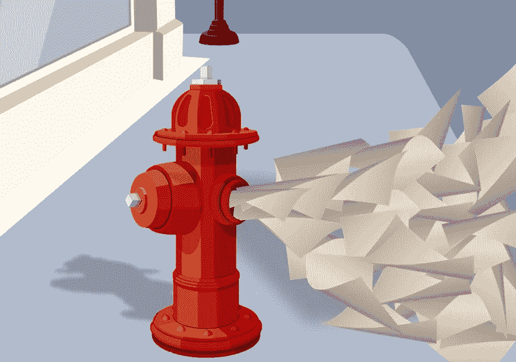
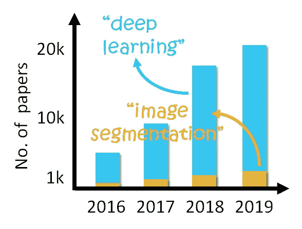
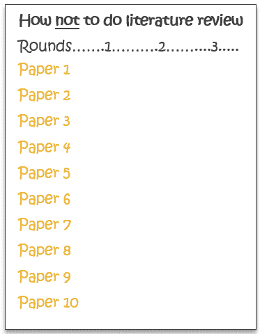
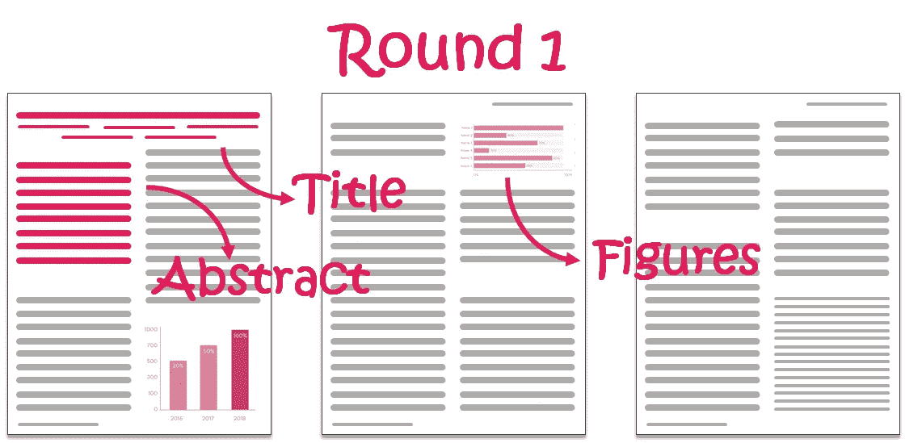
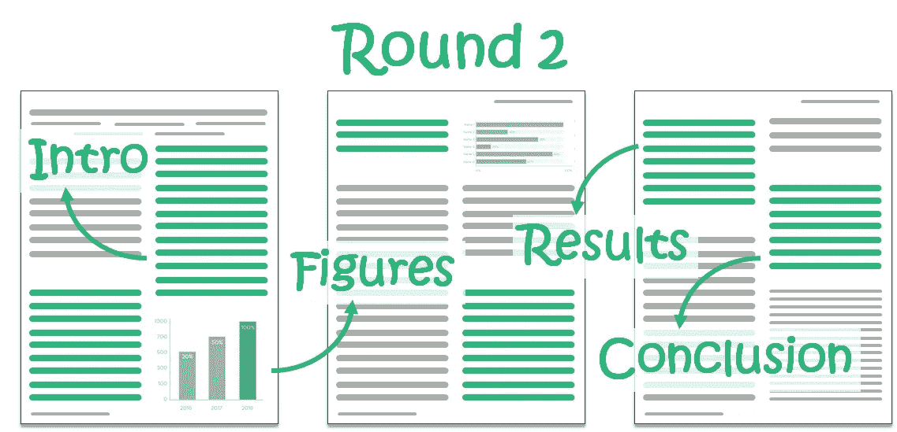
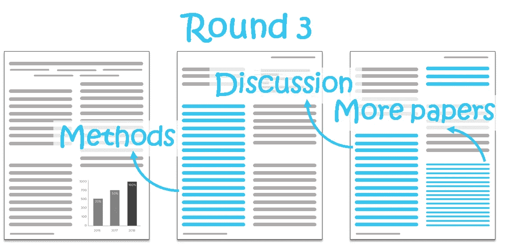
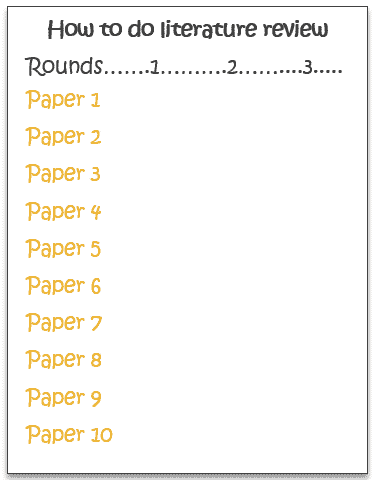
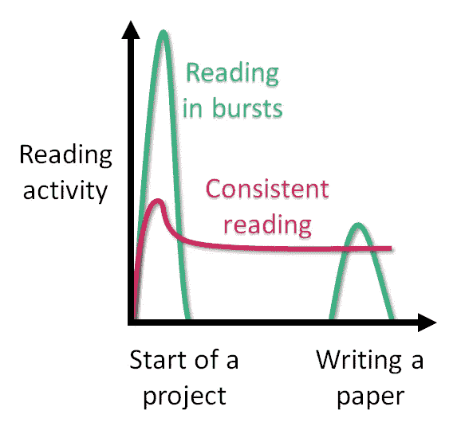

# 如何跟上学术文献

> 原文：<https://towardsdatascience.com/how-to-keep-up-with-academic-literature-15ffc40e5758?source=collection_archive---------32----------------------->

## 学会持续有效地做文献综述

跟上学术文献就像试图从消防栓喝水一样——似乎不可能跟上！(感谢[亚历克斯·科宁斯](https://profiles.stanford.edu/alexandra-konings))。来自 dlpng.com、[freepik.com](https://www.freepik.com/free-photos-vectors/paper)的作品。

学术出版正在爆炸式增长。每年有超过 250 万篇论文出版，而出版速度每年攀升 8%的事实对此毫无帮助。有这么多东西要读，很容易让人觉得我们只是在勉强维持生计。

不幸的是，跟上文学是那些事情中的一件——就像走路——并没有真正教给我们。我们被期望自学它。然而，在过去的几年里，我意识到，即使我们有自己查找和阅读论文的风格，也有一些被许多人掌握的、但不为所有人所知的良好实践。只有在我坐在教室里学习如何跟上文学之后，这一点才变得明显起来(吴恩达的讲座)。

在这篇文章中，我将把这些教训与来自我的同事、教授和我自己的经验的其他有价值的见解结合起来。到文章结束时，我们会学到:

1.  如何找到与我们相关的论文？
2.  如何使用三遍法有效地阅读这些论文？
3.  为什么持续的阅读胜过突发的活动？

## 读什么？一套精心策划的文章。

甚至在我们学会如何高效阅读之前，跟上学术文献的一个方法就是缩小我们的范围，仔细选择我们阅读的内容。除非你是一个像达芬奇一样的博学者，否则你感兴趣的领域很可能很窄，可以用 6-10 个关键词来定义。因为我是一名地球科学家，所以我使用“野火”、“森林死亡率”等关键词。

你可以使用尽可能多的关键词来定义你的范围，但是要尽量保持每个关键词的明确性。比如“深度学习”就是一个很可怕的关键词，因为它不够具体。这将导致数以千计的不相关的文件，在其中找到与你相关的就像大海捞针一样困难。另一方面，“图像分割”是一个很好的关键字，因为它是特定的。最后，不要羞于及时更新你的关键词，以反映你不断变化的兴趣。

使用像“图像分割”这样的特定关键词比使用像“深度学习”这样的宽泛关键词更好，这样可以减少混乱，并使你的阅读列表易于管理。数据来源:科学网。图片作者。

一旦你定义了你的关键词，使用以下资源收集与你相关的文献-

1.  在(免费)、 [Scopus](https://www.elsevier.com/solutions/scopus) (付费)，或者[科学之网](https://apps.webofknowledge.com/)(付费)上在线搜索。此选项仅对一次性搜索有效。你不能仅仅依靠这个来让自己跟上文学的发展(稍后解释)。
2.  **会议记录**
3.  **Twitter** - 用你的关键词搜索合适的人，关注他们。
4.  **朋友和同事**——利用你的关系网找到合适的论文。如果你找到他们地区的文件，你可以还他们人情。
5.  [**谷歌学术提醒**](https://scholar.google.com/scholar_alerts?view_op=list_alerts&hl=en)——用你的关键词设置提醒，或者“关注”你感兴趣的教授。
6.  **目录** -设置接收杂志目录的提醒，你所在地区的文章经常在这些杂志上发表。JournalTOCs 是一个很棒的服务，因为它为大多数期刊合并并发送提醒。对于浏览目录的重要性，人们有不同的看法。然而，我发现克服这种盲目的感觉是很有用的——它让我们得以一窥更广阔的科学世界的发展。

一旦我们使用我们的关键词编辑了一个精选的论文列表，我们就可以使用三遍方法来阅读它们。

## 如何阅读？三重途径被形象化了。

阅读论文时，我们要确保在略读其余部分的同时，详细阅读所有重要和相关的论文。当然，事先无法知道什么是重要的。因此，从头到尾阅读每篇论文并不是对我们时间的有价值的利用，因为每篇论文的相关性不同——有些可能对它们的背景很重要，有些可能有助于激励我们的特定项目，有些可能有我们想要复制的分析，有些可能有与我们最初的假设相反的结果(因此通读非常重要)。

不要浪费时间从开始到结束依次阅读每篇论文。图片作者。

我发现阅读论文的[三步法(S. Keshav 的论文)](https://dl.acm.org/doi/pdf/10.1145/1273445.1273458)不仅帮助我识别项目的重要论文，还让我专注于每篇论文中的相关部分。通过这种方式，我可以在每篇论文中进行多次传递，每次传递都有更大的深度

**第一轮:亮点。**

第一轮:标题、摘要和图片+说明文字。来自 freepik.com[的作品](https://www.freepik.com/free-photos-vectors/infographic)。

第一轮包括阅读标题、摘要和图表+说明。这一轮的目的是抓住一篇论文的重点，而不是通过它的细节。标题和摘要有助于我们抓住论文的主要结论。这些数字提供了一目了然的结果。

请记住，我们仍然没有了解到确切的结果，或者这篇论文的背景，这很好。在这个阶段，我们最感兴趣的是论文的“内容”，而不是“为什么”或“如何”。由于第一轮相当短，我在这一轮中涵盖了我从上一节收集的每一篇论文。

在第 1 轮中需要记住的一些思考内容:

1.  作者试图完成什么？
2.  如何使数字变得更好？(不管论文内容如何，这是一项需要学习的有用技能)

在第一轮结束时，我们可以筛选出那些显然与我们感兴趣的主题无关的论文。然后我们进入第二轮。

第二轮:核心。

第 2 轮:介绍、结果、结论、图表+标题，略读其余部分。来自[freepik.com](https://www.freepik.com/free-photos-vectors/infographic)的艺术品。

第二轮包括阅读引言、结果、结论、图表和说明，并略读其余部分。这是我们真正开始理解报纸的地方。导言将帮助我们适应研究的需要，而结果和结论将帮助我们清楚地理解论文的发现。我发现这是我学得最多的一轮。

在第二轮中需要记住的一些提示:

1.  有哪些想法或数据可以自己用？
2.  你想关注哪些参考资料？

第三轮:细节。

第 3 轮:方法、讨论、参考资料，略读其余内容。来自 freepik.com[的艺术品](https://www.freepik.com/free-photos-vectors/infographic)。

第三轮包括阅读方法，讨论，记下一些参考文献，略读其余的。这一轮是为了深入文件。通过详细研究这些方法，我们应该对自己能够复制这种方法相当有信心。因为我们在第三轮深入研究论文，所以这一轮只讨论那些与我们感兴趣的主题直接相关的论文。

由于我们在这一轮结束时已经经历了多轮，这是一个很好的时间来记录最初一组论文中被频繁引用的所有论文。在第三轮中，对讨论部分的额外关注也应该为我们指出具有类似发现的其他相关论文，或者这些结果可能非常重要的地方。

在第三轮中需要记住的一些提示:

1.  该方法的关键要素是什么？
2.  你想关注哪些参考资料？

三通是什么样子的。图片作者。

通过这种三关方法，我可以每周通读大约 25 篇论文，而不用在那些与我当前兴趣不太相关的论文上花费太多时间。因此，它节省了我大量的时间，而不会影响我对学术文献的需求。但是，只有经常执行，才算成功。

## 什么时候读书？天天！

如果你从这篇文章中只学到一样东西，那就是这个- **说到阅读，坚持胜过活跃。虽然文献综述在新项目的开始阶段无疑是有用的，但它并不是一项只针对开始阶段的活动。不坚持复习文献，会让我们变得过时。在像深度学习这样的新兴领域，更是如此，4 年前的论文被认为是旧的。**

目标是与你的阅读保持一致。图片作者。

与阅读不一致是危险的，原因有二

1.  一旦第一轮文献综述完成，我们就不再了解我们领域的最新发展
2.  很有可能会错过一些我们最初没有涉及的重要文件

在一次会议上，当有人在我的报告后问我，“当论文 Y 表明它在像你这样的案例中不成立时，你为什么假设 X？”一般来说，这类问题有几个可以接受的答案，但没有一个是以*开头的，“我没有读过那篇论文，但是……”。*从那以后，我每晚睡觉前都会阅读至少一篇论文，这极大地帮助了我跟上文学的脚步。

> 一天一份报纸让你远离尴尬。

## 结论

在这篇文章中，我们学习了如何跟上学术文献。虽然网上搜索是可以的，但使用经常给我们提供论文的工具，如学者提醒或目录提醒，是至关重要的。有了一套精选的论文，我们可以遵循三步走的方法来有效地通读它们——首先抓住重点，然后进入核心，最后理解论文的细节。在每一轮结束时，随意扔掉与你感兴趣的话题无关的论文。最后，通过我自己的尴尬经历，我希望你重视每天阅读的需要，不要把文献综述作为一次性活动。