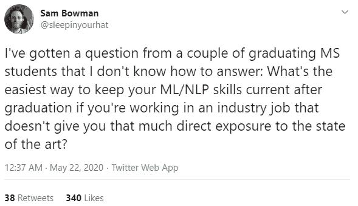
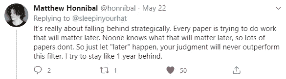
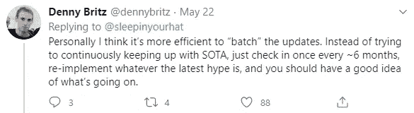

# 如何在不需要人工智能的工作中跟上人工智能的最新发展

> 原文：<https://towardsdatascience.com/how-to-keep-up-with-the-latest-in-ai-while-working-in-jobs-that-doesnt-need-it-ff830d6f6f78?source=collection_archive---------63----------------------->

## 思考如何平衡学习 SOTA 的需要和工作生活义务的现实。

鸣谢:Unsplash [@jon_chng](http://twitter.com/jon_chng)

# 介绍

*本文是由* [*山姆·鲍曼*](https://twitter.com/sleepinyourhat/status/1263509234936950786?s=20) *对这条推文(下图)的总结。大部分内容取自原始帖子的回复，并与我自己的经历交织在一起。*

如果你在数据科学领域工作，你可能会认识以前问过这个问题的人(或者那个人实际上就是你自己)。尤其是如果你在一家非科技公司工作(实际上，即使是科技公司也能务实地解决他们的问题)——你的公司可能不会期望你花太多时间去阅读/研究/学习“艺术之初”( SOTA)的技术来解决你的业务问题。

这真是一个两难的选择。一个有时相当令人沮丧的问题。

这是一个两难的问题，因为成为一名优秀的数据科学家的一部分是推动数据科学所能提供的边界，但在你的工作场所并不鼓励你这样做。

令人沮丧的是，你总是隐隐约约地怀疑你当前生产系统中部署的任何东西都可以很容易地被最新的 SOTA 技术取代，但你却没有获准花一些工作时间阅读一些相关的研究论文，进行实验和 A/B 测试你的假设。

那么，一个数据科学家应该怎么做才能跟上世界的潮流呢？

一方面，成为一名体面的数据科学家的驱动力迫使你跟上最新的 AI/ML 进展，但在硬币的另一面，每天有这么多的论文要读，在这么多的领域发表。在一家对推动人工智能领域的发展不感兴趣的公司工作绝对没有帮助。

# 战略

从推特的帖子来看，这里有一些我喜欢的策略(也许对你也有用)。

## **1。错开你的学习**

我喜欢上面的是，它让你不再需要总是关注最新的 SOTA 算法，而是迫使你专注于最终目标(即解决商业问题)。是的，你会迟到一会儿(FOMO 是真的)。但是你也可以在其他事情上保持一点点理智(比如帮助孩子做作业或者和你的妻子出去购物)。

我记得几年前伯特论文发表的时候，每隔几周你就会看到一个新的伯特变种出现，并声称 SOTA 分数。我不认为测试所有不同的嵌入是对您时间的有效利用——而且它们可能不会增加您的知识深度水平(因为当每个人都渴望证明一些东西时，在快速上升期间事情会很快变得陈旧)。

因此，在采用一种技术之前，有一个间隔年(或 6 个月)让尘埃落定，对我来说听起来是个不错的策略。更不用说在这一年的时间内，已经有大量的研讨会、教程、文章、视频、示例代码以及您需要快速了解的算法要点，以及如何有效地部署它(在您非常熟悉的框架中)。

## 2.听播客

在我看来，播客是消费最新 SOTA 最简单的方式。一天的通勤时间(Covid 19 之前)大约花费我 3 小时的时间(来回)，一集播客通常在 30 分钟到 1 小时之间，取决于提供商。这意味着在一周内，它会总结出 15 个小时的高质量内容，如果我觉得这个话题有趣，我可以随时回去看。

我最喜欢的如下:

1.  TWIML(涵盖整个人工智能领域、垂直业务和 ML Ops)
2.  NLP 亮点(Allen NLP 人员采访其他 NLP 专家)
3.  Lex Friedman 的人工智能

## 3.加入一个虚拟的纸质阅读小组

如果说新冠肺炎有什么好消息的话，那就是它已经成为许多公司虚拟知识共享的催化剂。我最近关注的一些问题是:

1.  Stitchfix 制作的 [Algo Hours](https://multithreaded.stitchfix.com/blog/2020/05/15/leland-mcinnes-algo-hour/) (录像可在 Youtube 上获得)
2.  [深度学习沙龙](https://www.meetup.com/Weights-Biases-Meetup/)通过权重和偏见(Youtube 上有录音)。
3.  HuggingFace 已经在各种技术会议和他们的 Youtube 频道上分享了许多内容，但还没有开始分享内部讨论。然而，他们确实会在 [Github](https://github.com/huggingface/awesome-papers) 上分享他们正在阅读的内容。

4. [Kaggle 阅文组](https://www.youtube.com/playlist?list=PLqFaTIg4myu8t5ycqvp7I07jTjol3RCl9)。它很过时了(最后一次更新是在 2019 年 12 月，所以可能没那么老……)，但是涵盖了很多 NLP 研究论文。准备人:Kaggle 的 Rachael Tatman。

5.由 dair.ai 的 elvis 主持的论文阅读&讨论 dair . ai，这是一个相当新的发现，我还没有时间深入研究他们的材料。不过，过去录音的标题看起来确实很有趣。

然而，回到现实，我从来没有刻意去观看或参加每一场直播的知识分享会(通常在中午 12 点左右+)。我通常会做的(Covid19 之前)是查找记录，将其保存在我的手机上(这对 Youtube 来说很容易)，并在通勤期间观看它们。

当然，现在我大部分时间都在家里工作，每当我休息或什么的时候，我总是可以直接在 Youtube 上观看它们。大多数时候，我通常会专注于与我可以立即使用的东西相关的东西(回到上面的第一点)或者正在某个地方的商业环境中应用的东西(而不仅仅是最新的 SOTA)。

## 4.社区/社交媒体

前面提到的项目指出了你可以自己学习的事情。但是请注意，在大多数情况下，没有一个反馈环告诉你到目前为止你所学到的是否正确。

这就是与社区保持联系的好处。我能想到的一些好处是:

1.  检查和平衡你的理解。
2.  众筹解决问题的最快方法。一般来说，人们都很慷慨，只要你不被认为是在虐待他们。
3.  能够加入各种主题的学习小组(从初级到高级)。TWIML ( [本周在机器学习](https://twimlai.com/community/))和 MLT ( [机器学习东京](https://machinelearningtokyo.slack.com/) ) Slack group 上的那些甚至为各个地理区域举办会议来迎合观众)。对于 fastai 库的用户来说， [fast.ai 社区](https://forums.fast.ai/)尤其活跃在他们的话语页面上。
4.  通过 Twitter/Slack 等平台直接接触行业先锋和开拓者。关于这个平台，我最喜欢的是该领域专家的推文(以及他们的回应，比如激发这篇文章的那条)。能够通读来自书籍作者、讲师、研究人员和人工智能圈名人录的关于 ML 最佳实践、数据伦理、NLP 技术和其他主题的来回讨论总是令人耳目一新。

## 5.做

最终，一个人需要积极地工作在代码上，并构建一些东西来真正欣赏已经获得的知识。研究源代码，从事自己的项目，参加 Kaggle 竞赛，甚至写下你所学到的东西——将极大地帮助巩固你的理解，并将它保存更长的时间(即刻意练习)。

# 结论

与 AI/ML/NLP 的最新发展和艺术状态保持同步可能是一项艰巨的任务——如果你的日常工作不需要你处于 AI 研究的前沿，就更是如此。

在这篇文章中，我们介绍了一些如何跟上 ML/NLP 最新发展的技巧。总结一下，不容易。但更重要的是，也许你真的不需要停留在进步的前沿。

随着这些天 NLP 领域的进展越来越快——想要跟踪每周出现的每一件事情可能都不是一件好事。一个更好、更简单的方法是错开投入的比例，这样既能让同类中的佼佼者脱颖而出；同时也从炒作的循环中过滤掉虚假的声明。

其余的建议围绕着在业余时间消耗知识，利用网络进行信息过滤，以及分配一些时间进行有意识的练习。