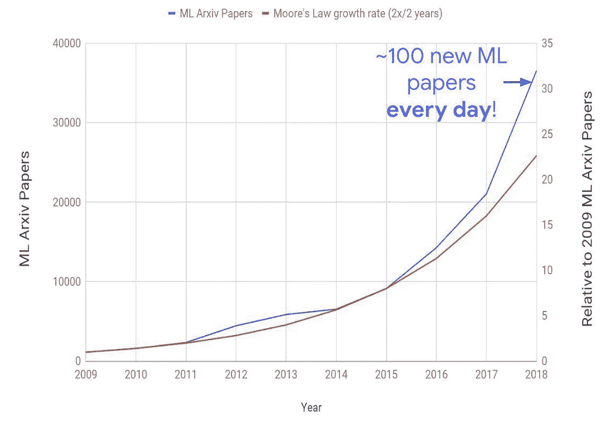
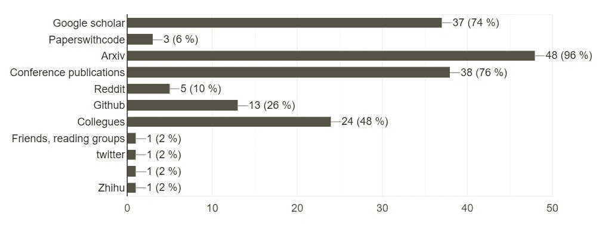
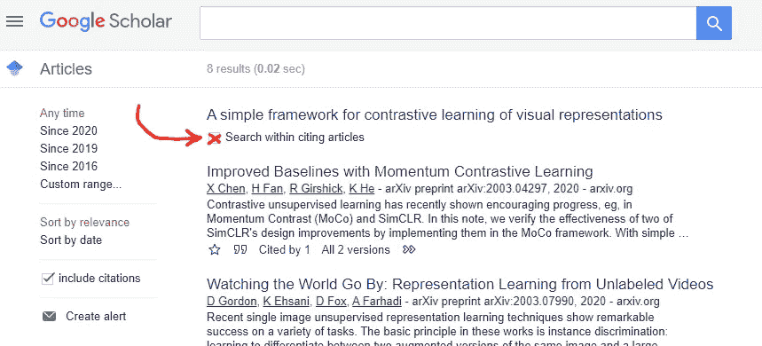

# 如何跟上 ML 的最新研究和趋势

> 原文：<https://towardsdatascience.com/how-to-keep-up-with-the-latest-research-and-trends-in-ml-a45a356b1001?source=collection_archive---------24----------------------->

对 ML 的大肆宣传导致该领域的研究和兴趣急剧增加。在这篇文章中，我分享了我追踪最新研究和趋势的方法。

ML 中的出版物数量呈指数级增长。下面的图表来自 2020 年的 Jeffrey Dean，图表显示，自 2009 年以来，我们已经增长了 30 倍。现在，跟上该领域的发展趋势和研究进展变得更加困难。你是如何跟上时代的？

摘自[院长 2020 年](https://arxiv.org/ftp/arxiv/papers/1911/1911.05289.pdf)

接下来，我们将首先看看其他人是如何跟踪这个领域的，然后我将分享我在过去几年在[轻松地](https://www.lightly.ai/)工作期间收集的技巧和诀窍。

# 其他研究人员是如何跟上最新研究的？

2019 年，我们对 CVPR、ICML、ICCV、NeurIPS 等会议接受的出版物作者进行了调查。来自学术界和行业研究实验室的 50 名研究人员参加了调查。

根据我们的调查，我们在 2019 年 3 月进行了调查

三个来源突出， [Arxiv](https://arxiv.org/) 、会议和[谷歌学术](https://scholar.google.com/)。

**Arxiv** 托管出版物的重印版，并对公众开放。这与 ML 研究人员对公开分享和传播他们的工作的强烈兴趣相结合，使其成为查找论文的首选地点之一。

会议可能是与该领域其他感兴趣的人进行身体交流的最佳场所。此外，他们列出了所有被接受的出版物，并向公众开放。我给你加了 [CVPR 2019](http://openaccess.thecvf.com/CVPR2019.py) 、 [ICML 2019](https://icml.cc/Conferences/2019/Schedule) 、 [NeurIPS 2019](https://nips.cc/Conferences/2019/Schedule) 、 [ICLR 2020](https://openreview.net/group?id=ICLR.cc/2020/Conference) 的链接。你也可以在网上找到会议发言的录音。我在这里列出了一些: [CVPR 有自己的 YouTube 频道](https://www.youtube.com/channel/UC0n76gicaarsN_Y9YShWwhw/playlists)，[对于 ICML，你可以在 YouTube 上简单地搜索“ICML 2019”来找到相关的演示文稿](https://www.youtube.com/results?search_query=icml+2019)，[对于 NeurIPS](https://www.youtube.com/results?search_query=neurips+2019) 也是如此。

**谷歌学术**可能是最广泛的关于 ML 出版物的数据库。它允许我们在引文中搜索(如下面我的一个提示和技巧所示)以及按出版日期过滤。例如，这将很容易过滤掉 2020 年后出现的所有引用 BERT 的公开论文。

人们不能忘记在同一领域工作的同事的重要性。我定期与来自世界各地的朋友交流，讨论我们最近感兴趣的论文。找到志趣相投的人的一个方法是参加当地的聚会小组。

我发现有趣的是 **GitHub** 越来越重要。我已经看到越来越多的存储库显示了“牛逼论文”的列表，例如[牛逼-深度视觉](https://github.com/kjw0612/awesome-deep-vision)、[牛逼-深度学习论文](https://github.com/terryum/awesome-deep-learning-papers)。我不期望这些来源总是最新的，但是在一个地方有一个更有影响力的论文的“摘要”可能是方便的。

# 我觉得非常有用的提示和技巧

我将总结一些帮助我提高效率的要点。我使用的主要渠道是 Twitter、Reddit 和谷歌学者引文搜索。

**创建一个 Twitter 账户，关注其他研究人员** 尽管 Twitter 在我们 2019 年的调查中只获得了几票，但我觉得它对我保持最新状态有很大帮助。大多数与我的领域相关的 ML 研究人员都在推特上发布他们最新的研究论文。只要跟踪他们，每周查看几次我的 twitter 账户，我就能跟踪他们的工作。此外，他们经常转发他们喜欢的领域的其他新论文。因此，只要关注几十名研究人员，你就已经可以在 twitter 上看到很多有趣的新论文了。如果你是一名研究人员，还没有 Twitter 账户，那就创建一个，让其他同事随时了解你的工作进展。

**使用 Reddit，不仅可以找到新的论文，还可以对它们进行讨论** 我喜欢 Reddit 的一点是，在对他人的工作给出反馈时，人们会更加直接和诚实。我想强调一下[机器学习子编辑](https://www.reddit.com/r/MachineLearning/)。这个 subreddit 有将近 100 万用户。你不仅会发现许多新的有趣的出版物，还会在评论区看到其他人的评论和想法。使用 Reddit 时还有另一个好处:你经常会发现与你的领域没有直接关系的论文。作为计算机视觉领域的人，你也会发现关于 NLP 或语音识别的论文。就个人而言，我非常欣赏这一点，因为它让我能够看到跨数据类型和行业的研究模式。此外，它给了我一个自我监督学习的一般进展概述。2018 年， [BERT](https://arxiv.org/abs/1810.04805) 使用自我监督的预训练在 NLP 中展示了巨大的成功。2019 年取得了跨界突破，并被证明对计算机视觉具有不可估量的价值。

**使用谷歌学者的“引文搜索”功能** 对我来说，谷歌学术是找到与我当前研究相关的其他相关论文的最重要工具之一。假设我们想要在 Google scholar 上引用 SimCLR 的[文章中搜索特定文本。只需切换“在引用文章中搜索”复选框，您将在引用 SimCLR 的文章中进行搜索。Arxiv 有一个在引文中搜索的类似功能，但是我个人偏好谷歌学术搜索。](https://scholar.google.com/scholar?cites=13219652991368821610&as_sdt=2005&sciodt=0,5&hl=en)

切换复选框，在引用谷歌学术的文章中进行搜索

**在一次会议上检查论文是否被接受** 我经常看到自己落入这个陷阱。Arxiv 已经成为 ML 论文的热点之一。然而，提交给 Arxiv 是非常容易的，有时甚至太容易了。没有同行评审程序，例如，你可以在著名的会议上进行。[你只需要已经注册的人的“认可”。](https://arxiv.org/help/submit)这有其利弊。一方面，实验，其结果将不足以为其他会议可以出现在 Arxiv。不太成功的实验不像成功的实验那样享有相同的曝光度，但它们可以为我提供一些有价值的知识，这个简单的平台使它们可以公开。另一方面，在 Arxiv 上也可能出现错误的实验、错误的数字和结果。为了保持对这一缺点的警惕，快速检查您在 Arxiv 上找到的论文是否也被该领域的任何会议接受总是好的。

**查看论文评论** 对于一些论文，你会在 [OpenReview](https://openreview.net/) 上找到反馈。举个例子，我在这里为你链接了 Karras et al .[Progressive GAN 的反馈，2018](https://openreview.net/pdf?id=Hk99zCeAb) ，[。并非所有的反馈都对你有用，因为你不是该出版物的作者。但它仍然可以帮助你更详细地理解某些部分，并了解其他工作与它的区别。](https://openreview.net/forum?id=Hk99zCeAb)

你如何跟踪你所在领域的相关研究和趋势？请在评论中分享你的建议和窍门。

Igor 联合创始人
[lightly.ai](https://www.lightly.ai/)