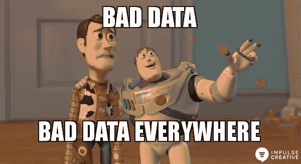

# 如何启动你的第一个数据博客？

> 原文：<https://towardsdatascience.com/how-to-kick-start-your-first-data-blog-9b850a0b8f46?source=collection_archive---------45----------------------->

弗兰基·查马基通过 [Unsplash](https://unsplash.com/photos/1K6IQsQbizI) 拍摄

除了“*之外，这可能是我最常被问到的问题了。你是如何找到数据科学/数据分析方面的工作的？*“我将写另一篇关于我求职历程的博客，所以这篇博客将关注如何在没有*工作的情况下获得行业曝光率*。

我之前在 [DIPD @加州大学洛杉矶分校](https://medium.com/u/4a46ecbb658d?source=post_page-----9b850a0b8f46--------------------------------) — *就这个话题做过一次[演讲，这个学生组织致力于增加产品和数据领域的多样性和包容性，是我共同创立的。](https://www.dropbox.com/s/9z3d7r5lyhkkuvs/DIPD%202020%20_%20Data%20Blogging%20Workshop.pdf?dl=0)*然而，我的目标是扩展这个主题，让更多的人了解它。

我希望这篇文章能激发越来越多的数据爱好者开始他们自己的博客。

对我们许多人来说，这可能是一个艰难的时期，但这也是增强和提升你在数据科学和分析方面的技能的黄金时间。如果你的工作在这个时候受到了影响， ***把不幸的*******当作一个休息、反思和启动你的个人项目***——时间不允许时奢侈的事情。*

> *“当一扇门关闭时，另一扇门会打开”——亚历山大·格雷厄姆·贝尔*

*艰难并不能决定你是谁，是你的态度和毅力决定了你的价值。让我们开始吧！*

# *从哪里开始？*

**

*卡尔·海尔达尔通过 [Unsplash](https://unsplash.com/photos/KE0nC8-58MQ) 拍摄的照片*

> *从小规模开始，逐步扩大*

*在我们开始任何项目之前， ***先缩小你的兴趣范围*** 。这是你的个人项目，所以你有完全的自主权。找到让你兴奋的事情，让你有动力投入时间！*

*一路上会有很多挑战，可能会阻止或转移你完成项目，让你坚持下去的应该是与你的兴趣密切相关的分析主题。它不一定是世界之外的东西。问问自己什么对你来说是重要的，为什么我们要在乎它。*

*当我刚开始时，我知道我全心全意地关心心理健康和获得更多正念的方法。所以我更深入地分析了[排名前六的冥想指导应用](/mindfulr-how-app-store-review-mining-can-boost-growth-improve-product-and-increase-monetization-4d50e20e9834)，以了解哪一个最适合我的偏好。*

# *获得灵感*

**

*与 Raj 通过 [Unsplash](https://unsplash.com/photos/o4c2zoVhjSw) 公路旅行的照片*

> *读，读，读！*

*我在加州大学洛杉矶分校[的研究助理职位中学到的最重要的关键因素之一是平衡分析和文献综述之间的工作量。这意味着，我们需要找到过去已经做了什么，并找出在这些发现的基础上你可以做出哪些补充或独特的方面。我的阅读来源各不相同，从媒体，分析 Vidhya，统计书籍到任何我能在互联网上找到的相关资料。](http://cresst.org/)*

*以我的[微妙的夫妻特质](/a-subtle-analysis-on-couples-music-and-movie-tastes-via-spotify-netflix-df40ce274383)分析为例。通过 Spotify API 在音乐品味分析领域已经做了一些工作，但还没有人真正深入研究电影。所以我抓住这个机会，发现了我们夫妇对音乐和电影的狂热爱好的交集。*

# *寻找合适的工具箱*

**

*Giang Nguyen 通过媒体 [MinfulR 拍摄的照片](/mindfulr-how-app-store-review-mining-can-boost-growth-improve-product-and-increase-monetization-4d50e20e9834)*

*现在，到了这一步，您需要确定要收集哪些数据，并为这项工作找到合适的工具。 ***这部分一直与我作为数据分析师的行业经验有着内在的共鸣*** 。这确实是最具挑战性和最耗时的部分。*

*对于这一阶段的分析，我最好的建议是问很多实际问题，并提出一些你需要通过数据来回答或证明的假设。我们还必须注意项目的可行性，否则，你可以更灵活地调整你的方法，使之更可行。*

**注意，可以使用自己最得心应手的编程语言:)我相信 Python 或者 R 都有自己的优势和很棒的支持数据包。**

*我过去项目中的一个例子可以阐明这个策略。我对与抑制新冠肺炎相关的非药物因素很好奇，所以我列出了所有我能想到的变量，如天气、个人防护用品、重症监护室床位、隔离等。然后我开始对开源数据集进行大规模研究。*

> *“所有的模型都是错误的，但有些是有用的”——乔治·博克斯*

*由于我没有公共卫生方面的背景，为这种类型的疫情数据建立预测模型是一个巨大的挑战。我首先从一些我熟悉的模型开始，如随机森林或贝叶斯岭回归。然而，我发现疫情通常遵循逻辑曲线的趋势，即病例在一段时间内呈指数增长，直到达到拐点并趋于平稳。这里指的是流行病学中的[房室模型](https://en.wikipedia.org/wiki/Compartmental_models_in_epidemiology)。我花了将近两周的时间来学习这个模型并将其应用到我的分析中，但结果非常令人着迷。我最终写了一篇关于此事的[博客](/covid-19-what-do-we-know-about-non-pharmaceutical-interventions-ba5c9f4150bb?source=user_profile---------0-----------------------)。*

# *该过程*

*如果你在数据科学/分析领域工作，这对你来说并不陌生— *“数据科学家 80%的时间都用于准备(简单地查找、清理和组织数据)，只有 20%的时间用于构建模型和执行分析。”**

**

*照片由[冲动创意](https://www.impulsecreative.com/)*

*清理数据的过程可能很繁琐，但是当你做对了，你的分析就会更有价值，更有意义。以下是我在分析工作流程中采用的典型流程:*

*1)收集数据*

*2)清理数据*

*   *[检测异常值和异常值](https://heartbeat.fritz.ai/how-to-make-your-machine-learning-models-robust-to-outliers-44d404067d07)*
*   *[缺失值故障排除](/how-to-handle-missing-data-8646b18db0d4)*
*   *[解码并克服不平衡类](https://machinelearningmastery.com/tactics-to-combat-imbalanced-classes-in-your-machine-learning-dataset/)*
*   *重新格式化变量名和类型*

**更多…**

*3)基于项目的技术*

*   ***(NLP)** 情感分析、POS、话题建模、BERT 等。*
*   ***(预测)**分类/回归模型*
*   ***(推荐系统)**协同过滤等。*

**更多……**

*4)写下见解和建议*

# *将这些点连接起来*

*这是分析中最重要的部分。我们如何将分析见解与现实环境联系起来，并提出可行的建议？不管你的项目的重点是什么，是关于机器学习、深度学习还是分析， **w *你的分析/模型试图解决什么问题？****

**

*照片由 [Quickmeme](http://www.quickmeme.com/meme/3uowt0) 拍摄*

*想象一下，我们建立一个高度复杂的模型来预测有多少媒体读者会为你的博客鼓掌。*好吧，这有什么重要的？**

*将其与潜在影响联系起来！如果你的帖子从 claps 获得更多的支持，它可能会在[媒体](https://medium.com/u/504c7870fdb6?source=post_page-----9b850a0b8f46--------------------------------)平台上更频繁地被策划和展示。如果更多的付费媒体读者找到你的博客，你可能会通过媒体合作伙伴计划赚更多的钱。这才是影响！*

*然而，这并不总是利润驱动的影响，它可能是社会，健康，甚至环境影响。这只是如何将技术概念与现实世界的实现联系起来的一个例子。*

# *障碍*

*你可能会在旅途中的某些地方碰壁。我最好的一条建议是主动 ***寻求帮助*** ！*

*除了向朋友、同事或导师寻求建议之外，我经常发现在在线问答平台上搜索或发布问题很有帮助，如 [Stack Overflow](https://stackoverflow.com/) 、 [StackExchange](https://stats.stackexchange.com/) 、 [Github](https://github.com/) 、 [Quora](https://www.quora.com/) 、 [Medium](https://medium.com/) 等等！在寻求解决方案时，要有耐心和创造力。如果在线解决方案还没有解决您的问题，请尝试考虑另一种方法来针对您的数据或代码版本的特征定制解决方案。*

> *写作的艺术是重写。*

*当我第一次向 Medium 发布我的第一个数据博客时，我发现自己重新访问了我的帖子，并在这里和那里修改了一些句子或措辞。如果你在发布后发现一些错别字或语法错误，不要气馁，你可以随时回去编辑！*

*因为这是我们的个人项目，所以你没有义务一定要完成它。因此，优先顺序和纪律在整个过程中起着至关重要的作用。为你的项目设定一个明确的目标，并制定一个实现目标的时间表。同时，不要把自己分散得太开，因为这可能会让你失去兴趣。*

*了解您的时间表和容量！我经常在休息或周末的时候，用 2 到 4 周的时间来完成我的个人项目。为了组织你的冲刺，跟踪你的进度，你可以参考一些敏捷框架，可以通过协作软件找到，比如[特雷罗](https://trello.com/en-US)或者[阿萨纳](https://app.asana.com/)。只要你取得进步，哪怕是最小的进步，总有一天你会成功。所以坚持下去，不要放弃！*

# *结束语*

****第一步总是最难的*** 。如果你觉得项目还没准备好，给自己一点时间微调，分享一下！*

*一开始没有什么是完美的。但是通过将它交付给观众，你会知道在以后的项目中应该改进什么——我从产品管理的角度全心全意地采纳了这个原则。*

*我过去并不擅长清晰地表达我的想法(*我仍在努力改进*)，但通过将自己推出舒适区，我已经走得更远了。我希望这将在某种程度上激励你开始你的第一个数据博客。相信你自己，勇敢一点，如果你一路上需要帮助，请联系我或你网络中的任何人！*

> *"信念是迈出第一步，即使你看不到整个楼梯."—马丁·路德·金*

**

*格伦·麦卡勒姆通过 [Unsplash](https://unsplash.com/photos/ygHdI1JBfhM) 拍摄的照片*

**点击这里查看我的数据博客**

* [## 新冠肺炎:我们对非药物干预了解多少？

### 免责声明:本分析的目标是提供一些关于新冠肺炎传输的数据信息

towardsdatascience.com](/covid-19-what-do-we-know-about-non-pharmaceutical-interventions-ba5c9f4150bb)  [## 微妙的夫妻特质:通过 Spotify 和网飞了解你爱的人

### 是的，像其他亚洲夫妇一样，我们分享每个订阅账户，包括 Spotify 和网飞·:D

towardsdatascience.com](/a-subtle-analysis-on-couples-music-and-movie-tastes-via-spotify-netflix-df40ce274383)  [## MindfulR —应用商店评论挖掘

### 你有没有被淹没在思绪中？你希望变得更加专注和专注吗？

towardsdatascience.com](/mindfulr-how-app-store-review-mining-can-boost-growth-improve-product-and-increase-monetization-4d50e20e9834) 

> 快乐的数据博客！🎉*