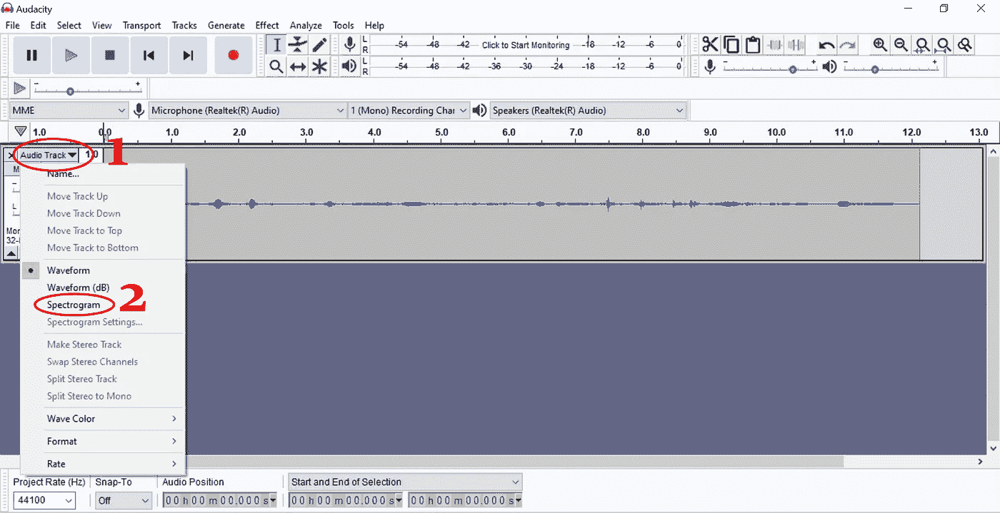
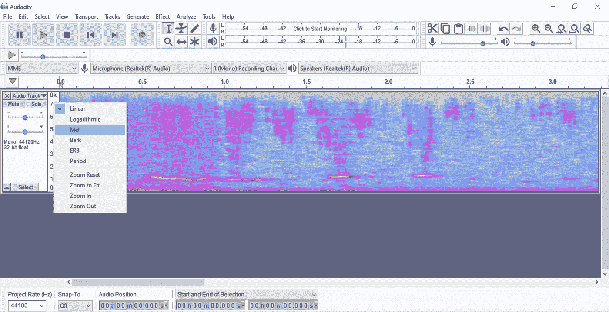
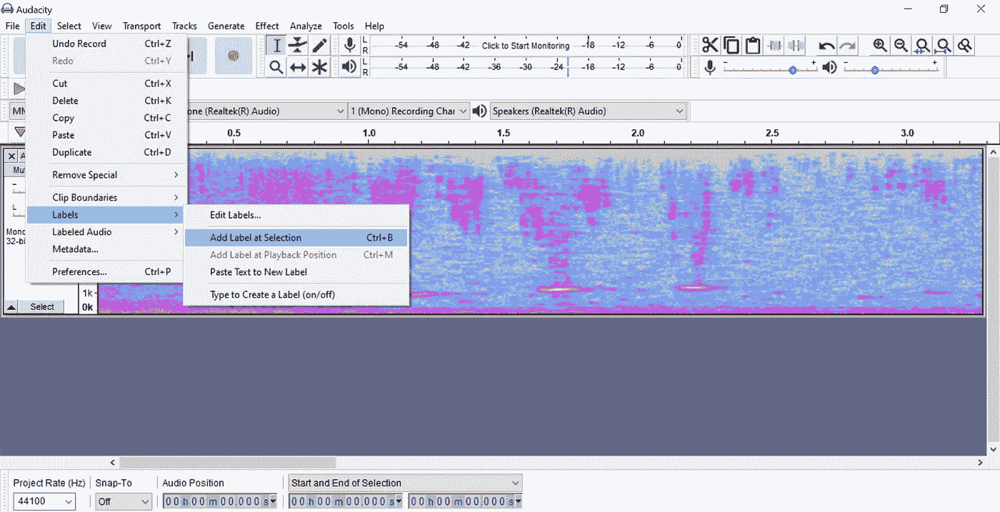
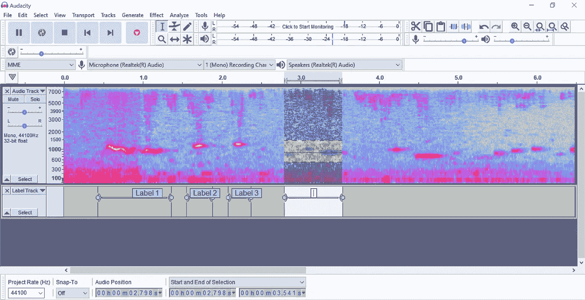
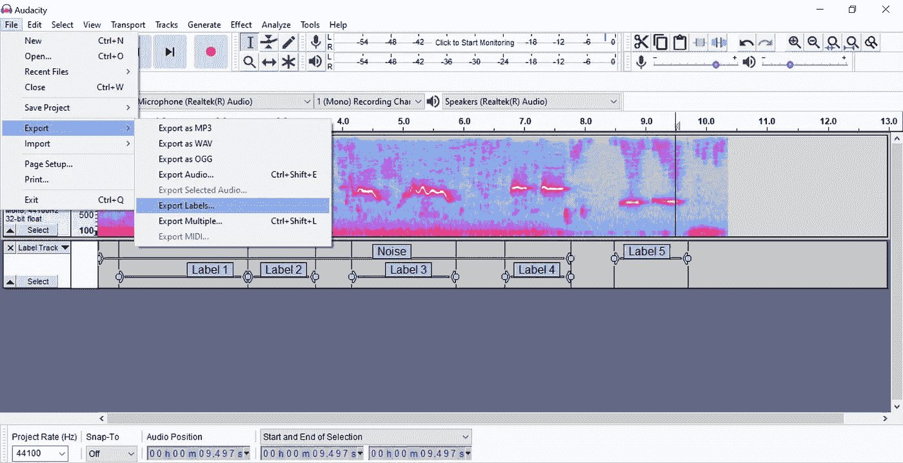
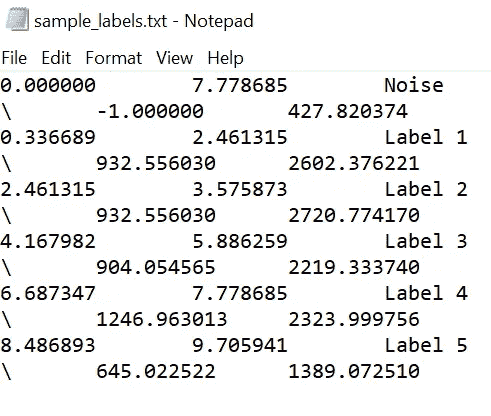

# 如何用 4 个简单的步骤为深度学习标记音频

> 原文：<https://towardsdatascience.com/how-to-label-audio-for-deep-learning-in-4-simple-steps-6a2c33b343e6?source=collection_archive---------17----------------------->

## 使用 Audacity 标记音频文件并在 Python 中加载结果的快速分步指南

韦斯·希克斯在 [Unsplash](https://unsplash.com/s/photos/headphones?utm_source=unsplash&utm_medium=referral&utm_content=creditCopyText) 上拍摄的照片。

为了训练深度学习模型，准备和管理数据集通常是非常重要的一步。在这个故事中，我展示了如何使用 **Audacity** 一款“免费、开源、跨平台的音频软件”来标记你的数据。

## 目录

*   声谱图表示
*   创建标签
*   导出标签
*   在 Python 上加载数据

# 1.声谱图表示

在安装 [Audacity](https://www.audacityteam.org/) 并导入一个音频文件后，第一步是更改为**声谱图表示**，如下图所示。

大胆地看声谱图。作者打印屏幕。

然后，您可以在同一菜单中调整谱图设置，并通过右键单击显示比例来调整显示比例。在下面的例子中，我选择“Mel”选项来缩放。你可以在 Dalya Gartzman 的[这个故事](/getting-to-know-the-mel-spectrogram-31bca3e2d9d0)中读到更多关于 Mel 光谱图的含义。

将比例更改为 Mel。图片由作者提供。

# 2.创建标签

要创建标签，首先进入**编辑>标签>在选择处添加标签**并检查键盘快捷键(Windows 中的 Ctrl+B ),这样你就不需要每次都回到菜单。

寻找添加标签的选项。图片由作者提供。

现在您已经知道了键盘快捷键，在谱图中选择一个要标记的区域(单击并拖动)，然后使用快捷键“在选择处添加标签”。将出现一个**标签轨道**，您可以输入标签的名称。您可以重复此过程，根据需要添加任意数量的标签！

创建标签。图片由作者提供。

**注意:**在您添加标签时播放片段会有所帮助。您可以使用“空格键”来播放和暂停。

# 3.导出标签

要导出标签，请转到**文件>导出>导出标签。**

导出标签。图片由作者提供。

结果是一个文本文件，每个标签指示开始和结束时间、标签名称以及最小和最大频率。频率值为-1 表示低于显示的最小值或高于显示的最大值。

导出标签的示例。图片由作者提供。

# 4.在 Python 上加载数据

对所有音频文件重复上述步骤后，您就可以在 Python 中加载数据了！我准备了以下代码来读取和显示带有相应标签的声谱图。该代码也可以作为 [Kaggle 内核](https://www.kaggle.com/mnpinto/label-audio-with-audacity)获得。

结果是下图所示的 Mel 谱图，红色边框对应于“标签数据框”(上面的代码)中的标签。

Mel 谱图和标签。图片由作者提供。

# 结束语

希望你觉得这个故事有用！请考虑在这个链接 加入我的私人邮件列表，这样你就不会错过我接下来的任何一个故事了！你可以在下面的两个故事中了解更多关于我的数据科学之旅！

 [## 我的 3 年历程:从零 Python 到深度学习竞赛高手

### 自从 2017 年开始学习 Python 以来，我一直遵循的道路是成为一名独自参加 Kaggle 比赛的大师…

towardsdatascience.com](/my-3-year-journey-from-zero-python-to-deep-learning-competition-master-6605c188eec7)  [## 我在 Kaggle 上的两年旅程:我如何成为竞赛大师

### 描述我的旅程和策略，我遵循成为一个竞赛大师与个人金牌

towardsdatascience.com](/my-2-year-journey-on-kaggle-how-i-became-a-competition-master-ef0f0955c35d) 

*感谢阅读！祝您愉快！*