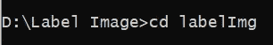
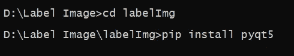
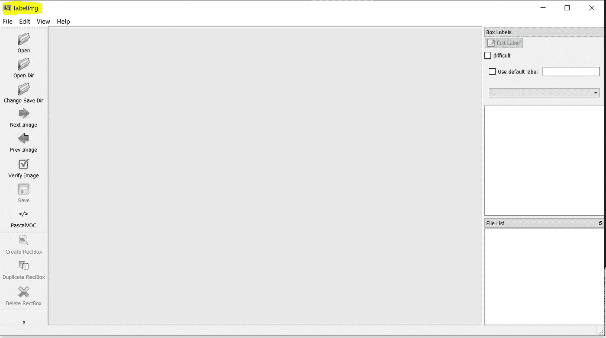
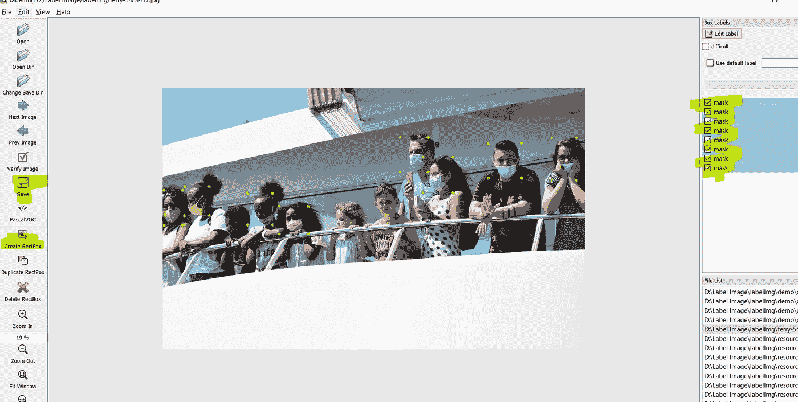

# 如何逐步标记用于对象检测的图像

> 原文：<https://towardsdatascience.com/how-to-label-images-for-object-detection-step-by-step-7ee317f98583?source=collection_archive---------7----------------------->

## 标记图像的逐步详细指南


照片作者: [Pixabay](https://pixabay.com/photos/ferry-ship-passenger-cruise-mask-5484417/)

图像标记是目标检测的第一步，也是最重要的一步。标注确实是一个非常耗时的过程，但是你在标注图像上投入的精力越多，你的模型就越精确。在这个故事中，我将详细讨论标签的完整方法。最后，通过这篇文章，您将为您的对象检测模型准备好您的标记数据。

这里你需要一个开源的工具来标注你的数据。要下载该工具，请按照以下步骤操作。

> **下载贴标工具**

*   如果您的机器上安装了 Git，请在设备的 open 命令提示符下键入

```
git clone [https://github.com/pranjalAI/labelImg.git](https://github.com/pranjalAI/labelImg.git)
```

*   如果你没有安装 Git，那么去 https://github.com/pranjalAI/labelImg.git[下载压缩目录。](https://github.com/pranjalAI/labelImg.git)
*   如果你是通过链接直接下载的，那么解压你的压缩文件。zip 文件。

> 安装依赖项

*   您需要使用命令提示符进入“labelImg”文件夹。



*   之后需要安装一个名为“pyqt5”的库。在命令提示符下键入以下命令。



安装 pyqt5

> 定义自定义类

*   你需要去“labelImg\data”文件夹；在那里你会发现 predefined_classes.txt 在这里，你可以定义你的自定义类。

> 激活“标签”工具

在命令提示符下，键入以下命令。


启动标签工具


照片由 [SpaceX](https://unsplash.com/@spacex?utm_source=medium&utm_medium=referral) 在 [Unsplash](https://unsplash.com?utm_source=medium&utm_medium=referral) 上拍摄

*   键入上面的命令后，您会看到一个交互式窗口，这是一个开源工具。



“标签”工具

你将在这里花费相当多的时间，因为这将帮助你得到标记的图像，并使它们为物体检测做好准备。

> 如何使用这个工具

*   点击“打开目录”并选择保存您需要标记的图像的文件夹。
*   然后点击“更改保存目录”这里，你需要选择目录来保存你的标签文件。该目录应该不同于图像目录。
*   现在你可以使用“创建矩形盒”在图像上绘制盒子。
*   点击保存按钮。它将生成一个包含盒子坐标的文件。



标签过程

*   您可以在一个图像中绘制多个框。它会要求分配一个类；选择您在上述步骤中定义的类别。

最后，您现在将拥有一个文件夹，该文件夹将使用与您的图像相同的名称来标记图像数据。您的数据现在可以进行对象检测了。尽管如此，如果你觉得你有更少的图像计数，那么请按照我的指南[生成对象检测数据](https://medium.com/swlh/data-augmentation-for-custom-object-detection-15674966e0c8)。这里，我展示了不同图像和标签增强技术。如果你想了解更多关于对象检测的后续步骤，那么请阅读我的另一篇文章，[Python 中的自定义对象检测](/step-by-step-yolo-model-deployment-in-localhost-using-python-8537e93a1784)。在这里，我已经讨论了如何训练您的模型并将其部署到本地主机。


约翰·施诺布里奇在 [Unsplash](https://unsplash.com?utm_source=medium&utm_medium=referral) 上的照片

> 一些收尾建议

标注数据可能是一个非常耗时的过程，但是如果您想要在您的模型中实现良好的准确性，那么您必须在此步骤中给出合理的时间量。试着从不同的资源中收集尽可能多的图像。图像种类越多，你的模型就越好。

> *在你走之前……*

如果你喜欢这篇文章，并且想继续关注关于 **Python &数据科学**的更多**精彩文章**——请点击这里[https://pranjalai.medium.com/membership](https://pranjalai.medium.com/membership)考虑成为一名中级会员。

请考虑使用[我的推荐链接](https://pranjalai.medium.com/membership)注册。通过这种方式，会员费的一部分归我，这激励我写更多关于 Python 和数据科学的令人兴奋的东西。

还有，可以随时订阅我的免费简讯: [**Pranjal 的简讯**](https://pranjalai.medium.com/subscribe) 。