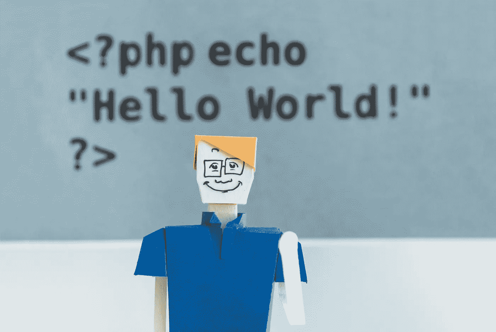

# 如何学习数据科学的编码

> 原文：<https://towardsdatascience.com/how-to-learn-coding-for-data-science-28df2705dac9?source=collection_archive---------12----------------------->

## 意见

## 提示 1:停止参加在线课程

[KOBU 机构](https://unsplash.com/@kobuagency?utm_source=unsplash&utm_medium=referral&utm_content=creditCopyText)在 [Unsplash](https://unsplash.com/s/photos/code?utm_source=unsplash&utm_medium=referral&utm_content=creditCopyText) 上拍摄的照片

当我第一次想学编程的时候，我在 YouTube 上看了 4 个小时的教程。

课程结束后，我想:“*太棒了*”。"*我现在知道如何编码了！*”

我很兴奋！我想了解更多。

所以我又上了一门教程。

然后…..我又拿了一个。

还有一个。

***听着耳熟吗？***

这种情况持续了一段时间，直到我最终放弃学习如何编码。

我太习惯结构化的课程了，而且似乎没有明确定义的教学大纲可以让我在编码方面从“零到英雄”。

*嗯，至少我试过了。现在我知道这不适合我，”我心想。*

一年后，在与一些程序员交谈并阅读了一些资料后，我意识到自己陷入了一个叫做**的教程陷阱。**

# 什么是教程陷阱？

教程陷阱真的很容易掉进去了。

你想学习编码。有人承诺，如果你学习他们的课程，你将成为一名程序员。

你选这门课。

你用新的框架和语言一次又一次地这样做。

这是一个非常棘手的情况，尤其是因为你实际上感觉你在每个教程中都学到了一些东西。

不幸的是，你无法学以致用。你不能用自己的代码来解决问题，更不用说从头开始创建一个完整的项目了。

如果这是你，那么是时候跳出教程陷阱了。

# 突破教程陷阱

照片由[劳伦提乌·约尔达切](https://unsplash.com/@jordachelr?utm_source=unsplash&utm_medium=referral&utm_content=creditCopyText)在 [Unsplash](https://unsplash.com/s/photos/break?utm_source=unsplash&utm_medium=referral&utm_content=creditCopyText) 拍摄

如果你读这篇文章是因为你想成为一名程序员，你来错地方了。

每个人学习编码的道路是不同的。我会简单地根据对我有效的方法给你指出正确的方向。

要跳出教程陷阱，首先需要**停止上教程**。

如果你上过一两门在线课程，你就会知道基本的语法和操作符。

*   变量
*   功能
*   控制流
*   环
*   数组

一旦你熟悉了基础知识和它们是如何工作的，继续前进！

所有的在线课程都会教你同样的东西，多学一门只会浪费你的时间。

## 了解这些之后，继续前进，开始做一些小的编码挑战。

[Jukan Tateisi](https://unsplash.com/@tateisimikito?utm_source=unsplash&utm_medium=referral&utm_content=creditCopyText) 在 [Unsplash](https://unsplash.com/s/photos/challenge?utm_source=unsplash&utm_medium=referral&utm_content=creditCopyText) 上的照片

我个人最喜欢的是一个名为 **HackerRank** 的网站。他们面临不同难度的挑战。

一旦你掌握了编程的基本知识，这是一个很好的入门方式。它会帮助你熟悉这门语言。

这些挑战一开始可能会有点吓人，因为这是您第一次在没有编码的情况下解决问题。

如果你中途遇到困难，看看另一个人的代码也会帮助你开始思考。(*不要只是复制粘贴他们的代码，试着去了解他们是如何解决的。)*

当你看别人的代码时，你会注意到他们都是不同的。看待一个问题的方式总是不止一种，你可以采取许多不同的方法。

这将真正改变你作为程序员的思维方式，提高你的编码能力。

## 项目，项目，项目

Jo Szczepanska 在 [Unsplash](https://unsplash.com/s/photos/project?utm_source=unsplash&utm_medium=referral&utm_content=creditCopyText) 上拍摄的照片

一旦你对自己无需遵循教程就能编写代码的能力有了一些信心，你就可以从项目开始了！

## 开始之前，心中要有一个最终产品

当我第一次进入数据分析领域时，我在任何地方都读到同样的建议。

做项目！

然而，我不知道该做什么项目。每次我开始做一件事，它都没有结果，我永远也不会完成它。

这是因为我头脑中没有一个坚实的目标。

当创建一个项目时，头脑中始终要有一个坚实的最终目标。此外，确保这是一个你有兴趣做的项目。否则你将永远无法完成它。

## 这里有一个例子:

你想分析音乐行业的发展趋势。

**最终目标:**利用艺术家姓名和流派等数据，发现音乐趋势随时间变化的模式。

为此，您首先需要收集数据。

这可以在**网络刮刀或 API** 的帮助下完成。这将需要相当多的编码，这本身就是一个很好的中级编码项目。

然后，您需要清理数据。这是一项简单的任务，但由于数据可能会非常混乱，因此可能会非常耗时。

执行数据分析任务不需要很高的编程技能。需要做的大多是数据操作，不需要太多逻辑就能做到。

最后，您可以执行实际的分析。为了做到这一点，你需要知道如何使用可视化库，这很容易掌握。Matplotlib 和 Seaborn 是两个流行的 Python 可视化库。

## 就是这样！

这只是你学习数据科学编码应该采取的步骤的一个粗略的想法。

我知道数据科学是一个吸引各种不同背景的人的领域。如果你来自非技术背景，编码部分可能一开始看起来真的很吓人。

每个人似乎都在编写这些非常复杂、大而无意义的代码。

## 然而，你需要记住每个人都有起点。

即使是最好的程序员也是从“Hello World”开始的，你只需要有耐心。

给自己一些时间去学习，拥抱学习曲线。就像学习游泳、开车或骑自行车一样，学习编码不是一夜之间就能完成的。这需要大量的练习和盯着电脑屏幕才能实现。

我希望这篇文章是有帮助的，感谢阅读！

> 犯错误仅仅意味着你学得更快