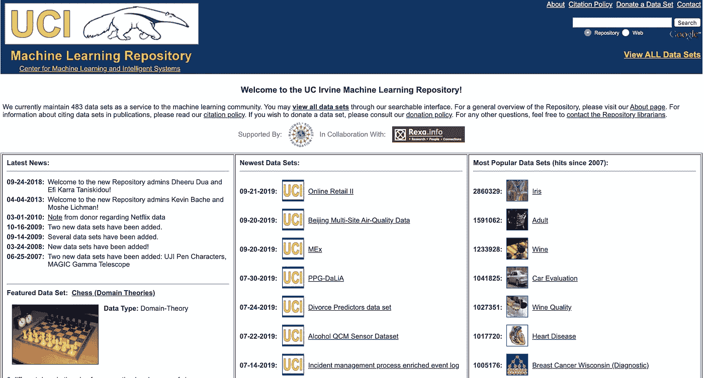

# 如何学习数据科学，开始你的神奇之旅

> 原文：<https://towardsdatascience.com/how-to-learn-data-science-and-start-your-amazing-journey-7de3f7757157?source=collection_archive---------34----------------------->

## 数据科学学习指南

[JESHOOTS.COM](https://unsplash.com/@jeshoots?utm_source=medium&utm_medium=referral)在 [Unsplash](https://unsplash.com?utm_source=medium&utm_medium=referral) 上拍照

随着科技行业的快速变化和机器人创新的到来，数据科学是开始学习的最佳领域之一。如果你对数据和如何使用数据充满热情，这篇文章将帮助你了解如何学习数据科学专业，以将你的兴趣转化为高薪职业。

# 数据科学新手的学位或证书

你可能会认为是时候获得一个技术学位或证书作为你的第一步了。实际上，你不需要这个。为什么？你的知识和你能做什么将是你面试的主要因素，而不是教育。

是的，拥有一个技术学位或证书当然是好的，但这不会仅仅因为你有文凭就帮你找到工作。所以把证书/学位当做一个可选项。拥有它是好事，但绝对不是你开始数据科学家之路的第一件事。

另一方面，如果你决定把你的时间奉献给一条深度学习的道路，而选择的大学或课程帮助你获得了你实际上会用到的知识，那就完全是另一回事了。

所以我的总体建议是开始一条理论或实践的学习之路。如果你有大量的时间和金钱，去学习课程，甚至获得学位。记住，公司不会非常详细地询问你的学历文件。你的回答会很笼统:“是的，我有学位/证书”或者“不，我没有学位/证书”。

还有，2020 年是远程做任何事情的一年。我相信你可以在网上获得一切，而不是去现场学习。在我们这个时代更安全，更有效。

# 你需要学习的技能

你学习道路的基础是 Python、SQL、机器学习和统计学。这些知识是高级的，所以让我们分别复习一下。

## 计算机编程语言

这将是你学习的第一门编程语言。这是非常令人兴奋的！为什么？因为 Python 是通用编程语言。它支持很多框架和库。学习起来既简单又快。此外，用 Python 而不是 Java 编写将节省大量时间。

如果您想了解更多为什么我给予 Python 如此高的优先级，我有一篇关于 Medium 的单独文章，提供了所有细节:

 [## 作为数据科学家，你需要学习 Python 的 7 大理由

### Python 给数据科学家带来的好处

towardsdatascience.com](/top-10-reasons-why-you-need-to-learn-python-as-a-data-scientist-e3d26539ec00) 

你需要同时学习和练习。试着用包含在文件夹中的项目来构建你的学习路径。这意味着一旦你掌握了足够的理论知识，就要尽可能多地包含实践步骤。这样，你很快就可以用纯 Python 写东西了。这包括基本语法、功能、控制流、循环、模块和类。

## 结构化查询语言

要使用数据库，您需要学习 SQL。这项技能允许您提取数据并与之交互。有不同的 SQL 类型，但是作为一个新手，你需要学习基本的分析 SQL。

可以用 W3School 借鉴一下。它有一个你需要的基本理论。同样，最好尽可能频繁地学习理论和实践。记住，任何科技行业都需要大量的实践经验。如果你停止练习，你会很快失去知识。

与 SQL 相关的问题是数据科学家在面试中的热门话题。这就是为什么它是学习 SQL 和自信快速回答面试问题的另一个原因。

## 统计数字

你当然应该学统计学。概率的主要关注点是分布、统计意义、假设检验和回归。

你可以把你的统计学习分成几个步骤:

1.  **核心统计概念**

*   试验设计
*   回归建模
*   数据转换

2.**贝氏思维**

3.**机器学习**

检查 [UCI 机器学习知识库](https://archive.ics.uci.edu/ml/index.php)。您可以将他们的数据用于您的个人项目。也可以部署一个模型。构建您的项目并将其存储在 Github 上。这是学习和建立个人投资组合的最佳方式。

[UCI 知识库](https://archive.ics.uci.edu/ml/index.php)

## 机器学习

我假设数据科学家最流行的方法来自机器学习。它不同于其他计算机决策，因为它包括预测。计算机能够使用算法用自己的数据预测结果。

如果将来要构建和部署产品，ML 肯定是一开始就要学的东西。在所有的数据科学家职能中，有一个软件工程师，需要 ML 知识。

如您所见，数据科学家不仅是构建模型的人，也是运行和支持模型的人。意思是她/他类似于软件工程师。

# 一些有用的链接

这里有一个列表可以帮助你:

[可汗学院](https://www.khanacademy.org/) —学习技术资料

[Codeacedmy Python 课程](https://www.codecademy.com/learn/learn-python-3) —这是一门学习 Python 的好课程

[统计学习简介](http://www-bcf.usc.edu/~gareth/ISL/) —从这里学习统计。

[数据灵丹妙药](http://dataelixir.com/):数据科学新闻和资源

# 重要说明

当你学习数据科学时，为开源项目做贡献。您可以找到许多需要社区帮助的 Python 库。这是一个很好的方法:

*   练习你的技能；
*   从其他人那里获得即时反馈和帮助；
*   参与真实的项目；
*   开源项目可以组织一次黑客马拉松，你可以参加；
*   你向别人学习；
*   你的作品集有一个真实的项目。

# 结论

数据科学家是一个非常创新和高薪的专业。如果你想学得快，我分享了一些有用的步骤，会让你在学习之旅中获得成功。我希望我已经激励你成为一名数据科学家，你将使用我的提示开始你的学习之旅，成为一名数据科学家。