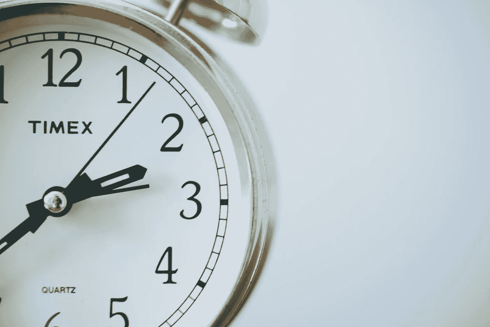
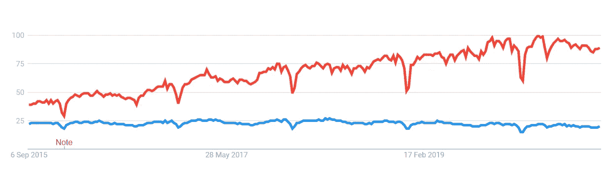

# 如何在短短 1 年内把数据科学从初学者学到大师(我的亲身经历)

> 原文：<https://towardsdatascience.com/how-to-learn-data-science-from-beginners-to-masters-in-just-1-year-my-personal-experience-6152bedd8157?source=collection_archive---------7----------------------->

## 从初学者到大师，我学习数据科学的清单的完整汇编只需要一年的时间旅行故事。享受学习！

索尼娅·兰福德在 [Unsplash](https://unsplash.com/s/photos/time-tavel?utm_source=unsplash&utm_medium=referral&utm_content=creditCopyText) 上拍摄的照片

终于，这篇文章是我们一直在等待的。在这篇完整的文章中，我们将讨论一个完整的大一新生如何在广阔的机器学习和数据科学领域开始他们的旅程，从学习核心概念和编写基本代码一直到破解面试，并随着时间的推移获得经验。互联网和书本上有如此多的内容，但是读什么和不读什么呢？完全糊涂了！让我们倒退一下，回到过去，从头开始一切。

> 如果你是一个初学者，并且想带着极大的热情学习数据科学，那么相信我，这篇文章肯定会帮助你制定学习机器学习和数据科学的计划。

在此之前，只是一个小提示，本文将很短(😅不那么短)，简单而精确，讨论了如果我再次回到过去，并准备成为一名数据科学家，用一个很酷的时间旅行讲故事，我会遵循的确切方法！

如我所说，让我们回到一年后，开始我们的旅程。

来源:[瑞克和莫蒂的时间旅行](https://rickymort420.tumblr.com/post/176895125713)

感谢里克和莫蒂在 2019 年把我们送回来！现在我们已经有了完整的一年，让我们来规划我们完整的路线图。所以基本上，首先让我们创建一个清单，列出我们在直接探索和学习之前可能想到的事情。我的简单描述清单如下:

1.  学习一门编程语言(R 或者 Python)。
2.  熟悉应用数学(LA，Stats，Prob)。
3.  开始读 ML/AI 上的博客，听播客。
4.  阅读一些令人惊奇的书来建立基础。
5.  学习机器学习和深度学习。
6.  尝试这些技能，做一些实践。
7.  利用竞争数据科学构建一些端到端项目。
8.  申请和破解面试。

现在，在我们知道最好和最有用的资源并让自己始终保持学习的动力之前，这个清单是没有用的。

> 这两件事如果能完美地付诸实施，我真的可以在一年内成为一名优秀的 ds！

## 学习编程语言

要成为一名数据科学家，你不需要成为一名专业的编码员，或者是 CodeChef 或 TopCoder 上的五星，你只需要知道如何用你喜欢的语言编写一个优化的代码。来自不同背景的人，尤其是没有编码经验的人，通过学习聪明地编码，在短短一年内被证明是优秀的数据科学家。

谷歌趋势 R(红色)vs Python(蓝色)

选择一种语言: **Python** 和 **R programming** 自 2014 年以来一直是机器学习和数据科学领域最受支持的语言之一，因为它们易于使用，并且广泛支持一个详尽的库列表，只需几行代码就可以做任何事情。上面的谷歌趋势图显示了这些语言在谷歌搜索引擎上的受欢迎程度。你可以尝试两种语言，看看哪一种更适合你，哪一种对你以后的工作更有帮助。

有些人甚至会两者都学，但就目前而言，我会根据自己的需求选择 Python。根据我的经验学习 Python 的几个资源有 YouTube:[**send ex**](https://www.youtube.com/user/sentdex)**或者 [**科里斯查费**](https://www.youtube.com/user/schafer5) **。**除此之外，我更愿意在[**【data camp】**](https://www.datacamp.com/)上一个月的包，尝试一下我的 python 实践课或者免费的，[【LearnPyhon.org】](https://www.learnpython.org/)**的**也会有同样的帮助。******

## ****熟悉应用数学****

****任何人都可以只用 3-4 行代码就让机器学习模型工作，但你有没有想过幕后发生了什么？机器学习算法的核心承载着背后运行的数学，并让它为我们工作。对库的支持减轻了我们的工作，但我们需要清楚它是如何工作的，以及我们如何构建自己的模型。****

****要做到这一点，我们需要非常清楚线性代数等核心数学，向我解释每一个算法的几何直觉，以及我如何在理解代数和向量系统的情况下制作自己的模型。主题包括矩阵代数和向量系统，可用于主成分分析(PCA)、支持向量机(SVMs)和许多其他数学模型。****

****其次，统计学和概率对于理解数据中的模式和从中发现洞见非常重要。机器学习所需的统计和概率理论是对各种分布的理解，如高斯分布、二项式分布、基于条件概率的概率规则贝叶斯定理、佩里托定律等。****

****微积分在理解数学模型中也起着非常重要的作用，一些必要的主题包括微分和积分，拉普拉斯，雅可比，偏导数，方向梯度，拉格朗日分布等。****

****最后，算法和优化问题是我们的机器学习算法的计算效率和可扩展性所需的另一个非常重要的数学分支。使用最佳算法理解，可以很好地理解如何编写最佳模型构建或数据规范化。****

****一些好的资源可能是 ISLR 的****或者是用于机器学习专业化的 [**数学**](https://www.coursera.org/specializations/mathematics-machine-learning) 或者是可汗学院的 [**线性代数**](https://www.khanacademy.org/math/linear-algebra)[**概率&统计**](https://www.khanacademy.org/math/probability)[**多变量微积分**](https://www.khanacademy.org/math/calculus-home/multivariable-calculus)**和 [**优化**](https://www.khanacademy.org/math/differential-calculus/derivative-applications/calc-optimization/e/optimization)**********

## ****阅读博客、文章和听播客****

****每天都有大量经验丰富的人发布惊人的博客。我可以选择每天读几本。现在，我需要计划我一天可以消化多少博客/文章而不中断流程，并了解数据科学领域正在发生的事情，或者熟悉一些科技人工智能新闻，或者可以是任何事情。一些真正优秀的定期发布一些惊人内容的出版商有[**朝向数据科学**](https://towardsdatascience.com/) 、 [**数据驱动投资人**](https://medium.com/datadriveninvestor) 、[**Analytics Vidya**](https://medium.com/analytics-vidhya)，或者 [**KD 掘金**](https://www.kdnuggets.com/) 等。****

****听几个很棒的播客可以极大地提高我理解惊人项目背后的科学的技能，或者研究人员对机器学习和人工智能领域的干扰有多深。播客基本上帮助我们建立可实现的数据素养，与每个人交流我们的数据故事。一个可以经常收听的播客列表是这里的****，其中我个人更喜欢雨果-鲍尼的 [**DataFramed**](https://www.datacamp.com/community/podcast) 或基里尔·叶列缅科的**SuperDataScience Podcast 或有时是[**data hack Radio****on sound cloud on day bases。**](https://soundcloud.com/datahack-radio)**********

## ******阅读机器学习书籍******

> ******"对于那些寻求超越平凡的人来说，阅读是必不可少的。"—吉米·罗恩******

******读书是我今年应该做的最重要的事情之一，以提高我的学习。我应该说，如果你是一个爱书的人，那么书是提高你学习的最好来源之一。我可以选择阅读免费的电子书或购买纸质书，任何东西都可以。有很多书可以购买并开始阅读，但我建议阅读的一些好书是:******

1.  ******[用于数据分析的 Python](https://www.oreilly.com/library/view/python-for-data/9781491957653/)，******
2.  ******[统计学习简介](https://faculty.marshall.usc.edu/gareth-james/ISL/ISLR%20Seventh%20Printing.pdf)，******
3.  ******[使用 Scikit-Learn、Keras 和 TensorFlow 进行机器实践学习](https://www.oreilly.com/library/view/hands-on-machine-learning/9781492032632/)，******
4.  ******[模式识别和机器学习](https://www.springer.com/gp/book/9780387310732)由 Christopher M .和 Bishop，******
5.  ******[深度学习](https://mitpress.mit.edu/books/deep-learning)Ian good fellow，******
6.  ******其他一些奥莱利的书也很棒，等等。******

## ******学习机器学习和深度学习******

******在线 MOOC 课程可能是一个非常好的资源，可以在更短的时间内学习 ML 和 DL，并保持旅程的互动性。我更愿意参加以下学习 ML 和 DL 的课程。******

1.  ******[机器学习](https://www.coursera.org/learn/machine-learning)由斯坦福大学、******
2.  ******[应用数据科学与 Python 专业化](https://www.coursera.org/specializations/data-science-python)密歇根大学，******
3.  ******[深度学习专业化](https://www.coursera.org/specializations/deep-learning)由 deeplearning.ai、******
4.  ******[应用人工智能课程](https://www.appliedaicourse.com/)Srikanth Varma，******
5.  ******[Udemy 的基里尔·叶列缅科教授的数据科学和 ML 课程](https://www.udemy.com/user/kirilleremenko/)，******
6.  ******对于 CNN 和计算机视觉 [CS231n](http://cs231n.stanford.edu/) 由斯坦福大学、******
7.  ******还有斯坦福大学的 for NLP [CS224n](http://web.stanford.edu/class/cs224n/) 都是很美的课程等等。******

******除了这些，全球的一些标准大学也为 ML 和数据科学提供令人惊叹的在线或离线课程。如果你想了解更多，你可以在他们的官方网站上查看，或者阅读相关文章了解更多。******

## ******技能健身房和动手实践******

> ******告诉我，我会忘记。教我，我会记住。让我参与进来，我会学到东西。—本杰明·富兰克林******

******更重要的是，如果一个人只是不停地学习而不参与事物，那么他就不能把知识长久地保存在持久的记忆中。动手实践是学习的一个非常重要的过程。毫无疑问，我更愿意要么在我的本地机器上为我学到的每个概念编写代码，并将其推送到 T2 的某个云上，要么使用一些好的在线平台在他们的云上做同样的事情，比如 T6、T7、DataCamp、T11、T13、Dataquest、T14、T15。这将帮助我不仅使我的概念变得强大，而且随着时间的推移提高我的编码技能，我可以随时通过查看代码来修改。******

## ******构建端到端项目并参与竞争******

******在项目中应用我过去所学的知识对于了解 ML 项目在真实行业中是如何构建的非常重要。你会得到一份你可以做的项目的详尽清单，DataFlair、Simplilearn 或互联网上的任何随机文章都可以帮助你开始做基础项目。其次，为 GitHub 或任何 VCS 上的公共项目制作一个记录良好的代码库肯定会帮助我建立一个好的投资组合。******

******参加比赛最终还会帮助我变得擅长编码，并将我的技能应用于现实世界的问题，并了解我在全球排行榜上的位置，这可以帮助我纠正错误，建立更好的自我。我会参加任何关于**[**分析 Vidya**](https://datahack.analyticsvidhya.com/)[**驱动数据**](https://www.drivendata.org/) 或 [**黑客地球**](https://www.hackerearth.com/)**等的比赛。他们主持惊人的全球研究和行业水平的竞赛。但是要确保你不会过度劳累😂！**********

******你可以阅读下面这篇文章来了解更多关于我在 Kaggle 上来自未来的旅程(😅别忘了我们现在是在过去)。******

****** [## 我是如何在短短 1 个月内成为 Kaggle 3X 专家，并在 3 个月内成为大师的！

### 让我们来谈谈我在加入平台仅一个月内成为 Kaggle 专家的故事，以及我是如何设法…

towardsdatascience.com](/how-i-became-kaggle-3x-expert-in-just-1-month-b63b37b53865)****** 

## ******破解采访******

******现在，我应该完全准备好了一切，并开始申请数据科学职位，应该努力提高我的沟通技能、数据叙事和其他软技能。我应该能够充分理解我过去所做的工作和我做过的项目，并且能够用比别人更好的方式来解释它们。******

******你的知识不会让你找到一份好工作，除非你有一个很好的投资组合，这说明了很多关于你的事情，如果你有兴趣了解更多关于为自己建立一个好的投资组合的信息，请阅读这篇文章！******

****** [## 如何建立一个能让你找到工作的数据科学投资组合？

### 学会制作一个关于你的强有力的作品集！

towardsdatascience.com](/how-to-build-a-data-science-portfolio-that-can-get-you-a-job-9f8d113739b3) 

如果我现在遵循所有的事情，在一年之内，我将能够突破 ML 和数据科学技术，并将能够获得一份好工作，我的朋友也一样，他通过这篇文章与我一起走过了完整的旅程😉！

让我们在一次很酷的时间旅行后及时回到 2020 年，并充分利用我们由于柯维德疫情不确定性而拥有的时间来学习并擅长机器学习和数据科学。****** 

## ******给你额外的小费！******

******恭喜🎉如果到目前为止你还在读这篇文章，那么你真的是一个对成为数据科学家有毅力和决心的人，并且很快就会成为一名数据科学家！******

******如果你是一个初学者，并正在寻找一些东西开始，我希望你会有一个清晰的图片来选择和规划自己的自定义清单。******

******想了解更多关于统计学、机器学习和数据科学的知识吗？******

******你可以在这里阅读我的其他类似博客:******

****** [## 如何变得超级强大成功？

### 释放你内心的超能力！

medium.com](https://medium.com/datadriveninvestor/how-to-become-super-powerful-and-successful-cdf65722a765)  [## 如何评价 Python 中机器学习模型性能？

### 一个实用的方法来计算模型的性能和在 Python 中的实现，涵盖了所有数学…

towardsdatascience.com](/how-to-evaluate-machine-learning-model-performance-in-python-135b4ae27f7e)  [## “正态分布”的功效

### 理解钟形曲线背后的科学！

towardsdatascience.com](/the-powers-of-normal-distribution-4cbb06e4a955) 

谢谢你，祝你新的旅程好运！

## 其他资源和参考

1.  [https://medium . com/forward-artificial-intelligence/top-university-to-purchase-a-masters-in-the-us-ai-d4a 461229 fbb](https://medium.com/towards-artificial-intelligence/top-universities-to-pursue-a-masters-in-machine-learning-ml-in-the-us-ai-d4a461229fbb)
2.  [https://towards data science . com/python-vs-r-for-data-science-6a 83e 4541000](/python-vs-r-for-data-science-6a83e4541000)
3.  [https://towards data science . com/the-mathematics-of-machine-learning-894 f 046 c 568](/the-mathematics-of-machine-learning-894f046c568)
4.  [https://towards data science . com/top-competitive-data-science-platforms-than-ka ggle-2995 e9 dad 93 c](/top-competitive-data-science-platforms-other-than-kaggle-2995e9dad93c)
5.  [https://towards data science . com/8-ml-ai-projects-to-make-your-portfolio-stand-out-BF C5 be 94 e 063](/8-ml-ai-projects-to-make-your-portfolio-stand-out-bfc5be94e063)******